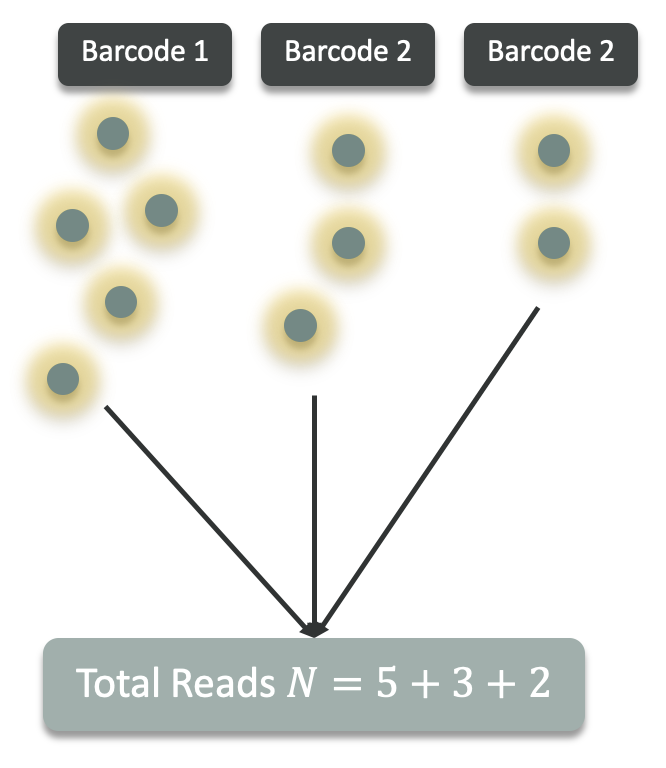
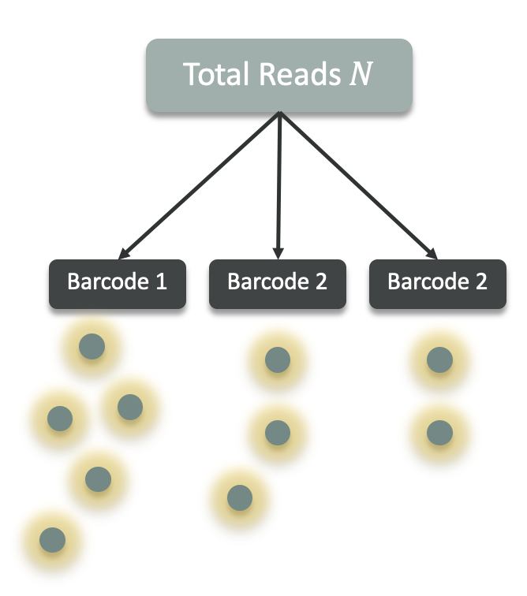
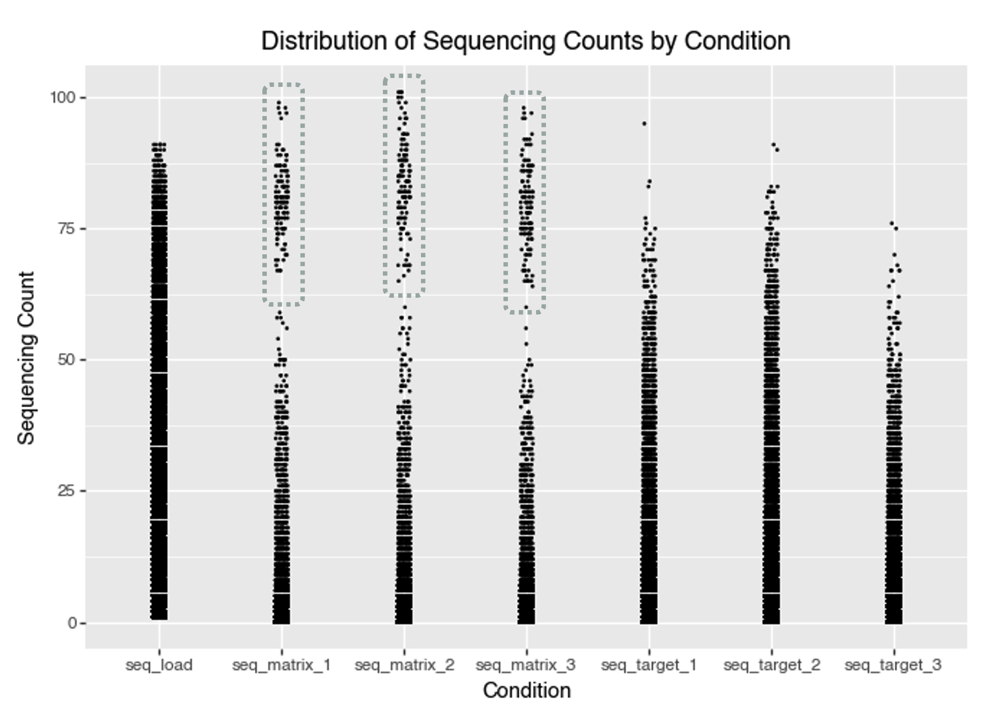
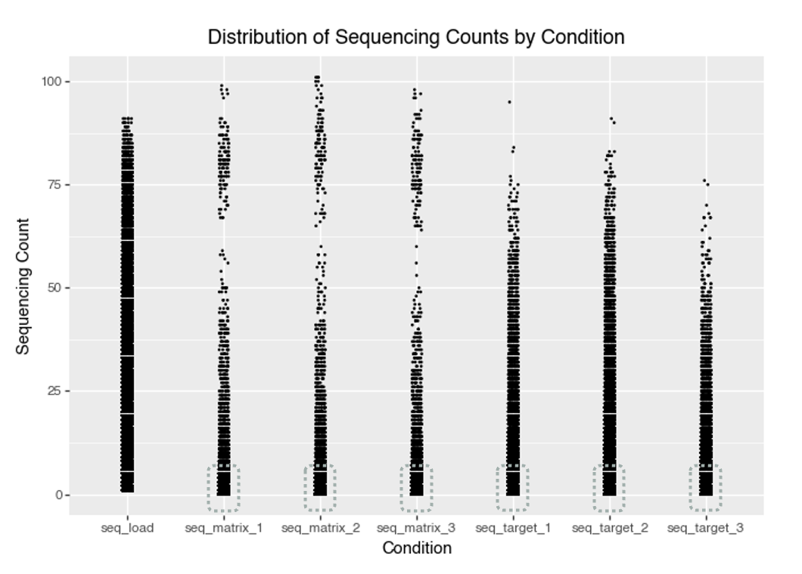

## What Is the Aim of This Blog?

This blog aims to design and build an attachment-aware, synthon-level GNN for DNA-encoded library (DEL) data, extending compositional models like DEL-Compose by explicitly encoding where each synthon attaches, rather than treating synthons as context-free fragments.

## Introduction: What Are DNA Encoded Libraries (DELs)?

DNA encoded libraries (DELs) are large collections of small molecules, each tagged with a unique DNA barcode that records its synthetic history. They enable high throughput screening by pooling and sequencing to identify binders to a target. Watch [this](https://www.youtube.com/watch?v=8jLIgTBJmdU) short video that explains DELs in a nutshell.

## DEL Likelihood Functions

### What is a correct likelihood function for DELs?

A DEL experiment involves several key stochastic steps that directly impact the statistical modeling of observed counts:

-   **Library synthesis**: initial molecule counts for each barcode can vary, introducing variability from the outset.
-   **Selection or binding step**: enriches certain barcodes based on their binding affinity, leading to barcode-specific changes in abundance.
-   **PCR amplification**: contributes substantial multiplicative noise and is a major source of overdispersion in the data.
-   **Sequencing**: captures a random, approximately Poisson-distributed sample from the amplified pool.

Thus, the observed DEL counts for each barcode are the outcome of a sequence of random processes, with amplification especially contributing to count heterogeneity.

#### Two data-generation perspectives for DEL counts

It is useful to separate DEL count models by the **data-generation assumption** they make about sequencing depth.

**1) Independent-barcode (rate-based) generation**

-   Each barcode (compound) produces its own count **independently** according to a barcode-specific rate.
-   The total read depth is then the **sum of independent counts**.
-   This perspective naturally motivates **Poisson**, **Negative Binomial**, **Poisson–lognormal**, and their zero-inflated variants.

<div style="text-align: center;">
  
</div>
[**Figure 1:** Independent-barcode generation: each barcode generates counts independently; totals add up.]{.fig-caption}

**2) Fixed-depth (composition-based) generation**

-   A sample has a fixed total read depth **N**, and each read is assigned to exactly one barcode.
-   Barcodes therefore **share a single pool** of reads, inducing weak negative dependence between barcode counts.
-   This perspective naturally motivates **Multinomial** and **Dirichlet–multinomial**, and the one-barcode marginal **Binomial/Beta–binomial**.

    <div style="text-align: center;">
    
    </div>
[**Figure 2:** Fixed-depth generation: a fixed total N is split across barcodes that share one pool.]{.fig-caption}

The likelihoods below are grouped with this distinction in mind.

#### Common likelihood functions for DELs

Below are common likelihood choices for DEL count data. In practice, DEL data are often **overdispersed** (variance \> mean) due to PCR/amplification and other multiplicative factors, and may also exhibit **excess zeros** (true absence, synthesis failures, or aggressive filtering).

##### Poisson

$$
X_i \sim \text{Poisson}(\lambda_i)
$$

Because sequencing counts in DEL experiments arise from random sampling of amplified DNA molecules, the sequencing step can be modeled using a Poisson distribution.

References:

-   [Machine learning on DNA-encoded library count data using an uncertainty-aware probabilistic loss function](https://pmc.ncbi.nlm.nih.gov/articles/PMC10830332/)
-   [Randomness in DNA Encoded Library Selection Data Can Be Modeled for More Reliable Enrichment Calculation](https://pubmed.ncbi.nlm.nih.gov/29437521/)

::: {.callout-note icon="false" collapse="true"}
## When to use Poisson?

Use Poisson when counts are well-explained by a single rate and the **mean–variance relationship is close to** $\mathrm{Var}(X) \approx \mathbb{E}[X]$ after accounting for obvious covariates (e.g., sequencing depth / library size).

Notice that Poisson is usually too narrow for DEL data once PCR noise is present.
:::

##### Poisson-Gamma or Negative Binomial (NB)

$$
X_i \mid \lambda_i \sim \text{Poisson}(\lambda_i), \qquad \lambda_i \sim \text{Gamma}(\alpha, \beta)
$$

::: {style="text-align: center;"}
or
:::

$$
X_i \sim \text{NB}(\mu_i, \phi)
$$

Because DEL sequencing readouts often exhibit overdispersion due to amplification and selection variability, barcode counts can be modeled using a Negative Binomial distribution.

References:

-   [Partial Product Aware Machine Learning on DNA-Encoded Libraries](https://arxiv.org/abs/2205.08020)
-   [Discovery of TNF inhibitors from a DNA-encoded chemical library based on diels-alder cycloaddition](https://pubmed.ncbi.nlm.nih.gov/19875081/) - Figure 3.

::: {.callout-note icon="false" collapse="true"}
## When to use Negative Binomial?

Use NB when you see **variance increasing faster than the mean**, typically well-captured by $\mu + \phi\mu^2$. This is often the default for DEL counts because amplification introduces extra variability.

If you model *paired* pre-/post-selection counts, NB is often used for each condition with shared/related dispersion:

$$
X_i^\text{pre} \sim \text{NB}(\mu_i^\text{pre}, \phi)
$$

$$
X_i^\text{post} \sim \text{NB}(\mu_i^\text{post}, \phi)
$$

The dispersion parameter $\phi$ represents **technical variability** not biological variability.

Because:

-   PCR process is similar between pre and post experiments
-   Sequencing instrument is probably the same between pre and post experiments
-   Library chemistry is the same between pre and post experiments

it is a reasonable assumption that the dispersion parameter is approximately the same between pre and post experiments.

$$
\phi^\text{pre} \approx \phi^\text{post} = \phi
$$

Or, use a common prior for the dispersion parameter:

$$
\phi^\text{pre}, \phi^\text{post} \sim \text{common prior}
$$
:::

##### Zero-Inflated Models

$$
X_i \sim \text{ZIP}(\lambda_i, \pi_i)
$$

::: {style="text-align: center;"}
or
:::

$$
X_i \sim \text{ZINB}(\mu_i, \phi, \pi_i)
$$

Which assumes that there are two mechanisms that produce zeros:

$$
X_i = 0 \quad \text{with probability } \pi_i
$$

::: {style="text-align: center;"}
and
:::

$$
X_i \sim \text{Poisson}(\lambda_i) \quad \text{with probability } 1 - \pi_i \quad \text{(for ZIP)}
$$

::: {style="text-align: center;"}
or
:::

$$
X_i \sim \text{NB}(\mu_i, \phi) \quad \text{with probability } 1 - \pi_i \quad \text{(for ZINB)}
$$

The interpretation of ZIP, ZINB is that with probability $\pi_i$, the observation is a **structural zero** (e.g., synthesis failure / true absence), **otherwise counts follow Poisson or Negative Binomial**. Zero inflated models should be treated as a *diagnostic driven choice*, **not a default likelihood choice**.

References:

-   [DEL-Ranking: Ranking-Correction Denoising Framework for Elucidating Molecular Affinities in DNA-Encoded Libraries](https://openreview.net/forum?id=QfyZ28FpVY) - Check the reviewers comments.

::: {.callout-note icon="false" collapse="true"}
## When to use Zero-inflated models?

Zero inflated models assume that there are two mechanisms that produce zeros:

-   **Structural zeros**: these are zeros that are due to:
    -   Synthesis failure for certain barcodes
    -   Missing synthons or ligation errors for certain barcodes
    -   Amplification failure where barcode dropout during amplification
    -   Library filtering steps
    -   Compound absence in the selection pool
-   **Observed zeros**: these are zeros that are due to the fact that the molecule was not sequenced.

Structural zeros are conceptually different from **sampling zeros**, which Poisson or Negative Binomial can already explain. [This is important because many apparent extra zeros are already explained by **overdispersion** in the Negative Binomial model, *not* a separate zero-generation process.]{style="color: #d7263d;"}

Zero inflated models are reasonable when:

1.  Poisson or Negative Binomial alone underpredicts zeros in posterior predictive checks

    The diagnostic is to check if observed zero fraction is larger than simulated zero fraction from Poisson or Negative Binomial

2.  Known synthesis failure mechanisms

    For instance:

    -   specific synthons systematically fail
    -   Library construction known to have dropout
    -   Certain cycles prosuce missing compounds

    These are structural zeros that are not explained by overdispersion.

3.  Exteremly sparse libraries

    If most barcodes are absent or filtered out, then ZIP, ZINB is a better fit than Poisson or Negative Binomial.

Notice that:

-   If sparsity is **already explained by low counts**, then [ZIP, ZINB is not necessary]{style="color: #d7263d; font-weight: bold;"}.
-   If **filtering is the main source of zeros**, then [ZIP, ZINB is not necessary]{style="color: #d7263d; font-weight: bold;"}.

If zeros are mainly caused by *thresholding / filtering* (i.e., you only record nonzeros above a cutoff), a **hurdle model** may be a better conceptual fit than ZIP, ZINB.
:::

##### Poisson-Lognormal

In the Negative Binomial model, the rate parameter is assumed to vary according to a gamma distribution. In contrast, the Poisson-Lognormal model assumes that the logarithm of the rate parameter follows a normal (lognormal) distribution.

$$
X_i \mid \lambda_i \sim \text{Poisson}(\lambda_i), \qquad \lambda_i \sim \text{Lognormal}(\mu_i, \sigma^2)
$$

A lognormal model for the rate has **heavier tails than a gamma model**, so it tends to fit DEL data better when a small number of barcodes show very large enrichment.

References:

-   There is **no well-known DEL paper** that explicitly uses a Poisson-Lognormal likelihood, although the model is statistically can be used for DEL data.

::: {.callout-note icon="false" collapse="true"}
## When to use Poisson-Lognormal?

Use Poisson–lognormal when noise is naturally **multiplicative on the rate** (PCR / assay effects), giving a log-normal-ish spread in effective rates across observations.
:::

##### Multinomial / Dirichlet-Multinomial

If we model counts **conditional on a fixed total read depth** (library size) in a sample:

$$
\mathbf{X} \sim \text{Multinomial}(N, \mathbf{p})
$$

with $N$ being the total read depth $(N = \sum_{i=1}^K X_i)$, where $K$ is the number of barcodes, and $\mathbf{p}$ being the vector of proportions of each barcode $(p_i = X_i / N)$.

A more overdispersed alternative is Dirichlet-multinomial.

$$
\mathbf{X} \mid \mathbf{p} \sim \text{Multinomial}(N, \mathbf{p}), \qquad \mathbf{p} \sim \text{Dirichlet}(\alpha)
$$

References:

-   There is **no well-known DEL paper** that explicitly uses a Multinomial / Dirichlet-multinomial likelihood, although the model is statistically valid and can be used for DEL data. Check [When to use Multinomial / Dirichlet-multinomial?]{.box-ref-highlight} for more details.

:::::: {.callout-note icon="false" collapse="true"}
## When to use Multinomial / Dirichlet-multinomial?

Use these when primary variability is driven by **relative composition** under a fixed (or modeled) total depth. This is common when comparing barcodes within the same sequencing run.

**In practice:**

-   Multinomial can be too narrow; Dirichlet-multinomial adds extra variability in proportions.

-   Multinomial / Dirichlet-multinomial are especially natural for modeling *within-sample* composition, whereas Poisson and Negative Binomial are common for *per-barcode* marginal modeling.

    -   **Within-sample perspective:** Given one sample with total reads $N$, how are those reads split across all barcodes?
        -   Model the joint vector of proportions/counts in that sample using a Multinomial distribution.
    -   **Per-barcode perspective:** For barcode $i$, what count do I expect?
        -   Model each barcode’s count distribution individually (often approximately independent, especially in sparse DEL settings).

-   Most DEL models don't use Multinomial / Dirichlet-multinomial likelihood, mostly for practical reasons:

    1.  Libraries are extremely large and have millions of barcodes. A multinomial likelihood becomes computationally difficult.
    2.  [When counts are small relative to $N$, then $\text{Multinomial} \approx \text{independent Poisson}$.]{.highlight-key-point}

**Intuition:**

-   **Multinomial perspective:** Imagine you have a total of $N$ sequencing reads, and you assign each one to a barcode. The barcodes share the total pool of reads.

-   **Negative Binomial/Poisson perspective:** Instead, think of each barcode as producing its own number of reads independently, according to its own rate. The total number of reads is simply the sum of these independent counts.

::::: {.callout-tip icon="false" collapse="true"}
## Why does $\text{Multinomial} \approx$ independent Poisson when counts are small relative to $N$?

Let $\mathbf{X}=(X_1,\dots,X_K) \sim \text{Multinomial}(N,\mathbf{p})$, where $\sum_{i=1}^K p_i = 1$ and $\sum_{i=1}^K X_i = N$.

For a fixed barcode $i$, the multinomial marginal is binomial:

$$
X_i \sim \text{Binomial}(N,p_i), \qquad \mathbb{E}[X_i]=Np_i
$$

So $Np_i$ is the expected read count for barcode $i$: among $N$ reads, each read lands in barcode $i$ with probability $p_i$.

In the DEL rare-event / large-depth regime, we consider:

-   $N$ is large,
-   Each barcode probability $p_i$ is small,
-   $Np_i$ stays finite (typically on the order of 1).

Under this scaling ($N\to\infty$, $p_i\to 0$, $Np_i\to\text{fixed value}$), and assuming that Poisson's parameter, $\lambda_i$, is equal to $Np_i$, each marginal converges as 
$$
X_i \Rightarrow \text{Poisson}(\lambda_i), \quad \lambda_i = Np_i. \quad \text{(K is number of barcodes)}
$$


Check [Why under these conditions, the binomial distribution converges to a Poisson distribution?]{.box-ref-highlight} box below for more details.

Although Multinomial is not independent jointly, but the dependence becomes negligible in sparse DEL settings. Check [Why independent Poisson?]{.box-ref-highlight} box below for more details.

So under rare-event / large-depth regime, **the multinomial can be viewed as the product of independent Poisson counts conditioned on a fixed total**:

$$
\mathbf{X} \approx \prod_{i=1}^K \text{Poisson}(\lambda_i), \qquad \lambda_i=Np_i.
$$

::: {.callout-tip icon="false" collapse="true"}
## Why under these conditions, the binomial distribution converges to a Poisson distribution?

The probability mass function (PMF) of the Binomial distribution is: $$
\Pr(X_i=k)=\binom{N}{k}p_i^k(1-p_i)^{N-k}
$$

Where $N$ is the total number of trials (or our experiment's read depth), $k$ is the number of successes (or our read count for a given barcode), and $p_i$ is the probability of success on each trial (or our barcode enrichment probability).

Now, let's recall the conditions of the rare-event/ large-depth regime:

-   $N$ is large,
-   Each barcode probability $p_i$ is small,
-   $Np_i$ stays finite (typically on the order of 1).

We stated that under this scaling, and **assuming that Poisson's parameter,** $\lambda_i$, is equal to $Np_i$, the PMF of the binomial distribution converges to the PMF of a Poisson distribution.

Let's start by rewriting $p_i$ as: $$p_i = \frac{\lambda_i}{N},$$

then the PMF of the binomial distribution becomes:

$$
\Pr(X_i=k)=\binom{N}{k}\left(\frac{\lambda_i}{N}\right)^k\left(1-\frac{\lambda_i}{N}\right)^{N-k}.
$$

Recall that: $$\binom{N}{k} = \frac{N!}{k!(N-k)!}$$ and $$N! = N(N-1)(N-2)(N-3)\cdots 3\times 2\times 1.$$ It can be written as $$N! = N(N-1)\cdots(N-k+1)(N-k)!$$ This notation is useful because it shows that in $\binom{N}{k} = \frac{N!}{k!(N-k)!}$, the $(N-k)!$ in numerator and denominator cancel out each other. Hence, we can rewrite the binomial coefficient as: $$
\binom{N}{k} = \frac{N(N-1)\cdots(N-k+1)}{k!}.
$$

Therefore, the PMF of the binomial distribution becomes: $$
\Pr(X_i=k)=\binom{N}{k}\left(\frac{\lambda_i}{N}\right)^k\left(1-\frac{\lambda_i}{N}\right)^{N-k}
=
\frac{N(N-1)\cdots(N-k+1)}{k!}\frac{\lambda_i^k}{N^k}\left(1-\frac{\lambda_i}{N}\right)^{N-k}.
$$

Let's focus on the first two terms:

$$
\frac{N(N-1)\cdots(N-k+1)}{k!}\frac{\lambda_i^k}{N^k}
$$

This can be written as: $$
\frac{\lambda_i^k}{k!}\cdot
\frac{N}{N}\cdot\frac{N-1}{N}\cdots\frac{N-k+1}{N}
$$

If we set $\frac{\lambda_i^k}{k!}$ aside, then the product of the remaining terms, can be written as a product of $k$ terms (because $N^k$ in denominator), each of which is of the form $\frac{N-j}{N}$ for $j=0,1,2,\dots,k-1$ ($k-1$, because the first term is $\frac{N}{N}$), hence: $$
\frac{N}{N}\cdot\frac{N-1}{N}\cdots\frac{N-k+1}{N} = \prod_{j=0}^{k-1}\left(1-\frac{j}{N}\right)
$$

Now, let's bring in the first term back, we get: $$
\frac{\lambda_i^k}{k!}\cdot \prod_{j=0}^{k-1}\left(1-\frac{j}{N}\right)
$$

In the rare-event/ large-depth regime, as $N\to\infty$, each term goes to 1, i.e.,

$$
\left(1-\overset{\longrightarrow \ 0}{\cancel{\frac{j}{N}}}\right)\longrightarrow 1 \quad (N\to\infty),
$$

That is because $k$ is fixed (it does not grow with $N$). Thus, $\frac{j}{N}\to 0$ for each $j=0,1,2,\dots,k-1$. Hence, the product of the remaining terms tends to $1$:

$$
\prod_{j=0}^{k-1}\left(1-\overset{\longrightarrow \ 0}{\cancel{\frac{j}{N}}}\right)\longrightarrow 1.
$$

Therefore, in the rare-event/ large-depth regime, the first two terms of the PMF of the binomial distribution converge to:

$$
\boxed{\binom{N}{k}p_i^k = \binom{N}{k}\left(\frac{\lambda_i}{N}\right)^k = \frac{N(N-1)\cdots(N-k+1)}{k!}\frac{\lambda_i^k}{N^k} = \frac{\lambda_i^k}{k!}.\overset{\longrightarrow\,1}{\cancel{\prod_{j=0}^{k-1}\left(1-\overset{\longrightarrow \ 0}{\cancel{\frac{j}{N}}}\right)}} = \frac{\lambda_i^k}{k!}.1 = \frac{\lambda_i^k}{k!}}
$$

Now, let's focus on the third term:

$$
\left(1-\frac{\lambda_i}{N}\right)^{N-k}
$$

This term can be written as:

$$
\left(1-\frac{\lambda_i}{N}\right)^N
\left(1-\frac{\lambda_i}{N}\right)^{-k}
$$

Recall that (this is a well-known result): $$
\lim_{N\to\infty} \left(1-\frac{a}{N}\right)^N = e^{-a}
$$

Therefore as $N\to\infty$, the first term converges to $e^{-\lambda_i}$: $$
\lim_{N\to\infty} \left(1-\frac{\lambda_i}{N}\right)^N = e^{-\lambda_i}
$$

The second term converges to $1$ as $N\to\infty$:

$$
\lim_{N\to\infty} \left(1-\overset{\longrightarrow\,0}{\cancel{\frac{\lambda_i}{N}}}\right)^{-k} = 1
$$

That is because $k$ is fixed (it does not grow with $N$). Thus, $\frac{\lambda_i}{N}\to 0$ as $N\to\infty$.

Putting it all together, the third term converges to:

$$
\boxed{\left(1-\frac{\lambda_i}{N}\right)^{N-k} = \left(1-\frac{\lambda_i}{N}\right)^N
\left(1-\frac{\lambda_i}{N}\right)^{-k} = e^{-\lambda_i}\cdot 1 = e^{-\lambda_i}}
$$

Let's bring in the result of the first and second term back, which was $\frac{\lambda_i^k}{k!}$. Now, we get:

$$
\boxed{\Pr(X_i=k) = e^{-\lambda_i}\frac{\lambda_i^k}{k!}}
$$

What is a PMF of a Poisson distribution? $$
\boxed{\Pr(X_i=k)=e^{-\lambda_i}\frac{\lambda_i^k}{k!}}
$$

Therefore, the PMF of the binomial distribution converges to the PMF of a Poisson distribution:

$$
\Pr(X_i=k)\longrightarrow e^{-\lambda_i}\frac{\lambda_i^k}{k!} = \Pr(X_i=k)\text{ (PMF of Poisson distribution)}.
$$
:::

::: {.callout-tip icon="false" collapse="true"}
## Why independent Poisson?

Jointly, the multinomial constraint $\sum_i X_i=N$ induces weak negative dependence between barcodes.

Intuitively, the total number of reads is a fixed budget: if one barcode receives more reads than expected, fewer reads are available for the others. In a mathematical sense, the covariance between two barcodes is negative in a multinomial model,

$$
\mathrm{Cov}(X_i,X_j)=-Np_ip_j \quad (i\neq j),
$$

The negative value indicates the inuition mentioned above: an increase in one variable often requires a decrease in the other, as the sum of all variables is fixed at $N$. So, the covariance is negative by construction. Equivalently, in terms of proportions $\hat p_i=X_i/N$,

$$
\mathrm{Cov}(\hat p_i,\hat p_j)=-\frac{p_ip_j}{N},
$$

which shrinks to $0$ as $N$ grows. In DEL, each $p_i$ is also very small, so these cross-barcode covariances are tiny. That is why the **dependence is usually negligible in practice**, and the joint distribution is well approximated by a product of **independent** Poisson variables:

$$
X_i \approx \text{Poisson}(\lambda_i), \qquad \lambda_i = Np_i,\quad i=1,\dots,K. \quad \text{(K is number of barcodes)}
$$

This is why DEL models often treat per-barcode counts as independent Poisson (or overdispersed Negative Binomial): it is an accurate and computationally convenient approximation in the sparse-count regime.
:::
:::::
::::::

##### Binomial / Beta-Binomial

When modeling a single barcode’s counts conditional on fixed total read depth $N$, we can treat the number of reads assigned to barcode $i$ as the marginal of a multinomial model:

$$
\mathbf{X} \sim \text{Multinomial}(N,\mathbf{p})
\quad \Rightarrow \quad
X_i \sim \text{Binomial}(N,p_i)
$$

with $p_i$ the true proportion of barcode $i$ in the pool. Binomial assumes a fixed probability per read and variance $N p_i(1-p_i)$, which can be too narrow when enrichment probabilities vary across experiments, PCR amplification, or selection noise.

A more overdispersed alternative is the Beta-binomial.

References:

-   [Quantitative Comparison of Enrichment from DNA-Encoded Chemical Library Selections](https://pubs.acs.org/doi/10.1021/acscombsci.8b00116) - Introduces a binomial distribution model to compute normalized enrichment z-scores from DEL selections.

$$
X_i \sim \text{BetaBinomial}(N, a_i, b_i)
$$

::: {.callout-note icon="false" collapse="true"}
## When is Beta–binomial useful for DEL?

The Beta prior adds **extra variability in enrichment probability**, analogous to how the Negative Binomial adds extra variability to Poisson rates.

**The Beta–binomial is the one-dimensional marginal of the Dirichlet–multinomial**: if one barcode is treated as “success” and all others as “failure,” the Dirichlet prior on proportions reduces to a Beta prior for that barcode.

Beta–binomial is particularly natural when modeling:

-   enrichment of **one barcode vs the background library**
-   **binder vs non‑binder probability** formulations
-   selection experiments where **total sequencing depth is fixed**

**In practice:**

-   In large DEL libraries, Beta–binomial can be easier to use than Dirichlet–multinomial because it avoids modeling all barcodes jointly.

-   [When counts are small relative to $N$, then $\text{BetaBinomial} \approx \text{Negative Binomial}$.]{.highlight-key-point}

**Intuition:**

-   **Dirichlet–multinomial** models the *entire library composition*
-   **Beta–binomial** models *one barcode’s share of reads*

:::: {.callout-tip icon="false" collapse="true"}
## Why $\text{BetaBinomial} \approx \text{Negative Binomial}$ when counts are small relative to $N$?

Let's start with Beta-binomial:

$$
X_i \sim \text{Binomial}(N, p_i) \quad \text{where} \quad p_i \sim \text{Beta}(a, b)
$$

In the rare-event/ large-depth regime, as $N\to\infty$, the binomial distribution converges to a Poisson distribution:

Check [Why under these conditions, the binomial distribution converges to a Poisson distribution?]{.box-ref-highlight} box in the Multinomial / Dirichlet-multinomial section for more details.


In the rare-event / large-depth regime, the Beta distribution converges to a Gamma distribution. Hence, the Beta Binomial distribution turns into a Poisson–Gamma mixture (i.e., Negative Binomial).

Given that we have already shown how the Binomial distribution converges to a Poisson distribution, what is left is to show how Beta distribution converges to Gamma distribution in the rare-event/ large-depth regime.

To understand this, we need to first understand change of variables formula!

::::
:::

## Example: KinDEL dataset

Let's start with some DEL data. We are using the data from [KinDEL paper](https://arxiv.org/abs/2410.08938). You can learn more about this resource, [here](https://icml.cc/virtual/2025/poster/45034) and access the data, [here](https://github.com/insitro/kindel).

In short, KinDEL is one of the first large, publicly available DNA-Encoded Library (DEL) datasets created specifically to support machine-learning research in drug discovery. The resource contains approximately **81 million small molecules** screened against the **two kinases targets (MAPK14 and DDR1)**, with accompanying benchmark tasks aimed at predictive hit identification and DEL denoising. Beyond raw count data, KinDEL also includes **replicate experiments** and biophysical validation data (on-DNA and off-DNA assays), making it useful for studying how well models recover true binding signals from noisy DEL measurements.

We load only a subsection of the data to keep the example simple and fast to run. In particular, we are loading the data for the DDR1 target, and the first split of the data.

```{python}
import pandas as pd
import numpy as np

data = pd.read_parquet("data/df_train_ddr1_split1_random.parquet")
data.head()
```

The columns are:

-   `smiles`: Canonical SMILES string for the fully assembled DEL molecule (the tri‑synthon product).
-   `molecule_hash`: Stable identifier/hash for the assembled molecule (useful for joins and de‑duplication).
-   `smiles_a`: SMILES for the synthon/fragment at attachment site **A** (cycle/position A).
-   `smiles_b`: SMILES for the synthon/fragment at attachment site **B** (cycle/position B).
-   `smiles_c`: SMILES for the synthon/fragment at attachment site **C** (cycle/position C).
-   `seq_target_1`: **Sequencing count** for target selection replicate 1 (number of unique DNA sequences observed for this molecule after selection against the protein target).
-   `seq_target_2`: Sequencing count for target selection replicate 2.
-   `seq_target_3`: Sequencing count for target selection replicate 3.
-   `seq_matrix_1`: Sequencing count for the **negative control / matrix** replicate 1 (selection without protein target).
-   `seq_matrix_2`: Sequencing count for the negative control / matrix replicate 2.
-   `seq_matrix_3`: Sequencing count for the negative control / matrix replicate 3.
-   `seq_load`: **Pre‑selection** sequencing count (rough estimate of each molecule’s abundance in the library prior to selection).
-   `y`: Training label used in KinDEL’s benchmarks; in the released 1M training subsets this column is the dataset’s `target_enrichment` value (a Poisson‑enrichment score comparing target vs control/matrix across replicates).

### Basic Exploratory Data Analysis (EDA)

Let's start with some Exploratory Data Analysis (EDA) to understand the data. We start by plotting counts by condition.

```{python}
import plotnine as gg

data_seq_counts = data.melt(id_vars=['molecule_hash'], value_vars=['seq_target_1', 'seq_target_2', 'seq_target_3', 'seq_matrix_1', 'seq_matrix_2', 'seq_matrix_3', 'seq_load'], value_name='seq_count', var_name='condition')

p = (
    gg.ggplot(data_seq_counts, gg.aes(x = 'condition', y='seq_count'))
    + gg.geom_jitter(width=0.05, height=0, size=0.1)
    + gg.labs(x='Condition', y='Sequencing Count', title='Distribution of Sequencing Counts by Condition')
)
p.save("img/kindel_eda_seq_counts.png")
p.show()
```

[**Figure 3:** Distribution of counts by condition for KinDEL train ddr1_split1_random dataset.]{.fig-caption}

#### Matrix binders

A key observation from the plot is that some compounds have very high sequencing counts in the matrix (control) conditions. The distribution of matrix counts appears bimodal. This suggests that some molecules may bind strongly to the matrix itself, not just the intended protein target. Such molecules could give high signals in both the target and matrix conditions, making it challenging to tell if they're true protein binders or simply show nonspecific, matrix-binding effects.

<div style="text-align: center;">
  
</div>

[**Figure 4:** Matrix binders. Molecules with high sequencing counts in matrix (control) conditions. These molecules can confound analysis by mimicking protein hits.]{.fig-caption}

#### High density regions near low counts

A high density region near low counts suggests that most molecules have very low sequencing counts. This is typical for DEL data where most barcodes are rare or absent in a given selection. Indicates a **sparse count structure** consistent with large library size and small per-barcode probabilities.

<div style="text-align: center;">
  
</div>

[**Figure 5:** Most molecules have very low counts, indicating sparse DEL data.]{.fig-caption}

A better way to visualize this is to plot the cumulative distribution function (CDF) of the sequencing counts.

```{python}
# Plot ECDF for all sequencing conditions except seq_load 
seq_conditions = [
    'seq_target_1', 'seq_target_2', 'seq_target_3',
    'seq_matrix_1', 'seq_matrix_2', 'seq_matrix_3'
]

# Melt data for plotnine
data_ecdf = data.melt(
    id_vars=['molecule_hash'],
    value_vars=seq_conditions,
    var_name='condition',
    value_name='seq_count'
)

ecdf_plot = (
    gg.ggplot(data_ecdf, gg.aes(x='seq_count', color='condition'))
    + gg.stat_ecdf(size=1)
    + gg.labs(
        x='Sequencing Count',
        y='Cumulative Probability',
        title='ECDF of Sequencing Counts by Condition'
    )
    + gg.theme_bw()
)
ecdf_plot.save("img/kindel_ecdf_by_condition.png")
ecdf_plot.show()
```

[**Figure 6:** Cumulative distribution function (CDF) of the sequencing counts for all conditions.]{.fig-caption}


### Explore replicates correlations

We compute the proportions of the sequencing counts for the matrix and target selection replicates. Then we can compare the proportions for the three replicates to see if they are correlated with each other. We do this for the matrix and target selection replicates.

#### Explore matrix selection replicates correlations


```{python}

data_seq_counts_matrix = data[['seq_matrix_1', 'seq_matrix_2', 'seq_matrix_3']]

# compute the proportion of the sequencing counts for the matrix conditions
data_seq_counts_matrix['seq_matrix_1_prop'] = data_seq_counts_matrix['seq_matrix_1'] / data_seq_counts_matrix['seq_matrix_1'].sum()
data_seq_counts_matrix['seq_matrix_2_prop'] = data_seq_counts_matrix['seq_matrix_2'] / data_seq_counts_matrix['seq_matrix_2'].sum()
data_seq_counts_matrix['seq_matrix_3_prop'] = data_seq_counts_matrix['seq_matrix_3'] / data_seq_counts_matrix['seq_matrix_3'].sum()


p_1 =(
    gg.ggplot(data_seq_counts_matrix, gg.aes(x = 'seq_matrix_1_prop', y='seq_matrix_2_prop'))
    + gg.geom_point(position='jitter', size=0.1, alpha=0.5)
    + gg.geom_abline(slope=1, intercept=0, color='red')
    + gg.labs(x='Sequencing Proportion for Matrix 1', y='Sequencing Proportion for Matrix 2') 

)

p_2 = (
    gg.ggplot(data_seq_counts_matrix, gg.aes(x = 'seq_matrix_1_prop', y='seq_matrix_3_prop'))
    + gg.geom_point(position='jitter', size=0.1, alpha=0.5)
    + gg.geom_abline(slope=1, intercept=0, color='red')
    + gg.labs(x='Sequencing Proportion for Matrix 1', y='Sequencing Proportion for Matrix 3')
)

p_3 = (
    gg.ggplot(data_seq_counts_matrix, gg.aes(x = 'seq_matrix_2_prop', y='seq_matrix_3_prop'))
    + gg.geom_point(position='jitter', size=0.1, alpha=0.5)
    + gg.geom_abline(slope=1, intercept=0, color='red')
    + gg.labs(x='Sequencing Proportion for Matrix 2', y='Sequencing Proportion for Matrix 3')
)


(p_1 | p_2 | p_3) + gg.theme(figure_size=(15, 4))
```


#### Explore target selection replicates correlations

```{python}

data_seq_counts_target = data[['seq_target_1', 'seq_target_2', 'seq_target_3']]

# compute the proportion of the sequencing counts for the matrix conditions
data_seq_counts_target['seq_target_1_prop'] = data_seq_counts_target['seq_target_1'] / data_seq_counts_target['seq_target_1'].sum()
data_seq_counts_target['seq_target_2_prop'] = data_seq_counts_target['seq_target_2'] / data_seq_counts_target['seq_target_2'].sum()
data_seq_counts_target['seq_target_3_prop'] = data_seq_counts_target['seq_target_3'] / data_seq_counts_target['seq_target_3'].sum()


p_1 =(
    gg.ggplot(data_seq_counts_target, gg.aes(x = 'seq_target_1_prop', y='seq_target_2_prop'))
    + gg.geom_point(position='jitter', size=0.1, alpha=0.5)
    + gg.geom_abline(slope=1, intercept=0, color='red')
    + gg.labs(x='Sequencing Proportion for Target 1', y='Sequencing Proportion for Target 2') 

)

p_2 = (
    gg.ggplot(data_seq_counts_target, gg.aes(x = 'seq_target_1_prop', y='seq_target_3_prop'))
    + gg.geom_point(position='jitter', size=0.1, alpha=0.5)
    + gg.geom_abline(slope=1, intercept=0, color='red')
    + gg.labs(x='Sequencing Proportion for Target 1', y='Sequencing Proportion for Target 3')
)

p_3 = (
    gg.ggplot(data_seq_counts_target, gg.aes(x = 'seq_target_2_prop', y='seq_target_3_prop'))
    + gg.geom_point(position='jitter', size=0.1, alpha=0.5)
    + gg.geom_abline(slope=1, intercept=0, color='red')
    + gg.labs(x='Sequencing Proportion for Target 2', y='Sequencing Proportion for Target 3')
)


(p_1 | p_2 | p_3) + gg.theme(figure_size=(15, 4))
```

### Mean–variance relationship of the sequencing counts

Let's plot the mean and variance of the sequencing counts for the matrix and target selection replicates.

In these plots, for each molecule, we plot the mean and variance of the sequencing counts for the matrix and target selection replicates.

#### Mean–variance relationship of the sequencing counts for the matrix conditions
```{python}
mv = pd.DataFrame({
    'mean_matrix': data[['seq_matrix_1','seq_matrix_2','seq_matrix_3']].mean(axis=1),
    'var_matrix':  data[['seq_matrix_1','seq_matrix_2','seq_matrix_3']].var(axis=1),
})

(
    gg.ggplot(mv, gg.aes(x='mean_matrix', y='var_matrix'))
    + gg.geom_point(size=0.3, alpha=0.3)
    + gg.geom_abline(slope=1, intercept=0, color='red', linetype='dashed')   # Poisson line
    + gg.scale_x_log10() + gg.scale_y_log10()
    + gg.labs(x='Mean count (matrix)', y='Variance (matrix)',
              title='Mean–Variance: points above red line indicates overdispersion')
)
```

#### Mean–variance relationship of the sequencing counts for the target conditions

```{python}
mv = pd.DataFrame({
    'mean_target': data[['seq_target_1','seq_target_2','seq_target_3']].mean(axis=1),
    'var_target':  data[['seq_target_1','seq_target_2','seq_target_3']].var(axis=1),
})

(
    gg.ggplot(mv, gg.aes(x='mean_target', y='var_target'))
    + gg.geom_point(size=0.3, alpha=0.3)
    + gg.geom_abline(slope=1, intercept=0, color='red', linetype='dashed')   # Poisson line
    + gg.scale_x_log10() + gg.scale_y_log10()
    + gg.labs(x='Mean count (target)', y='Variance (target)',
              title='Mean–Variance: points above red line indicates overdispersion')
)
```

The red line is the Poisson line. That is:

$$
\mathrm{Var}(X) = \mathrm{E}[X]
$$

This is the Poisson mean–variance relationship.

The points above the red line indicate overdispersion:

$$
\mathrm{Var}(X) > \mathrm{E}[X]
$$

This means that the variance is greater than the mean. This is often the case for DEL data because of :

- The extra dispersion introduced by PCR/amplification.
- Molecule-specific effects
- Replicate variability

**What does the points below the red line indicate?**

The points below the red line does not necessarily indicate underdispersion. 

Two main reasons for points below the red line:

- **Small-sample variance noise**: With only three replicates, we can get strong estimation noise. Even if the true process is Poisson or NB, some sample variances will fall below the mean purely by chance.

- **Nearly identical replicates**: If the replicates are nearly identical, the variance will be very low.
Example:

Let's say we have three replicates: (10,10,11). The mean is 10.33 and the variance is 0.33.

Variance is tiny and it falls below the red line.
In this case, the variance is due to low observed replicate variation NOT necessarily biologically meaningful underdispersion.

**What are the horizental lines in the plots?**

Suggested EDAs:

| EDA                       | Informs                                    |
|---------------------------|---------------------------------------------|
| Mean–variance plot        | Poisson vs NB vs Poisson-lognormal          |
| Zero fraction             | ZIP/ZINB needed or not                      |
| Count histograms          | Overall distributional shape                |
| Target vs matrix scatter  | What enrichment looks like                  |
| Load vs target            | Whether to include offset/normalization     |
| Synthon-level aggregation | Synthon-level GNN design                    |
| Library depth             | Whether Multinomial ≈ Poisson holds         |

