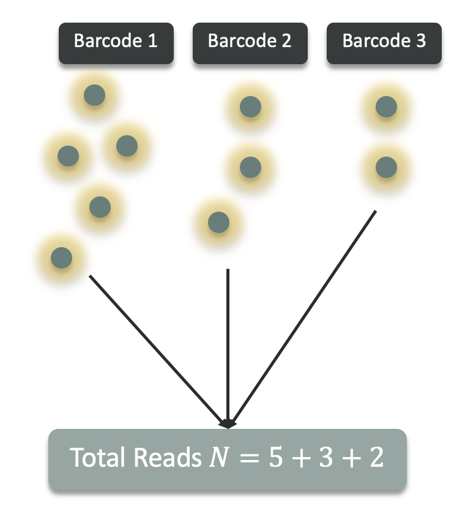
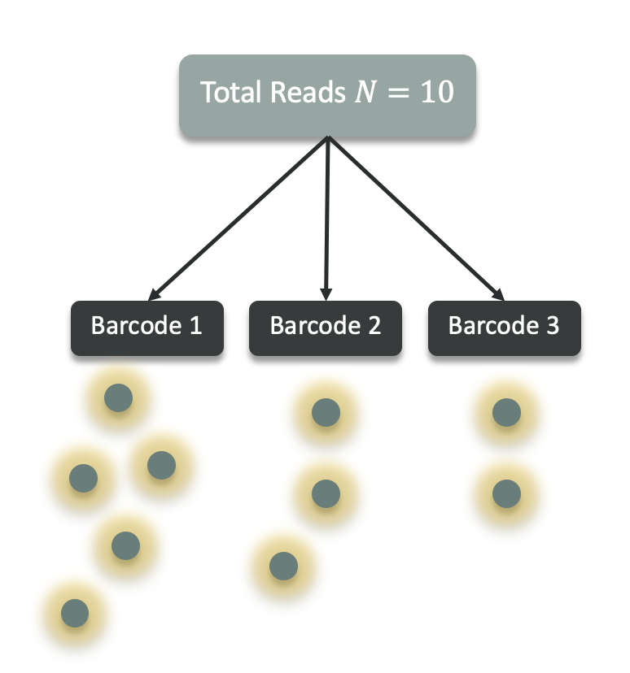
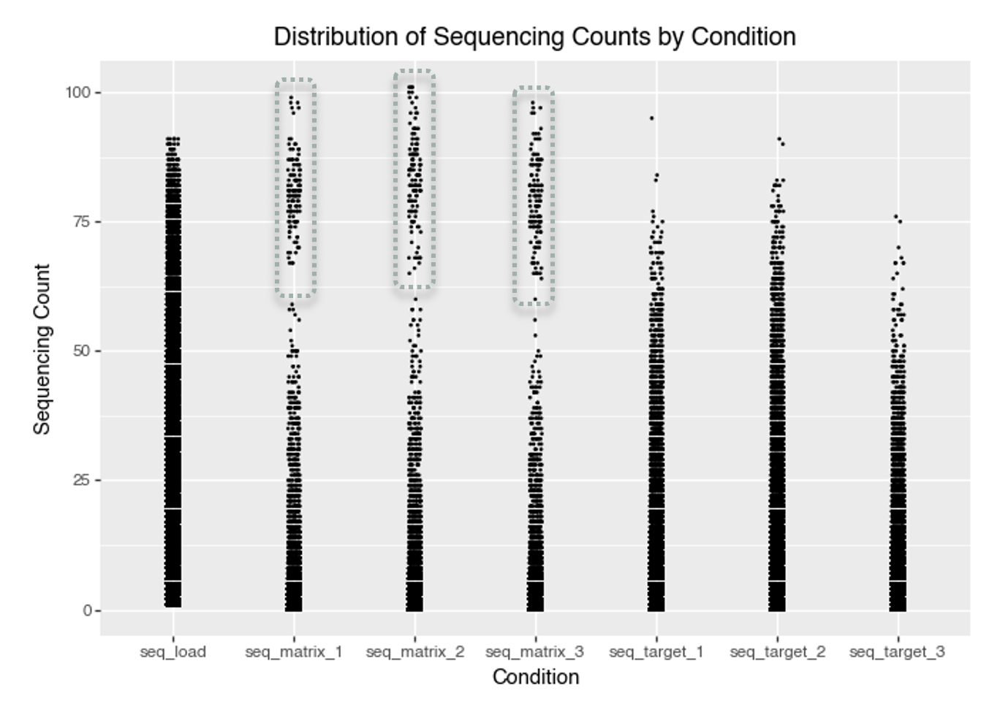
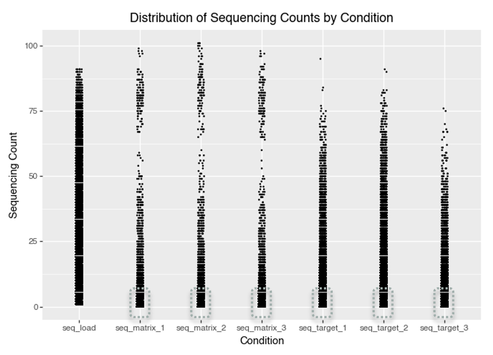
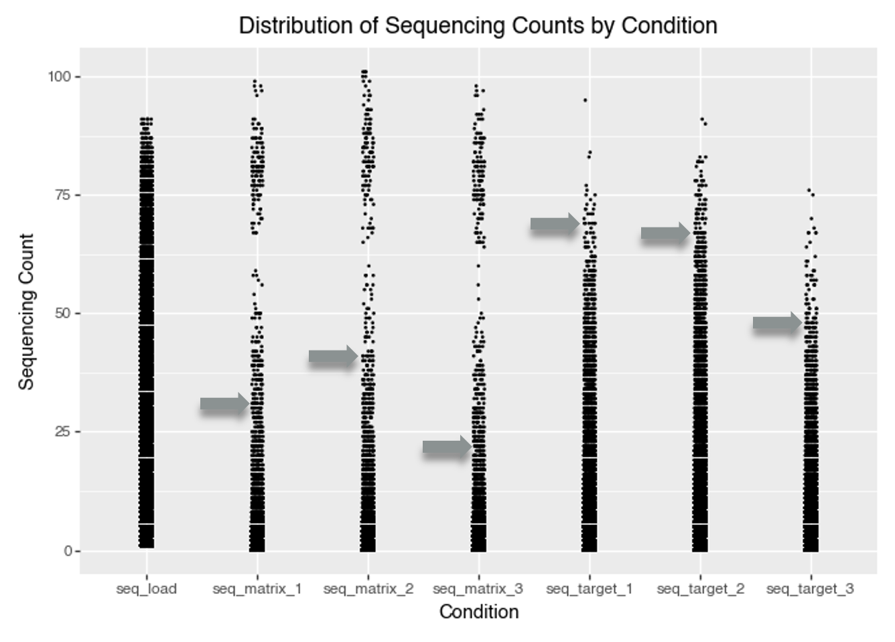
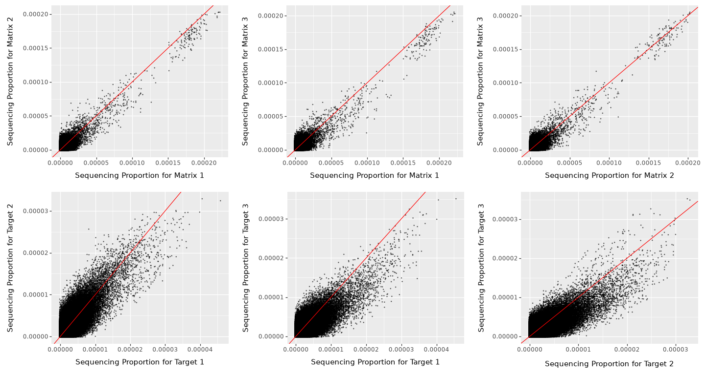
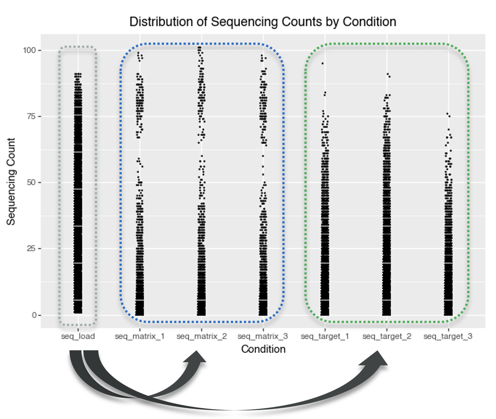
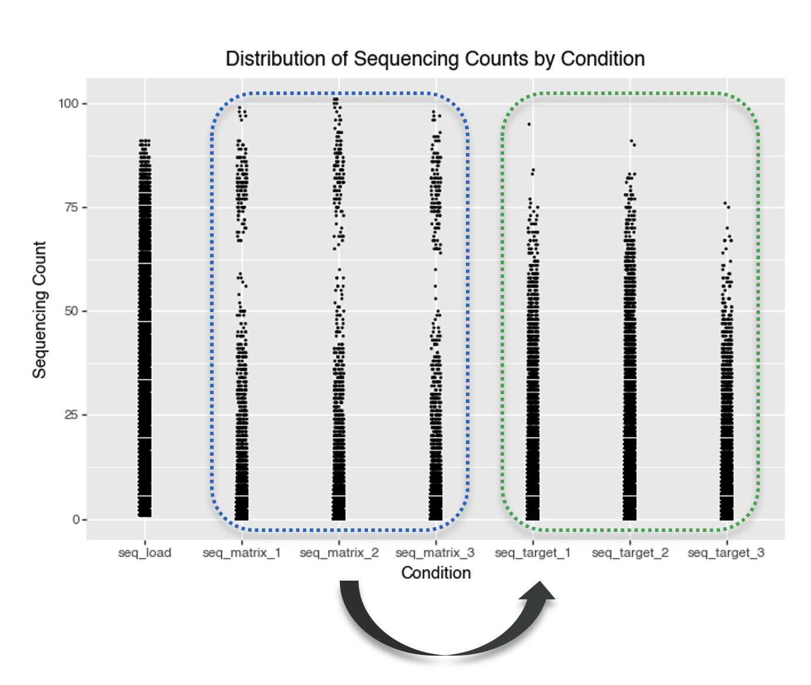

## What Is the Aim of This Blog?

This three-part series aims to build a principled probabilistic framework for modeling DNA-encoded library (DEL) data, with the goal of explaining noisy observed sequencing counts in terms of latent compound-level and synthon-level effects so that true enrichment or binding signal can be separated from technical and compositional artifacts. Part 1 focuses on the statistical foundations of DEL modeling: choosing and interpreting appropriate likelihood functions, understanding the underlying data-generation assumptions, and identifying how background effects, library composition, and replicate variation should be represented. In future posts, we will build on these ideas by covering a count-based denoising model in Part 2 and a synthon-level, attachment-aware extension in Part 3.

::: {.callout-note icon="false"}
## What Part 1 Does and Does Not Cover

-   **Part 1** covers DEL likelihoods, modeling assumptions, exploratory data analysis, and the implications these have for model design.
-   **Part 2** will introduce a probabilistic denoising count model.
-   **Part 3** will extend that model to a synthon-level, attachment-aware setting.
:::

## Introduction: What Are DNA Encoded Libraries (DELs)?

DNA encoded libraries (DELs) are large collections of small molecules, each tagged with a unique DNA barcode that records its synthetic history. They enable high throughput screening by pooling and sequencing to identify binders to a target. Watch [this](https://www.youtube.com/watch?v=8jLIgTBJmdU) and [this](https://www.youtube.com/watch?v=Jc6VlbJBn6A) short videos that explains DELs in a nutshell.

## DEL Likelihood Functions

### What is a correct likelihood function for DELs?

A DEL experiment involves several key stochastic steps that directly impact the statistical modeling of observed counts:

-   **Library synthesis**: initial molecule counts for each barcode can vary, introducing variability from the outset.
-   **Selection or binding step**: enriches certain barcodes based on their binding affinity, leading to barcode-specific changes in abundance.
-   **PCR amplification**: contributes substantial multiplicative noise and is a major source of overdispersion in the data.
-   **Sequencing**: captures a random, approximately Poisson-distributed sample from the amplified pool.

Thus, the observed DEL counts for each barcode are the outcome of a sequence of random processes, with amplification especially contributing to count heterogeneity.

#### Two data-generation perspectives for DEL counts

It is useful to separate DEL count models by the **data-generation assumption** they make about sequencing depth.

**1) Independent-barcode (rate-based) generation**

-   Each barcode (compound) produces its own count **independently** according to a barcode-specific rate.
-   The total read depth is then the **sum of independent counts**.
-   This perspective naturally motivates **Poisson**, **Negative Binomial**, **Poisson–lognormal**, and their zero-inflated variants.

{#fig-independent-barcode width="25%"}

**2) Fixed-depth (composition-based) generation**

-   A sample has a fixed total read depth **N**, and each read is assigned to exactly one barcode.

-   Barcodes therefore **share a single pool** of reads, inducing weak negative dependence between barcode counts.

-   This perspective naturally motivates **Multinomial** and **Dirichlet–multinomial**, and the one-barcode marginal **Binomial/Beta–binomial**.

{#fig-fixed-depth width="35%"}

The likelihoods below are grouped with this distinction in mind.

#### Common likelihood functions for DELs

Below are common likelihood choices for DEL count data. In practice, DEL data are often **overdispersed** (variance \> mean) due to PCR/amplification and other multiplicative factors, and may also exhibit **excess zeros** (true absence, synthesis failures, or aggressive filtering).

##### Poisson

$$
X_i \sim \text{Poisson}(\lambda_i)
$$

Because sequencing counts in DEL experiments arise from random sampling of amplified DNA molecules, the sequencing step can be modeled using a Poisson distribution.

References:

-   [Machine learning on DNA-encoded library count data using an uncertainty-aware probabilistic loss function](https://pmc.ncbi.nlm.nih.gov/articles/PMC10830332/)
-   [Randomness in DNA Encoded Library Selection Data Can Be Modeled for More Reliable Enrichment Calculation](https://pubmed.ncbi.nlm.nih.gov/29437521/)

::: {.callout-note icon="false" collapse="true"}
## When to use Poisson?

Use Poisson when counts are well-explained by a single rate and the **mean–variance relationship is close to** $\mathrm{Var}(X) \approx \mathbb{E}[X]$ after accounting for obvious covariates (e.g., sequencing depth / library size).

Notice that Poisson is usually too narrow for DEL data once PCR noise is present.
:::

##### Poisson-Gamma or Negative Binomial (NB)

$$
X_i \mid \lambda_i \sim \text{Poisson}(\lambda_i), \qquad \lambda_i \sim \text{Gamma}(\alpha, \beta)
$$

::: {style="text-align: center;"}
or
:::

$$
X_i \sim \text{NB}(\mu_i, \phi)
$$

Because DEL sequencing readouts often exhibit overdispersion due to amplification and selection variability, barcode counts can be modeled using a Negative Binomial distribution.

References:

-   [Partial Product Aware Machine Learning on DNA-Encoded Libraries](https://arxiv.org/abs/2205.08020)
-   [Discovery of TNF inhibitors from a DNA-encoded chemical library based on diels-alder cycloaddition](https://pubmed.ncbi.nlm.nih.gov/19875081/) - Figure 3.

::: {.callout-note icon="false" collapse="true"}
## When to use Negative Binomial?

Use NB when you see **variance increasing faster than the mean**, typically well-captured by $\mu + \phi\mu^2$. This is often the default for DEL counts because amplification introduces extra variability.

If you model *paired* pre-/post-selection counts, NB is often used for each condition with shared/related dispersion:

$$
X_i^\text{pre} \sim \text{NB}(\mu_i^\text{pre}, \phi)
$$

$$
X_i^\text{post} \sim \text{NB}(\mu_i^\text{post}, \phi)
$$

The dispersion parameter $\phi$ represents **technical variability** not biological variability.

Because:

-   PCR process is similar between pre and post experiments
-   Sequencing instrument is probably the same between pre and post experiments
-   Library chemistry is the same between pre and post experiments

it is a reasonable assumption that the dispersion parameter is approximately the same between pre and post experiments.

$$
\phi^\text{pre} \approx \phi^\text{post} = \phi
$$

Or, use a common prior for the dispersion parameter:

$$
\phi^\text{pre}, \phi^\text{post} \sim \text{common prior}
$$
:::

##### Zero-Inflated Models

$$
X_i \sim \text{ZIP}(\lambda_i, \pi_i)
$$

::: {style="text-align: center;"}
or
:::

$$
X_i \sim \text{ZINB}(\mu_i, \phi, \pi_i)
$$

Which assumes that there are two mechanisms that produce zeros:

$$
X_i = 0 \quad \text{with probability } \pi_i
$$

::: {style="text-align: center;"}
and
:::

$$
X_i \sim \text{Poisson}(\lambda_i) \quad \text{with probability } 1 - \pi_i \quad \text{(for ZIP)}
$$

::: {style="text-align: center;"}
or
:::

$$
X_i \sim \text{NB}(\mu_i, \phi) \quad \text{with probability } 1 - \pi_i \quad \text{(for ZINB)}
$$

In ZIP/ZINB, with probability $\pi_i$ an observation is a **structural zero** (e.g., true absence or synthesis failure), and otherwise counts follow Poisson or Negative Binomial. In DEL data, *structural absence is rarely observed directly, so zero inflation often reflects dropouts or technical noise*; it can improve fit, but overdispersed Negative Binomial models are often sufficient, so zero inflation should be a diagnostic-driven choice, not a default.

References:

-   [DEL-Ranking: Ranking-Correction Denoising Framework for Elucidating Molecular Affinities in DNA-Encoded Libraries](https://openreview.net/forum?id=QfyZ28FpVY) - Check the reviewers comments.
-   [Compositional Deep Probabilistic Models of DNA-Encoded Libraries](https://arxiv.org/abs/2310.13769) - ZIP used to model DEL data.

::: {.callout-note icon="false" collapse="true"}
## When to use Zero-inflated models?

Zero inflated models assume that there are two mechanisms that produce zeros:

-   **Structural zeros**: these are zeros that are due to:
    -   Synthesis failure for certain barcodes
    -   Missing synthons or ligation errors for certain barcodes
    -   Amplification failure where barcode dropout during amplification
    -   Compound absence in the selection pool
-   **Observed zeros**: these are zeros that are due to the fact that the molecule was not sequenced.

Structural zeros are conceptually different from **sampling zeros**, which Poisson or Negative Binomial can already explain. [This is important because many apparent extra zeros are already explained by **overdispersion** in the Negative Binomial model, *not* a separate zero-generation process.]{.highlight-key-point}

Zero inflated models are reasonable when:

1.  Poisson or Negative Binomial alone underpredicts zeros in posterior predictive checks

    The diagnostic is to check if observed zero fraction is larger than simulated zero fraction from Poisson or Negative Binomial

2.  Known synthesis failure mechanisms

    For instance:

    -   specific synthons systematically fail
    -   Library construction known to have dropout
    -   Certain cycles prosuce missing compounds

    These are structural zeros that are not explained by overdispersion.

3.  Exteremly sparse libraries

    If most barcodes are absent or filtered out, then ZIP, ZINB is a better fit than Poisson or Negative Binomial.

Notice that:

-   If sparsity is **already explained by low counts**, then [ZIP, ZINB is not necessary]{style="color: #d7263d; font-weight: bold;"}.
-   If **filtering is the main source of zeros**, then [ZIP, ZINB is not necessary]{style="color: #d7263d; font-weight: bold;"}.

If zeros are mainly caused by *thresholding / filtering* (i.e., you only record nonzeros above a cutoff), a **hurdle model** may be a better conceptual fit than ZIP, ZINB.
:::

##### Poisson-Lognormal

In the Negative Binomial model, the rate parameter is assumed to vary according to a gamma distribution. In contrast, the Poisson-Lognormal model assumes that the logarithm of the rate parameter follows a normal (lognormal) distribution.

$$
X_i \mid \lambda_i \sim \text{Poisson}(\lambda_i), \qquad \lambda_i \sim \text{Lognormal}(\mu_i, \sigma^2)
$$

A lognormal model for the rate has **heavier tails than a gamma model**, so it tends to fit DEL data better when a small number of barcodes show very large enrichment.

References:

-   There is **no well-known DEL paper** that explicitly uses a Poisson-Lognormal likelihood, although the model is statistically can be used for DEL data.

::: {.callout-note icon="false" collapse="true"}
## When to use Poisson-Lognormal?

Use Poisson–lognormal when noise is naturally **multiplicative on the rate** (PCR / assay effects), giving a log-normal-ish spread in effective rates across observations.
:::

##### Multinomial / Dirichlet-Multinomial {#multinomial-dirichlet-multinomial}

If we model counts **conditional on a fixed total read depth** (library size) in a sample:

$$
\mathbf{X} \sim \text{Multinomial}(N, \mathbf{p})
$$

with $N$ being the total read depth $(N = \sum_{i=1}^K X_i)$, where $K$ is the number of barcodes, and $\mathbf{p}$ being the vector of proportions of each barcode $(p_i = X_i / N)$.

A more overdispersed alternative is Dirichlet-multinomial.

$$
\mathbf{X} \mid \mathbf{p} \sim \text{Multinomial}(N, \mathbf{p}), \qquad \mathbf{p} \sim \text{Dirichlet}(\alpha)
$$

References:

-   There is **no well-known DEL paper** that explicitly uses a Multinomial / Dirichlet-multinomial likelihood, although the model is statistically valid and can be used for DEL data. Check [When to use Multinomial / Dirichlet-multinomial?]{.box-ref-highlight} for more details.

:::::: {.callout-note icon="false" collapse="true"}
## When to use Multinomial / Dirichlet-multinomial?

Use these when primary variability is driven by **relative composition** under a fixed (or modeled) total depth. This is common when comparing barcodes within the same sequencing run.

**In practice:**

-   Multinomial can be too narrow; Dirichlet-multinomial adds extra variability in proportions.

-   Multinomial / Dirichlet-multinomial are especially natural for modeling *within-sample* composition, whereas Poisson and Negative Binomial are common for *per-barcode* marginal modeling.

    -   **Within-sample perspective:** Given one sample with total reads $N$, how are those reads split across all barcodes?
        -   Model the joint vector of proportions/counts in that sample using a Multinomial distribution.
    -   **Per-barcode perspective:** For barcode $i$, what count do I expect?
        -   Model each barcode’s count distribution individually (often approximately independent, especially in sparse DEL settings).

-   Most DEL models don't use Multinomial / Dirichlet-multinomial likelihood, mostly for practical reasons:

    1.  Libraries are extremely large and have millions of barcodes. A multinomial likelihood becomes computationally difficult.
    2.  [When counts are small relative to $N$, then $\text{Multinomial} \approx \text{independent Poisson}$.]{.highlight-key-point}

**Intuition:**

-   **Multinomial perspective:** Imagine you have a total of $N$ sequencing reads, and you assign each one to a barcode. The barcodes share the total pool of reads.

-   **Negative Binomial/Poisson perspective:** Instead, think of each barcode as producing its own number of reads independently, according to its own rate. The total number of reads is simply the sum of these independent counts.

::::: {.callout-tip icon="false" collapse="true"}
## Why does $\text{Multinomial} \approx$ independent Poisson when counts are small relative to $N$?

Let $\mathbf{X}=(X_1,\dots,X_K) \sim \text{Multinomial}(N,\mathbf{p})$, where $\sum_{i=1}^K p_i = 1$ and $\sum_{i=1}^K X_i = N$.

For a fixed barcode $i$, the multinomial marginal is binomial:

$$
X_i \sim \text{Binomial}(N,p_i), \qquad \mathbb{E}[X_i]=Np_i
$$

So $Np_i$ is the expected read count for barcode $i$: among $N$ reads, each read lands in barcode $i$ with probability $p_i$.

In the DEL rare-event / large-depth regime, we consider:

-   $N$ is large,
-   Each barcode probability $p_i$ is small,
-   $Np_i$ stays finite (typically on the order of 1).

Under this scaling ($N\to\infty$, $p_i\to 0$, $Np_i\to\text{fixed value}$), and assuming that Poisson's parameter, $\lambda_i$, is equal to $Np_i$, each marginal converges as $$
X_i \Rightarrow \text{Poisson}(\lambda_i), \quad \lambda_i = Np_i. \quad \text{(K is number of barcodes)}
$$

Check [Why under these conditions, the binomial distribution converges to a Poisson distribution?]{.box-ref-highlight} box below for more details.

Although Multinomial is not independent jointly, but the dependence becomes negligible in sparse DEL settings. Check [Why independent Poisson?]{.box-ref-highlight} box below for more details.

So under rare-event / large-depth regime, **the multinomial can be viewed as the product of independent Poisson counts conditioned on a fixed total**:

$$
\mathbf{X} \approx \prod_{i=1}^K \text{Poisson}(\lambda_i), \qquad \lambda_i=Np_i.
$$

::: {.callout-tip icon="false" collapse="true"}
## Why under these conditions, the binomial distribution converges to a Poisson distribution?

The probability mass function (PMF) of the Binomial distribution is: $$
\Pr(X_i=k)=\binom{N}{k}p_i^k(1-p_i)^{N-k}
$$

Where $N$ is the total number of trials (or our experiment's read depth), $k$ is the number of successes (or our read count for a given barcode), and $p_i$ is the probability of success on each trial (or our barcode enrichment probability).

Now, let's recall the conditions of the rare-event/ large-depth regime:

-   $N$ is large,
-   Each barcode probability $p_i$ is small,
-   $Np_i$ stays finite (typically on the order of 1).

We stated that under this scaling, and **assuming that Poisson's parameter,** $\lambda_i$, is equal to $Np_i$, the PMF of the binomial distribution converges to the PMF of a Poisson distribution.

Let's start by rewriting $p_i$ as: $$p_i = \frac{\lambda_i}{N},$$

then the PMF of the binomial distribution becomes:

$$
\Pr(X_i=k)=\binom{N}{k}\left(\frac{\lambda_i}{N}\right)^k\left(1-\frac{\lambda_i}{N}\right)^{N-k}.
$$

Recall that: $$\binom{N}{k} = \frac{N!}{k!(N-k)!}$$ and $$N! = N(N-1)(N-2)(N-3)\cdots 3\times 2\times 1.$$ It can be written as $$N! = N(N-1)\cdots(N-k+1)(N-k)!$$ This notation is useful because it shows that in $\binom{N}{k} = \frac{N!}{k!(N-k)!}$, the $(N-k)!$ in numerator and denominator cancel out each other. Hence, we can rewrite the binomial coefficient as: $$
\binom{N}{k} = \frac{N(N-1)\cdots(N-k+1)}{k!}.
$$

Therefore, the PMF of the binomial distribution becomes: $$
\Pr(X_i=k)=\binom{N}{k}\left(\frac{\lambda_i}{N}\right)^k\left(1-\frac{\lambda_i}{N}\right)^{N-k}
=
\frac{N(N-1)\cdots(N-k+1)}{k!}\frac{\lambda_i^k}{N^k}\left(1-\frac{\lambda_i}{N}\right)^{N-k}.
$$

Let's focus on the first two terms:

$$
\frac{N(N-1)\cdots(N-k+1)}{k!}\frac{\lambda_i^k}{N^k}
$$

This can be written as: $$
\frac{\lambda_i^k}{k!}\cdot
\frac{N}{N}\cdot\frac{N-1}{N}\cdots\frac{N-k+1}{N}
$$

If we set $\frac{\lambda_i^k}{k!}$ aside, then the product of the remaining terms, can be written as a product of $k$ terms (because $N^k$ in denominator), each of which is of the form $\frac{N-j}{N}$ for $j=0,1,2,\dots,k-1$ ($k-1$, because the first term is $\frac{N}{N}$), hence: $$
\frac{N}{N}\cdot\frac{N-1}{N}\cdots\frac{N-k+1}{N} = \prod_{j=0}^{k-1}\left(1-\frac{j}{N}\right)
$$

Now, let's bring in the first term back, we get: $$
\frac{\lambda_i^k}{k!}\cdot \prod_{j=0}^{k-1}\left(1-\frac{j}{N}\right)
$$

In the rare-event/ large-depth regime, as $N\to\infty$, each term goes to 1, i.e.,

$$
\left(1-\overset{\longrightarrow \ 0}{\cancel{\frac{j}{N}}}\right)\longrightarrow 1 \quad (N\to\infty),
$$

That is because $k$ is fixed (it does not grow with $N$). Thus, $\frac{j}{N}\to 0$ for each $j=0,1,2,\dots,k-1$. Hence, the product of the remaining terms tends to $1$:

$$
\prod_{j=0}^{k-1}\left(1-\overset{\longrightarrow \ 0}{\cancel{\frac{j}{N}}}\right)\longrightarrow 1.
$$

Therefore, in the rare-event/ large-depth regime, the first two terms of the PMF of the binomial distribution converge to:

$$
\boxed{\binom{N}{k}p_i^k = \binom{N}{k}\left(\frac{\lambda_i}{N}\right)^k = \frac{N(N-1)\cdots(N-k+1)}{k!}\frac{\lambda_i^k}{N^k} = \frac{\lambda_i^k}{k!}.\overset{\longrightarrow\,1}{\cancel{\prod_{j=0}^{k-1}\left(1-\overset{\longrightarrow \ 0}{\cancel{\frac{j}{N}}}\right)}} = \frac{\lambda_i^k}{k!}.1 = \frac{\lambda_i^k}{k!}}
$$

Now, let's focus on the third term:

$$
\left(1-\frac{\lambda_i}{N}\right)^{N-k}
$$

This term can be written as:

$$
\left(1-\frac{\lambda_i}{N}\right)^N
\left(1-\frac{\lambda_i}{N}\right)^{-k}
$$

Recall that (this is a well-known result): $$
\lim_{N\to\infty} \left(1-\frac{a}{N}\right)^N = e^{-a}
$$

Therefore as $N\to\infty$, the first term converges to $e^{-\lambda_i}$: $$
\lim_{N\to\infty} \left(1-\frac{\lambda_i}{N}\right)^N = e^{-\lambda_i}
$$

The second term converges to $1$ as $N\to\infty$:

$$
\lim_{N\to\infty} \left(1-\overset{\longrightarrow\,0}{\cancel{\frac{\lambda_i}{N}}}\right)^{-k} = 1
$$

That is because $k$ is fixed (it does not grow with $N$). Thus, $\frac{\lambda_i}{N}\to 0$ as $N\to\infty$.

Putting it all together, the third term converges to:

$$
\boxed{\left(1-\frac{\lambda_i}{N}\right)^{N-k} = \left(1-\frac{\lambda_i}{N}\right)^N
\left(1-\frac{\lambda_i}{N}\right)^{-k} = e^{-\lambda_i}\cdot 1 = e^{-\lambda_i}}
$$

Let's bring in the result of the first and second term back, which was $\frac{\lambda_i^k}{k!}$. Now, we get:

$$
\boxed{\Pr(X_i=k) = e^{-\lambda_i}\frac{\lambda_i^k}{k!}}
$$

What is a PMF of a Poisson distribution? $$
\boxed{\Pr(X_i=k)=e^{-\lambda_i}\frac{\lambda_i^k}{k!}}
$$

Therefore, the PMF of the binomial distribution converges to the PMF of a Poisson distribution:

$$
\Pr(X_i=k)\longrightarrow e^{-\lambda_i}\frac{\lambda_i^k}{k!} = \Pr(X_i=k)\text{ (PMF of Poisson distribution)}.
$$
:::

::: {.callout-tip icon="false" collapse="true"}
## Why independent Poisson?

Jointly, the multinomial constraint $\sum_i X_i=N$ induces weak negative dependence between barcodes.

Intuitively, the total number of reads is a fixed budget: if one barcode receives more reads than expected, fewer reads are available for the others. In a mathematical sense, the covariance between two barcodes is negative in a multinomial model,

$$
\mathrm{Cov}(X_i,X_j)=-Np_ip_j \quad (i\neq j),
$$

The negative value indicates the inuition mentioned above: an increase in one variable often requires a decrease in the other, as the sum of all variables is fixed at $N$. So, the covariance is negative by construction. Equivalently, in terms of proportions $\hat p_i=X_i/N$,

$$
\mathrm{Cov}(\hat p_i,\hat p_j)=-\frac{p_ip_j}{N},
$$

which shrinks to $0$ as $N$ grows. In DEL, each $p_i$ is also very small, so these cross-barcode covariances are tiny. That is why the **dependence is usually negligible in practice**, and the joint distribution is well approximated by a product of **independent** Poisson variables:

$$
X_i \approx \text{Poisson}(\lambda_i), \qquad \lambda_i = Np_i,\quad i=1,\dots,K. \quad \text{(K is number of barcodes)}
$$

This is why DEL models often treat per-barcode counts as independent Poisson (or overdispersed Negative Binomial): it is an accurate and computationally convenient approximation in the sparse-count regime.
:::
:::::
::::::

##### Binomial / Beta-Binomial {#binomial-beta-binomial}

When modeling a single barcode’s counts conditional on fixed total read depth $N$, we can treat the number of reads assigned to barcode $i$ as the marginal of a multinomial model:

$$
\mathbf{X} \sim \text{Multinomial}(N,\mathbf{p})
\quad \Rightarrow \quad
X_i \sim \text{Binomial}(N,p_i)
$$

with $p_i$ the true proportion of barcode $i$ in the pool. Binomial assumes a fixed probability per read and variance $N p_i(1-p_i)$, which can be too narrow when enrichment probabilities vary across experiments, PCR amplification, or selection noise.

A more overdispersed alternative is the Beta-binomial.

References:

-   [Quantitative Comparison of Enrichment from DNA-Encoded Chemical Library Selections](https://pubs.acs.org/doi/10.1021/acscombsci.8b00116) - Introduces a binomial distribution model to compute normalized enrichment z-scores from DEL selections.

$$
X_i \sim \text{BetaBinomial}(N, a_i, b_i)
$$

:::: {.callout-note icon="false" collapse="true"}
## When is Beta–binomial useful for DEL?

The Beta prior adds **extra variability in enrichment probability**, analogous to how the Negative Binomial adds extra variability to Poisson rates.

**The Beta–binomial is the one-dimensional marginal of the Dirichlet–multinomial**: if one barcode is treated as “success” and all others as “failure,” the Dirichlet prior on proportions reduces to a Beta prior for that barcode.

Beta–binomial is particularly natural when modeling:

-   enrichment of **one barcode vs the background library**
-   **binder vs non‑binder probability** formulations
-   selection experiments where **total sequencing depth is fixed**

**In practice:**

-   In large DEL libraries, Beta–binomial can be easier to use than Dirichlet–multinomial because it avoids modeling all barcodes jointly.

-   [When counts are small relative to $N$, then $\text{BetaBinomial} \approx \text{Negative Binomial}$.]{.highlight-key-point}

**Intuition:**

-   **Dirichlet–multinomial** models the *entire library composition*
-   **Beta–binomial** models *one barcode’s share of reads*

::: {.callout-tip icon="false" collapse="true"}
## Why $\text{BetaBinomial} \approx \text{Negative Binomial}$ when counts are small relative to $N$?

Let's start with Beta-binomial:

$$
X_i \sim \text{Binomial}(N, p_i) \quad \text{where} \quad p_i \sim \text{Beta}(a, b)
$$

In the rare-event/ large-depth regime, as $N\to\infty$, the binomial distribution converges to a Poisson distribution:

Check [Why under these conditions, the binomial distribution converges to a Poisson distribution?]{.box-ref-highlight} box in the Multinomial / Dirichlet-multinomial section for more details.

To complete the argument, we now need the analogous result for the prior on the success probability: under the same rare-event scaling, the **Beta prior on** $p$ becomes a **Gamma prior on** $\lambda = Np$. Once that happens, the Beta-binomial becomes a Poisson-Gamma mixture, which is exactly the Negative Binomial.

The key tool is the **change-of-variables formula** for densities.

If a random variable $X$ has density $f_X(x)$ and we define a new variable

$$
Y = g(X)
$$

where $g$ is one-to-one and differentiable, then the density of $Y$ is

$$
f_Y(y) = f_X\bigl(g^{-1}(y)\bigr)\left|\frac{d}{dy}g^{-1}(y)\right|
$$

The intuition is that probability mass is preserved under reparameterization: a small interval around $x$ must carry the same probability as the corresponding small interval around $y = g(x)$, and the derivative term accounts for how the scale stretches or shrinks.

Here the natural rare-event reparameterization is

$$
\lambda = Np
\qquad \Longleftrightarrow \qquad
p = \frac{\lambda}{N}
$$

because in the Poisson limit, $\lambda = Np$ is the quantity that stays finite while $p$ becomes small.

Now assume

$$
p_N \sim \text{Beta}(a, b_N)
$$

and scale the second Beta parameter as

$$
b_N = \beta N
$$

for some fixed $\beta > 0$. This scaling ensures that the typical success probability is of order $1/N$, which is exactly the rare-event regime.

The Beta density is

$$
f_{p_N}(p)
= \frac{1}{B(a,b_N)} p^{a-1}(1-p)^{b_N-1},
\qquad 0 < p < 1
$$

Apply the change-of-variables formula with $p = \lambda/N$. Since

$$
\frac{dp}{d\lambda} = \frac{1}{N},
$$

the density of $\lambda = Np_N$ is

$$
f_{\lambda_N}(\lambda)
= f_{p_N}\left(\frac{\lambda}{N}\right)\frac{1}{N}
= \frac{1}{B(a,b_N)\,N^a}\lambda^{a-1}\left(1-\frac{\lambda}{N}\right)^{b_N-1},
\qquad 0 < \lambda < N
$$

Now take the limit as $N \to \infty$.

First, since $b_N = \beta N$,

$$
\left(1-\frac{\lambda}{N}\right)^{b_N-1}
\;\longrightarrow\;
e^{-\beta \lambda}
$$

which is the standard exponential limit.

Second, use the asymptotic behavior of the Beta function:

$$
B(a,\beta N)
= \frac{\Gamma(a)\Gamma(\beta N)}{\Gamma(a+\beta N)}
\;\sim\;
\Gamma(a)(\beta N)^{-a}
$$

Hence

$$
\frac{1}{B(a,\beta N)\,N^a}
\;\longrightarrow\;
\frac{\beta^a}{\Gamma(a)}
$$

Putting the pieces together,

$$
f_{\lambda_N}(\lambda)
\;\longrightarrow\;
\frac{\beta^a}{\Gamma(a)}\lambda^{a-1}e^{-\beta \lambda},
\qquad \lambda > 0
$$

which is exactly the density of

$$
\lambda \sim \text{Gamma}(a,\beta)
$$

with shape $a$ and rate $\beta$.

Therefore, in the rare-event / large-depth regime,

$$
p_N \sim \text{Beta}(a,\beta N)
\qquad \Longrightarrow \qquad
\lambda_N = Np_N \overset{d}{\longrightarrow} \text{Gamma}(a,\beta)
$$

and since

$$
X \mid p_N \sim \text{Binomial}(N,p_N)
\qquad \Longrightarrow \qquad
X \mid \lambda_N \approx \text{Poisson}(\lambda_N),
$$

we obtain

$$
X \approx \int \text{Poisson}(X \mid \lambda)\,\text{Gamma}(\lambda \mid a,\beta)\,d\lambda
$$

which is a **Poisson-Gamma mixture**, i.e. a **Negative Binomial**.

So the rare-event bridge is:

$$
\text{Beta-Binomial}
\;\approx\;
\text{Poisson-Gamma mixture}
\;=\;
\text{Negative Binomial}
$$
:::
::::

## Example: KinDEL dataset

Let's start with some DEL data. We are using the data from [KinDEL paper](https://arxiv.org/abs/2410.08938). You can learn more about this resource, [here](https://icml.cc/virtual/2025/poster/45034) and access the data, [here](https://github.com/insitro/kindel).

In short, KinDEL is one of the first large, publicly available DNA-Encoded Library (DEL) datasets created specifically to support machine-learning research in drug discovery. The resource contains approximately **81 million small molecules** screened against the **two kinases targets (MAPK14 and DDR1)**, with accompanying benchmark tasks aimed at predictive hit identification and DEL denoising. Beyond raw count data, KinDEL also includes **replicate experiments** and biophysical validation data (on-DNA and off-DNA assays), making it useful for studying how well models recover true binding signals from noisy DEL measurements.

We load only a subsection of the data to keep the example simple and fast to run. In particular, we are loading the data for the DDR1 target, and the first split of the data.

```{python}
import warnings
warnings.filterwarnings("ignore", module="plotnine")

import pandas as pd
import numpy as np
import seaborn as sns
import matplotlib.pyplot as plt
import plotnine as gg

```

```{python}
data = pd.read_parquet("data/df_train_ddr1_split1_random.parquet")
data.head()
```

The columns are:

-   `smiles`: Canonical SMILES string for the fully assembled DEL molecule (the tri‑synthon product).
-   `molecule_hash`: Stable identifier/hash for the assembled molecule (useful for joins and de‑duplication).
-   `smiles_a`: SMILES for the synthon/fragment at attachment site **A** (cycle/position A).
-   `smiles_b`: SMILES for the synthon/fragment at attachment site **B** (cycle/position B).
-   `smiles_c`: SMILES for the synthon/fragment at attachment site **C** (cycle/position C).
-   `seq_target_1`: **Sequencing count** for target selection replicate 1 (number of unique DNA sequences observed for this molecule after selection against the protein target).
-   `seq_target_2`: Sequencing count for target selection replicate 2.
-   `seq_target_3`: Sequencing count for target selection replicate 3.
-   `seq_matrix_1`: Sequencing count for the **negative control / matrix** replicate 1 (selection without protein target).
-   `seq_matrix_2`: Sequencing count for the negative control / matrix replicate 2.
-   `seq_matrix_3`: Sequencing count for the negative control / matrix replicate 3.
-   `seq_load`: **Pre‑selection** sequencing count (rough estimate of each molecule’s abundance in the library prior to selection).
-   `y`: Training label used in KinDEL’s benchmarks; in the released 1M training subsets this column is the dataset’s `target_enrichment` value (a Poisson‑enrichment score comparing target vs control/matrix across replicates).

### Basic Exploratory Data Analysis (EDA)

Let's start with some Exploratory Data Analysis (EDA) to understand the data. We start by plotting counts by condition.

```{python}
#| label: fig-seq-counts
#| fig-cap: Distribution of counts by condition for the KinDEL DDR1 `split1_random` training subset.
data_seq_counts = data.melt(id_vars=['molecule_hash'], value_vars=['seq_target_1', 'seq_target_2', 'seq_target_3', 'seq_matrix_1', 'seq_matrix_2', 'seq_matrix_3', 'seq_load'], value_name='seq_count', var_name='condition')

p = (
    gg.ggplot(data_seq_counts, gg.aes(x = 'condition', y='seq_count'))
    + gg.geom_jitter(width=0.05, height=0, size=0.1)
    + gg.labs(x='Condition', y='Sequencing Count', title='Distribution of Sequencing Counts by Condition')
)
p.save("img/kindel_eda_seq_counts.png")
p.show()
```


#### Matrix binders {#matrix-binders}

A key observation from the plot is that some compounds have very high sequencing counts in the matrix (control) conditions. The distribution of matrix counts appears bimodal. This suggests that some molecules may bind strongly to the matrix itself, not just the intended protein target. Such molecules could give high signals in both the target and matrix conditions, making it challenging to tell if they're true protein binders or simply show nonspecific, matrix-binding effects.

{#fig-matrix-binders width="75%"}

#### Strong low-count mass across all conditions {#strong-low-count-mass-across-all-conditions}

A high density region near low counts suggests that most molecules have very low sequencing counts. This is typical for DEL data where most barcodes are rare or absent in a given selection. Indicates a **sparse count structure** consistent with large library size and small per-barcode probabilities.

{#fig-low-count-mass width="75%"}

A better way to visualize this is to plot the cumulative distribution function (CDF) of the sequencing counts.

::: {.callout-note icon="false" collapse="true"}
## What it is ECDF plot and how to interpret it?

An ECDF (Empirical Cumulative Distribution Function) shows the cumulative proportion of observations that are less than or equal to a given value. Mathematically, it is defined as:

$$
F(x) = \Pr(X \leq x)
$$

An ECDF transforms raw data into a cumulative probability view, making distributional structure and percentiles immediately interpretable without relying on arbitrary bins or model assumptions. **If the curve is at 0.75 when** $x=10$, then 75% of the observations are less than or equal to 10.

Axes are:

-   x-axis: the variable of interest (e.g. sequencing count)
-   y-axis: the cumulative probability

Shape tells us:

-   Steep section: high density of observations near the value
-   Flat section: low density of observations near the value
-   Slope: rate of change of the cumulative probability
:::

```{python}
#| label: fig-ecdf-counts
#| fig-cap: Cumulative distribution function (CDF) of the sequencing counts for all conditions with the 85th percentile marked.
# Plot ECDF faceted by condition, and add vertical line at the 85% quantile for each

seq_conditions = [
    'seq_target_1', 'seq_target_2', 'seq_target_3',
    'seq_matrix_1', 'seq_matrix_2', 'seq_matrix_3'
]

# Melt data for plotnine
data_ecdf = data.melt(
    id_vars=['molecule_hash'],
    value_vars=seq_conditions,
    var_name='condition',
    value_name='seq_count'
)

# Compute the 85th percentile (quantile) for each condition
ecdf_thresholds = (
    data_ecdf.groupby('condition')['seq_count']
    .quantile(0.85)
    .reset_index()
    .rename(columns={'seq_count': 'quantile_85'})
)

# Merge quantiles back for vertical line drawing
# (not strictly necessary, just for convenience)
data_ecdf = data_ecdf.merge(ecdf_thresholds, on='condition', how='left')

# Prepare dataframe for vertical lines
vline_data = ecdf_thresholds.copy()
vline_data['y_start'] = 0
vline_data['y_end'] = 0.85


ecdf_plot = (
    gg.ggplot(data_ecdf, gg.aes(x='seq_count'))
    + gg.stat_ecdf(size=1)
    + gg.geom_vline(
        data=vline_data,
        mapping=gg.aes(xintercept='quantile_85'),
        linetype="dashed", color="red"
    )
    + gg.geom_label(
        data=vline_data.assign(y_pos=0.5),
        mapping=gg.aes(
            x='quantile_85',
            y='y_pos',
            label='round(quantile_85, 1)'
        ),
        color="red",
        fill="white",
        size=11,
        ha='left',
        va='center',
        nudge_x=1,
        label_padding=0.4,
        format_string="{:.0f}"
    )
    + gg.facet_wrap('~condition', scales='free')
    + gg.labs(
        x='Sequencing Count',
        y='Cumulative Probability',
        title='ECDF of Sequencing Counts by Condition (with 85% Quantile)'
    )
    + gg.theme_bw()
    + gg.theme(strip_text=gg.element_text(size=11))
)

ecdf_plot.save("img/kindel_ecdf_by_condition.png")
ecdf_plot.show()
```


The ECDF indicates that most molecules have very low sequencing counts, and the patterns differ between the matrix and target selections. This difference reflects the distinct biological and technical contexts of each selection method.

For the matrix selection, the distribution mirrors the composition of the input library, highlighting that only a small subset of molecules bind to the matrix, which is a desirable outcome, indicating limited non-specific binding.

In contrast, the target selection distribution shows higher counts at the 85th percentile, demonstrating that the target protein enriches for specific compounds. This suggests successful binding or functional selection of molecules by the target protein.

#### Discrete horizontal bands

The appearance of discrete horizontal bands in the plot reflects the presence of repeated, identical sequencing count values across many molecules. This arises because next-generation sequencing produces integer counts and there are only so many ways that low-abundance molecules can be sampled and counted from a large pool. Especially at lower count levels, a substantial number of molecules will have the same sequencing count (for example, many may have a count of "1", "2", and so on), resulting in "steps" in the ECDF plot (@fig-ecdf-counts) or pronounced horizontal bands (@fig-discrete-bands). This effect is further amplified when the sequencing depth is modest relative to the library complexity, or when many molecules are present at similar low abundance.

{#fig-discrete-bands width="75%"}

Let's plot the frequency of each sequencing count value ($\leq 20$) for all conditions. This directly shows why the bands appear: thousands of molecules share the same low integer count.

```{python}
#| label: fig-count-frequency
#| fig-cap: Frequency of each sequencing count value ($\leq 20$) for all conditions.

# Using the already-melted data_ecdf from earlier
count_of_counts = (
    data_ecdf
    .groupby(['condition', 'seq_count'])
    .size()
    .reset_index(name='n_molecules')
)

# Truncate at, say, count=20 for visibility
count_of_counts_trunc = count_of_counts[count_of_counts['seq_count'] <= 20]


frequency_of_counts_plot = (
    gg.ggplot(count_of_counts_trunc, gg.aes(x='factor(seq_count)', y='n_molecules'))
    + gg.geom_col(fill='steelblue', width=0.7)
    + gg.facet_wrap('~condition', scales='free_y')
    + gg.labs(
        x='Sequencing Count',
        y='Number of Molecules',
        title='Frequency of Each Sequencing Count Value (≤ 20)'
    )
    + gg.theme_bw()
    + gg.theme(axis_text_x=gg.element_text(size=8, rotation=90), figure_size=(15, 4))
)

frequency_of_counts_plot.save("img/kindel_frequency_of_counts.png")
frequency_of_counts_plot.show()
```


@fig-count-frequency confirms that low integer counts dominate across conditions: counts such as 0, 1, 2, and 3 occur for very large numbers of molecules, while higher counts are much rarer. This pile-up at a few small integer values is what produces the visible step-like ECDF behavior and discrete horizontal bands seen in the earlier plots.

#### Correlations between replicates {#correlations-between-replicates}

Each experimental selection (both *matrix* and *target*) was performed in three independent replicates:

{#fig-replicate-design width="75%"}

To assess reproducibility, we compare replicate-level sequencing proportions for both matrix and target selections. For each replicate, molecule counts are normalized by the replicate total, then compared pairwise. We use three complementary views: scatter plots (@fig-replicate-scatter) for pattern shape and deviation from the $y=x$ line, a Spearman correlation heatmap (@fig-replicate-heatmap) for a compact quantitative summary of pairwise agreement, and a replicate-support plot (@fig-replicate-support) to show how often molecules are observed at all across replicates.

```{python}
#| label: fig-replicate-scatter
#| fig-cap: Correlations between replicates for the matrix and target selection conditions.

data_seq_counts_matrix = data[['seq_matrix_1', 'seq_matrix_2', 'seq_matrix_3']]

# compute the proportion of the sequencing counts for the matrix conditions
data_seq_counts_matrix['seq_matrix_1_prop'] = data_seq_counts_matrix['seq_matrix_1'] / data_seq_counts_matrix['seq_matrix_1'].sum()
data_seq_counts_matrix['seq_matrix_2_prop'] = data_seq_counts_matrix['seq_matrix_2'] / data_seq_counts_matrix['seq_matrix_2'].sum()
data_seq_counts_matrix['seq_matrix_3_prop'] = data_seq_counts_matrix['seq_matrix_3'] / data_seq_counts_matrix['seq_matrix_3'].sum()

data_seq_counts_target = data[['seq_target_1', 'seq_target_2', 'seq_target_3']]

# compute the proportion of the sequencing counts for the target conditions
data_seq_counts_target['seq_target_1_prop'] = data_seq_counts_target['seq_target_1'] / data_seq_counts_target['seq_target_1'].sum()
data_seq_counts_target['seq_target_2_prop'] = data_seq_counts_target['seq_target_2'] / data_seq_counts_target['seq_target_2'].sum()
data_seq_counts_target['seq_target_3_prop'] = data_seq_counts_target['seq_target_3'] / data_seq_counts_target['seq_target_3'].sum()


p_1 =(
    gg.ggplot(data_seq_counts_matrix, gg.aes(x = 'seq_matrix_1_prop', y='seq_matrix_2_prop'))
    + gg.geom_point(position='jitter', size=0.1, alpha=0.5)
    + gg.geom_abline(slope=1, intercept=0, color='red')
    + gg.labs(x='Sequencing Proportion for Matrix 1', y='Sequencing Proportion for Matrix 2') 

)

p_2 = (
    gg.ggplot(data_seq_counts_matrix, gg.aes(x = 'seq_matrix_1_prop', y='seq_matrix_3_prop'))
    + gg.geom_point(position='jitter', size=0.1, alpha=0.5)
    + gg.geom_abline(slope=1, intercept=0, color='red')
    + gg.labs(x='Sequencing Proportion for Matrix 1', y='Sequencing Proportion for Matrix 3')
)

p_3 = (
    gg.ggplot(data_seq_counts_matrix, gg.aes(x = 'seq_matrix_2_prop', y='seq_matrix_3_prop'))
    + gg.geom_point(position='jitter', size=0.1, alpha=0.5)
    + gg.geom_abline(slope=1, intercept=0, color='red')
    + gg.labs(x='Sequencing Proportion for Matrix 2', y='Sequencing Proportion for Matrix 3')
)

p_4 =(
    gg.ggplot(data_seq_counts_target, gg.aes(x = 'seq_target_1_prop', y='seq_target_2_prop'))
    + gg.geom_point(position='jitter', size=0.1, alpha=0.5)
    + gg.geom_abline(slope=1, intercept=0, color='red')
    + gg.labs(x='Sequencing Proportion for Target 1', y='Sequencing Proportion for Target 2') 

)

p_5 = (
    gg.ggplot(data_seq_counts_target, gg.aes(x = 'seq_target_1_prop', y='seq_target_3_prop'))
    + gg.geom_point(position='jitter', size=0.1, alpha=0.5)
    + gg.geom_abline(slope=1, intercept=0, color='red')
    + gg.labs(x='Sequencing Proportion for Target 1', y='Sequencing Proportion for Target 3')
)

p_6 = (
    gg.ggplot(data_seq_counts_target, gg.aes(x = 'seq_target_2_prop', y='seq_target_3_prop'))
    + gg.geom_point(position='jitter', size=0.1, alpha=0.5)
    + gg.geom_abline(slope=1, intercept=0, color='red')
    + gg.labs(x='Sequencing Proportion for Target 2', y='Sequencing Proportion for Target 3')
)


(p_1 | p_2 | p_3) / (p_4 | p_5 | p_6) + gg.theme(figure_size=(15, 8))
```


In @fig-replicate-scatter, stronger clustering along the red $y=x$ line indicates better agreement between replicate pairs. Agreement is generally clearer for matrix replicates and for higher-abundance molecules. The broad spread at very low proportions is expected in sparse DEL data, where sampling noise dominates; this reduces apparent concordance for low-abundance molecules without necessarily indicating experimental failure.

::: {.callout-note icon="false" collapse="true"}
## Why is sampling noise dominant at low proportions?

Sequencing is a sampling process. Each molecule $i$ has some true (but unknown) proportion $p_i$ in the library. Under the rare-event / large-depth regime, when we sequence a total of $N$ reads, the observed count $n_i$ for molecule $i$ is approximately Poisson-distributed (see [Why under these conditions, the binomial distribution converges to a Poisson distribution?]{.box-ref-highlight} box, in Multinomial / Dirichlet-multinomial section for more details):

$$n_i \sim \text{Poisson}(\lambda_i), \quad \lambda_i = N \cdot p_i$$

The Poisson distribution has the property that its variance equals its mean:

$$\mathbb{E}[n_i] = \lambda_i, \quad \text{Var}(n_i) = \lambda_i$$

The observed proportion is $\hat{p}_i = n_i / N$. Its variance is:

$$\text{Var}(\hat{p}_i) = \frac{p_i}{N}$$

and the standard deviation is:

$$\text{SD}(\hat{p}_i) = \sqrt{\text{Var}(\hat{p}_i)} = \sqrt{\frac{p_i}{N}}$$

The key quantity is the **coefficient of variation** (CV), which measures relative noise, or how large the noise is compared to the signal: $CV = \frac{SD}{Mean}$. It is a dimensionless quantity that is always positive. **The higher the CV, the more noise there is compared to the signal**.

$$
\text{CV}(\hat{p}_i)
= \frac{\text{SD}(\hat{p}_i)}{\mathbb{E}[\hat{p}_i]}
= \frac{\sqrt{p_i / N}}{p_i}
= \frac{\sqrt{p_i} \;/\; \sqrt{N}}{p_i}
= \frac{\sqrt{p_i}}{\sqrt{N} \cdot p_i}
$$

Divide both numerator and denominator by $\sqrt{p_i}$: $$
\frac{\sqrt{p_i}}{\sqrt{N} \cdot p_i}
= \frac{\sqrt{p_i} \;/\; \sqrt{p_i}}{(\sqrt{N} \cdot p_i) \;/\; \sqrt{p_i}}
= \frac{1}{\sqrt{N} \cdot \sqrt{p_i}}
= \frac{1}{\sqrt{N \cdot p_i}}
$$

Which means that the CV is the same as: $$
\boxed{CV(\hat{p}_i) = \frac{1}{\sqrt{\lambda_i}}}
$$

Let's explore the relationship between the coefficient of variation and the proportion of the molecule in the library:

-   When $N \cdot p_i$ is **large** (high-abundance molecules), **the CV is small**. The observed proportion $\hat{p}_i$ is a precise estimate of $p_i$, so two replicates will agree closely.
-   When $N \cdot p_i$ is **small** (low-abundance molecules), **the CV blows up**. For example, if the expected count is $\lambda_i = 1$, then $\text{CV} = 100\%$. The actual count could easily be 0, 1, 2, or 3, which is wildly different relative to the expectation.

Since each replicate draws counts **independently**, their sampling errors are uncorrelated. **When both replicates have high relative noise (low** $p_i$), the scatter in the replicate-vs-replicate plot compounds the noise from both, producing the characteristic fan-shaped spread at low proportions.
:::

::: {.callout-tip icon="false" collapse="true"}
## Why the correlation is different for the matrix and target selection conditions?

### Matrix selection

The matrix condition has no target protein present. Molecules are selected purely based on non-specific affinity for the matrix itself. Because this process is largely driven by physical chemistry (e.g., charge, hydrophobicity) rather than specific binding events, the enrichment is relatively stable and reproducible across replicates. As a result, a molecule that gets a high count in matrix replicate 1 tends to get a similarly high count in matrix replicate 2 and 3 and the points cluster better along the diagonal.

### Target selection

The target selection involves a specific biological interaction between each molecule and the protein (DDR1 in this case). Several factors introduce extra variability here:

-   **Stochastic binding events**: True binders associate and dissociate with the protein in a probabilistic way, and this randomness gets amplified differently in each independent replicate. Here, [stochastic binding events are the main source of variability.]{.highlight-key-point}

-   **Rare true hits**: The vast majority of molecules do not bind the target protein at all, only a tiny fraction are true binders. For these rare binders, the number of molecules that make it through the entire process (binding, washing, elution, PCR, and sequencing) is very small to begin with. As a result, even minor random changes or noise in any step can cause large swings in their observed counts between replicates. Here, [low abundance makes any small random variation in any step matter more in relative terms.]{.highlight-key-point}

    **Example**: Suppose there are only 10 true binder molecules recovered in one replicate and 12 in another. That’s a 20% difference, just from a change of two molecules. If one run happens to have harsher washing conditions, or a few more or less molecules are lost by chance at any stage, the difference is amplified because there are so few to start with. These small absolute changes can translate into large relative fluctuations, which is why true binders often show variable and inconsistent counts across replicates.

-   **PCR amplification noise**: This multiplicative noise affects any enriched compound. [Target-enriched compounds tend to have higher absolute counts (higher $n_{\text{true}}$), so the variance scales up more dramatically.]{.highlight-key-point}

    Let's explain this in more detail. PCR amplification is multiplicative. Each molecule is copied many times, and the number of copies varies stochastically. A simple model is:

    $$
      n_{\text{obs}} = n_{\text{true}} \cdot \epsilon
      $$

    Where:

    -   $n_{\text{obs}}$ is the observed count after PCR amplification.
    -   $n_{\text{true}}$ is the true count before PCR amplification.
    -   $\epsilon$ is the amplification noise (log-normal or gamma distributed), which is a random variable with $\mathbb{E}[\epsilon] = 1$ (so, $\mathbb{E}[n_{\text{obs}}] = n_{\text{true}}$) and $\epsilon$ is independent of $n_{\text{true}}$.

    So, the observed count is a product of the true count, $n_{\text{true}}$, and the amplification noise, $\epsilon$ (a random variable).

    Now, the variance of a constant times a random variable is the square of the constant times the variance of the random variable: $$
      \text{Var}(c \cdot X) = c^2 \cdot \text{Var}(X)
      $$

    This follows from the properties of variance: $$
      \text{Var}(X)
      = \mathbb{E}[(X - \mathbb{E}[X])^2]
      = \mathbb{E}[X^2 - 2X\mathbb{E}[X] + (\mathbb{E}[X])^2]
      = \mathbb{E}[X^2] - 2\mathbb{E}[X]\mathbb{E}[X] + (\mathbb{E}[X])^2
      = \mathbb{E}[X^2] - 2\mathbb{E}[X]^2 + \mathbb{E}[X]^2
      = \mathbb{E}[X^2] - \mathbb{E}[X]^2
      $$

    So,

    $$\text{Var}(cX) = \mathbb{E}[(cX)^2] - (\mathbb{E}[cX])^2 = c^2 \mathbb{E}[X^2] - c^2 (\mathbb{E}[X])^2 = c^2[\mathbb{E}[X^2] - (\mathbb{E}[X])^2] = c^2 \,\text{Var}(X)$$

    Therefore, applying this to the simple model, we get:

    $$
      \text{Var}(n_{\text{obs}}) = n_{\text{true}}^2 \cdot \text{Var}(\epsilon)
      $$

    That is why the variance of target-enriched compounds, with higher $n_{\text{true}}$, scales up more dramatically.
:::

To complement @fig-replicate-scatter, we summarize replicate agreement with a Spearman correlation matrix. Spearman correlation is rank-based, so it asks whether molecules ranked high in one replicate also tend to rank high in another, without assuming a strictly linear relationship.

```{python}
#| label: fig-replicate-heatmap
#| fig-cap: Spearman correlation matrix across matrix and target replicates using within-replicate proportions.
# collect replicate counts
rep_counts = data[
    [
        "seq_matrix_1", "seq_matrix_2", "seq_matrix_3",
        "seq_target_1", "seq_target_2", "seq_target_3",
    ]
].copy()

# convert counts to within-replicate proportions
for col in rep_counts.columns:
    rep_counts[f"{col}_prop"] = rep_counts[col] / rep_counts[col].sum()

rep_prop_cols = [
    "seq_matrix_1_prop", "seq_matrix_2_prop", "seq_matrix_3_prop",
    "seq_target_1_prop", "seq_target_2_prop", "seq_target_3_prop",
]

# Spearman correlation matrix across replicate proportions
corr_tbl = rep_counts[rep_prop_cols].corr(method="spearman")

# lower-triangle heatmap
mask = np.triu(np.ones_like(corr_tbl, dtype=bool))

plt.figure(figsize=(6, 5))
ax = sns.heatmap(
    corr_tbl,
    mask=mask,
    annot=True,
    fmt=".2f",
    cmap="vlag",
    vmin=-1,
    vmax=1,
    square=True,
    cbar_kws={"shrink": 0.8},
)
ax.set_title("Spearman Correlation Matrix Across Replicates (Proportions)")
plt.tight_layout()
plt.show()
```


One more view is useful here: for each molecule, we count in how many of the three replicate experiments the sequencing count is greater than zero. This gives a simple measure of **replicate support**. A molecule detected in all three replicates has much stronger support than a molecule detected in only one replicate, while a molecule with zero counts in all replicates is a clear example of dropout in that condition. Framing the data this way makes the prevalence of dropout immediately visible and complements the pairwise correlation plots above, which show agreement only among the molecules that are observed.

```{python}
#| label: fig-replicate-support
#| fig-cap: Fraction of molecules observed in 0, 1, 2, or 3 replicates for matrix and target selections.
replicate_support = pd.concat(
    [
        pd.DataFrame({
            "selection": "Matrix",
            "n_nonzero_replicates": (data[["seq_matrix_1", "seq_matrix_2", "seq_matrix_3"]] > 0).sum(axis=1),
        }),
        pd.DataFrame({
            "selection": "Target",
            "n_nonzero_replicates": (data[["seq_target_1", "seq_target_2", "seq_target_3"]] > 0).sum(axis=1),
        }),
    ],
    ignore_index=True,
)

support_summary = (
    replicate_support
    .groupby(["selection", "n_nonzero_replicates"])
    .size()
    .reindex(
        pd.MultiIndex.from_product(
            [["Matrix", "Target"], [0, 1, 2, 3]],
            names=["selection", "n_nonzero_replicates"],
        ),
        fill_value=0,
    )
    .reset_index(name="n_molecules")
)
support_summary["percent"] = (
    100 * support_summary["n_molecules"]
    / support_summary.groupby("selection")["n_molecules"].transform("sum")
)
support_summary["replicate_support_label"] = pd.Categorical(
    support_summary["n_nonzero_replicates"].map({
        0: "Detected in 0 replicates",
        1: "Detected in 1 replicate",
        2: "Detected in 2 replicates",
        3: "Detected in 3 replicates",
    }),
    categories=[
        "Detected in 0 replicates",
        "Detected in 1 replicate",
        "Detected in 2 replicates",
        "Detected in 3 replicates",
    ],
    ordered=True,
)

replicate_support_plot = (
    gg.ggplot(
        support_summary,
        gg.aes(
            x="replicate_support_label",
            y="percent",
            fill="selection",
        ),
    )
    + gg.geom_col(width=0.7, show_legend=False)
    + gg.facet_wrap("~selection", nrow=1)
    + gg.labs(
        x="Detection across replicates",
        y="Percent of molecules",
        title="Replicate support differs strongly between matrix and target selections",
    )
    + gg.theme_bw()
    + gg.theme(
        figure_size=(10, 4),
        axis_text_x=gg.element_text(rotation=20, ha="right"),
    )
)

replicate_support_plot.save("img/kindel_replicate_support.png")
replicate_support_plot.show()
```


Together, @fig-replicate-scatter, @fig-replicate-heatmap, and @fig-replicate-support support a consistent interpretation:

within-condition replicate correlations are positive and informative (typically stronger for matrix than target), while low-abundance regions remain noisy due to sampling variation. Cross-condition correlations (matrix vs target) are expected to be lower because they reflect different biological/technical mechanisms.

The replicate-support view adds an important nuance: many molecules are absent from all three matrix replicates, whereas target counts are much more often observed in two or three replicates. This reinforces two modeling points:

-   First, dropout is common and should not automatically be interpreted as a structural zero.
-   Second, reproducibility depends on condition, which argues for explicit replicate-level noise rather than treating all zeros or disagreements as biologically meaningful.

When fitting count models, this replicate-to-replicate variation should be modeled explicitly rather than ignored.

#### Relationship between pre and post-selection counts {#relationship-between-pre-and-post-selection-counts}

Pre-selction counts are represented by `seq_load` column in the dataset. The pre-selction counts represent the abundance of each molecule in the library prior to any selection. That is, how many copies of each barcode were present before exposing the library to either the matrix or the target protein. [Having this pre-selection abundance information is useful because it allows us to distinguish between molecules that appear enriched after selection due to true binding (biological effect) and those that were simply more prevalent in the input library (technical artifact).]{.highlight-key-point}

{#fig-pre-post-overview width="75%"}

Molecules might have higher pre-selection counts due to:

-   **Synthesis variability**: Some molecules are overrepresented in the input library due to differences in chemical synthesis.
-   **Sequence preferences**: Certain sequences are preferentially amplified during library preparation.

Let's start by plotting the relationship between pre-selection counts and post-selection counts for the matrix and target selection conditions. Here, we take the mean of the post-selection counts for the matrix and target selection conditions across the three replicates. Then, we log-transform the pre-selection counts and the mean of the post-selection counts to make the plot interpretable.

::: {.callout-note icon="false" collapse="true"}
## Why log-transforming data with `log1p(x)` (i.e., `log(x + 1)`) makes the data interpretable?

DEL sequencing counts and means are highly skewed and span several orders of magnitude, with many zeros and a few very large values.

`log1p(x)` makes the plot interpretable, because:

-   `log1p(0) = 0` (so zeros remain zeros, avoiding -inf)
-   `log1p(x)` compresses large values, reduces skew, and reveals structure across the full dynamic range. For example, a value of 1000 becomes `log1p(1000) = 6.9`, which is much more manageable and interpretable.
-   Without log-transform, details at low and medium counts would be obscured by a few outliers (e.g., very large values).
:::

```{python}
#| label: fig-pre-post-scatter
#| fig-cap: Pairwise relationships between `seq_load`, matrix mean, and target mean counts on the log scale.

rel = data.copy()
rel["matrix_mean"] = rel[["seq_matrix_1", "seq_matrix_2", "seq_matrix_3"]].mean(axis=1)
rel["target_mean"] = rel[["seq_target_1", "seq_target_2", "seq_target_3"]].mean(axis=1)

rel["log_seq_load"] = np.log1p(rel["seq_load"])
rel["log_matrix_mean"] = np.log1p(rel["matrix_mean"])
rel["log_target_mean"] = np.log1p(rel["target_mean"])


rel_long = pd.concat(
    [
        rel[["log_seq_load", "log_matrix_mean"]].rename(columns={"log_seq_load": "x", "log_matrix_mean": "y"}).assign(panel="Load vs Matrix"),
        rel[["log_seq_load", "log_target_mean"]].rename(columns={"log_seq_load": "x", "log_target_mean": "y"}).assign(panel="Load vs Target"),        
    ],
    ignore_index=True,
)

(
    gg.ggplot(rel_long, gg.aes(x="x", y="y"))
    + gg.geom_point(alpha=0.1, size=0.25)
    + gg.geom_abline(slope=1, intercept=0, color="red")
    + gg.facet_wrap("~panel", scales="free")
    + gg.labs(
        x="log1p (seq_load)", 
        y="log1p (matrix_mean) or log1p (target_mean)", 
        title="Pairwise relationships: seq_load, matrix, and target"
    )
    + gg.theme_bw()
)
```


The scatter plots of log-transformed pre-selection counts (`seq_load`) versus post-selection mean counts (matrix and target) show three consistent patterns:

-   **Dense cloud below the diagonal:**\
    Most molecules lie below the $y=x$ line, meaning post-selection counts are lower than pre-selection counts. This is expected for non-binders that are depleted during selection. The visible horizontal and vertical banding reflects integer count discreteness after log transformation.

-   **High-count points near the diagonal:**\
    Molecules near the diagonal have post-selection counts close to their initial abundance. Many of these likely reflect input-library overrepresentation (for example, synthesis or sequencing bias as mentioned above) rather than selective enrichment. So, large counts alone should not be interpreted as evidence of binding.

-   **Points above the diagonal (enrichment):**\
    Molecules above $y=x$ have higher post-selection than pre-selection counts. In "Load vs Matrix," these are plausible non-specific matrix binders; in "Load vs Target," they are candidate target binders (e.g., DDR1). A larger above-diagonal population in the target panel suggests enrichment beyond background matrix effects.

::: {.callout-note icon="false" collapse="true"}
## What is the modelling implication of the above plots?

Since high post-selection counts can reflect either true biological enrichment or simply high initial abundance, it's essential to adjust for pre-selection abundance (seq_load) when modeling to accurately identify binders.
:::

@fig-pre-post-scatter shows the relationship between pre- and post-selection counts for the matrix and target selection conditions. We can also provide a concise quantitative summary of how strongly these variables move together.

Again, Spearman correlation is a good choice since it is rank-based, asking whether molecules with higher `seq_load` also tend to have higher matrix or target counts, without assuming a linear relationship. The Spearman correlation matrix therefore complements @fig-pre-post-scatter by turning the visual trends into directly comparable pairwise association measures.

```{python}
#| label: fig-pre-post-corr
#| fig-cap: Spearman correlation matrix between log-transformed pre-selection abundance (`seq_load`), matrix counts, and target counts.
# compute the Spearman correlation matrix
corr_tbl = rel[["log_seq_load", "log_matrix_mean", "log_target_mean"]].corr(method="spearman")
# Plot the Spearman correlation matrix as a lower triangle heatmap

# Create a mask for the upper triangle
mask = np.triu(np.ones_like(corr_tbl, dtype=bool))

plt.figure(figsize=(5, 4))
ax = sns.heatmap(
    corr_tbl, 
    mask=mask, 
    annot=True, 
    fmt=".2f", 
    cmap="vlag", 
    vmin=-1, 
    vmax=1, 
    square=True,
    cbar_kws={"shrink": .8}
)
plt.title("Spearman Correlation Matrix (log-transformed)\nPre-selection, Matrix, Target")
plt.tight_layout()
plt.show()
```


The correlation matrix shows high correlation between `seq_load` and matrix counts, and low correlation between `seq_load` and target counts. This is consistent with the visual patterns in @fig-pre-post-scatter where matrix counts mostly track library composition and have a tighter scatter whereas target counts reflect enrichment, not just library compoistion and hence have a looser scatter.

Another correlation that is interesting to look at is the correlation between matrix and target counts. High correlation here means target counts may be dominated by background effects. Let's look at the correlation between matrix and target counts.

#### Relationship between matrix and target counts {#relationship-between-matrix-and-target-counts}

Exploring the relationship between matrix and target counts can help us to understand if the target counts are dominated by background effects or are truly enriched by the target protein.

{#fig-matrix-target-overview width="75%"}

```{python}
#| label: fig-matrix-target-scatter
#| fig-cap: Relationship between mean matrix and target replicate counts on the log scale.
rel_long = pd.concat(
    [
        rel[["log_matrix_mean", "log_target_mean"]].rename(columns={"log_matrix_mean": "x", "log_target_mean": "y"}).assign(panel="Matrix vs Target"),
    ],
    ignore_index=True,
)
(
    gg.ggplot(rel_long, gg.aes(x="x", y="y"))
    + gg.geom_point(alpha=0.1, size=0.25)
    + gg.geom_abline(slope=1, intercept=0, color="red")
    + gg.labs(x="log1p (matrix_mean)", y="log1p (target_mean)", title="Pairwise relationships: matrix, target")
    + gg.theme_bw()
)
```


This plot compares the mean matrix and target counts (across three replicates) for each molecule, with the red line indicating equality (i.e., $y = x$). The vertical lines are due to integer-valued counts in the matrix and target selections.

While there is a general positive relationship (0.67 based on the Spearman correlation in @fig-pre-post-corr), reflecting that target counts include matrix-derived background, many points appear above the diagonal. That is higher target counts than matrix counts. This indicates specific enrichment in the target condition beyond background effects.

#### Crude enrichment relative to matrix background

Because a molecule can be abundant in the input library and still show non-specific matrix binding, it is useful to combine the previous two ideas into a single diagnostic. A simple way to do that is to plot a crude target-over-matrix enrichment score against pre-selection abundance. This is not a substitute for a probabilistic model, but it provides an intuitive preview of the modeling target.

```{python}
#| label: fig-enrichment-vs-load
#| fig-cap: Crude target-over-matrix enrichment plotted against pre-selection abundance. The dashed line marks equal target and matrix signal.
rel["log2_target_over_matrix"] = np.log2((rel["target_mean"] + 1) / (rel["matrix_mean"] + 1))

enrichment_plot = (
    gg.ggplot(
        rel,
        gg.aes(x="log_seq_load", y="log2_target_over_matrix"),
    )
    + gg.geom_bin_2d(bins=70)
    + gg.geom_hline(yintercept=0, color="#d7301f", linetype="dashed", size=0.7)
    + gg.scale_fill_gradient(
        low="#deebf7",
        high="#08519c",
        name="Number of\nmolecules",
    )
    + gg.labs(
        x="log1p(pre-selection count)",
        y="log2((target mean + 1) / (matrix mean + 1))",
        title="Target-over-matrix enrichment across pre-selection abundance",
    )
    + gg.theme_bw()
    + gg.theme(
        figure_size=(7, 5),
        panel_grid_minor=gg.element_blank(),
        panel_grid_major=gg.element_line(color="#e5e5e5", size=0.3),
        plot_title=gg.element_text(weight="bold"),
    )
)

enrichment_plot.save("img/kindel_target_over_matrix_enrichment_vs_load.png")
enrichment_plot.show()
```


This plot brings the previous EDA results together in a single view. The x-axis shows how abundant a molecule was before selection, while the y-axis shows whether its average target count is higher or lower than its average matrix count.

The dashed horizontal line at zero is the key reference point:

-   Molecules **near zero** have similar target and matrix counts, so their signal is consistent with background rather than clear target-specific enrichment;
-   Molecules **below zero** have lower target than matrix signal, which makes them poor target-binder candidates;
-   Molecules **above zero** have excess target signal relative to matrix background, making them more plausible target-specific binders.

Most importantly, molecules with positive enrichment appear across a range of pre-selection abundances, not only among the most abundant compounds in the input library. The quantity we care about is not raw count size by itself, but **target-specific enrichment after accounting for both matrix background and input abundance**.

#### Relationship between mean and variance of the sequencing counts {#relationship-between-mean-and-variance-of-the-sequencing-counts}

The mean–variance relationship of the sequencing counts is a useful diagnostic tool to check if the data is overdispersed or underdispersed.

-   Overdispersion: The variance is greater than the mean.
-   Underdispersion: The variance is less than the mean.

[In DEL data, underdispersion is often rare and overdispersion is often the norm.]{.highlight-key-point}

The following factors contribute to inflating the variance above the mean:

-   PCR amplification
-   Molecule-specific amplification biases
-   Replicate-to-replicate technical variability.

**True underdispersion is uncommon**; when variance appears below the mean, it is often due to small-sample noise (e.g., with only a few replicates) rather than a genuinely underdispersed process.

As can be seen from @fig-seq-counts, the sequencing count distributions are right-skewed and heavy-tailed. While a heavy right tail suggests the presence of high-count outliers and large variability, it does not alone confirm overdispersion in the strict statistical sense (where the variance exceeds the mean). Overdispersion should be directly assessed by comparing the sample mean and variance of counts across replicates. Let's plot the mean and variance of the sequencing counts for the matrix and target selection replicates to examine this directly.

```{python}
#| label: fig-mean-variance
#| fig-cap: Mean-variance relationship of the sequencing counts for the matrix and target selection conditions.
# Compute mean and variance for both matrix and target replicates
mv = pd.DataFrame({
    'mean_matrix': data[['seq_matrix_1', 'seq_matrix_2', 'seq_matrix_3']].mean(axis=1),
    'var_matrix':  data[['seq_matrix_1', 'seq_matrix_2', 'seq_matrix_3']].var(axis=1),
    'mean_target': data[['seq_target_1', 'seq_target_2', 'seq_target_3']].mean(axis=1),
    'var_target':  data[['seq_target_1', 'seq_target_2', 'seq_target_3']].var(axis=1),
})

# Melt for long format for plotting
mv_long = pd.concat([
    mv[['mean_matrix', 'var_matrix']].rename(columns={'mean_matrix': 'mean', 'var_matrix': 'var'}).assign(condition='Matrix'),
    mv[['mean_target', 'var_target']].rename(columns={'mean_target': 'mean', 'var_target': 'var'}).assign(condition='Target'),
], ignore_index=True)

mean_var_plot = (
    gg.ggplot(mv_long, gg.aes(x='mean', y='var'))
    + gg.geom_point(size=0.3, alpha=0.3)
    + gg.geom_abline(slope=1, intercept=0, color='red', linetype='dashed')
    + gg.scale_x_log10() + gg.scale_y_log10()
    + gg.facet_wrap('~condition', scales='free')
    + gg.labs(
        x='Mean count',
        y='Variance',
        title='Mean–Variance by Condition: points above red line indicate overdispersion'
    )
    + gg.theme_bw()
)

mean_var_plot
```


The red line is the Poisson assumption, which means the variance is equal to the mean:

$$
\mathrm{Var}(X) = \mathrm{E}[X]
$$

The points above the red line indicate overdispersion, which means the variance is greater than the mean:

$$
\mathrm{Var}(X) > \mathrm{E}[X]
$$

Both matrix and target conditions show clear overdispersion: most points lie above the red Poisson line (Var = Mean), so variance exceeds the mean across the count range.

**In the matrix condition**, the overdispersion is mainly due to technical noise (PCR, sequencing) and non-specific matrix binding. Molecules with similar mean counts can still vary a lot across replicates.

**In the target condition**, the overdispersion includes the same technical sources plus biological variability from true target binding. Enriched binders can have high mean and high variance, while non-binders stay near the low-count region.

In the matrix condition, the points with high mean and low variance on the right side of the plot are likely to be the same compounds that are present in all three replicates and is discussed in the Matrix binders section.

The horizental lines in the plots are due to integer-valued counts in the matrix and target selections, as mentioned in the previous section.

::: {.callout-note icon="false" collapse="true"}
## What does the points below the red line indicate?

The points below the red line does not necessarily indicate underdispersion, which means the variance is less than the mean:

$$
\mathrm{Var}(X) < \mathrm{E}[X]
$$

Two main reasons for points below the red line:

-   **Small-sample variance noise**: With only three replicates, we can get strong estimation noise. Even if the true process is Poisson or NB, some sample variances will fall below the mean purely by chance.

-   **Nearly identical replicates**: If the replicates are nearly identical, the variance will be very low.

    **Example**: Let's say we have three replicates: (10,10,11). The mean is 10.33 and the variance is 0.33. Variance is tiny and it falls below the red line. In this case, the variance is due to low observed replicate variation NOT necessarily biologically meaningful underdispersion.
:::

### Choosing appropriate likelihood functions

We choose likelihood functions based on two EDA findings:

-   **Rare-event, high-depth counts:**\
    As shown in [Strong low-count mass across all conditions](#strong-low-count-mass-across-all-conditions), most molecules have very low counts. This sparse regime is well described by independent-barcode (rate-based) models such as Poisson, Negative Binomial, and Poisson-Lognormal.

    In this setting, fixed-depth (composition-based) models become approximately equivalent to rate-based models, which further supports focusing on the independent-barcode view. (See [Two data-generation perspectives for DEL counts](#two-data-generation-perspectives-for-dels), [Multinomial / Dirichlet-Multinomial](#multinomial-dirichlet-multinomial), and [Binomial / Beta-Binomial](#binomial-beta-binomial).)

-   **Overdispersion:**\
    In [Mean–variance relationship of the sequencing counts](#relationship-between-mean-and-variance-of-the-sequencing-counts), the variance is consistently larger than the mean, indicating overdispersion. This rules out a pure Poisson assumption and favors likelihoods that explicitly model extra-Poisson variability.

Taken together, the data support **Negative Binomial** and **Poisson-Lognormal** as the most appropriate likelihoods for DEL rate-based count modeling in this analysis.

### Considerations for modeling parameters of the likelihood functions

EDA highlights three key non-target/technical effects that should be explicitly modeled, as they can inflate or distort observed post-selection counts.

-   **Matrix-driven background:** As discussed in [Matrix binders](#matrix-binders), some compounds are consistently enriched in the matrix condition, and this pattern is reproducible across replicates (see [Correlations between replicates](#correlations-between-replicates)). In addition, [Relationship between matrix and target counts](#relationship-between-matrix-and-target-counts) shows that matrix and target counts are correlated. Together, these results indicate that part of the target signal can reflect non-specific matrix binding rather than true target affinity.

-   **Library composition effects:** [Relationship between pre and post-selection counts](#relationship-between-pre-and-post-selection-counts) shows that pre-selection abundance is correlated with post-selection counts. This implies that baseline library representation can propagate into both matrix and target readouts, independently of binding strength.

-   **Replicate-level variation:** The [Correlations between replicates](#correlations-between-replicates) analysis (including the Spearman summary in @fig-replicate-heatmap) shows that replicate agreement is substantial but not perfect, especially in low-abundance regions where sampling and technical noise are strongest. This indicates that replicate-to-replicate shifts should be modeled explicitly (e.g., with replicate random effects or condition-specific replicate offsets), rather than absorbed into enrichment parameters.

In practice, likelihood parameterization should separate background structure (matrix effects and input composition), replicate-level technical variation, and true target-dependent enrichment. Doing so improves both the accuracy of enrichment estimates and the biological interpretability of model outputs.


### What exactly is the modeling target?

At this stage, it is useful to distinguish clearly between the **data we observe**, the **latent quantity we want to infer**, and the **practical goal of the model**.

-   **Observed data:** the raw sequencing counts themselves, such as pre-selection (`seq_load`), matrix counts, and target counts across replicates. These are the quantities modeled directly by the likelihood.
-   **Inferential target:** the latent enrichment or binding-related signal that explains why some molecules have higher target counts than would be expected from input abundance and background matrix effects alone.
-   **Practical goal:** not merely predicting raw counts, but **denoising and ranking molecules** so that likely binders are separated from molecules that look strong only because of technical noise, input abundance, or non-specific background binding, while still allowing genuinely promising low-count compounds to be rescued when the overall evidence supports binding.

This distinction matters because a good probabilistic DEL model should treat observed counts as noisy evidence, not as the binding signal itself. 

### A causal sketch of DEL counts

The previous EDA sections each diagnosed a specific problem with DEL data: overdispersion, matrix background correlation, library composition confounding, and replicate-level noise. Taken individually, each finding motivates a modelling choice. But taken together, they point to something deeper: observed counts are not direct measurements of binding, rather they are the **mixture of several overlapping causes**, only one of which is the signal we care about.

A useful way to make this explicit is a **causal sketch of the data generation process**. A causal sketch is a map of cause and effect: nodes are variables, and arrows show which variables causally influence which others. Its value here is not just descriptive, it is a **modelling prescription**.

Drawing on everything identified in the EDA, the four latent causes of DEL sequencing counts are:

-   **Library composition** is a common upstream cause of all three count types: pre-selection, matrix, and target. A molecule that happens to be over-represented in the synthesized library will appear more often in every condition, regardless of whether it binds anything. This was established in [Relationship between pre and post-selection counts](#relationship-between-pre-and-post-selection-counts).
-   **Matrix background** is a shared cause of both matrix and target counts. Non-specific interactions with the solid support inflate post-selection counts in both conditions simultaneously, which is why the [Relationship between matrix and target counts](#relationship-between-matrix-and-target-counts) shows a  positive association even for non-binders.
-   **Target binding** is the only cause that flows exclusively into the target counts, on top of what matrix background and library composition already contribute. This is the signal of interest.
-   **Replicate effects and technical noise** operate at the observation stage. Because we have replicate matrix and target measurements but not replicate pre-selection counts, this noise enters the model at the point where latent rates become observed read counts.

@fig-causal-sketch captures this structure as a causal sketch with three layers. On the left are the **latent causes**: library composition and input abundance, matrix-background propensity, target-binding propensity, and condition-specific replicate effects (sampling, PCR, and run variation). Each latent cause flows into the middle layer, which contains the **condition-specific latent count intensities**, one for pre-selection, one for matrix, and one for target. These intensities are not directly observable; they are the underlying rates that determine how many reads a given molecule generates under each condition. Finally, the right layer shows the **observed sequencing counts**, `seq_load` for pre-selection, and replicated matrix (`seq_matrix_1`, `seq_matrix_2`, `seq_matrix_3`) and target (`seq_target_1`, `seq_target_2`, `seq_target_3`) read counts, which are noisy draws from those latent intensities.

{#fig-causal-sketch width="75%"}

[The causal sketch also makes it clear why a simple enrichment ratio, for example, dividing target counts by matrix counts, is not a satisfying answer to the DEL hit identification problem. Such a ratio partially cancels the matrix background, but it ignores the library-composition entirely, so a molecule that is abundant in the input library will still look enriched even if it does not bind the target.]{.highlight-key-point}

@fig-causal-sketch is the blueprint for the modeling approach in Part 2. Each latent cause identified in the causal sketch is translated into a specific component of a probabilistic count model. By explicitly modeling these causes, we are able to separate true binding signal from background noise and technical effects, resulting in a cleaner, more reliable estimate of binding for each molecule.

## Key Takeaways and Next Steps

In this post, we focused on the statistical principles needed to model DEL sequencing counts. The exploratory analyses showed that the data are sparse, dominated by low counts, and clearly overdispersed, which makes rate-based count models such as the **Negative Binomial** and **Poisson-Lognormal** more appropriate than simple Poisson models. At the same time, the EDA highlighted three effects that any useful DEL model should handle explicitly: matrix-driven background, library composition, and replicate-level technical variation. The statistical principles will guide the choice of likelihood functions and the modeling of parameters of the likelihood functions.

These observations have an important modeling implication: observed post-selection counts should not be interpreted as direct evidence of binding without accounting for background and technical structure. A good DEL model should explain noisy counts through a probabilistic likelihood while separating true enrichment signal from non-specific matrix effects, input abundance, and replicate-to-replicate variability.

In the next post, we will build on this principle by specifying and fitting a count-based probabilistic denoising model for DEL data. The goal will be to model observed counts directly while inferring latent enrichment or binding-related signal in a way that is more robust to technical and compositional artifacts.

************************************************************************

TODO:

1. Check the Beta-Binomial section.

2. Do a final consistency and proofreading pass. The content is strong, but a polish pass would help. In blogs/DEL_Model/DEL_modelling_Part_1.qmd there are still a few wording/typo issues like Pre-selction, horizental, compoistion, and a few sentences that are slightly repetitive. Cleaning those up will noticeably improve readability.


*****************************

Idea for the next blog on GenAI: https://apps.allenimmunology.org/aifi/resources/parse-10m-cytokines/

