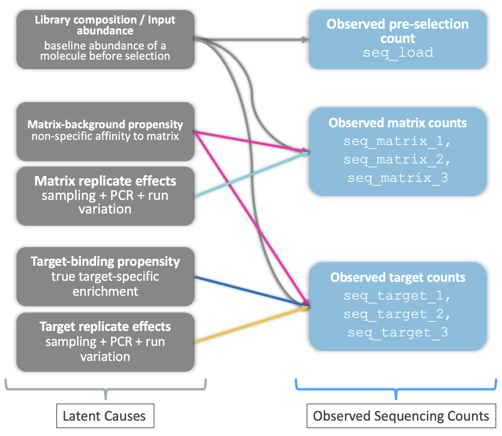
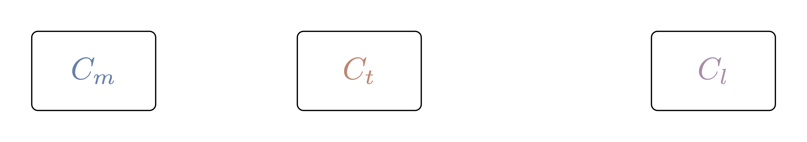

## What Is the Aim of This Blog?

This blog builds on the statistical foundations established in Part 1 by specifying and fitting a probabilistic model for DNA-encoded library (DEL) sequencing counts. The goal is to explain noisy observed counts in terms of latent enrichment, background matrix effects, input-library composition, and replicate-level technical variation, so that binding-related signal can be separated from technical and compositional artifacts. A compound-aware model that incorporates molecular structure is deferred to Part 3.

## The causal sketch from Part 1

The causal sketch introduced in Part 1 is the starting point for the model building in Part 2. Its role is to tell us which sources of variation should be represented explicitly, rather than being left for the model to absorb in an ad hoc way.

{#fig-causal-sketch width="75%"}

In Part 1, the sketch identified four main causes of observed DEL counts:

-   Library composition,
-   Matrix background,
-   Target-specific binding,
-   Replicate-level technical noise.

In Part 2, each of these becomes a concrete part of the probabilistic model:

-   **Input abundance** explains baseline counts,
-   **Matrix effects** explain non-specific background,
-   **Target-specific terms** capture enrichment beyond background, and
-   **Replicate terms** account for technical variation across experiments.

This is the key modeling idea for the rest of the post: observed counts are treated as noisy consequences of several overlapping latent processes, not as direct measurements of binding. We follow a Bayesian workflow inspired by [McElreath's Statistical Rethinking](https://xcelab.net/rm/) to build and evaluate candidate models that respect the causal structure of the sketch while differing in their statistical assumptions.

## A Bayesian workflow for modelling DEL counts

A central point made by McElreath in Statistical Rethinking is that a DAG does not uniquely determine a statistical model. It encodes causal assumptions and conditional independencies, thereby constraining which variables may be connected, which adjustment sets are valid, and which conditional independencies must hold. However, it does not specify the likelihood, link function, or prior structure. As a result, a single DAG defines a family of compatible statistical models, which must be evaluated based on both predictive performance and their ability to faithfully represent the underlying data-generating process.

With that in mind, we model DEL counts in the following order:

1.  **State the causal assumptions (DAG first).**\
    Clarify which variables influence counts (e.g., library composition, matrix effects, target effects, replicate variation) and identify potential confounding and collider structures. The DAG fixes the causal scaffolding that every candidate model must respect and determines which variables must (or must not) be conditioned on for valid inference.

2.  **Enumerate candidate generative models compatible with the DAG.**\
    From the same DAG, write down several plausible statistical models that differ in, for example:

    -   likelihood family (e.g., Poisson-Gamma/Negative Binomial vs. Poisson-Lognormal),
    -   link function and parameterization of the rate,
    -   hierarchical structure (pooling across replicates, matrices, or compounds),
    -   inclusion of interaction or nonlinear terms,
    -   mixture components for latent subpopulations.

    Each candidate is a concrete realization of the same causal assumptions, but may differ substantially in its statistical and predictive behavior.

3.  **Specify likelihoods and priors for each candidate.**\
    For every candidate model, write the full generative specification: likelihood, priors, and deterministic relationships (including background, enrichment, and replicate terms) before fitting any parameters. This step makes explicit all modeling assumptions implied but not fixed by the DAG.

4.  **Run prior predictive simulation for each candidate.**\
    Simulate synthetic counts from the priors of each candidate to check whether its assumptions are plausible. We use this to:

    -   verify prior scales are reasonable,
    -   detect impossible predictions,
    -   understand implied behavior before seeing data,
    -   discard candidates whose prior predictive distributions are incompatible with known properties of DEL data.

5.  **Fit each surviving candidate to data.**\
    Estimate the posterior for each model (e.g., using variational inference for scalability on large DEL datasets, or MCMC where feasible).

6.  **Inspect posterior inferences.**\
    Summarize posterior distributions, credible intervals, and parameter dependencies to understand uncertainty, identifiability, and trade-offs between latent components within each candidate.

7.  **Perform posterior predictive checks.**\
    Generate replicated datasets from each fitted model and compare them with observed data. Key diagnostics include:

    -   variance mismatch (suggesting misspecified likelihood),
    -   tail behavior mismatch (suggesting incorrect distributional assumptions),
    -   missing structure such as multimodality or heterogeneity (suggesting missing latent structure).

8.  **Compare candidate models by predictive performance.**\
    Because the DAG admits multiple statistical models, model comparison is intrinsic to the workflow rather than an afterthought. Use WAIC, LOO cross-validation, and stacking when useful, alongside the posterior predictive checks from step 7. Notice that strong predictive performance does not guarantee correct causal interpretation.

9.  **Revise and expand the model family if needed.**\
   If no candidate passes predictive checks, propose new candidates, still constrained by the DAG, by modifying:

    -   likelihood family,
    -   hierarchical structure,
    -   predictors or interactions,
    -   nonlinear transformations,
    -   mixture components.

    If domain knowledge suggests that the DAG itself is incomplete or incorrect, revise the DAG and return to step 2.

10. **Interpret and decide.**\
    Use the posterior of the chosen model (or a stacked combination of candidates) to interpret parameters, generate predictions via posterior predictive distributions, and evaluate causal contrasts or counterfactuals where the causal assumptions encoded in the DAG justify such interpretations.

### State the causal assumptions (DAG first)

The first step in the Bayesian workflow is to make the causal assumptions explicit as a directed acyclic graph (DAG). We build the DAG incrementally, starting from what is actually measured and then introducing the latent quantities needed to explain it.

For a single compound, the experiment yields three observed counts:

- matrix counts, $C_m$,
- target counts, $C_t$,
- library counts (pre-selection), $C_l$.

These are shown as the only nodes in the initial DAG:

{#fig-dag-ct-only width="50%"}

Each observed count is assumed to arise from a stochastic process governed by an underlying rate: $\lambda_m$ for matrix counts, $\lambda_t$ for target counts, and $\lambda_l$ for library counts, as shown in the DAG below:

{#fig-dag-ct-lambda width="50%"}

The exact form of this process (the likelihood) and how the rates relate to one another are left unspecified for now; they are introduced in the next steps as we extend the DAG.

The rate parameters $\lambda_m$, $\lambda_t$, and $\lambda_l$ are not independent; they are influenced by several latent factors that we introduce as new nodes in the DAG. These include:

- compound abundance in the input library, $a$,
- matrix background propensity, $b$,
- target-binding propensity, $s$,

{#fig-dag-latent-factors width="50%"}

The arrows in the DAG encode which latent factors influence which rates:

- **Compound abundance, $a$** enters all three rates ($\lambda_l$, $\lambda_m$, $\lambda_t$). More copies of a compound in the input library mean more molecules available to be sequenced in every downstream condition, so $a$ sets a baseline for all observed counts.
- **Matrix background, $b$** enters $\lambda_m$ and $\lambda_t$ but not $\lambda_l$. It captures non-specific retention (e.g., sticking to beads, resin, or other surfaces) that occurs whenever the library is exposed to the experimental matrix, regardless of whether the target is present.
- **Target-binding propensity, $s$** enters only $\lambda_t$. It represents the additional enrichment a compound experiences specifically because it binds the target, and is the quantity we ultimately want to infer.

So far the DAG captures the main sources of variation in observed counts for one comopound only. However, DEL experiments involve large numbers of compounds. To model this, we introduce a plate that replicates the structure for each compound $i$:

{#fig-dag-with-latent-factors-with-plate width="60%"}

Here, the plate indicates that each compound $i$ has its own set of observed counts ($C_{m,i}$, $C_{t,i}$, $C_{l,i}$), rates ($\lambda_{m,i}$, $\lambda_{t,i}$, $\lambda_{l,i}$), and latent factors ($a_i$, $b_i$, $s_i$). The causal structure within the plate is the same for every compound, but the parameters can vary across compounds.

TODO:

1. Add the replicate level variation parameters
2. Check the DAG for:
    - Chain (mediation)
    - Fork (confounding)
    - Collider structures
3. Check for combined patterns:
    - Fork + chain (confounded mediation)
    - Collider with downstream conditioning
    - Backdoor paths
    - Frontdoor paths
    - Selection bias (collider via sampling)

    Identify:
    - confounders → control for
    - colliders → never control
    - mediators → depends on question
