## What Is the Aim of This Blog?

This blog builds on the statistical foundations established in Part 1 by specifying and fitting a probabilistic model for DNA-encoded library (DEL) sequencing counts. The goal is to explain noisy observed counts in terms of latent enrichment, background matrix effects, input-library composition, and replicate-level technical variation, so that binding-related signal can be separated from technical and compositional artifacts. A compound-aware model that incorporates molecular structure is deferred to Part 3.

## The causal sketch from Part 1

The causal sketch introduced in Part 1 is the starting point for the model building in Part 2. Its role is to tell us which sources of variation should be represented explicitly, rather than being left for the model to absorb in an ad hoc way.

{#fig-causal-sketch width="75%"}

In Part 1, the sketch identified four main causes of observed DEL counts:

- Library composition,
- Matrix background,
- Target-specific binding,
- Replicate-level technical noise.

In Part 2, each of these becomes a concrete part of the probabilistic model:

- **Input abundance** explains baseline counts,
- **Matrix effects** explain non-specific background,
- **Target-specific terms** capture enrichment beyond background, and
- **Replicate terms** account for technical variation across experiments.

This is the key modeling idea for the rest of the post: observed counts are treated as noisy consequences of several overlapping latent processes, not as direct measurements of binding. We follow a Bayesian workflow inspired by [McElreath's Statistical Rethinking](https://xcelab.net/rm/) to build and evaluate candidate models that respect the causal structure of the sketch while differing in their statistical assumptions.

## A Bayesian workflow for modelling DEL counts

A DAG makes the assumed causal structure explicit, but it does not uniquely determine a statistical model. It does not choose the likelihood, link function, priors, hierarchical structure, or dispersion model. These choices must be specified separately and then checked against both the scientific assumptions and the observed data.

For DEL counts, the workflow is:

1.  **Define the scientific question and estimand.**\
    Specify what we want to learn. For example, the target-binding propensity of each compound, and distinguish that latent quantity from the observed sequencing counts. Also define the observational units, replicate structure, and measurements available for inference.

2.  **State the causal and measurement assumptions (DAG first).**\
    Decide which processes generate the counts: input abundance, matrix background, target-specific enrichment, and replicate-level technical variation. Use the DAG to identify common causes, mediators, colliders, and assumed independencies before writing the statistical model.

3.  **Write the generative model and priors.**\
    Translate the DAG into a likelihood, link function, priors, and relationships between latent quantities and observed counts. Several models may be compatible with the same DAG. For example, Negative Binomial and Poisson-lognormal likelihoods or different pooling and dispersion structures.

4.  **Run prior predictive checks.**\
    Draw parameter values from the priors and simulate DEL counts before fitting the model. The simulated data should exhibit plausible count ranges, sparsity, dispersion, tail behaviour, matrix-target relationships, and replicate variation. Implausible simulations indicate that the model or priors need revision.

5.  **Fit the model to the observed data.**\
    Estimate the posterior distribution of the latent quantities and parameters using an inference method appropriate for the model and dataset.

6.  **Check the computation.**\
    Because the full DEL dataset will require variational inference, check that the evidence lower bound (ELBO) stabilises and that optimisation succeeds without numerical errors. Repeat the fit from several initialisations, confirm recovery of known parameters in simulated data, and compare posterior means and uncertainties with MCMC on a smaller representative subset. Pay particular attention to underestimated posterior variances and missed correlations, which are common limitations of variational approximations.

7.  **Run posterior predictive checks.**\
    Simulate replicated datasets from the posterior and ask whether the fitted model reproduces important features of the observed counts. A model can fit some summaries well while still missing dispersion, zero frequencies, tail behaviour, or dependence across conditions and replicates.

8.  **Compare, revise, and assess sensitivity.**\
    Revise models that fail computational or predictive checks. When several adequate models remain, compare them using scientifically relevant predictive checks and, where useful, LOO, WAIC, or stacking. Examine sensitivity to priors and structural assumptions rather than relying on a single specification.

9.  **Interpret and report the target-binding signal.**\
    Once the model is computationally reliable and predictively adequate, report the posterior target-binding propensity and its uncertainty. Interpret causal contrasts only when they are supported by the estimand, DAG, and identification assumptions.

[Posterior predictive checks assess whether a fitted model can reproduce relevant features of the data; they do not, by themselves, validate the causal assumptions encoded in the DAG.]{.highlight-key-point}

### Define the scientific question and estimand

The scientific question is: **for each compound, how much of its target count reflects target-specific enrichment rather than starting abundance, non-specific matrix retention, or replicate-level technical variation?** We also want to quantify how uncertain that conclusion is.

The unit of inference is compound $i$. For each compound, we observe a pre-selection library count [$C_{l,i}$]{style="color:#b48ead"} and replicate-level matrix and target counts, [$C_{m,i,r}$]{style="color:#5e81ac"} and [$C_{t,i,r}$]{style="color:#d08770"}. These counts are noisy measurements generated by several overlapping latent processes; none is itself a direct measurement of binding.

The primary estimand is the compound-specific latent target-binding propensity [$s_i$]{style="color:#bf616a"}. We define [$s_i$]{style="color:#bf616a"} as the contribution to the expected target count that remains after separating the effects of input abundance [$a_i$]{style="color:#a3be8c"}, matrix background [$b_i$]{style="color:#88c0d0"}, and target-replicate variation [$\gamma_{t,r}$]{style="color:#d08770"}. Its precise numerical scale, additive, multiplicative, or log-scale, will be determined when the link function and generative model are specified.

In Bayesian terms, the inferential target is the joint posterior distribution:

$$
p\left(s_i \mid \mathbf{C}_l,\mathbf{C}_m,\mathbf{C}_t\right),
$$

from which we can report a posterior estimate and credible interval for each compound, as well as posterior probabilities or rankings defined by scientifically meaningful thresholds. The remaining latent quantities and dispersion parameters are necessary for the model, but they are secondary to the scientific target [$s_i$]{style="color:#bf616a"}.

[The estimand is not a raw target-to-library or target-to-matrix count ratio. It is a model-based latent quantity whose interpretation depends on the assumed data-generating process and on whether the available counts can distinguish target-specific enrichment from abundance, background, and technical variation.]{.highlight-key-point}

### State the causal and measurement assumptions (DAG first)

Having defined [$s_i$]{style="color:#bf616a"} as the estimand, the next step is to state how the observed counts are assumed to arise. We use a directed acyclic graph (DAG) to separate measured outcomes from the latent biological and technical processes that generate them. Square nodes represent observed counts, circles represent latent quantities, and arrows represent assumed causal influence. The absence of an arrow is also an assumption: it states that no direct effect is included in the current causal description.

For a single compound, the observed data are:

- The pre-selection library count, [$C_l$]{style="color:#b48ead"},
- The matrix-control count, [$C_m$]{style="color:#5e81ac"}, and
- The target-selection count, [$C_t$]{style="color:#d08770"}.

We begin with these measurements alone:

{#fig-dag-ct-only width="75%"}

The first latent process is input abundance, [$a$]{style="color:#a3be8c"}: the amount of the compound present before selection. Greater input abundance should increase the expected library count and carry forward into both the matrix and target measurements. We therefore draw arrows from [$a$]{style="color:#a3be8c"} to all three counts.

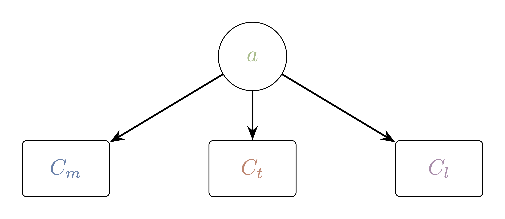{#fig-dag-with-input-abundance width="75%"}

The second latent process is matrix background, [$b$]{style="color:#88c0d0"}, which represents non-target-specific retention or amplification. It affects both [$C_m$]{style="color:#5e81ac"} and [$C_t$]{style="color:#d08770"} because the target condition is assumed to contain background processes also present in the matrix control. It does not affect the pre-selection library count.

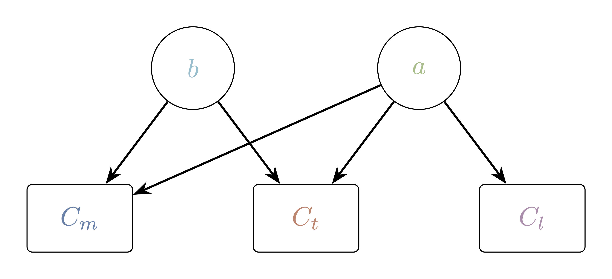{#fig-dag-with-matrix-background width="75%"}

The third latent process is target-specific enrichment, [$s$]{style="color:#bf616a"}. By definition, this signal is present only in the target condition, so it has a direct arrow to [$C_t$]{style="color:#d08770"} but not to [$C_l$]{style="color:#b48ead"} or [$C_m$]{style="color:#5e81ac"}.

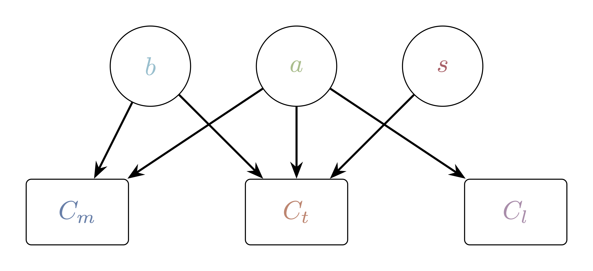{#fig-dag-with-target-specific-enrichment width="75%"}

To extend this structure to the full library, we introduce a plate indexed by compound $i$. Each compound has its own input abundance [$a_i$]{style="color:#a3be8c"}, matrix background [$b_i$]{style="color:#88c0d0"}, and target-specific enrichment [$s_i$]{style="color:#bf616a"}.

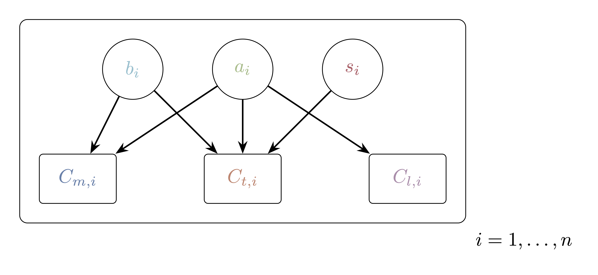{#fig-dag-with-plate width="85%"}

Matrix and target counts are also subject to replicate-level variation from sequencing depth, preparation efficiency, and batch effects. A second plate indexed by replicate $r$ introduces condition-specific effects [$\gamma_{m,r}$]{style="color:#5e81ac"} and [$\gamma_{t,r}$]{style="color:#d08770"}. Under the completed DAG, the assumed direct causes of each measurement are therefore:

- [$C_{l,i}$]{style="color:#b48ead"}: input abundance [$a_i$]{style="color:#a3be8c"};
- [$C_{m,i,r}$]{style="color:#5e81ac"}: input abundance [$a_i$]{style="color:#a3be8c"}, matrix background [$b_i$]{style="color:#88c0d0"}, and matrix-replicate variation [$\gamma_{m,r}$]{style="color:#5e81ac"};
- [$C_{t,i,r}$]{style="color:#d08770"}: input abundance [$a_i$]{style="color:#a3be8c"}, matrix background [$b_i$]{style="color:#88c0d0"}, target-specific enrichment [$s_i$]{style="color:#bf616a"}, and target-replicate variation [$\gamma_{t,r}$]{style="color:#d08770"}.

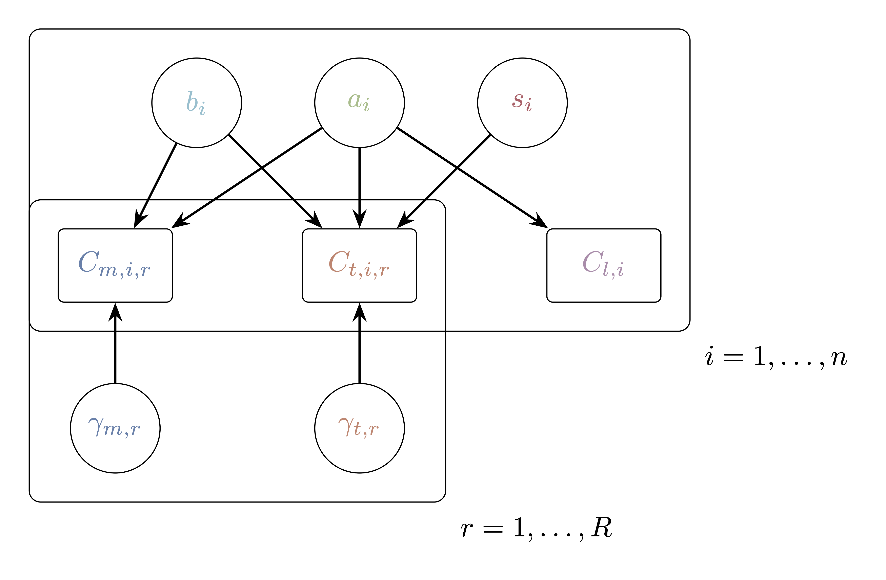{#fig-dag-with-latent-factors-and-replicates width="75%"}

The completed DAG exposes the central inferential challenge: [$C_{t,i,r}$]{style="color:#d08770"} is generated by several latent processes, but only one of them, [$s_i$]{style="color:#bf616a"}, is the estimand. Drawing the graph does not establish that these contributions can be separated from the available measurements. Before translating the DAG into a likelihood, link function, priors, and dispersion model, we therefore need to clarify what successful or valid inference about [$s_i$]{style="color:#bf616a"} requires.

::: {.callout-note icon="false" collapse="true"}
# What does valid inference mean in the context of a DAG?

For this analysis, valid inference means recovering [$s_i$]{style="color:#bf616a"} without attributing to it variation generated by [$a_i$]{style="color:#a3be8c"}, [$b_i$]{style="color:#88c0d0"}, [$\gamma_{m,r}$]{style="color:#5e81ac"}, or [$\gamma_{t,r}$]{style="color:#d08770"}. The DAG identifies these competing causes, but it does not prove that the data contain enough information to separate them.

Identification must come from the measurement structure. For example, the library count informing [$a_i$]{style="color:#a3be8c"}, the matrix replicates informing [$b_i$]{style="color:#88c0d0"}, and repeated observations informing the replicate effects, together with appropriate likelihood and prior assumptions.

[A coherent DAG is necessary but not sufficient. Valid inference also requires an identifiable parameterisation, a suitable count likelihood, defensible priors, reliable computation, and adequate prior and posterior predictive behaviour.]{.highlight-key-point}
:::

#### Which variables should and should not be conditioned on?

Our goal is to infer the target-binding propensity [$s$]{style="color:#bf616a"}. To do this, we need to understand how information about [$s$]{style="color:#bf616a"} flows through the DAG. This is where the concepts of **path**, **open and closed paths**, **four elemental confounds** (as described by McElreath - second edition of statistical rethinking, Figure 6.6) come in.

##### What is a path in a DAG?

A path is a sequence of adjacent edges connecting two nodes. When identifying a path, we may follow edges in either direction; the arrow directions matter later, when we determine whether the path is open or closed. In the current DAG, target-specific enrichment [$s_i$]{style="color:#bf616a"} has a direct path to the target count:

-   [$s_i$]{style="color:#bf616a"} → [$C_{t,i,r}$]{style="color:#d08770"}

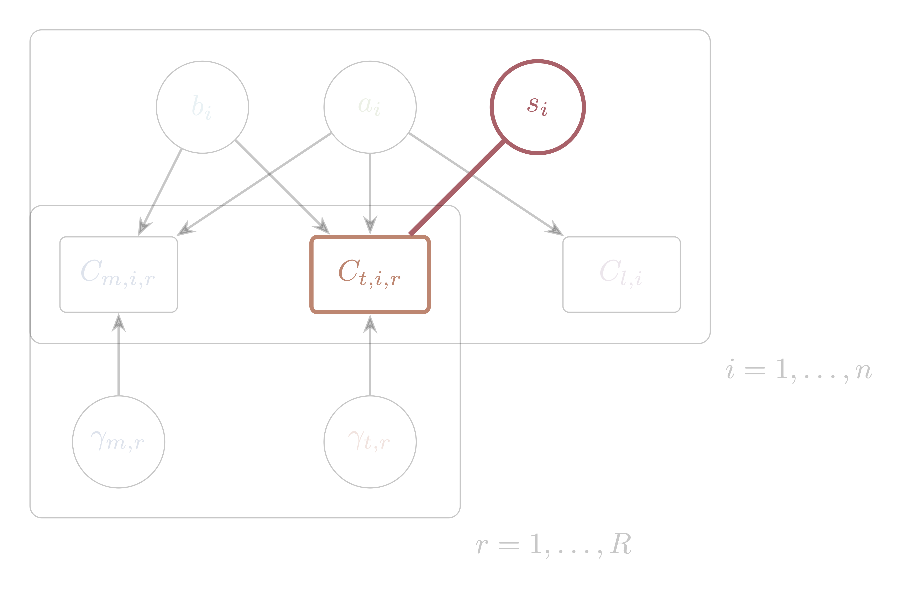{#fig-path-s_i-to-Ct_i_r width="75%"}

The graph also contains longer paths between [$s_i$]{style="color:#bf616a"} and other variables. For example, one path from [$s_i$]{style="color:#bf616a"} to the library count [$C_{l,i}$]{style="color:#b48ead"} passes through the target count and input abundance:

-   [$s_i$]{style="color:#bf616a"} → [$C_{t,i,r}$]{style="color:#d08770"} ← [$a_i$]{style="color:#a3be8c"} → [$C_{l,i}$]{style="color:#b48ead"}

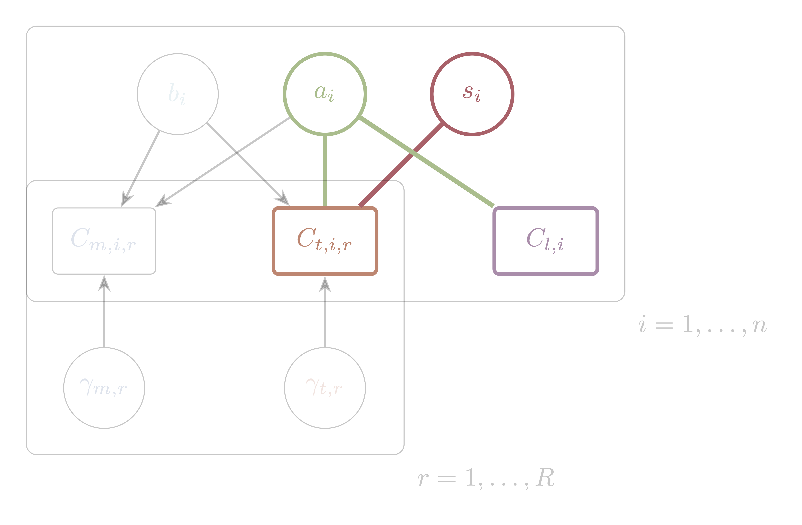{#fig-path-sto-Cl width="75%"}

##### What does open or closed path mean in a DAG?

A path is **open** when information can pass along it, meaning the two variables may become statistically associated.

A path is **closed** when something blocks that route, so the variables are independent along that path.

Whether a path is open or closed depends on two things:

1.  The arrow pattern along the path, and\
2.  Which variables we condition on.

Opening and closing paths matter because conditioning can change the associations implied by a DAG. Closing an unwanted path, such as a confounding path, can reduce bias. But conditioning can also do harm: it may block part of the causal effect we want to estimate, or open a previously closed path and create a spurious association.

McElreath shows that these changes in path status are governed by a small set of recurring path structures. In practice, DAG reasoning means identifying which structure appears along a path and then asking whether conditioning on a node blocks bias or introduces it.

[This is why simply removing correlated predictors is not a causal solution. As McElreath puts it, “Pairwise correlations are not the problem.” What matters is why variables are correlated and what conditioning on them does. A high correlation may arise because two variables share a common cause, because one mediates the effect of the other, or because both are downstream of some selection process. These situations require different modelling choices.]{.highlight-key-point}

##### What are the recurring path structures and how they can open or close a path?

Four elemental path structures determine how conditioning affects the flow of information in a DAG. As McElreath explains:

> “No matter how complicated a causal DAG appears, it is always built out of these four types of relations.”
>
> — McElreath, Richard. *Statistical Rethinking: A Bayesian Course with Examples in R and STAN* (Chapman & Hall/CRC Texts in Statistical Science), p. 185, “Function.” Kindle edition.

The first is the **fork**, or **confounding**, structure:

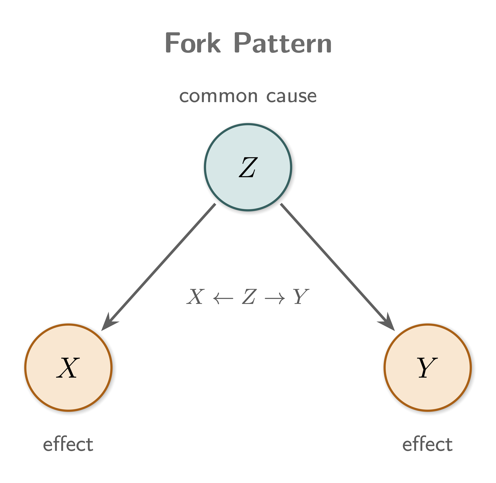{#fig-fork-structure width="50%"}

In a fork structure, the middle node is a common cause of the two endpoints:

$$X \leftarrow Z \rightarrow Y$$

Because both $X$ and $Y$ are caused by $Z$, they may be statistically associated even if there is no direct causal effect between them. Conditioning on the common cause $Z$ blocks this path and removes the association induced by $Z$. This can be written as:

$$X \perp\!\!\!\perp Y \mid Z$$

which reads as “$X$ is independent of $Y$ once we know $Z$”.

[Conditioning on $Z$ blocks the backdoor path through the confounder, $Z$, and helps recover an unbiased estimate of the causal effect.]{.highlight-key-point}

::: {.callout-note icon="false" collapse="true"}
# What is a backdoor path?

A backdoor path is a non-causal path between $X$ and $Y$ that sneaks in through a common cause and can make $X$ look associated with $Y$ even when the association is partly or entirely confounded.

A front-door causal path is: $$X \rightarrow Y$$

This is the direct causal effect we want to estimate: the effect of $X$ on $Y$.

Backdoor path start by **going backwards out of** $X$ into one of its causes (in this case, $Z$), then forward to $Y$:

$$X \leftarrow Z \rightarrow Y$$

Recall that a **path** is a sequence of edges connecting two nodes, **regardless of the direction of the arrows**. So the path from $X$ to $Y$ can go backwards from $X$ to $Z$, and then forward from $Z$ to $Y$. This is a backdoor path because it goes “backwards” out of $X$ before going forward to $Y$.

A backdoor path carries confounding. To estimate the causal effect of $X$ on $Y$, we usually want to block backdoor paths by conditioning on appropriate common causes such as $Z$.
:::

:::::::::: {.callout-tip icon="false" collapse="true"}
# Intuitive example of a fork structure and backdoor path

Suppose we want to estimate whether carrying an umbrella has an effect on being wet. However, there is a confounder: weather conditions. Rainy weather affects both whether someone carries an umbrella and whether they gets wet.

On rainy days, people are more likely to carry an umbrella and more likely to get wet. This can create a statistical association between umbrellas and getting wet, even if carrying an umbrella does not directly cause someone to get wet.

$$X = \text{Carrying an umbrella}$$

$$Y = \text{Getting wet}$$

$$Z = \text{Weather conditions (rainy or not)}$$

Weather is a common cause of both carrying an umbrella and getting wet. This creates the backdoor path:

$$X \leftarrow Z \rightarrow Y$$

or $$\text{Carrying an umbrella} \leftarrow \text{Weather conditions} \rightarrow \text{Getting wet}$$

So the association between umbrella use and getting wet is partly coming through the backdoor path via weather.

The path is called a backdoor path because instead of going forward from umbrella to getting wet: $$\text{Carrying an umbrella} \rightarrow \text{Getting wet}$$

It goes backwards from umbrella to one of its causes (weather):

$$\text{Carrying an umbrella} \leftarrow \text{Weather conditions}$$

and then forward from weather to getting wet: $$\text{Weather conditions} \rightarrow \text{Getting wet}$$

If we condition on weather, we compare people under the same weather conditions. This makes the causal question clearer. Weather creates a backdoor path because it affects both whether someone carries an umbrella and whether they get wet:

$$\text{Carrying an umbrella} \leftarrow \text{Weather} \rightarrow \text{Getting wet}$$

Conditioning on weather blocks this backdoor path. It separates the association caused by shared weather conditions from the possible direct effect of carrying an umbrella on getting wet. Once we compare people under the same weather conditions, we would expect umbrella use to be associated with a lower chance of getting wet, if umbrellas are effective.

::: {.callout-note icon="false" collapse="true"}
# Code for the fork example

Let's simulate some data to illustrate the fork example. We will create a simple dataset where weather conditions affect both umbrella use and getting wet.

{#fig-umbrella-dag width="50%"}

```{python}
import numpy as np
import pandas as pd
import matplotlib.pyplot as plt
# Set random seed for reproducibility
np.random.seed(42)
# Simulate weather conditions (0 = not rainy, 1 = rainy)
weather = np.random.binomial(1, 0.3, size=1000)
# Simulate umbrella use based on weather (more likely to carry an umbrella if it's rainy)
umbrella = np.random.binomial(1, 0.8 * weather + 0.1, size=1000)
# Simulate getting wet based on weather and umbrella use
# People are more likely to get wet if it's rainy, but carrying an umbrella reduces the chance
getting_wet = np.random.binomial(1, 0.7 * weather * (1 - umbrella) + 0.1 * weather * umbrella + 0.05 * (1 - weather), size=1000)
# Create a DataFrame
data = pd.DataFrame({
    'Weather': weather,
    'Umbrella': umbrella,
    'GettingWet': getting_wet
})
# Show the first few rows of the dataset
from IPython.display import display
display(data.head())
```

This code simulates a dataset of 1000 observations with three variables: Weather, Umbrella, and GettingWet.

##### Weather

Weather is simulated as a binary variable where 1 indicates rainy weather and 0 indicates not rainy. The probability of it being rainy is set to 0.3, meaning that 30% of the time it will be rainy.

##### Umbrella

The probability of carrying an umbrella is influenced by the weather and is defined as: $$ 0.8 * weather + 0.1 $$

This means that:

- If it's rainy (weather = 1), the probability of carrying an umbrella is 90%: $$ 0.8 * 1 + 0.1 = 0.9 $$

- If it's not rainy (weather = 0), the probability of carrying an umbrella is 10%: $$ 0.8 * 0 + 0.1 = 0.1 $$

##### Getting Wet

The probability of getting wet is defined as: $$ 0.7 * weather * (1 - umbrella) + 0.1 * weather * umbrella + 0.05 * (1 - weather) $$

This means that:

- If it's rainy and the person is not carrying an umbrella (weather = 1, umbrella = 0), the probability of getting wet is 70%: $$ 0.7 * 1 * (1 - 0) + 0.1 * 1 * 0 + 0.05 * (1 - 1) = 0.7 $$

- If it's rainy and the person is carrying an umbrella (weather = 1, umbrella = 1), the probability of getting wet is 10%: $$ 0.7 * 1 * (1 - 1) + 0.1 * 1 * 1 + 0.05 * (1 - 1) = 0.1 $$

- If it's not rainy (weather = 0), the probability of getting wet is always low at 5%, regardless of umbrella use. $$ 0.7 * 0 * (1 - umbrella) + 0.1 * 0 * umbrella + 0.05 * (1 - 0) = 0.05 $$

##### Summary of the simulated data

Let's plot the simulated data to see the associations between the variables.

Starting with the raw association between Umbrella and GettingWet:

```{python}
import pandas as pd
from plotnine import (
    ggplot, aes, geom_tile, geom_text, facet_wrap,
    scale_fill_gradient, labs, theme_minimal, theme,
    element_text, element_blank
)

ct = pd.crosstab(
    data["Umbrella"],
    data["GettingWet"],
    normalize="all"
).reset_index().melt(
    id_vars="Umbrella",
    var_name="GettingWet",
    value_name="proportion"
)

counts = pd.crosstab(
    data["Umbrella"],
    data["GettingWet"]
).reset_index().melt(
    id_vars="Umbrella",
    var_name="GettingWet",
    value_name="count"
)

heatmap_df = ct.merge(counts, on=["Umbrella", "GettingWet"])

heatmap_df["Umbrella"] = heatmap_df["Umbrella"].map({
    0: "No umbrella",
    1: "Umbrella"
})

heatmap_df["GettingWet"] = heatmap_df["GettingWet"].map({
    0: "Not wet",
    1: "Wet"
})

heatmap_df["label"] = heatmap_df.apply(
    lambda r: f"n = {int(r['count'])}\n{100 * r['proportion']:.1f}%",
    axis=1,
)

p1 = (
    ggplot(heatmap_df, aes(x="GettingWet", y="Umbrella", fill="proportion"))
    + geom_tile(color="white", size=1.2)
    + geom_text(aes(label="label"), size=11, color="#0f172a")
    + scale_fill_gradient(low="#eff6ff", high="#2563eb")
    + labs(
        title="Observed association between umbrella use and getting wet",
        subtitle="Each tile shows the proportion of all 1000 observations.",
        x=None,
        y=None,
        fill="Proportion",
    )
    + theme_minimal(base_size=12)
    + theme(
        figure_size=(6.5, 4.0),
        panel_grid_major=element_blank(),
        panel_grid_minor=element_blank(),
        plot_title=element_text(weight="bold", size=13),
        plot_subtitle=element_text(size=10),
        axis_text=element_text(size=11),
    )
)

p1
```

And, stratified association by Weather, that show what happens after blocking the backdoor path:

```{python}
strat_counts = (
    data
    .groupby(["Weather", "Umbrella", "GettingWet"])
    .size()
    .reset_index(name="count")
)

full_grid = pd.MultiIndex.from_product(
    [[0, 1], [0, 1], [0, 1]],
    names=["Weather", "Umbrella", "GettingWet"]
).to_frame(index=False)

strat_df = full_grid.merge(
    strat_counts,
    on=["Weather", "Umbrella", "GettingWet"],
    how="left"
).fillna({"count": 0})

strat_df["within_weather_prop"] = (
    strat_df["count"] / strat_df.groupby("Weather")["count"].transform("sum")
)

strat_df["Weather"] = strat_df["Weather"].map({
    0: "Not rainy",
    1: "Rainy"
})

strat_df["Umbrella"] = strat_df["Umbrella"].map({
    0: "No umbrella",
    1: "Umbrella"
})

strat_df["GettingWet"] = strat_df["GettingWet"].map({
    0: "Not wet",
    1: "Wet"
})

strat_df["label"] = strat_df.apply(
    lambda r: f"n = {int(r['count'])}\n{100 * r['within_weather_prop']:.1f}%",
    axis=1,
)

p2 = (
    ggplot(strat_df, aes(x="GettingWet", y="Umbrella", fill="within_weather_prop"))
    + geom_tile(color="white", size=1.2)
    + geom_text(aes(label="label"), size=10, color="#0f172a")
    + facet_wrap("~Weather")
    + scale_fill_gradient(low="#eff6ff", high="#2563eb")
    + labs(
        title="Umbrella use and getting wet, stratified by weather",
        subtitle="Stratifying by weather shows the association after blocking the backdoor path.\n",
        x=None,
        y=None,
        fill="Within-weather\nproportion",
    )
    + theme_minimal(base_size=12)
    + theme(
        figure_size=(8.0, 4.0),
        panel_grid_major=element_blank(),
        panel_grid_minor=element_blank(),
        plot_title=element_text(weight="bold", size=13),
        plot_subtitle=element_text(size=10),
        axis_text=element_text(size=11),
        strip_text=element_text(weight="bold", size=11),
    )
)

p2
```

##### Analyze the data to see the associations

We are interested in the association between carrying an umbrella and getting wet, and how this association changes when we condition on weather.

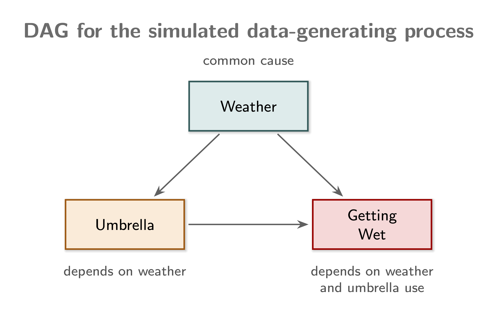{#fig-umbrella-association width="50%"}

To quantify how the umbrella–wet association changes when we account for weather, we fit two logistic regression models: one **unadjusted** (umbrella only) and one **adjusted** (umbrella and weather).

Both models treat each person's outcome as a Bernoulli draw with an individual probability $p_i$:

$$\text{GettingWet}_i \sim \text{Bernoulli}(p_i)$$

The two models differ in how $p_i$ is parameterised. The unadjusted model links $p_i$ only to umbrella use:

$$\text{logit}(p_i) = \alpha + \beta_{\text{umbrella}} \cdot \text{Umbrella}_i$$

The adjusted model additionally conditions on weather, blocking the backdoor path $\text{Umbrella} \leftarrow \text{Weather} \rightarrow \text{GettingWet}$:

$$\text{logit}(p_i) = \alpha + \beta_{\text{umbrella}} \cdot \text{Umbrella}_i + \beta_{\text{weather}} \cdot \text{Weather}_i$$

The priors are weakly informative Normal(0, 2) distributions on each coefficient, which keep the logit-scale effects within a plausible range ($\pm 4$) while placing no strong prior preference on direction:

$$ \alpha \sim \text{Normal}(0, 2), \quad \beta_{\text{umbrella}} \sim \text{Normal}(0, 2), \quad \beta_{\text{weather}} \sim \text{Normal}(0, 2) $$

Both models are fitted via NUTS (No-U-Turn Sampler) using Pyro. The key quantity of interest is $\beta_{\text{umbrella}}$: comparing its posterior between the two models shows how much of the raw umbrella–wet association disappears once weather is held fixed.

```{python}
import warnings
import torch
import pyro
import pyro.distributions as dist
from pyro.infer import MCMC, NUTS

warnings.filterwarnings("ignore", category=UserWarning)


pyro.set_rng_seed(42)


def wet_model(umbrella, wet, weather=None):
    alpha = pyro.sample('alpha', dist.Normal(0.0, 2.0))
    beta_umbrella = pyro.sample('beta_umbrella', dist.Normal(0.0, 2.0))

    logits = alpha + beta_umbrella * umbrella
    if weather is not None:
        beta_weather = pyro.sample('beta_weather', dist.Normal(0.0, 2.0))
        logits = logits + beta_weather * weather

    with pyro.plate('obs', len(umbrella)):
        pyro.sample('wet', dist.Bernoulli(logits=logits), obs=wet)


def fit_logistic_model(umbrella, wet, weather=None, num_samples=1000, warmup_steps=500):
    pyro.clear_param_store()
    umbrella = torch.as_tensor(umbrella, dtype=torch.float32)
    wet = torch.as_tensor(wet, dtype=torch.float32)
    weather = None if weather is None else torch.as_tensor(weather, dtype=torch.float32)

    nuts_kernel = NUTS(wet_model)
    mcmc = MCMC(
        nuts_kernel,
        num_samples=num_samples,
        warmup_steps=warmup_steps,
        disable_progbar=True
    )
    mcmc.run(umbrella, wet, weather)
    return mcmc.get_samples()


posterior_unadjusted = fit_logistic_model(
    umbrella=data['Umbrella'].values,
    wet=data['GettingWet'].values,
    weather=None
)

posterior_adjusted = fit_logistic_model(
    umbrella=data['Umbrella'].values,
    wet=data['GettingWet'].values,
    weather=data['Weather'].values
)

beta_unadjusted = posterior_unadjusted['beta_umbrella'].detach().numpy()
beta_adjusted = posterior_adjusted['beta_umbrella'].detach().numpy()
beta_weather = posterior_adjusted['beta_weather'].detach().numpy()

##########################################################
#        Plotting the posterior distributions
##########################################################

from plotnine import (
    ggplot, aes, geom_polygon, geom_line, geom_segment, geom_vline,
    labs, theme, element_text, element_blank, element_line,
    element_rect, scale_y_continuous, scale_x_continuous, coord_cartesian,
)
from scipy.stats import gaussian_kde

# Posterior draws from your fitted Pyro models
posterior_draws = {
    "Weather effect": beta_weather,
    "Umbrella effect\n(adjusted for weather)": beta_adjusted,
    "Umbrella effect\n(unadjusted)": beta_unadjusted,
}

# Plot order: top to bottom
plot_order = [
    "Weather effect",
    "Umbrella effect\n(adjusted for weather)",
    "Umbrella effect\n(unadjusted)",
]

all_draws = np.concatenate([np.asarray(v) for v in posterior_draws.values()])
x_min, x_max = np.quantile(all_draws, [0.005, 0.995])
x_pad = 0.20 * (x_max - x_min)
x_grid = np.linspace(x_min - x_pad, x_max + x_pad, 400)

ridge_height = 0.72
rows = []
interval_rows = []
summary_rows = []

for i, name in enumerate(plot_order):
    draws = np.asarray(posterior_draws[name])
    y_base = len(plot_order) - 1 - i

    kde = gaussian_kde(draws)
    density = kde(x_grid)
    density_scaled = density / density.max() * ridge_height

    median = np.median(draws)
    lower, upper = np.quantile(draws, [0.10, 0.90])  # 80% interval

    for x, d in zip(x_grid, density_scaled):
        rows.append({
            "parameter": name,
            "x": x,
            "y_base": y_base,
            "y": y_base + d,
        })

        if lower <= x <= upper:
            interval_rows.append({
                "parameter": name,
                "x": x,
                "y_base": y_base,
                "y": y_base + d,
            })

    summary_rows.append({
        "parameter": name,
        "median": median,
        "lower": lower,
        "upper": upper,
        "y_base": y_base,
        "y_top": y_base + np.interp(median, x_grid, density_scaled),
    })

ridge_df = pd.DataFrame(rows)
interval_df = pd.DataFrame(interval_rows)
summary_df = pd.DataFrame(summary_rows)

# Build filled polygons
polygon_rows = []
interval_polygon_rows = []

for name in plot_order:
    sub = ridge_df[ridge_df["parameter"] == name].sort_values("x")
    y_base = sub["y_base"].iloc[0]

    polygon_rows.extend(sub.to_dict("records"))
    polygon_rows.extend([
        {"parameter": name, "x": sub["x"].iloc[-1], "y_base": y_base, "y": y_base},
        {"parameter": name, "x": sub["x"].iloc[0], "y_base": y_base, "y": y_base},
    ])

    sub_int = interval_df[interval_df["parameter"] == name].sort_values("x")

    if len(sub_int) > 0:
        interval_polygon_rows.extend(sub_int.to_dict("records"))
        interval_polygon_rows.extend([
            {"parameter": name, "x": sub_int["x"].iloc[-1], "y_base": y_base, "y": y_base},
            {"parameter": name, "x": sub_int["x"].iloc[0], "y_base": y_base, "y": y_base},
        ])

polygon_df = pd.DataFrame(polygon_rows)
interval_polygon_df = pd.DataFrame(interval_polygon_rows)

p = (
    ggplot()
    + geom_vline(xintercept=0, color="#d9d9d9", size=1.2)

    # Full posterior density
    + geom_polygon(
        polygon_df,
        aes(x="x", y="y", group="parameter"),
        fill="#c8dce8",
        alpha=0.75,
        color=None,
    )

    # Central 80% interval
    + geom_polygon(
        interval_polygon_df,
        aes(x="x", y="y", group="parameter"),
        fill="#8fb7cb",
        alpha=0.70,
        color=None,
    )

    # Density outline
    + geom_line(
        ridge_df,
        aes(x="x", y="y", group="parameter"),
        color="#002b63",
        size=1.2,
    )

    # Baseline for each ridge
    + geom_segment(
        summary_df.assign(x_start=x_grid.min(), x_end=x_grid.max()),
        aes(x="x_start", xend="x_end", y="y_base", yend="y_base"),
        color="#002b63",
        size=1.0,
    )

    # Posterior median line
    + geom_segment(
        summary_df,
        aes(x="median", xend="median", y="y_base", yend="y_top"),
        color="#4b8aa6",
        size=2.3,
    )

    + scale_y_continuous(
        breaks=summary_df["y_base"].tolist(),
        labels=summary_df["parameter"].tolist(),
        expand=(0.06, 0.20),
    )
    + scale_x_continuous(expand=(0.02, 0.02))
    + coord_cartesian(ylim=(-0.55, len(plot_order) - 0.15))

    + labs(
        title="Posterior distributions",
        subtitle="with medians and 80% intervals",
        x="Posterior coefficient estimate",
        y="Coefficients",
    )

    + theme(
        figure_size=(9.5, 6.0),

        panel_background=element_rect(fill="white", color="white"),
        plot_background=element_rect(fill="white", color="white"),

        panel_grid_major=element_blank(),
        panel_grid_minor=element_blank(),

        axis_line_x=element_line(color="black", size=0.8),
        axis_line_y=element_line(color="black", size=0.8),
        axis_ticks_major=element_line(color="black", size=0.8),
        axis_ticks_minor=element_blank(),

        axis_text_x=element_text(size=12, color="#333333", family="serif"),
        axis_text_y=element_text(size=12, color="#333333", family="serif", weight="bold"),
        axis_title_x=element_text(size=12, color="#333333", family="serif", margin={"t": 10}),

        plot_title=element_text(size=24, family="serif", color="black"),
        plot_subtitle=element_text(size=17, family="serif", color="black"),
    )
)


p.save("img/fork_weather_example_posteriors.png", dpi=300)

```

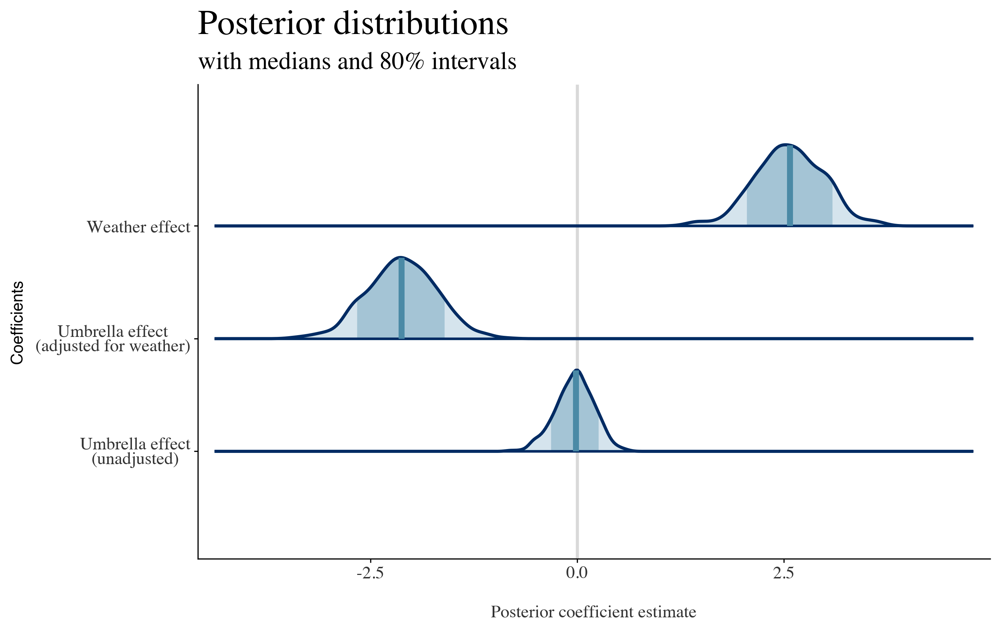{#fig-fork-weather-example-posteriors width="75%"}

The posteriors tell a clear story about confounding. In the **unadjusted model**, $\beta_{\text{umbrella}}$ is centred near zero — naively suggesting that carrying an umbrella makes no difference to getting wet. This is the confound at work: rainy weather drives both umbrella use and getting wet, so the two variables appear unrelated once that shared cause dominates the marginal association.

In the **adjusted model**, conditioning on weather blocks the backdoor path $\text{Umbrella} \leftarrow \text{Weather} \rightarrow \text{GettingWet}$, and $\beta_{\text{umbrella}}$ shifts decisively to the left. A negative logit-scale coefficient means that, among people experiencing the same weather conditions, carrying an umbrella is associated with a lower probability of getting wet, exactly what the data-generating process encoded. The **weather effect** is itself strongly positive, confirming that rainy weather is the main driver of getting wet, independent of umbrella use.

[This is the core lesson of confounding: an unadjusted association can be essentially zero even when the causal effect is real, because a common cause masks it. Conditioning on that cause separates the causal signal from the noise introduced by the shared pathway.]{.highlight-key-point}
:::

:::::::: {.callout-tip icon="false" collapse="true"}
# What if we only observe Umbrella and Getting Wet, but not Weather?

Up to this point, we assumed that **Weather**, **Umbrella**, and **Getting Wet** were all observed. In that case, the confounding structure is visible and can be blocked by conditioning on Weather:

$$\text{Umbrella} \leftarrow \text{Weather} \rightarrow \text{Getting Wet}.$$

Now suppose **Weather is unobserved**. The causal structure has not changed; the same fork still exists, but the common cause is now latent:

$$\text{Umbrella} \leftarrow \text{Weather}_{\text{latent}} \rightarrow \text{Getting Wet}.$$

[The confounder does not disappear just because we failed to measure it. It still keeps the backdoor path open.]{.highlight-key-point}

As a result, a model that regresses **Getting Wet** on **Umbrella** alone mixes two sources of association:

1.  The causal effect of carrying an umbrella, and
2.  The non-causal association induced by hidden Weather.

Because Weather is unobserved, ordinary adjustment cannot block this path directly. We therefore need another strategy. The most transparent first step is sensitivity analysis, which asks:

::: {style="text-align: center;"}
How large would unmeasured-confounding bias need to be to materially change the conclusion?
:::

Other strategies are possible, but they require more data or more assumptions. We could measure Weather directly, use proxy variables such as rainfall or season, randomise umbrella use, or build a latent variable model that represents Weather explicitly. Each option addresses the same problem: the open backdoor path created by an unobserved common cause.

The code below starts with a simple sensitivity analysis, then fits a latent variable model in which Weather is unobserved but still included in the generative structure.

[Latent confounders are dangerous because they keep backdoor paths open. If the common cause is unmeasured, the model can attribute part of a spurious association to the causal effect we want to estimate.]{.highlight-key-point}

:::::: {.callout-note icon="false" collapse="true"}
# Sensitivity analysis and latent variable model

##### Sensitivity analysis for hidden confounding

We start with a simple sensitivity analysis. @fig-sensitivity-analysis-DAG makes the causal problem explicit: hidden Weather is a common cause of both Umbrella and Getting Wet, so even if we observe those two variables perfectly, the umbrella coefficient from a model that omits Weather can mix together a causal effect and confounding bias.

To formalise this, we write the naive umbrella association as the sum of a causal component and an omitted-confounding term:

$$\beta_{\text{naive}} = \beta_{\text{causal}} + \delta,$$

where:

- $\beta_{\text{naive}}$ is the umbrella coefficient from the unadjusted model,
- $\beta_{\text{causal}}$ is the (unknown) causal umbrella effect we care about,
- $\delta \ge 0$ is an assumed positive bias induced by hidden Weather.

::: {.callout-tip icon="false" collapse="true"}
## Why a positive bias?

Hidden Weather is a common cause of both Umbrella and Getting Wet as @fig-sensitivity-analysis-DAG shows. This means that:

- When Weather = 1, umbrella use becomes more likely, and
- When Weather = 1, getting wet also becomes more likely.

This shared cause induces an **extra positive association** between umbrella use and getting wet in the **unadjusted model**. In this sensitivity analysis, we represent that upward bias with $\delta$, so we assume $\delta \ge 0$.

[The point is not that umbrellas truly increase wetness. The point is that hidden Weather can pull the naive umbrella coefficient upward, making the effect look less negative, closer to zero, or even positive.]{.highlight-key-point}

That is why we write:

$$\beta_{\text{naive}} = \beta_{\text{causal}} + \delta$$

and therefore:

$$\beta_{\text{causal}}(\delta) = \beta_{\text{naive}} - \delta.$$
:::

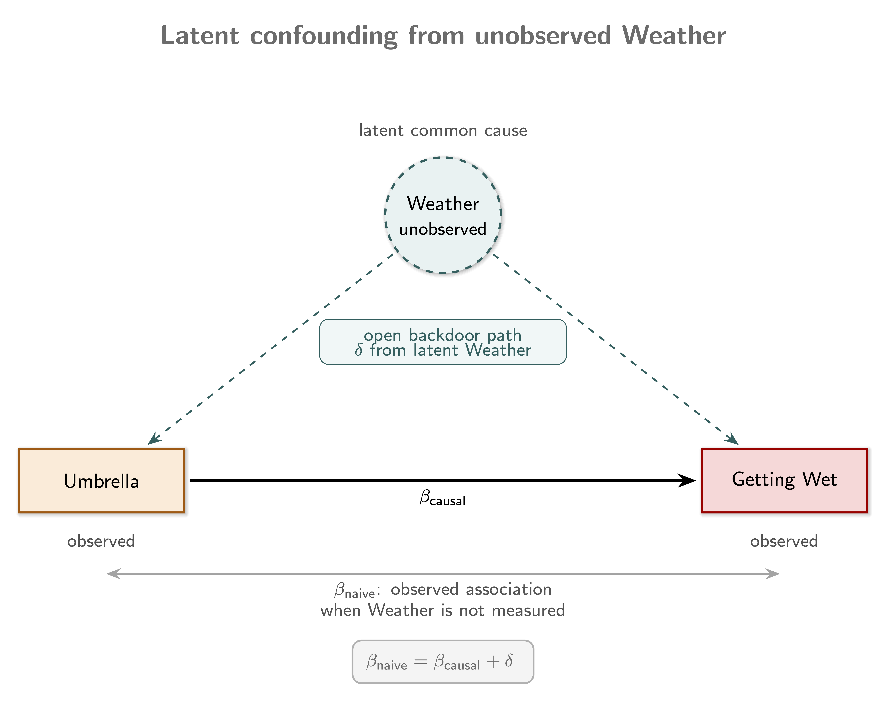{#fig-sensitivity-analysis-DAG width="75%"}

Rearranging gives the bias-corrected umbrella effect under an assumed bias level $\delta$:

$$\beta_{\text{causal}}(\delta) = \beta_{\text{naive}} - \delta.$$

In Bayesian form, we apply this transformation to each posterior draw from the unadjusted model:

$$\beta_{\text{causal}}(\delta_i) = \beta_{\text{naive}} - \delta_i, \quad i=1,\dots,N.$$

For each value of $\delta$ on a grid, we compute summary statistics of the adjusted posterior draws $\{\beta_{\text{causal}}(\delta)_i\}_{i=1}^N$ and plot the median together with an 80% interval. @fig-sensitivity-analysis-explainer shows the logic of this one-sided setup: as the assumed hidden-weather bias increases, the corrected umbrella effect is shifted downward by exactly that amount.

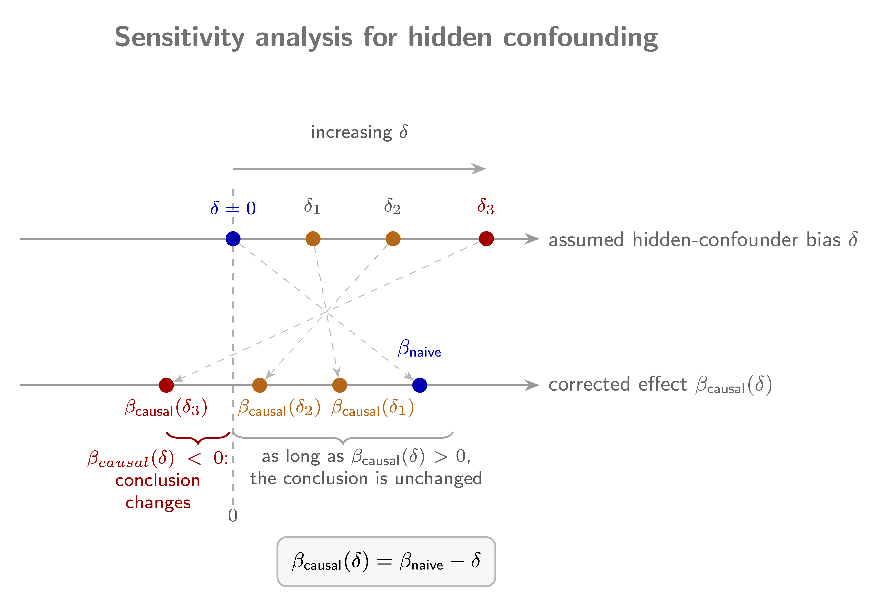{#fig-sensitivity-analysis-explainer width="75%"}

```{python}
import numpy as np
import pandas as pd
import torch
import pyro
import pyro.distributions as dist
from pyro.infer import MCMC, NUTS
from plotnine import (
    ggplot, aes, geom_line, geom_ribbon, geom_hline, geom_pointrange, geom_vline,
    labs, theme_minimal, theme, element_blank, element_text, element_line,
    element_rect, coord_flip,
)

pyro.set_rng_seed(42)


beta_unadjusted_draws = posterior_unadjusted["beta_umbrella"].detach().numpy()

# Assume hidden weather creates a positive bias in the naive umbrella effect.
# For each assumed bias size, subtract it from the unadjusted posterior draws.
bias_grid = np.linspace(0.0, 2.5, 101)
sensitivity_rows = []

for assumed_bias in bias_grid:
    corrected_draws = beta_unadjusted_draws - assumed_bias
    sensitivity_rows.append({
        "assumed_bias": assumed_bias,
        "mean": np.mean(corrected_draws),
        "median": np.median(corrected_draws),
        "lower": np.quantile(corrected_draws, 0.10),
        "upper": np.quantile(corrected_draws, 0.90),
    })

sensitivity_df = pd.DataFrame(sensitivity_rows)

crossing_df = sensitivity_df[
    (sensitivity_df["mean"] < 0) & (sensitivity_df["upper"] < 0)
]
threshold_bias = None if crossing_df.empty else crossing_df["assumed_bias"].iloc[0]

p_sensitivity = (
    ggplot(sensitivity_df, aes(x="assumed_bias", y="median"))
    + geom_ribbon(aes(ymin="lower", ymax="upper"), fill="#c8dce8", alpha=0.55)
    + geom_line(color="#002b63", size=1.3)
    + geom_hline(yintercept=0, color="#9ca3af", linetype="dashed", size=0.9)
    + (
        geom_vline(xintercept=threshold_bias, color="#c1121f", linetype="dashed", size=1.0)
        if threshold_bias is not None
        else None
    )
    + labs(
        title="Sensitivity to hidden weather confounding",
        subtitle=(
            "Applies \u03b2_causal(\u03b4) = \u03b2_naive \u2212 \u03b4 to the unadjusted posterior"
            " (hidden-weather causal structure shown in Figure 14).\n"
            "Line: posterior median. Ribbon: central 80% interval. Red line: first \u03b4 where the posterior mean and 80% interval are below zero."
        ),
        x="Assumed omitted-confounder bias (\u03b4) on the umbrella log-odds",
        y="Bias-corrected umbrella effect  [\u03b2_naive \u2212 \u03b4]",
    )
    + theme_minimal(base_size=12)
    + theme(
        figure_size=(8.5, 5.0),
        panel_background=element_rect(fill="white", color="white"),
        plot_background=element_rect(fill="white", color="white"),
        panel_grid_major=element_line(color="#ebebeb", size=0.6),
        panel_grid_minor=element_blank(),
        axis_line_x=element_line(color="#333333", size=0.7),
        axis_line_y=element_line(color="#333333", size=0.7),
        plot_title=element_text(weight="bold", size=14),
        plot_subtitle=element_text(size=9.5),
        axis_text=element_text(size=11),
        axis_title_x=element_text(size=11, margin={"t": 8}),
        axis_title_y=element_text(size=11, margin={"r": 8}),
    )
)

p_sensitivity
```

In this one-sided additive setup,

$$\beta_{\text{causal}}(\delta) = \beta_{\text{naive}} - \delta, \quad \delta \ge 0,$$

the line is linear by construction and moves downward as $\delta$ increases. The sensitivity plot above shows that at $\delta = 0$ the uncorrected effect, $\beta_{\text{naive}}$, is already close to zero and the 80% interval still overlaps zero. As larger positive bias is assumed, both the median and the full 80% interval move further below zero.

The red vertical line marks the first assumed bias level at which the posterior mean is below zero and the entire central 80% interval is also below zero.

In the fitted plot here, the threshold occurs at $\delta = 0.275$. The corresponding odds multiplier is $e^{0.275} \approx 1.32$, so hidden Weather would need to increase the relevant odds by about 32% along the omitted-confounding pathway before the posterior mean and the full central 80% interval both fall below zero.

Because $\beta_{\text{naive}}$ is already close to zero, this sensitivity analysis shows that the unadjusted association, in @fig-fork-weather-example-posteriors, is fragile. Any positive hidden-weather bias pushes the corrected effect, $\beta_{\text{causal}}(\delta)$, below zero, supporting the interpretation that umbrella use is protective (negative or protective umbrella effect means umbrella use is associated with less getting wet), once the open backdoor path through Weather is accounted for.

::: {.callout-note icon="false" collapse="true"}
## Why sensitivity analysis still matters when the unadjusted effect is zero?

Even if the unadjusted umbrella effect were exactly zero, we should not automatically ignore sensitivity analysis.

In this example, $\beta_{\text{naive}}$ is already close to zero. Under the one-sided assumption that hidden Weather biases the umbrella coefficient upward, any positive value of $\delta$ moves the corrected effect below zero:

$$\beta_{\text{causal}}(\delta)=\beta_{\text{naive}}-\delta.$$

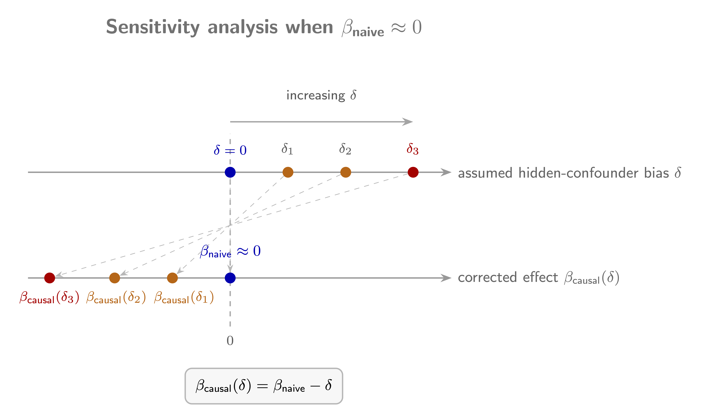{#fig-sensitivity-analysis-for-umbrella-example width="75%"}

So the sensitivity analysis is not testing whether a strong positive umbrella effect survives adjustment. It is showing that the unadjusted association is fragile around zero: even modest hidden-weather bias would make the corrected effect negative, consistent with umbrellas reducing the chance of getting wet.

[However, this does not mean that sensitivity analysis is unnecessary whenever an observed coefficient is near zero and a common cause is plausible.]{.highlight-key-point}

The direction and size of the hidden bias may be uncertain, the posterior uncertainty may be wide, and the causal question may depend on how large the corrected effect could plausibly become. Sensitivity analysis is still useful because it makes those assumptions explicit.
:::

##### Latent variable model for hidden confounding

The sensitivity analysis treated hidden Weather as an unknown source of bias. That is useful because it asks: how much hidden confounding would be needed to change our conclusion? But it does not try to model Weather directly.

A stronger alternative is to write down a latent variable model. In this model, Weather is not just an abstract bias term. It is an explicit but unobserved variable that can affect both whether someone carries an umbrella and whether they get wet.

The assumed causal structure is as shown in @fig-umbrella-association: Weather is a common cause of both Umbrella and Getting Wet, and there is also a direct effect of Umbrella on Getting Wet. However, only Umbrella and GettingWet are observed. Weather is hidden. This is similar to the DAG in @fig-sensitivity-analysis-DAG.

Let, $$W_i \in \{0, 1\}$$

denote the latent weather state for observation $i$, where $W_i = 0$ might mean dry weather and $W_i = 1$ might mean rainy weather. We observe:

$$ U_i = Umbrella_i $$ $$ G_i = GettingWet_i $$

The model first assumes that each observation has some probability of being in rainy weather: $$W_i \sim \text{Bernoulli}(p_{\text{weather}}),$$ Then, umbrella use depends on the hidden weather state: $$U_i|W_i \sim \text{Bernoulli}(\text{logit}^{-1  }(\alpha_u + \beta_{\text{weather} \to \text{umbrella}} \cdot W_i)),$$ where, $\alpha_u$ is the baseline log-odds of carrying an umbrella when $W_i=0$, and $\beta_{\text{weather} \to \text{umbrella}}$ captures how much the log-odds of carrying an umbrella increase when $W_i=1$.

Getting wet then depends on both umbrella use and the hidden weather state: $$G_i|U_i, W_i \sim \text{Bernoulli}(\text{logit}^{-1  }(\alpha_g + \beta_{\text{umbrella} \to \text{wet}} \cdot U_i + \beta_{\text{weather} \to \text{wet}} \cdot W_i)),$$ where $\alpha_g$ is the baseline log-odds of getting wet when $U_i=0$ and $W_i=0$, $\beta_{\text{umbrella} \to \text{wet}}$ captures the direct umbrella effect, after accounting for latent Weather, and $\beta_{\text{weather} \to \text{wet}}$ captures the direct effect of Weather on getting wet, i.e., how much the log-odds of getting wet increase when $W_i=1$.

The important computational detail is that we do not sample $W_i$ directly. Weather is discrete, and NUTS works best with continuous parameters. So instead we marginalise over the two possible weather states. ​ For each observation, the likelihood is: $$P(U_i, G_i) = \Sigma_{w_i \in \{0, 1\}} P(W_i=w) P(U_i | W_i=w) P(G_i | U_i, W_i=w) = P(W_i=0) P(U_i | W_i=0) P(G_i | U_i, W_i=0) + P(W_i=1) P(U_i | W_i=1) P(G_i | U_i, W_i=1)$$

So the model asks:

For each observed pair $(U_i, G_i)$, how likely is this observation if the hidden weather state was dry, and how likely is it if the hidden weather state was rainy? It then averages those two possibilities according to the estimated probability of each weather state.

Because Weather is never observed, the model must infer it entirely from the joint pattern of Umbrella and GettingWet. That means the **result depends strongly on the assumed model form, the priors, and the assumption that a binary latent Weather variable is a reasonable representation of the hidden common cause**.

[So the latent variable model gives us a more mechanistic version of the hidden-confounding story, but it is not assumption-free. The sensitivity analysis is weaker but more transparent; the latent variable model is more structural but more model-dependent.]{.highlight-key-point}

```{python}
def latent_weather_model(umbrella, wet):
    """
    Marginalized latent common-cause model:

        Weather -> Umbrella
        Weather -> GettingWet
        Umbrella -> GettingWet

    Only Umbrella and GettingWet are observed.
    Weather is binary and latent, so we integrate it out of the likelihood.
    """
    logit_p_weather = pyro.sample("logit_p_weather", dist.Normal(0.0, 1.5))
    p_weather = torch.sigmoid(logit_p_weather)

    alpha_u = pyro.sample("alpha_u", dist.Normal(0.0, 2.0))
    beta_weather_to_umbrella = pyro.sample("beta_weather_to_umbrella", dist.Normal(0.0, 2.0))

    alpha_wet = pyro.sample("alpha_wet", dist.Normal(0.0, 2.0))
    beta_umbrella_to_wet = pyro.sample("beta_umbrella_to_wet", dist.Normal(0.0, 2.0))
    beta_weather_to_wet = pyro.sample("beta_weather_to_wet", dist.Normal(0.0, 2.0))

    umbrella_log_prob_w0 = dist.Bernoulli(logits=alpha_u).log_prob(umbrella)
    umbrella_log_prob_w1 = dist.Bernoulli(
        logits=alpha_u + beta_weather_to_umbrella
    ).log_prob(umbrella)

    wet_log_prob_w0 = dist.Bernoulli(
        logits=alpha_wet + beta_umbrella_to_wet * umbrella
    ).log_prob(wet)
    wet_log_prob_w1 = dist.Bernoulli(
        logits=alpha_wet + beta_umbrella_to_wet * umbrella + beta_weather_to_wet
    ).log_prob(wet)

    # The two terms log_prob_w0 and log_prob_w1 are the log-probabilities of the observed data under the two possible hidden Weather states.
    log_prob_w0 = torch.log1p(-p_weather) + umbrella_log_prob_w0 + wet_log_prob_w0
    log_prob_w1 = torch.log(p_weather) + umbrella_log_prob_w1 + wet_log_prob_w1
    
    # The logsumexp operation adds these two possibilities together on the probability scale while keeping the computation numerically stable.
    pyro.factor(
        "marginalized_obs_log_prob",
        torch.logsumexp(torch.stack([log_prob_w0, log_prob_w1]), dim=0).sum(),
    )


def fit_latent_weather_model(data, num_samples=1000, warmup_steps=500):
    pyro.clear_param_store()

    umbrella = torch.as_tensor(data["Umbrella"].values, dtype=torch.float32)
    wet = torch.as_tensor(data["GettingWet"].values, dtype=torch.float32)

    nuts_kernel = NUTS(latent_weather_model)
    mcmc = MCMC(
        nuts_kernel,
        num_samples=num_samples,
        warmup_steps=warmup_steps,
        disable_progbar=True,
    )
    mcmc.run(umbrella, wet)
    return mcmc.get_samples()


posterior_latent = fit_latent_weather_model(data)

from plotnine import (
    ggplot, aes, geom_polygon, geom_line, geom_segment, geom_vline,
    labs, theme, element_text, element_blank, element_line,
    element_rect, scale_y_continuous, scale_x_continuous, coord_cartesian,
)
from scipy.stats import gaussian_kde

summary_spec = [
    ("beta_weather_to_umbrella", "Weather -> Umbrella"),
    ("beta_umbrella_to_wet", "Umbrella -> Getting wet"),
    ("beta_weather_to_wet", "Weather -> Getting wet"),
]

posterior_draws_latent = {
    label: posterior_latent[param_name].detach().numpy()
    for param_name, label in summary_spec
}

plot_order_latent = [label for _, label in summary_spec]
all_draws_latent = np.concatenate([np.asarray(v) for v in posterior_draws_latent.values()])
x_min_latent, x_max_latent = np.quantile(all_draws_latent, [0.005, 0.995])
x_pad_latent = 0.20 * (x_max_latent - x_min_latent)
x_grid_latent = np.linspace(x_min_latent - x_pad_latent, x_max_latent + x_pad_latent, 400)

ridge_height_latent = 0.72
rows_latent = []
interval_rows_latent = []
summary_rows_latent = []

for i, name in enumerate(plot_order_latent):
    draws = np.asarray(posterior_draws_latent[name])
    y_base = len(plot_order_latent) - 1 - i

    kde = gaussian_kde(draws)
    density = kde(x_grid_latent)
    density_scaled = density / density.max() * ridge_height_latent

    median = np.median(draws)
    lower, upper = np.quantile(draws, [0.025, 0.975])

    for x, d in zip(x_grid_latent, density_scaled):
        rows_latent.append({
            "parameter": name,
            "x": x,
            "y_base": y_base,
            "y": y_base + d,
        })

        if lower <= x <= upper:
            interval_rows_latent.append({
                "parameter": name,
                "x": x,
                "y_base": y_base,
                "y": y_base + d,
            })

    summary_rows_latent.append({
        "parameter": name,
        "median": median,
        "lower": lower,
        "upper": upper,
        "y_base": y_base,
        "y_top": y_base + np.interp(median, x_grid_latent, density_scaled),
    })

ridge_df_latent = pd.DataFrame(rows_latent)
interval_df_latent = pd.DataFrame(interval_rows_latent)
summary_df_latent = pd.DataFrame(summary_rows_latent)

polygon_rows_latent = []
interval_polygon_rows_latent = []

for name in plot_order_latent:
    sub = ridge_df_latent[ridge_df_latent["parameter"] == name].sort_values("x")
    y_base = sub["y_base"].iloc[0]

    polygon_rows_latent.extend(sub.to_dict("records"))
    polygon_rows_latent.extend([
        {"parameter": name, "x": sub["x"].iloc[-1], "y_base": y_base, "y": y_base},
        {"parameter": name, "x": sub["x"].iloc[0], "y_base": y_base, "y": y_base},
    ])

    sub_int = interval_df_latent[interval_df_latent["parameter"] == name].sort_values("x")
    if len(sub_int) > 0:
        interval_polygon_rows_latent.extend(sub_int.to_dict("records"))
        interval_polygon_rows_latent.extend([
            {"parameter": name, "x": sub_int["x"].iloc[-1], "y_base": y_base, "y": y_base},
            {"parameter": name, "x": sub_int["x"].iloc[0], "y_base": y_base, "y": y_base},
        ])

polygon_df_latent = pd.DataFrame(polygon_rows_latent)
interval_polygon_df_latent = pd.DataFrame(interval_polygon_rows_latent)

p_latent = (
    ggplot()
    + geom_vline(xintercept=0, color="#d9d9d9", size=1.2)
    + geom_polygon(
        polygon_df_latent,
        aes(x="x", y="y", group="parameter"),
        fill="#c8dce8",
        alpha=0.75,
        color=None,
    )
    + geom_polygon(
        interval_polygon_df_latent,
        aes(x="x", y="y", group="parameter"),
        fill="#8fb7cb",
        alpha=0.70,
        color=None,
    )
    + geom_line(
        ridge_df_latent,
        aes(x="x", y="y", group="parameter"),
        color="#002b63",
        size=1.2,
    )
    + geom_segment(
        summary_df_latent.assign(x_start=x_grid_latent.min(), x_end=x_grid_latent.max()),
        aes(x="x_start", xend="x_end", y="y_base", yend="y_base"),
        color="#002b63",
        size=1.0,
    )
    + geom_segment(
        summary_df_latent,
        aes(x="median", xend="median", y="y_base", yend="y_top"),
        color="#4b8aa6",
        size=2.3,
    )
    + scale_y_continuous(
        breaks=summary_df_latent["y_base"].tolist(),
        labels=summary_df_latent["parameter"].tolist(),
        expand=(0.06, 0.20),
    )
    + scale_x_continuous(expand=(0.02, 0.02))
    + coord_cartesian(ylim=(-0.55, len(plot_order_latent) - 0.15))
    + labs(
        title="Latent variable model estimates",
        subtitle="with medians and 95% intervals after marginalizing over hidden weather",
        x="Posterior coefficient estimate",
        y="Coefficients",
    )
    + theme(
        figure_size=(9.5, 6.0),
        panel_background=element_rect(fill="white", color="white"),
        plot_background=element_rect(fill="white", color="white"),

        panel_grid_major=element_blank(),
        panel_grid_minor=element_blank(),

        axis_line_x=element_line(color="black", size=0.8),
        axis_line_y=element_line(color="black", size=0.8),
        axis_ticks_major=element_line(color="black", size=0.8),
        axis_ticks_minor=element_blank(),

        axis_text_x=element_text(size=12, family="serif", color="#333333"),
        axis_text_y=element_text(size=12, family="serif", color="#333333", weight="bold"),
        axis_title_x=element_text(size=12, family="serif", color="#333333", margin={"t": 10}),

        plot_title=element_text(size=24, family="serif", color="black"),
        plot_subtitle=element_text(size=17, family="serif", color="black"),
    )
)

p_latent
```

The latent-variable model gives a more structural representation of the hidden-confounding story: Weather is treated as an explicit but unobserved common cause of both Umbrella and GettingWet. However, the posterior estimates show wide uncertainty intervals for all three paths, and each interval overlaps zero. This means the model does not clearly identify the hidden Weather mechanism or the direct effect of Umbrella on GettingWet from the observed data alone.

In particular, the Umbrella → GettingWet coefficient is centred close to zero, suggesting little evidence for a strong direct umbrella effect after accounting for latent Weather. But this should not be interpreted as proof of no causal effect. Rather, it shows that once we allow for an unobserved common cause, the available data are compatible with a range of explanations.

Latent-variable models can make hidden confounding explicit, but they require stronger assumptions. If the hidden variable is not observed, **the parameters may be weakly identified**, and the posterior can remain highly uncertain. In this example, the latent Weather model is more faithful to the causal DAG, but **less transparent and more assumption-dependent than the sensitivity analysis**.

::: {.callout-note icon="false" collapse="true"}
## A Note on Parameter Identifiability

The weak identification we saw above is not unique to latent-variable models. It belongs to a broader class of difficulties that arise whenever the data and model structure are not informative enough to pin down a parameter’s value. This can happen because of a modelling mistake, but it also occurs in perfectly correct models.

A practical signal of weak identification is that the posterior looks a lot like the prior. If the data carry little information about a parameter, Bayesian updating has little to update, and the posterior will closely track whatever prior we started with. Comparing the two is therefore a useful diagnostic: a posterior that remains wide and prior-shaped is not a sign that something went wrong, it is the correct answer to the question we asked. But it is also an invitation to ask a sharper question, **collect more data**, or reconsider whether the parameter is estimable at all given the available evidence.

```{python}
rng_ident = np.random.default_rng(42)
n_prior_ident = 5_000
prior_sd_ident = 2.0

param_spec_ident = [
    ("beta_weather_to_umbrella", "Weather → Umbrella"),
    ("beta_umbrella_to_wet",     "Umbrella → Getting wet"),
    ("beta_weather_to_wet",      "Weather → Getting wet"),
]

prior_draws_ident = {
    label: rng_ident.normal(0.0, prior_sd_ident, n_prior_ident)
    for _, label in param_spec_ident
}
post_draws_ident = {
    label: posterior_latent[pname].detach().numpy()
    for pname, label in param_spec_ident
}

all_vals_ident = np.concatenate([
    np.concatenate([prior_draws_ident[l], post_draws_ident[l]])
    for _, l in param_spec_ident
])
x_lo_i, x_hi_i = np.quantile(all_vals_ident, [0.005, 0.995])
x_pad_i = 0.15 * (x_hi_i - x_lo_i)
x_grid_i = np.linspace(x_lo_i - x_pad_i, x_hi_i + x_pad_i, 400)

plot_order_i = [label for _, label in param_spec_ident]
ridge_h_i = 0.72


def build_ridge_rows_ident(draws_dict, plot_order, x_grid, ridge_h):
    rows, int_rows = [], []
    for i, name in enumerate(plot_order):
        y_base = len(plot_order) - 1 - i
        kde = gaussian_kde(draws_dict[name])
        dens = kde(x_grid)
        dens_s = dens / dens.max() * ridge_h
        lo, hi = np.quantile(draws_dict[name], [0.025, 0.975])
        for x, d in zip(x_grid, dens_s):
            rows.append({"parameter": name, "x": x, "y_base": y_base, "y": y_base + d})
            if lo <= x <= hi:
                int_rows.append({"parameter": name, "x": x, "y_base": y_base, "y": y_base + d})
    return pd.DataFrame(rows), pd.DataFrame(int_rows)


def build_polygon_ident(df, plot_order):
    rows = []
    for name in plot_order:
        sub = df[df["parameter"] == name].sort_values("x")
        if len(sub) == 0:
            continue
        y_base = sub["y_base"].iloc[0]
        rows.extend(sub.to_dict("records"))
        rows += [
            {"parameter": name, "x": sub["x"].iloc[-1], "y_base": y_base, "y": y_base},
            {"parameter": name, "x": sub["x"].iloc[0],  "y_base": y_base, "y": y_base},
        ]
    return pd.DataFrame(rows)


prior_df_i, _ = build_ridge_rows_ident(prior_draws_ident, plot_order_i, x_grid_i, ridge_h_i)
post_df_i, post_int_df_i = build_ridge_rows_ident(post_draws_ident, plot_order_i, x_grid_i, ridge_h_i)

prior_poly_i    = build_polygon_ident(prior_df_i,    plot_order_i)
post_poly_i     = build_polygon_ident(post_df_i,     plot_order_i)
post_int_poly_i = build_polygon_ident(post_int_df_i, plot_order_i)

summary_rows_i = []
for i, name in enumerate(plot_order_i):
    y_base = len(plot_order_i) - 1 - i
    draws = post_draws_ident[name]
    kde = gaussian_kde(draws)
    dens_s = kde(x_grid_i)
    dens_s = dens_s / dens_s.max() * ridge_h_i
    median = np.median(draws)
    summary_rows_i.append({
        "parameter": name,
        "y_base": y_base,
        "median": median,
        "y_top": y_base + np.interp(median, x_grid_i, dens_s),
    })
summary_df_i = pd.DataFrame(summary_rows_i)

p_ident = (
    ggplot()
    + geom_vline(xintercept=0, color="#d9d9d9", size=1.2)
    + geom_polygon(prior_poly_i, aes(x="x", y="y", group="parameter"),
                   fill="#e0e0e0", alpha=0.85, color=None)
    + geom_line(prior_df_i, aes(x="x", y="y", group="parameter"),
                color="#999999", size=0.9, linetype="dashed")
    + geom_polygon(post_poly_i, aes(x="x", y="y", group="parameter"),
                   fill="#c8dce8", alpha=0.75, color=None)
    + geom_polygon(post_int_poly_i, aes(x="x", y="y", group="parameter"),
                   fill="#8fb7cb", alpha=0.70, color=None)
    + geom_line(post_df_i, aes(x="x", y="y", group="parameter"),
                color="#002b63", size=1.2)
    + geom_segment(
        summary_df_i.assign(x_start=x_grid_i.min(), x_end=x_grid_i.max()),
        aes(x="x_start", xend="x_end", y="y_base", yend="y_base"),
        color="#002b63", size=1.0,
    )
    + geom_segment(
        summary_df_i,
        aes(x="median", xend="median", y="y_base", yend="y_top"),
        color="#4b8aa6", size=2.3,
    )
    + scale_y_continuous(
        breaks=summary_df_i["y_base"].tolist(),
        labels=summary_df_i["parameter"].tolist(),
        expand=(0.06, 0.20),
    )
    + scale_x_continuous(expand=(0.02, 0.02))
    + coord_cartesian(ylim=(-0.55, len(plot_order_i) - 0.15))
    + labs(
        title="Prior vs posterior: latent weather model",
        subtitle="grey dashed = prior  ·  blue filled = posterior (95% interval shaded)",
        x="Coefficient value",
        y="",
    )
    + theme(
        figure_size=(9.5, 6.0),
        panel_background=element_rect(fill="white", color="white"),
        plot_background=element_rect(fill="white", color="white"),
        panel_grid_major=element_blank(),
        panel_grid_minor=element_blank(),
        axis_line_x=element_line(color="black", size=0.8),
        axis_line_y=element_line(color="black", size=0.8),
        axis_ticks_major=element_line(color="black", size=0.8),
        axis_ticks_minor=element_blank(),
        axis_text_x=element_text(size=12, family="serif", color="#333333"),
        axis_text_y=element_text(size=12, family="serif", color="#333333", weight="bold"),
        axis_title_x=element_text(size=12, family="serif", color="#333333", margin={"t": 10}),
        plot_title=element_text(size=24, family="serif", color="black"),
        plot_subtitle=element_text(size=17, family="serif", color="black"),
    )
)

p_ident
```
:::
::::::
::::::::
::::::::::

The second is the **pipe** or **mediation** structure:

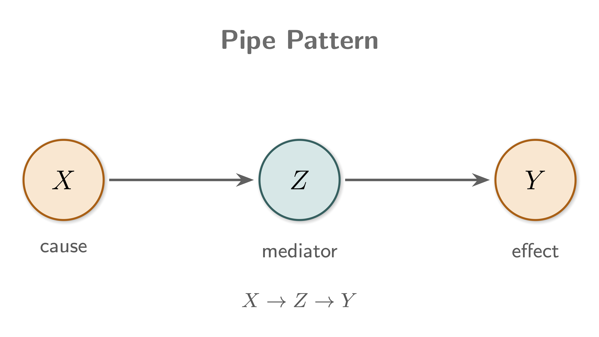{#fig-pipe-structure width="60%"}

In a pipe, $Z$ lies on the causal path from $X$ to $Y$. It is a **mediator**, not a common cause.

$$X \rightarrow Z \rightarrow Y$$

Conditioning on $Z$ blocks this mediation path ($X \perp\!\!\!\perp Y \mid Z$). That is helpful only if our goal is to estimate the **direct effect** of $X$ on $Y$ that does not run through $Z$. If we want to estimate the **total effect** of $X$ on $Y$, then conditioning on $Z$ is inappropriate because it removes part of the causal effect we are trying to measure.

[To estimate the total effect of $X$ on $Y$, we do not condition on $Z$, because the mediator carries part of the causal signal.]{.highlight-key-point}

[To estimate the direct effect of $X$ on $Y$ that bypasses $Z$, we do condition on $Z$. This is a different estimand and answers a different causal question.]{.highlight-key-point}

:::::: {.callout-tip icon="false" collapse="true"}
# Intuitive example of a pipe structure

Suppose we want to understand whether exercise affects blood pressure, and part of that effect works through weight loss:

$$X = \text{Exercise}$$

$$Z = \text{Weight loss}$$

$$Y = \text{Blood pressure}$$

The assumed causal path is:

$$\text{Exercise} \rightarrow \text{Weight loss} \rightarrow \text{Blood pressure}$$

Here, weight loss mediates part of the effect of exercise on blood pressure. Exercise changes body weight, and that weight change in turn affects blood pressure.

If we condition on weight loss, we block that mediated path. The model then asks a narrower question: does exercise affect blood pressure *other than through weight loss*? That is the **direct effect** of exercise that bypasses the mediator.

If instead we want the **total effect** of exercise on blood pressure, we should *not* condition on weight loss, because weight loss is one of the mechanisms through which exercise works. Conditioning on the mediator would remove that part of the causal signal and change the estimand.

::: {.callout-note icon="false" collapse="true"}
## Total effect vs direct effect vs mediated effect in the pipe structure

#### Total effect

The **total effect** is the overall effect of Exercise on Blood pressure, allowing the effect to travel through **all available causal routes**. In this pipe example, there is only one route:

$$\text{Exercise} \rightarrow \text{Weight loss} \rightarrow \text{Blood pressure}$$

So the total effect includes the full contribution of Weight loss as a mediator.

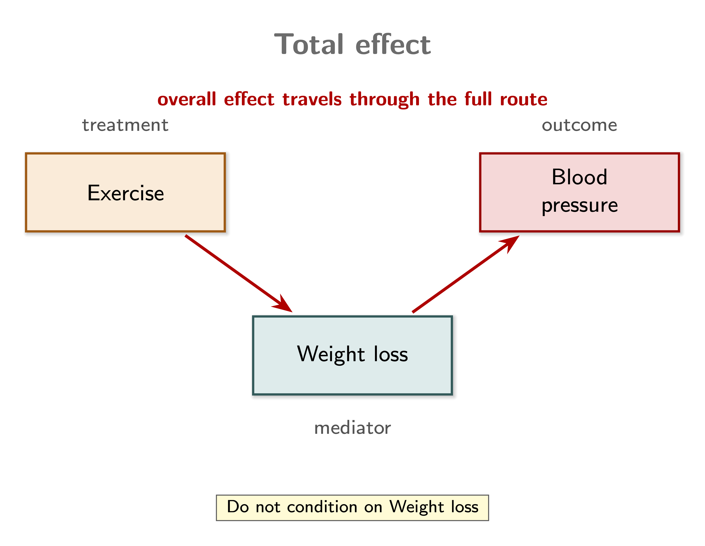{#fig-pipe-total-effect width="60%"}

Interpretation: this asks, "if a person exercises rather than not exercising, how much does their blood pressure change overall?" To answer that question, we **do not** condition on Weight loss, because Weight loss is part of how Exercise works.

#### Direct effect

The **direct effect** is the effect of Exercise on Blood pressure **after blocking the route through Weight loss**. That means we ask whether Exercise still changes Blood pressure once Weight loss is held fixed.

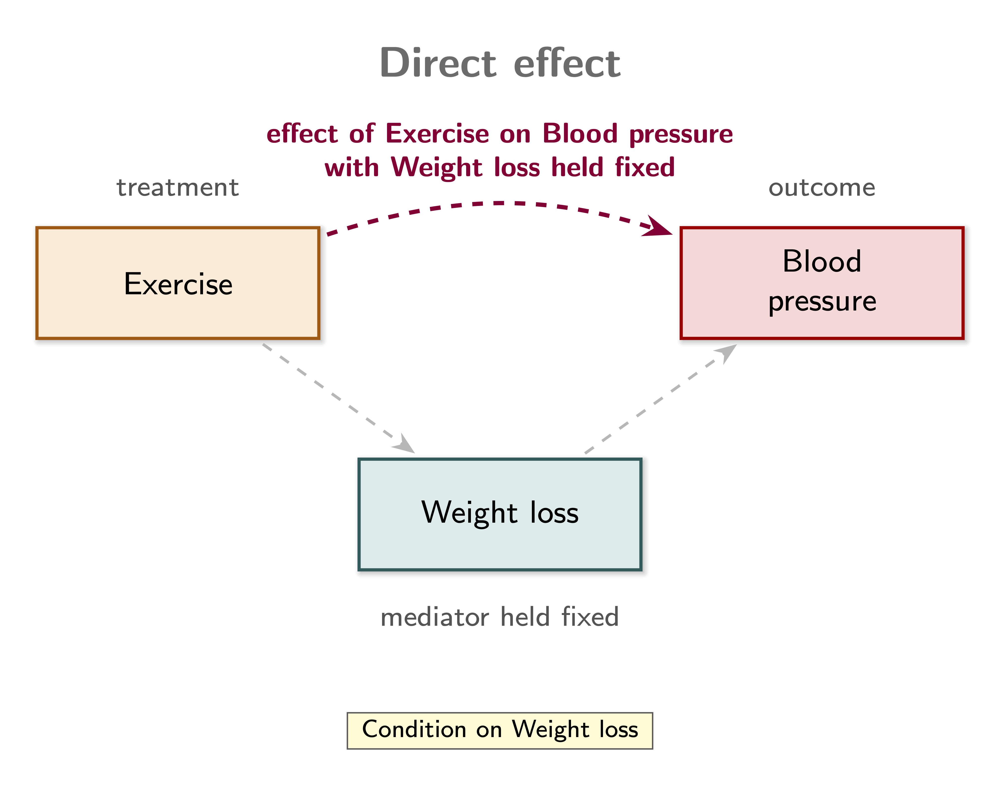{#fig-pipe-direct-effect width="60%"}

Interpretation: this asks, "if two people had the same Weight loss, but one exercised and the other did not, would their Blood pressure still differ?" In the [Code for the pipe example]{.box-ref-highlight} section, the simulated data-generating process says no. So in that example, the true direct effect is 0.

#### Mediated path

The **mediated path** is the route through Weight loss. It is the part of the story in which Exercise first changes Weight loss, and Weight loss then changes Blood pressure.

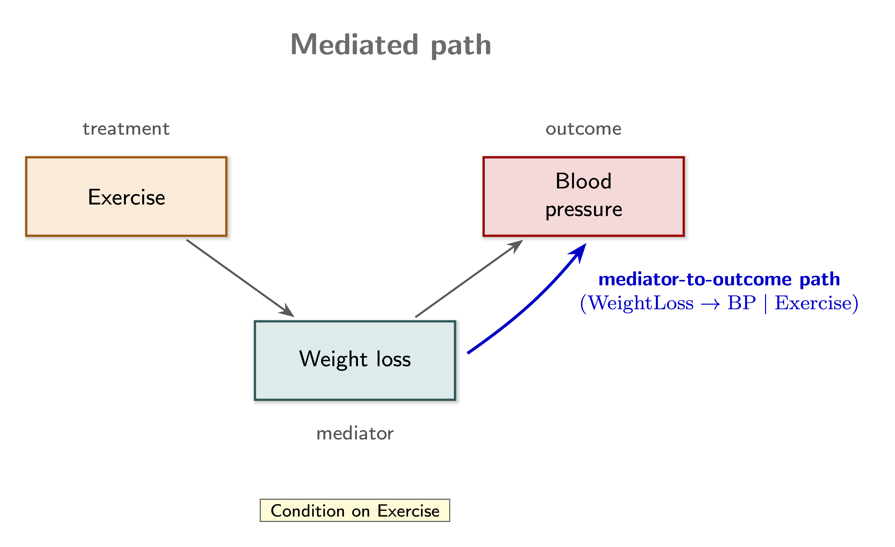{#fig-pipe-mediated-effect width="70%"}

Interpretation: this panel is not asking about the overall effect of Exercise. It is isolating the mediator-to-outcome part of the pipe, namely how Blood pressure changes as Weight loss changes. Later, when we fit the Bayesian models, this is the quantity represented by the `WeightLoss -> BP | Exercise` coefficient.

[These three pictures answer three different questions. Total effect asks for the overall effect of Exercise on Blood pressure. Direct effect asks what remains after Weight loss is held fixed. Mediated path isolates the WeightLoss -\> Blood pressure part of the mechanism.]{.highlight-key-point}
:::

:::: {.callout-note icon="false" collapse="true"}
## Code for the pipe example

Let’s simulate some data to illustrate the pipe example. We will create a simple dataset where exercise affects both weight loss and blood pressure.

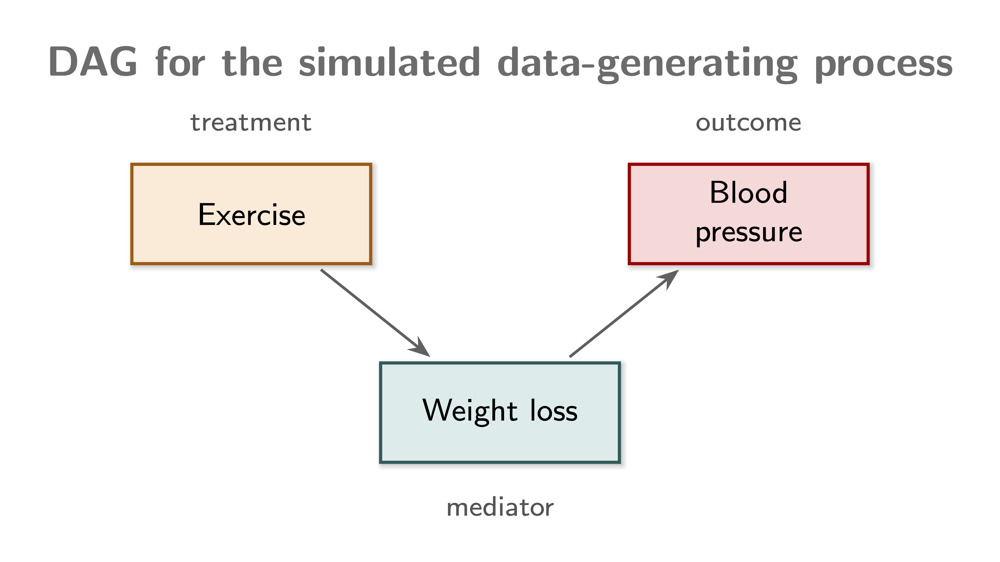{#fig-weight-loss-dag width="50%"}

Exercise raises weight loss by 0.5 units (on a standardised scale); each unit of weight loss reduces blood pressure by 2 mmHg (millimetres of mercury, the standard clinical unit for blood pressure). There is **no direct path** from Exercise to Blood pressure: the entire effect is mediated.

$$\text{True total effect of Exercise (Exercise} \rightarrow \text{Blood Pressure)} = 0.5 \times (-2) = -1 \text{ mmHg}$$

$$\text{True direct effect of Exercise (Exercise} \rightarrow \text{Blood Pressure | WeightLoss)} = 0$$

$$\text{True mediated path (WeightLoss} \rightarrow \text{Blood Pressure | Exercise)} = -2 \text{ mmHg per unit}$$

```{python}
# Data-generating process 
rng_pipe   = np.random.default_rng(42)
n_pipe     = 1000

exercise_pipe  = rng_pipe.binomial(1, 0.5, n_pipe).astype(float)
weight_loss    = 0.5 * exercise_pipe + rng_pipe.normal(0, 1.0, n_pipe)
blood_pressure = 120.0 - 2.0 * weight_loss + rng_pipe.normal(0, 5.0, n_pipe)

ex_t = torch.tensor(exercise_pipe,  dtype=torch.float32)
wl_t = torch.tensor(weight_loss,    dtype=torch.float32)
bp_t = torch.tensor(blood_pressure, dtype=torch.float32)

pd.DataFrame({
    "Exercise": exercise_pipe,
    "WeightLoss": weight_loss,
    "BloodPressure": blood_pressure,
}).head()

```

This code simulates a dataset of 1000 observations from the true pipe structure with three variables: `Exercise`, `WeightLoss`, and `BloodPressure`. Exercise is a binary variable indicating whether someone exercised (1) or not (0). Weight loss is a continuous variable that depends on exercise, with exercisers losing more weight on average. Blood pressure is a continuous variable that depends on weight loss, with higher weight loss associated with lower blood pressure. There is no direct effect of exercise on blood pressure after accounting for weight loss.

##### Summary of the simulated data

Let’s plot the simulated data to see the associations between the variables.

```{python}
from plotnine import geom_jitter, geom_boxplot, geom_smooth, scale_color_manual, scale_fill_manual, theme_minimal, geom_point

pipe_plot_df = pd.DataFrame({
    "Exercise":    exercise_pipe.astype(int).astype(str).tolist(),
    "WeightLoss":  weight_loss.tolist(),
    "BloodPressure":          blood_pressure.tolist(),
})

COLORS = {"0": "#5e81ac", "1": "#bf616a"}

# Panel 1: WeightLoss by Exercise (X → Z) 
p_xz = (
    ggplot(pipe_plot_df, aes(x="Exercise", y="WeightLoss", color="Exercise", fill="Exercise"))
    + geom_jitter(width=0.15, alpha=0.30, size=1.5)
    + geom_boxplot(width=0.35, alpha=0.55, outlier_alpha=0)
    + scale_color_manual(values=COLORS, guide=None)
    + scale_fill_manual( values=COLORS, guide=None)
    + labs(
        title="Exercise → Weight loss",
        subtitle="Exercisers (1) have higher weight loss on average",
        x="Exercise (0 = No, 1 = Yes)",
        y="Weight loss (standardised units)",
    )
    + theme(
        figure_size=(5.5, 5.0),
        panel_background=element_rect(fill="white", color="white"),
        plot_background=element_rect(fill="white", color="white"),
        panel_grid_major=element_line(color="#ebebeb", size=0.6),
        panel_grid_minor=element_blank(),
        axis_line_x=element_line(color="black", size=0.8),
        axis_line_y=element_line(color="black", size=0.8),
        axis_text=element_text(size=12, family="serif", color="#333333"),
        axis_title_x=element_text(size=12, family="serif", color="#333333", margin={"t": 10}),
        axis_title_y=element_text(size=12, family="serif", color="#333333"),
        plot_title=element_text(size=18, family="serif", color="black"),
        plot_subtitle=element_text(size=13, family="serif", color="#555555"),
        legend_position="none",
    )
)

# ── Panel 2: BloodPressure vs WeightLoss, coloured by Exercise (Z → Y) ─────────────
p_zy = (
    ggplot(pipe_plot_df, aes(x="WeightLoss", y="BloodPressure", color="Exercise"))
    + geom_point(alpha=0.35, size=1.5)
    + geom_smooth(method="lm", se=False, size=1.2)
    + scale_color_manual(
        values=COLORS,
        labels=["No exercise", "Exercise"],
        name="",
    )
    + labs(
        title="Weight loss → Blood pressure",
        subtitle="Both groups follow the same slope (−2 mmHg / unit).\nExercise shifts the WeightLoss distribution, not the slope",
        x="Weight loss (standardised units)",
        y="Blood pressure (mmHg)",
    )
    + theme(
        figure_size=(7.5, 5.0),
        panel_background=element_rect(fill="white", color="white"),
        plot_background=element_rect(fill="white", color="white"),
        panel_grid_major=element_line(color="#ebebeb", size=0.6),
        panel_grid_minor=element_blank(),
        axis_line_x=element_line(color="black", size=0.8),
        axis_line_y=element_line(color="black", size=0.8),
        axis_text=element_text(size=12, family="serif", color="#333333"),
        axis_title_x=element_text(size=12, family="serif", color="#333333", margin={"t": 10}),
        axis_title_y=element_text(size=12, family="serif", color="#333333"),
        plot_title=element_text(size=18, family="serif", color="black"),
        plot_subtitle=element_text(size=13, family="serif", color="#555555"),
        legend_position="bottom",
        legend_text=element_text(size=11, family="serif"),
    )
)

(p_xz / p_zy) + theme(figure_size=(6.0, 12.0))

```

**Top panel** ($Exercise \rightarrow WeightLoss$): exercisers tend to have higher weight loss than non-exercisers. This is the first step of the mediation: the cause (Exercise) moves the mediator (WeightLoss).

**Bottom panel** ($WeightLoss \rightarrow BloodPressure$): higher weight loss is associated with lower blood pressure, at a slope of −2 mmHg per unit. Both the blue (no exercise) and red (exercise) regression lines have the **same slope**. The only difference is that the red group sits further to the right because they lost more weight.

[Exercise does not have a special additional pull on blood pressure. It simply moves people to a higher weight-loss value, and it is the higher weight loss that then lowers their blood pressure. If we took two people with identical weight loss, one who exercised and one who did not, their blood pressures would be the same. The entire benefit of exercise on blood pressure runs through the weight loss which is a mediator.]{.highlight-key-point}

##### Analyze the data to see the associations

We fit two Bayesian models with Pyro. The only difference is whether `WeightLoss` appears as a predictor.

**Model 1 — total effect** (Exercise only):

$$\alpha \sim \mathcal{N}(120,\, 10) $$

$$\beta_{\text{ex}} \sim \mathcal{N}(0,\, 5) $$

$$\sigma \sim \text{HalfNormal}(10)$$

$$\mu_i = \alpha + \underbrace{\beta_{\text{ex}}}_{\text{total effect}} \cdot \text{Exercise}_i $$

$$\text{BP}_i \sim \mathcal{N}(\mu_i,\, \sigma)$$

**Model 2 — direct effect** (Exercise and WeightLoss):

$$\alpha \sim \mathcal{N}(120,\, 10)$$ $$ 
\beta_{\text{ex}} \sim \mathcal{N}(0,\, 5) $$

$$\beta_{\text{wl}} \sim \mathcal{N}(0,\, 5) $$

$$\sigma \sim \text{HalfNormal}(10)$$

$$\mu_i = \alpha +  \underbrace{\beta_{\text{ex}}}_{\text{direct effect}} \cdot \text{Exercise}_i + \underbrace{\beta_{\text{wl}}}_{\text{mediated effect}} \cdot \text{WeightLoss}_i $$

$$\text{BP}_i \sim \mathcal{N}(\mu_i,\, \sigma)$$

In Model 1, $\beta_{\text{ex}}$ captures the **total effect** of exercise: that is, everything that reaches blood pressure through any path, including through weight loss.

In Model 2, conditioning on `WeightLoss` blocks the mediated path, so $\beta_{\text{ex}}$ estimates only the **direct effect** that bypasses the mediator, and $\beta_{\text{wl}}$ isolates the weight-loss-to-blood-pressure relationship.

```{python}

# Model 1: total effect (no conditioning on WeightLoss) 
def total_effect_model(exercise, bp):
    alpha    = pyro.sample("alpha",   dist.Normal(120.0, 10.0))
    beta_ex  = pyro.sample("beta_ex", dist.Normal(0.0,   5.0))
    sigma    = pyro.sample("sigma",   dist.HalfNormal(10.0))
    mu = alpha + beta_ex * exercise
    with pyro.plate("obs", len(bp)):
        pyro.sample("bp", dist.Normal(mu, sigma), obs=bp)


# Model 2: direct effect (conditioning on WeightLoss) 
def direct_effect_model(exercise, weight_loss, bp):
    alpha    = pyro.sample("alpha",   dist.Normal(120.0, 10.0))
    beta_ex  = pyro.sample("beta_ex", dist.Normal(0.0,   5.0))
    beta_wl  = pyro.sample("beta_wl", dist.Normal(0.0,   5.0))
    sigma    = pyro.sample("sigma",   dist.HalfNormal(10.0))
    mu = alpha + beta_ex * exercise + beta_wl * weight_loss
    with pyro.plate("obs", len(bp)):
        pyro.sample("bp", dist.Normal(mu, sigma), obs=bp)


def run_pipe_mcmc(model, *args, num_samples=1000, warmup_steps=500):
    pyro.clear_param_store()
    mcmc = MCMC(NUTS(model), num_samples=num_samples,
                warmup_steps=warmup_steps, disable_progbar=True)
    mcmc.run(*args)
    return mcmc.get_samples()


post_total_pipe  = run_pipe_mcmc(total_effect_model,  ex_t,       bp_t)
post_direct_pipe = run_pipe_mcmc(direct_effect_model, ex_t, wl_t, bp_t)
```

```{python}
draws_pipe = {
    "Total effect\n(Exercise -> BP)":          post_total_pipe["beta_ex"].numpy(),
    "Direct effect\n(Exercise -> BP | WL)":    post_direct_pipe["beta_ex"].numpy(),
    "Mediated path\n(WeightLoss -> BP | Ex.)": post_direct_pipe["beta_wl"].numpy(),
}
true_vals_pipe = {
    "Total effect\n(Exercise -> BP)":          -1.0,
    "Direct effect\n(Exercise -> BP | WL)":     0.0,
    "Mediated path\n(WeightLoss -> BP | Ex.)": -2.0,
}

plot_order_pipe = list(draws_pipe.keys())
all_pipe_vals   = np.concatenate(list(draws_pipe.values()))
x_lo_p, x_hi_p = np.quantile(all_pipe_vals, [0.005, 0.995])
x_pad_p         = 0.15 * (x_hi_p - x_lo_p)
x_grid_p        = np.linspace(x_lo_p - x_pad_p, x_hi_p + x_pad_p, 400)
ridge_h_p       = 0.72

pipe_rows, pipe_int_rows, pipe_summary_rows = [], [], []

for i, name in enumerate(plot_order_pipe):
    y_base = len(plot_order_pipe) - 1 - i
    draws  = draws_pipe[name]
    kde    = gaussian_kde(draws)
    dens   = kde(x_grid_p)
    dens_s = dens / dens.max() * ridge_h_p
    lo, hi = np.quantile(draws, [0.025, 0.975])
    median = np.median(draws)
    tv     = true_vals_pipe[name]

    for x, d in zip(x_grid_p, dens_s):
        pipe_rows.append({"label": name, "x": x, "y_base": y_base, "y": y_base + d})
        if lo <= x <= hi:
            pipe_int_rows.append({"label": name, "x": x, "y_base": y_base, "y": y_base + d})

    pipe_summary_rows.append({
        "label":    name,
        "y_base":   y_base,
        "median":   median,
        "true_val": tv,
        "y_top":    y_base + np.interp(median, x_grid_p, dens_s),
        "y_true_top": y_base + np.interp(tv, x_grid_p, dens_s),
    })


def build_polygon_pipe(df, order, col="label"):
    rows = []
    for name in order:
        sub = df[df[col] == name].sort_values("x")
        if len(sub) == 0:
            continue
        yb = sub["y_base"].iloc[0]
        rows.extend(sub.to_dict("records"))
        rows += [
            {col: name, "x": sub["x"].iloc[-1], "y_base": yb, "y": yb},
            {col: name, "x": sub["x"].iloc[0],  "y_base": yb, "y": yb},
        ]
    return pd.DataFrame(rows)


pipe_df       = pd.DataFrame(pipe_rows)
pipe_int_df   = pd.DataFrame(pipe_int_rows)
pipe_poly     = build_polygon_pipe(pipe_df,     plot_order_pipe)
pipe_int_poly = build_polygon_pipe(pipe_int_df, plot_order_pipe)
pipe_sum_df   = pd.DataFrame(pipe_summary_rows)

p_pipe = (
    ggplot()
    + geom_vline(xintercept=0, color="#d9d9d9", size=1.2)
    + geom_polygon(pipe_poly,     aes(x="x", y="y", group="label"),
                   fill="#c8dce8", alpha=0.75, color=None)
    + geom_polygon(pipe_int_poly, aes(x="x", y="y", group="label"),
                   fill="#8fb7cb", alpha=0.70, color=None)
    + geom_line(pipe_df, aes(x="x", y="y", group="label"),
                color="#002b63", size=1.2)
    + geom_segment(
        pipe_sum_df.assign(x_start=x_grid_p.min(), x_end=x_grid_p.max()),
        aes(x="x_start", xend="x_end", y="y_base", yend="y_base"),
        color="#002b63", size=1.0,
    )
    + geom_segment(
        pipe_sum_df,
        aes(x="median", xend="median", y="y_base", yend="y_top"),
        color="#4b8aa6", size=2.3,
    )
    + geom_segment(
        pipe_sum_df,
        aes(x="true_val", xend="true_val", y="y_base", yend="y_true_top"),
        color="#c1121f", size=2.3,
    )
    + scale_y_continuous(
        breaks=pipe_sum_df["y_base"].tolist(),
        labels=pipe_sum_df["label"].tolist(),
        expand=(0.06, 0.25),
    )
    + scale_x_continuous(expand=(0.02, 0.02))
    + coord_cartesian(ylim=(-0.55, len(plot_order_pipe) - 0.15))
    + labs(
        title="Total effect vs. direct effect: pipe structure",
        subtitle="blue tick = posterior median  ·  red tick = true value  ·  shaded = 95% interval",
        x="Coefficient estimate (mmHg)",
        y="",
    )
    + theme(
        figure_size=(10.5, 6.8),
        panel_background=element_rect(fill="white", color="white"),
        plot_background=element_rect(fill="white", color="white"),
        panel_grid_major=element_blank(),
        panel_grid_minor=element_blank(),
        axis_line_x=element_line(color="black", size=0.8),
        axis_line_y=element_line(color="black", size=0.8),
        axis_ticks_major=element_line(color="black", size=0.8),
        axis_ticks_minor=element_blank(),
        axis_text_x=element_text(size=12, family="serif", color="#333333"),
        axis_text_y=element_text(size=11, family="serif", color="#333333", weight="bold"),
        axis_title_x=element_text(size=12, family="serif", color="#333333", margin={"t": 10}),
        plot_title=element_text(size=24, family="serif", color="black"),
        plot_subtitle=element_text(size=17, family="serif", color="black"),
    )
)

p_pipe
```

The fitted posteriors make a clear distinction between **total effect**, **direct effect**, and **mediated path**.

For the **total effect** of `Exercise` on `Blood pressure`, the posterior median sits very close to the true value of $-1$ mmHg. This is the quantity we recover when we do **not** condition on `WeightLoss`, because we want to keep the whole causal route

$$\text{Exercise} \rightarrow \text{WeightLoss} \rightarrow \text{Blood pressure}$$

inside the estimand. In other words, this model asks for the overall effect of `Exercise` on `Blood pressure`, including the part that works through `WeightLoss`.

For the **direct effect** of `Exercise` on `Blood pressure` conditional on `WeightLoss`, the posterior is much more uncertain and is centred somewhat to the right of zero. But the 95% interval still includes $0$, which is the true direct effect in this simulation. This is exactly the question:

::: {style="text-align: center;"}
If two people had the same `WeightLoss`, would `Exercise` still predict a difference in `Blood pressure`?
:::

In the data-generating process used here, the answer is no. So once we condition on `WeightLoss`, the remaining exercise coefficient should be interpreted as a noisy estimate of a direct effect that is truly absent.

For the **mediated path** coefficient, the posterior is tight and close to the true value of $-2$ mmHg. This coefficient measures the relationship between `WeightLoss` and `Blood pressure` after accounting for `Exercise`. Because `WeightLoss` is a continuous predictor with a strong effect, the model learns this parameter much more precisely than either of the `Exercise` coefficients.

The key point is that the two `Exercise` coefficients are different because they answer different causal questions. Leaving `WeightLoss` out gives the **total effect** of `Exercise`. Putting `WeightLoss` into the model blocks the mediation route and gives the **direct effect** instead.

[Conditioning on the mediator does not make the model better or worse. It changes the question. If `WeightLoss` is part of the mechanism we want to measure, we should leave it out and estimate the total effect. If we want the part of the `Exercise` effect that does not run through `WeightLoss`, we should condition on it and estimate the direct effect.]{.highlight-key-point}
::::
::::::

The third is the **collider** structure:

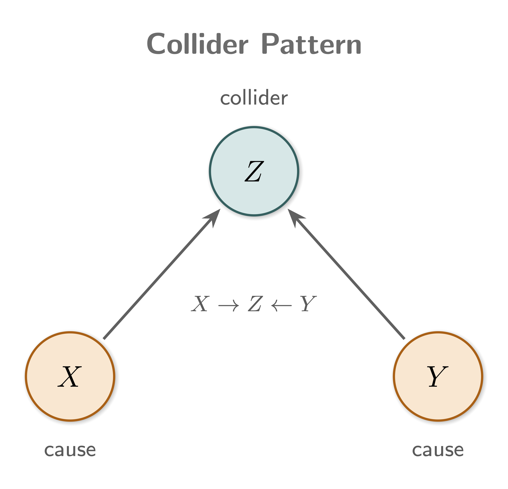{#fig-collider-structure width="50%"}

In a collider, two arrows meet at the same node:

$$X \rightarrow Z \leftarrow Y$$

Here, $Z$ is a common **effect** of $X$ and $Y$. This is very different from a fork. In a fork, the middle node is a common cause and conditioning on it blocks a confounding path. In a collider, the middle node is a common effect and conditioning on it opens a path that was previously closed.

Without conditioning on $Z$, the path between $X$ and $Y$ is closed:

$$X \perp\!\!\!\perp Y$$

But once we condition on the collider, information can flow through it:

$$X \not\!\perp\!\!\!\perp Y \mid Z$$

This can create an association between $X$ and $Y$ even when neither causes the other. The association is not evidence of a causal relationship between the endpoints; it is a consequence of conditioning on a shared outcome. This is called **collider bias**; when the conditioning happens through sample inclusion, this is often called **selection bias**.

[The practical rule is: do not condition on a collider, or on a variable downstream of a collider, unless the estimand specifically requires it and the induced bias is understood.]{.highlight-key-point}

:::: {.callout-tip icon="false" collapse="true"}
## Intuitive example of a collider structure

Suppose a selective university admits students who are either smart or athletic, or some combination of the two. In the general population, assume intelligence and athleticism are unrelated: knowing that someone is smart tells us nothing about whether they are athletic.

The admission decision is therefore a shared effect:

$$    \text{Smart} \rightarrow \text{Admitted} \leftarrow \text{Athletic}$$

If we look only at admitted students, we have conditioned on the collider. This can create a negative association between intelligence and athleticism even though the two traits were independent in the wider population. Among admitted students, someone who is not athletic is more likely to be very smart, because they still had to clear the admissions threshold somehow.

This is the collider intuition: once we know the shared outcome occurred, learning that one possible cause is absent makes the other cause more plausible. The two causes begin to "explain away" each other.

[The observed trade-off is not evidence that intelligence reduces athleticism, or that athleticism reduces intelligence. It is a selection artifact created by conditioning on their shared outcome.]{.highlight-key-point}

::: {.callout-note icon="false" collapse="true"}
## Code for the collider example

Let's simulate the same collider structure using the university admissions example:

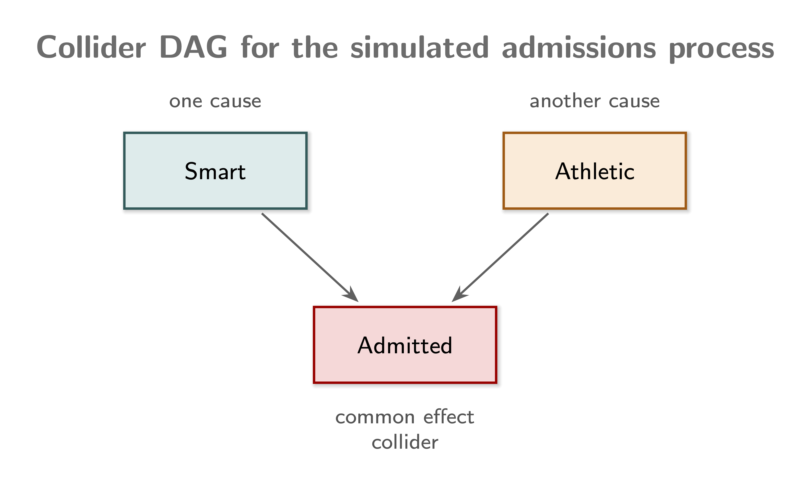{#fig-collider-example width="75%"}

$$\text{Smart} \rightarrow \text{Admitted} \leftarrow \text{Athletic}$$

The important setup is that `Smart` and `Athletic` are uncorrelated traits in the full population. Here we draw both as continuous standard-normal variables and make them independent by construction:

```python
smart = rng_collider.normal(0, 1, n_population)
athletic = rng_collider.normal(0, 1, n_population)
```

Then we make `Admitted` a binary variable. A student is admitted if their combined smart and athletic scores are high enough. This makes admission a shared outcome of both traits, so `Admitted` is a collider:

```python
admission_score = smart + athletic
admission_threshold = np.quantile(admission_score, 0.8)
admitted = (admission_score >= admission_threshold).astype(int)
```
 Here is the full population data-generating process with `Admitted` as a collider:
```{python}
# Full population data-generating process 
rng_collider = np.random.default_rng(42)

n_population = 2000

smart = rng_collider.normal(0, 1, n_population)
athletic = rng_collider.normal(0, 1, n_population)

# Admission is binary, but both inputs are continuous.
admission_score = smart + athletic
admission_threshold = np.quantile(admission_score, 0.8)
admitted = (admission_score >= admission_threshold).astype(int)

population_df = pd.DataFrame({
    "Smart": smart,
    "Athletic": athletic,
    "Admitted": admitted
})

population_df.head()
```

In the full population, `Smart` and `Athletic` are independent by construction. Knowing that someone has a high value of `Smart` tells us essentially nothing about their value of `Athletic`. The sample correlation should therefore be close to zero.

##### Summary of the simulated data

Let's plot the relationship between `Smart` and `Athletic` in the full population:

```{python}
from plotnine import (
    ggplot,
    aes,
    geom_point,
    geom_smooth,
    labs,
    theme_minimal,
    theme,
    element_text,
)

from plotnine import annotate

# Calculate the correlation
full_population_corr = population_df[["Smart", "Athletic"]].corr().iloc[0, 1]

(
    ggplot(population_df, aes(x="Smart", y="Athletic"))
    + geom_point(alpha=0.35, size=1.2)
    + geom_smooth(method="lm", se=False, color="#bf616a")
    + labs(
        title="Smart and athletic are unrelated in the full population",
        subtitle="The two traits were generated independently, so the fitted line is approximately flat.",
        x="Smart",
        y="Athletic"
    )
    + annotate(
        "text",
        x=population_df["Smart"].min() + 0.5,
        y=population_df["Athletic"].max() - 0.5,
        label=f"corr = {full_population_corr:.2f}",
        size=10,
        ha='left',
        va='top'
    )
    + theme_minimal()
    + theme(
        figure_size=(6.5, 4.5),
        plot_title=element_text(weight="bold")
    )
)
```

Now suppose we only look at admitted students. This is equivalent to conditioning on the collider `Admitted`.

```{python}
# ── Selected sample: admitted students only 
admitted_df = population_df.query("Admitted == 1").copy()
```

Among admitted students, `Smart` and `Athletic` are no longer independent:

```{python}
# Calculate the correlation
admitted_population_corr = admitted_df[["Smart", "Athletic"]].corr().iloc[0, 1]

(
    ggplot(admitted_df, aes(x="Smart", y="Athletic"))
    + geom_point(alpha=0.35, size=1.2)
    + geom_smooth(method="lm", se=False, color="#bf616a")
    + labs(
        title="Smart and athletic are associated in the admitted students sample",
        subtitle="The two traits are associated in the admitted students sample,\nbut were independent in the full population.",
        x="Smart",
        y="Athletic"
    )
    + annotate(
        "text",
        x=admitted_df["Smart"].min() + 0.1,  # Top-left, padding from left edge
        y=admitted_df["Athletic"].max() - 0.1,  # Slightly below top edge
        label=f"corr = {admitted_population_corr:.2f}",
        size=10,
        color="black",
        ha='left',
        va='top'
    )
    + theme_minimal()
    + theme(
        figure_size=(6.5, 4.5),
        plot_title=element_text(weight="bold")
    )
)
```

The reason is selection. In the admitted group, a student with a lower value of `Smart` usually needs a higher value of `Athletic` to clear the admission threshold. Similarly, a less athletic admitted student usually needs to be smarter. The two traits start to trade off against each other inside the selected sample, even though no such trade-off exists in the full population.

So the key point is:

$$\text{Smart} \perp\!\!\!\perp \text{Athletic}$$

in the full population, but

$$  
\text{Smart} \not\!\perp\!\!\!\perp \text{Athletic} \mid \text{Admitted}$$

after conditioning on admission.

##### Analyze the data to see the associations

So, should we condition on the collider? Usually, **no**. If the goal is to learn the relationship between the two causes, `Smart` and `Athletic`, in the population, conditioning on `Admitted` would create an association that is not causal.

In the regression examples in this post, conditioning on a variable means including it as a covariate in the model. So here, conditioning on `Admitted` means adding `Admitted` to the linear predictor.

We fit two Bayesian linear regressions: one unconditioned model and one regression-adjusted model that includes `Admitted`.

**Model 1 - no conditioning on the collider**:

$$\alpha \sim \mathcal{N}(0,\, 1)$$

$$\beta_{\text{smart}} \sim \mathcal{N}(0,\, 1)$$

$$\sigma \sim \text{HalfNormal}(1)$$

$$\mu_i = \alpha + \beta_{\text{smart}} \cdot \text{Smart}_i$$

$$\text{Athletic}_i \sim \mathcal{N}(\mu_i,\, \sigma)$$

This model uses the full population. Since `Smart` and `Athletic` were generated independently, the posterior for $\beta_{\text{smart}}$ should be close to zero.

**Model 2 - conditioning on the collider**:

$$\alpha \sim \mathcal{N}(0,\, 1)$$

$$\beta_{\text{smart}} \sim \mathcal{N}(0,\, 1)$$

$$\beta_{\text{admitted}} \sim \mathcal{N}(0,\, 1)$$

$$\sigma \sim \text{HalfNormal}(1)$$

$$\mu_i = \alpha + \beta_{\text{smart}} \cdot \text{Smart}_i + \beta_{\text{admitted}} \cdot \text{Admitted}_i$$

$$\text{Athletic}_i \sim \mathcal{N}(\mu_i,\, \sigma)$$

This model uses the full population but includes the collider as a covariate. The coefficient $\beta_{\text{smart}}$ is now a conditional association: how `Athletic` changes with `Smart` among observations with the same value of `Admitted`, averaged across the admitted and not-admitted strata by the model.

If the collider logic is correct, the posterior for $\beta_{\text{smart}}$ should move away from zero in the conditioned model, even though `Smart` has no causal effect on `Athletic`.

```{python}
smart_full_t = torch.tensor(population_df["Smart"].values, dtype=torch.float32)
athletic_full_t = torch.tensor(population_df["Athletic"].values, dtype=torch.float32)
admitted_full_t = torch.tensor(population_df["Admitted"].values, dtype=torch.float32)


def smart_athletic_model(smart, athletic, admitted=None):
    alpha = pyro.sample("alpha", dist.Normal(0.0, 1.0))
    beta_smart = pyro.sample("beta_smart", dist.Normal(0.0, 1.0))
    sigma = pyro.sample("sigma", dist.HalfNormal(1.0))

    mu = alpha + beta_smart * smart
    if admitted is not None:
        beta_admitted = pyro.sample("beta_admitted", dist.Normal(0.0, 1.0))
        mu = mu + beta_admitted * admitted

    with pyro.plate("obs", len(athletic)):
        pyro.sample("athletic", dist.Normal(mu, sigma), obs=athletic)


def run_collider_mcmc(smart, athletic, admitted=None, num_samples=1000, warmup_steps=500):
    pyro.clear_param_store()
    mcmc = MCMC(
        NUTS(smart_athletic_model),
        num_samples=num_samples,
        warmup_steps=warmup_steps,
        disable_progbar=True
    )
    mcmc.run(smart, athletic, admitted)
    return mcmc.get_samples()


post_full_collider = run_collider_mcmc(smart_full_t, athletic_full_t)
post_adjusted_collider = run_collider_mcmc(smart_full_t, athletic_full_t, admitted_full_t)
```

```{python}
draws_collider = {
    "Full population\n(no conditioning)": post_full_collider["beta_smart"].detach().numpy(),
    "Full population\n(+ Admitted covariate)": post_adjusted_collider["beta_smart"].detach().numpy(),
}

plot_order_collider = list(draws_collider.keys())
all_collider_vals = np.concatenate(list(draws_collider.values()))
x_lo_c, x_hi_c = np.quantile(all_collider_vals, [0.005, 0.995])
x_pad_c = 0.20 * (x_hi_c - x_lo_c)
x_grid_c = np.linspace(x_lo_c - x_pad_c, x_hi_c + x_pad_c, 400)
ridge_h_c = 0.72

collider_rows, collider_int_rows, collider_summary_rows = [], [], []

for i, name in enumerate(plot_order_collider):
    y_base = len(plot_order_collider) - 1 - i
    draws = draws_collider[name]
    kde = gaussian_kde(draws)
    dens = kde(x_grid_c)
    dens_s = dens / dens.max() * ridge_h_c
    lo, hi = np.quantile(draws, [0.025, 0.975])
    median = np.median(draws)

    for x, d in zip(x_grid_c, dens_s):
        collider_rows.append({"label": name, "x": x, "y_base": y_base, "y": y_base + d})
        if lo <= x <= hi:
            collider_int_rows.append({"label": name, "x": x, "y_base": y_base, "y": y_base + d})

    collider_summary_rows.append({
        "label": name,
        "y_base": y_base,
        "median": median,
        "y_top": y_base + np.interp(median, x_grid_c, dens_s),
    })


def build_polygon_collider(df, order, col="label"):
    rows = []
    for name in order:
        sub = df[df[col] == name].sort_values("x")
        if len(sub) == 0:
            continue
        yb = sub["y_base"].iloc[0]
        rows.extend(sub.to_dict("records"))
        rows += [
            {col: name, "x": sub["x"].iloc[-1], "y_base": yb, "y": yb},
            {col: name, "x": sub["x"].iloc[0], "y_base": yb, "y": yb},
        ]
    return pd.DataFrame(rows)


collider_df = pd.DataFrame(collider_rows)
collider_int_df = pd.DataFrame(collider_int_rows)
collider_poly = build_polygon_collider(collider_df, plot_order_collider)
collider_int_poly = build_polygon_collider(collider_int_df, plot_order_collider)
collider_sum_df = pd.DataFrame(collider_summary_rows)

p_collider = (
    ggplot()
    + geom_vline(xintercept=0, color="#d9d9d9", size=1.2)
    + geom_polygon(
        collider_poly,
        aes(x="x", y="y", group="label"),
        fill="#c8dce8",
        alpha=0.75,
        color=None
    )
    + geom_polygon(
        collider_int_poly,
        aes(x="x", y="y", group="label"),
        fill="#8fb7cb",
        alpha=0.70,
        color=None
    )
    + geom_line(
        collider_df,
        aes(x="x", y="y", group="label"),
        color="#002b63",
        size=1.2
    )
    + geom_segment(
        collider_sum_df.assign(x_start=x_grid_c.min(), x_end=x_grid_c.max()),
        aes(x="x_start", xend="x_end", y="y_base", yend="y_base"),
        color="#002b63",
        size=1.0
    )
    + geom_segment(
        collider_sum_df,
        aes(x="median", xend="median", y="y_base", yend="y_top"),
        color="#4b8aa6",
        size=2.3
    )
    + scale_y_continuous(
        breaks=collider_sum_df["y_base"].tolist(),
        labels=collider_sum_df["label"].tolist(),
        expand=(0.06, 0.25),
    )
    + scale_x_continuous(expand=(0.02, 0.02))
    + coord_cartesian(ylim=(-0.55, len(plot_order_collider) - 0.15))
    + labs(
        title="Conditioning on a collider opens the path",
        subtitle="blue tick = posterior median  ·  shaded = 95% interval",
        x="Coefficient for Smart predicting Athletic",
        y="",
    )
    + theme(
        figure_size=(10.5, 6.8),
        panel_background=element_rect(fill="white", color="white"),
        plot_background=element_rect(fill="white", color="white"),
        panel_grid_major=element_blank(),
        panel_grid_minor=element_blank(),
        axis_line_x=element_line(color="black", size=0.8),
        axis_line_y=element_line(color="black", size=0.8),
        axis_ticks_major=element_line(color="black", size=0.8),
        axis_ticks_minor=element_blank(),
        axis_text_x=element_text(size=12, family="serif", color="#333333"),
        axis_text_y=element_text(size=11, family="serif", color="#333333", weight="bold"),
        axis_title_x=element_text(size=12, family="serif", color="#333333", margin={"t": 10}),
        plot_title=element_text(size=24, family="serif", color="black"),
        plot_subtitle=element_text(size=17, family="serif", color="black"),
    )
)

p_collider
```

The two posteriors answer different questions.

In the **full population**, the posterior for $\beta_{\text{smart}}$ is close to zero. This is what we expect, because `Smart` and `Athletic` were generated independently. The path

$$\text{Smart} \rightarrow \text{Admitted} \leftarrow \text{Athletic}$$

is closed until we condition on `Admitted`.

When we **include `Admitted` as a covariate**, the posterior for $\beta_{\text{smart}}$ moves away from zero. This is regression conditioning: the model asks whether `Smart` and `Athletic` are associated after holding admission status fixed. Since admission is a common effect of both traits, holding it fixed opens the collider path. The resulting association is not a causal effect of `Smart` on `Athletic`, or of `Athletic` on `Smart`. It is created by conditioning on their shared outcome.

So the practical answer is:

- If the estimand is the relationship between `Smart` and `Athletic` in the full population, **do not condition on `Admitted`**.
- If the estimand is a descriptive association at fixed admission status, then including `Admitted` as a covariate is conditioning on the collider.

[For a collider, conditioning is not a harmless adjustment. It changes a closed path into an open path and can manufacture an association between two variables that do not cause each other.]{.highlight-key-point}


:::
::::

The fourth and final structure is the **descendant** structure:

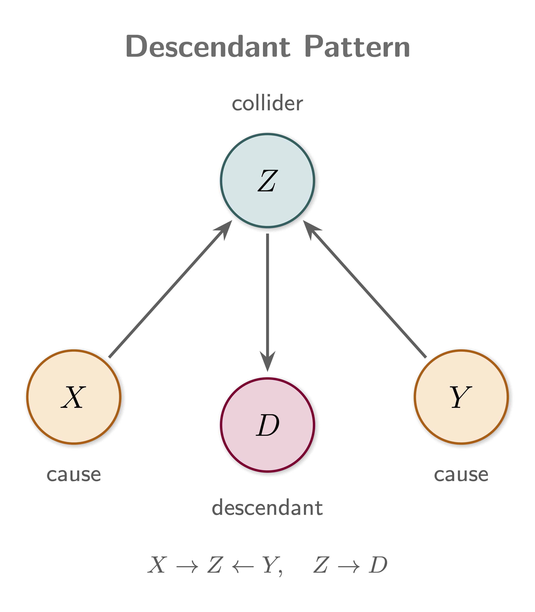{#fig-descendant-structure width="50%"}

A descendant is any variable that lies downstream of another variable. In the structure here, $D$ is a descendant of the collider $Z$:

$$X \rightarrow Z \leftarrow Y$$

$$Z \rightarrow D$$

Because $D$ is caused by $Z$, learning about $D$ gives us information about $Z$. So even if we do not condition directly on the collider $Z$, conditioning on its descendant $D$ can still open the otherwise closed path between $X$ and $Y$:

$$X \not\!\perp\!\!\!\perp Y \mid D$$


[Conditioning on a descendant of a collider can open the collider path indirectly. The problem is not only conditioning on the shared outcome itself, but also conditioning on variables that reveal information about that shared outcome.]{.highlight-key-point}

::: {.callout-tip icon="false" collapse="true"}
## Intuitive example of a descendant structure

Return to the university admissions example. Suppose `Smart` and `Athletic` are independent traits in the applicant population, but both can help a student get admitted:

$$\text{Smart} \rightarrow \text{Admitted} \leftarrow \text{Athletic}$$

Now add one more variable: whether the student appears in the university's student database. A student appears in that database only after being admitted and enrolling. So database membership is downstream of admission:

$$\text{Admitted} \rightarrow \text{In university database}$$

`Admitted` is still the collider. `In university database` is not itself the collider; it is a downstream consequence of it. If we analyze only people in the database, we are using a variable that carries information about admission, so `Smart` and `Athletic` can still begin to explain away each other:


$$\text{Smart} \not\!\perp\!\!\!\perp \text{Athletic} \mid \text{In university database}$$

[Conditioning on a downstream variable can act like a noisy version of conditioning on the collider itself. The more informative the descendant is about the collider, the more it can induce the same selection-driven association.]{.highlight-key-point}

::: {.callout-note icon="false" collapse="true"}
## Code for the descendant example

Let's simulate some data to illustrate the descendant example. We will create a simple dataset where `Smart` and `Athletic` are independent traits in the applicant population, but both can help a student get admitted. We will then add one more variable: whether the student appears in the university's student database. Database membership is downstream of admission, but it is noisy: some admitted students are missing because it takes time to add them to the system, and a small number of non-admitted applicants can appear because of administrative errors.

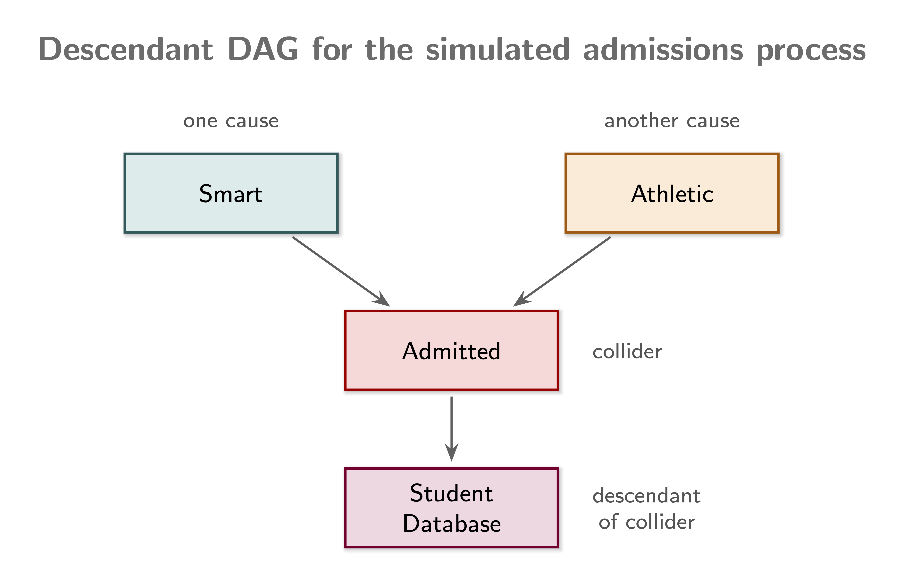{#fig-descendant-example width="75%"}

```{python}
# Descendant example: database membership as a noisy proxy for admission
rng_descendant = np.random.default_rng(123)

n_applicants = 5000

# Controls how noisy the descendant is.
# Higher values mean more admitted students are still missing from the database.
database_delay_noise = 0.30

# Optional administrative/data-entry noise.
database_false_positive_rate = 0.01

smart = rng_descendant.normal(0, 1, n_applicants)
athletic = rng_descendant.normal(0, 1, n_applicants)

# Admission is the collider: both traits can help a student clear the threshold.
admission_score = smart + athletic
admission_threshold = np.quantile(admission_score, 0.80)
admitted = (admission_score >= admission_threshold).astype(int)

# Database membership is a descendant of admission.
# Because adding admitted students takes time, some admitted students are not
# yet visible in the database. A small false-positive rate represents occasional
# administrative errors.
p_in_database = np.where(
    admitted == 1,
    1.0 - database_delay_noise,
    database_false_positive_rate,
)
in_university_database = rng_descendant.binomial(1, p_in_database)

descendant_df = pd.DataFrame({
    "Smart": smart,
    "Athletic": athletic,
    "Admitted": admitted,
    "InUniversityDatabase": in_university_database,
})

descendant_df.head()

```

#### Summary of the simulated data

The `InUniversityDatabase` variable is a noisy proxy for the `Admitted` variable:

```{python}
descendant_df[["Admitted", "InUniversityDatabase"]].corr().iloc[0, 1]
```

It is not itself the collider, but it is a downstream consequence of it. Let's plot the simulated data to see the associations between `Smart` and `Athletic` in the full population, and when we condition on the `Admitted` variable, and when we condition on the `InUniversityDatabase` variable:


```{python}
from plotnine import (
    ggplot,
    aes,
    geom_point,
    geom_smooth,
    geom_text,
    facet_wrap,
    labs,
    theme_minimal,
    theme,
    element_text,
)

plot_full_df = descendant_df.assign(
    Sample="Full applicant population"
)

plot_admitted_df = descendant_df.query("Admitted == 1").assign(
    Sample="Condition on Admitted"
)

plot_database_df = descendant_df.query("InUniversityDatabase == 1").assign(
    Sample="Condition on Student Database"
)

descendant_plot_df = pd.concat(
    [plot_full_df, plot_admitted_df, plot_database_df],
    ignore_index=True,
)

sample_order = [
    "Full applicant population",
    "Condition on Admitted",
    "Condition on Student Database",
]

descendant_plot_df["Sample"] = pd.Categorical(
    descendant_plot_df["Sample"],
    categories=sample_order,
    ordered=True,
)

descendant_corr_df = (
    descendant_plot_df
    .groupby("Sample", observed=True)
    .apply(
        lambda df: pd.Series({
            "corr": df[["Smart", "Athletic"]].corr().iloc[0, 1],
            "x": df["Smart"].min() + 0.25,
            "y": df["Athletic"].max() - 0.25,
        })
    )
    .reset_index()
)

descendant_corr_df["label"] = descendant_corr_df["corr"].map(
    lambda corr: f"corr = {corr:.2f}"
)

(
    ggplot(descendant_plot_df, aes(x="Smart", y="Athletic"))
    + geom_point(alpha=0.25, size=0.8)
    + geom_smooth(method="lm", se=False, color="#bf616a")
    + geom_text(
        descendant_corr_df,
        aes(x="x", y="y", label="label"),
        inherit_aes=False,
        ha="left",
        va="top",
        size=9,
    )
    + facet_wrap("~Sample", nrow=1)
    + labs(
        title="Conditioning on a descendant partially opens the collider path",
        subtitle=(
            "Smart and Athletic are independent in the full population, "
            "but become associated after conditioning on Admitted or its noisy descendant."
        ),
        x="Smart",
        y="Athletic",
    )
    + theme_minimal()
    + theme(
        figure_size=(12, 4.2),
        plot_title=element_text(weight="bold"),
    )
)
```


#### Analyze the data to see the associations

The descendant example asks a slightly different question from the collider example. We already know that conditioning directly on `Admitted` opens the collider path:

$$\text{Smart} \rightarrow \text{Admitted} \leftarrow \text{Athletic}$$

Now we want to know what happens if we do not condition on `Admitted` itself, but instead condition on a variable downstream of it:

$$\text{Admitted} \rightarrow \text{InUniversityDatabase}$$

Because `InUniversityDatabase` carries information about `Admitted`, conditioning on it can also create an association between `Smart` and `Athletic`.

To illustrate this, we fit three Bayesian linear regressions:

**Model 1 - no conditioning**:

$$\alpha \sim \mathcal{N}(0,\, 1)$$

$$\beta_{\text{smart}} \sim \mathcal{N}(0,\, 1)$$

$$\sigma \sim \text{HalfNormal}(1)$$

$$\mu_i = \alpha + \beta_{\text{smart}} \cdot \text{Smart}_i$$

$$\text{Athletic}_i \sim \mathcal{N}(\mu_i,\, \sigma)$$

This model estimates the raw association between `Smart` and `Athletic` in the full applicant population. Since the two traits were generated independently, $\beta_{\text{smart}}$ should be close to zero.

**Model 2 - conditioning on the collider**:

$$\alpha \sim \mathcal{N}(0,\, 1)$$

$$\beta_{\text{smart}} \sim \mathcal{N}(0,\, 1)$$

$$\beta_{\text{admitted}} \sim \mathcal{N}(0,\, 1)$$

$$\sigma \sim \text{HalfNormal}(1)$$

$$\mu_i = \alpha + \beta_{\text{smart}} \cdot \text{Smart}_i + \beta_{\text{admitted}} \cdot \text{Admitted}_i$$

$$\text{Athletic}_i \sim \mathcal{N}(\mu_i,\, \sigma)$$

This model conditions directly on `Admitted`, the collider.

**Model 3 - conditioning on the descendant**:

$$\alpha \sim \mathcal{N}(0,\, 1)$$

$$\beta_{\text{smart}} \sim \mathcal{N}(0,\, 1)$$

$$\beta_{\text{database}} \sim \mathcal{N}(0,\, 1)$$

$$\sigma \sim \text{HalfNormal}(1)$$

$$\mu_i = \alpha + \beta_{\text{smart}} \cdot \text{Smart}_i + \beta_{\text{database}} \cdot \text{InUniversityDatabase}_i$$

$$\text{Athletic}_i \sim \mathcal{N}(\mu_i,\, \sigma)$$

This model does not condition on the collider directly. Instead, it conditions on `InUniversityDatabase`, a noisy descendant of the collider. If the descendant is informative about admission, the posterior for $\beta_{\text{smart}}$ should move away from zero, but usually less strongly than when conditioning directly on `Admitted`.

```{python}
smart_desc_t = torch.tensor(descendant_df["Smart"].values, dtype=torch.float32)
athletic_desc_t = torch.tensor(descendant_df["Athletic"].values, dtype=torch.float32)
admitted_desc_t = torch.tensor(descendant_df["Admitted"].values, dtype=torch.float32)
database_desc_t = torch.tensor(descendant_df["InUniversityDatabase"].values, dtype=torch.float32)


def descendant_association_model(smart, athletic, condition_var=None):
    alpha = pyro.sample("alpha", dist.Normal(0.0, 1.0))
    beta_smart = pyro.sample("beta_smart", dist.Normal(0.0, 1.0))
    sigma = pyro.sample("sigma", dist.HalfNormal(1.0))

    mu = alpha + beta_smart * smart
    if condition_var is not None:
        beta_condition = pyro.sample("beta_condition", dist.Normal(0.0, 1.0))
        mu = mu + beta_condition * condition_var

    with pyro.plate("obs", len(athletic)):
        pyro.sample("athletic", dist.Normal(mu, sigma), obs=athletic)


def run_descendant_mcmc(smart, athletic, condition_var=None, num_samples=1000, warmup_steps=500):
    pyro.clear_param_store()
    mcmc = MCMC(
        NUTS(descendant_association_model),
        num_samples=num_samples,
        warmup_steps=warmup_steps,
        disable_progbar=True
    )
    mcmc.run(smart, athletic, condition_var)
    return mcmc.get_samples()


post_desc_unconditioned = run_descendant_mcmc(smart_desc_t, athletic_desc_t)
post_desc_admitted = run_descendant_mcmc(smart_desc_t, athletic_desc_t, admitted_desc_t)
post_desc_database = run_descendant_mcmc(smart_desc_t, athletic_desc_t, database_desc_t)
```

```{python}
draws_descendant = {
    "Full population\n(no conditioning)": post_desc_unconditioned["beta_smart"].detach().numpy(),
    "Full population\n(+ Admitted covariate)": post_desc_admitted["beta_smart"].detach().numpy(),
    "Full population\n(+ Database covariate)": post_desc_database["beta_smart"].detach().numpy(),
}

plot_order_descendant = list(draws_descendant.keys())
all_descendant_vals = np.concatenate(list(draws_descendant.values()))
x_lo_d, x_hi_d = np.quantile(all_descendant_vals, [0.005, 0.995])
x_pad_d = 0.20 * (x_hi_d - x_lo_d)
x_grid_d = np.linspace(x_lo_d - x_pad_d, x_hi_d + x_pad_d, 400)
ridge_h_d = 0.72

descendant_rows, descendant_int_rows, descendant_summary_rows = [], [], []

for i, name in enumerate(plot_order_descendant):
    y_base = len(plot_order_descendant) - 1 - i
    draws = draws_descendant[name]
    kde = gaussian_kde(draws)
    dens = kde(x_grid_d)
    dens_s = dens / dens.max() * ridge_h_d
    lo, hi = np.quantile(draws, [0.025, 0.975])
    median = np.median(draws)

    for x, d in zip(x_grid_d, dens_s):
        descendant_rows.append({"label": name, "x": x, "y_base": y_base, "y": y_base + d})
        if lo <= x <= hi:
            descendant_int_rows.append({"label": name, "x": x, "y_base": y_base, "y": y_base + d})

    descendant_summary_rows.append({
        "label": name,
        "y_base": y_base,
        "median": median,
        "y_top": y_base + np.interp(median, x_grid_d, dens_s),
    })


def build_polygon_descendant(df, order, col="label"):
    rows = []
    for name in order:
        sub = df[df[col] == name].sort_values("x")
        if len(sub) == 0:
            continue
        yb = sub["y_base"].iloc[0]
        rows.extend(sub.to_dict("records"))
        rows += [
            {col: name, "x": sub["x"].iloc[-1], "y_base": yb, "y": yb},
            {col: name, "x": sub["x"].iloc[0], "y_base": yb, "y": yb},
        ]
    return pd.DataFrame(rows)


descendant_df_ridge = pd.DataFrame(descendant_rows)
descendant_int_df_ridge = pd.DataFrame(descendant_int_rows)
descendant_poly = build_polygon_descendant(descendant_df_ridge, plot_order_descendant)
descendant_int_poly = build_polygon_descendant(descendant_int_df_ridge, plot_order_descendant)
descendant_sum_df = pd.DataFrame(descendant_summary_rows)

p_descendant = (
    ggplot()
    + geom_vline(xintercept=0, color="#d9d9d9", size=1.2)
    + geom_polygon(
        descendant_poly,
        aes(x="x", y="y", group="label"),
        fill="#c8dce8",
        alpha=0.75,
        color=None
    )
    + geom_polygon(
        descendant_int_poly,
        aes(x="x", y="y", group="label"),
        fill="#8fb7cb",
        alpha=0.70,
        color=None
    )
    + geom_line(
        descendant_df_ridge,
        aes(x="x", y="y", group="label"),
        color="#002b63",
        size=1.2
    )
    + geom_segment(
        descendant_sum_df.assign(x_start=x_grid_d.min(), x_end=x_grid_d.max()),
        aes(x="x_start", xend="x_end", y="y_base", yend="y_base"),
        color="#002b63",
        size=1.0
    )
    + geom_segment(
        descendant_sum_df,
        aes(x="median", xend="median", y="y_base", yend="y_top"),
        color="#4b8aa6",
        size=2.3
    )
    + scale_y_continuous(
        breaks=descendant_sum_df["y_base"].tolist(),
        labels=descendant_sum_df["label"].tolist(),
        expand=(0.06, 0.25),
    )
    + scale_x_continuous(expand=(0.02, 0.02))
    + coord_cartesian(ylim=(-0.55, len(plot_order_descendant) - 0.15))
    + labs(
        title="Conditioning on a descendant can open the collider path",
        subtitle="blue tick = posterior median  ·  shaded = 95% interval",
        x="Coefficient for Smart predicting Athletic",
        y="",
    )
    + theme(
        figure_size=(10.5, 6.8),
        panel_background=element_rect(fill="white", color="white"),
        plot_background=element_rect(fill="white", color="white"),
        panel_grid_major=element_blank(),
        panel_grid_minor=element_blank(),
        axis_line_x=element_line(color="black", size=0.8),
        axis_line_y=element_line(color="black", size=0.8),
        axis_ticks_major=element_line(color="black", size=0.8),
        axis_ticks_minor=element_blank(),
        axis_text_x=element_text(size=12, family="serif", color="#333333"),
        axis_text_y=element_text(size=11, family="serif", color="#333333", weight="bold"),
        axis_title_x=element_text(size=12, family="serif", color="#333333", margin={"t": 10}),
        plot_title=element_text(size=24, family="serif", color="black"),
        plot_subtitle=element_text(size=17, family="serif", color="black"),
    )
)

p_descendant
```

The three posteriors show how the association changes as we condition on different variables.

In the **full population**, the posterior for $\beta_{\text{smart}}$ is close to zero. This is the baseline result: `Smart` and `Athletic` were generated independently, so knowing a student's value of `Smart` tells us essentially nothing about their value of `Athletic`.

When we **include `Admitted` as a covariate**, the posterior for $\beta_{\text{smart}}$ moves away from zero. This is the same collider effect as before. The model is now estimating the association between `Smart` and `Athletic` after holding fixed a shared outcome of both traits.

When we **include `InUniversityDatabase` as a covariate**, the posterior also moves away from zero. This is the descendant effect. The model has not conditioned on the collider itself, but it has conditioned on a variable that contains information about the collider. Because database membership is downstream of admission, it partially reveals admission status, and that is enough to partially open the path between `Smart` and `Athletic`.

The strength of this induced association depends on how informative the descendant is. If `InUniversityDatabase` were a perfect copy of `Admitted`, conditioning on it would behave almost exactly like conditioning on `Admitted`. If it were pure noise and carried no information about admission, conditioning on it would not open the path.

So the practical answer to the question of on which variables to condition is:

- If the estimand is the relationship between `Smart` and `Athletic` in the full applicant population, **do not condition on `Admitted`**.
- Also avoid conditioning on variables downstream of `Admitted`, such as `InUniversityDatabase`, unless the estimand specifically requires it.
- A descendant of a collider can be dangerous because it can look like an ordinary observed covariate while still carrying information about the collider.

[Conditioning on a descendant of a collider is a weaker, noisier version of conditioning on the collider itself. It can still manufacture an association between variables that were independent in the population.]{.highlight-key-point}

:::

:::

##### Identifying the four path structures in the DEL DAG

Before writing the statistical model, we can use the four elemental path structures to describe the causal assumptions in @fig-dag-with-latent-factors-and-replicates.

1.  **Forks (common causes).** Input abundance [$a_i$]{style="color:#a3be8c"} is a common cause of the library, matrix, and target counts, producing the forks

    -   [$C_{l,i}$]{style="color:#b48ead"} ← [$a_i$]{style="color:#a3be8c"} → [$C_{m,i,r}$]{style="color:#5e81ac"},
    -   [$C_{l,i}$]{style="color:#b48ead"} ← [$a_i$]{style="color:#a3be8c"} → [$C_{t,i,r}$]{style="color:#d08770"}, and
    -   [$C_{m,i,r}$]{style="color:#5e81ac"} ← [$a_i$]{style="color:#a3be8c"} → [$C_{t,i,r}$]{style="color:#d08770"}.

    Matrix background [$b_i$]{style="color:#88c0d0"} creates another fork:

    -   [$C_{m,i,r}$]{style="color:#5e81ac"} ← [$b_i$]{style="color:#88c0d0"} → [$C_{t,i,r}$]{style="color:#d08770"}.

    These shared causes can induce associations among the observed counts. They are not, however, confounders of the path [$s_i$]{style="color:#bf616a"} → [$C_{t,i,r}$]{style="color:#d08770"}, because neither [$a_i$]{style="color:#a3be8c"} nor [$b_i$]{style="color:#88c0d0"} causes [$s_i$]{style="color:#bf616a"}.

2.  **Pipes (mediation).** No mediation structure appears in this DAG. Every latent process acts directly on an observed count, and no node lies on a directed causal path between another cause and its count. The DAG therefore contains no mediator to condition on.

3.  **Colliders (common effects).** The target count [$C_{t,i,r}$]{style="color:#d08770"} is a shared effect of [$a_i$]{style="color:#a3be8c"}, [$b_i$]{style="color:#88c0d0"}, [$s_i$]{style="color:#bf616a"}, and [$\gamma_{t,r}$]{style="color:#d08770"}. It is therefore a collider for every pair of these causes. For example,

    -   [$s_i$]{style="color:#bf616a"} → [$C_{t,i,r}$]{style="color:#d08770"} ← [$a_i$]{style="color:#a3be8c"}.

    Similarly, the matrix count [$C_{m,i,r}$]{style="color:#5e81ac"} is a collider for [$a_i$]{style="color:#a3be8c"}, [$b_i$]{style="color:#88c0d0"}, and [$\gamma_{m,r}$]{style="color:#5e81ac"}. Conditioning on, or selecting observations by, either count can induce associations among its otherwise independent causes.

4.  **Descendants of colliders.** The observed counts are descendants of their latent causes, but neither collider, [$C_{m,i,r}$]{style="color:#5e81ac"} nor [$C_{t,i,r}$]{style="color:#d08770"}, has a downstream node in this DAG. Consequently, the specific descendant-of-a-collider structure described earlier is absent.

[The DAG contains common causes and colliders, but no mediators or descendants of colliders. This supports a generative model in which input abundance, matrix background, target-specific enrichment, and replicate effects enter as distinct causes of the observed counts, rather than treating the counts as interchangeable adjustment variables.]{.highlight-key-point}

### Write the generative model and priors

The DAG tells us which quantities should contribute to each count, but we still need to choose how those contributions combine. We begin with a hierarchical Negative Binomial model. This is a useful first model because DEL counts are non-negative, sparse, and overdispersed, while the hierarchy allows information to be shared across compounds without forcing them to have the same abundance, background retention, or target enrichment.

Let $K_l$, $K_{m,r}$, and $K_{t,r}$ denote the total usable reads in the library, matrix ($r$th replicate), and target ($r$th replicate), and let $N$ be the number of compounds. We use

$$
E_l = \frac{K_l}{N}, \qquad
E_{m,r} = \frac{K_{m,r}}{N}, \qquad
E_{t,r} = \frac{K_{t,r}}{N}
$$

as known sequencing-exposure offsets. **Each is the count expected for one compound if reads were distributed uniformly in that sample**. Using these offsets removes differences in sequencing depth from the latent compound effects; it does not assume that the compounds are actually equally abundant.

#### Likelihood and link function

The likelihood describes how the latent biological and technical processes become noisy observed counts. For compound $i$ and replicate $r$, we specify

$$
\begin{aligned}
C_{l,i} &\sim \operatorname{NegBinomial}_2(\mu_{l,i}, \phi_l), \\
C_{m,i,r} &\sim \operatorname{NegBinomial}_2(\mu_{m,i,r}, \phi_m), \\
C_{t,i,r} &\sim \operatorname{NegBinomial}_2(\mu_{t,i,r}, \phi_t),
\end{aligned}
$$

Each line says that the observed count is a noisy realisation around an expected count $\mu$. One way to think about this is that $\mu$ is the model's recipe for repeated versions of the experiment, whereas $C$ is the particular result obtained on one occasion. Repeating the same experiment does not have to produce exactly $\mu$ reads, but the results should be distributed around it.

The subscript in $\operatorname{NegBinomial}_2$ identifies the **NB2 parameterisation** of the Negative Binomial family; it does not denote a different distribution. The notation follows [Cameron and Trivedi (1986)](https://doi.org/10.1002/jae.3950010104). In NB2, the extra-Poisson variance grows quadratically with the mean:

$$
\mathbb{E}[C \mid \mu,\phi] = \mu,
\qquad
\operatorname{Var}(C \mid \mu,\phi) = \mu + \frac{\mu^2}{\phi}.
$$

This differs from NB1, where the additional variance grows linearly with the mean. The distinction matters for sequencing data because high-abundance compounds can be much more variable in absolute terms than low-abundance compounds. For example, if $\mu=10$ and $\phi=5$, NB2 gives

$$
\operatorname{Var}(C)=10+\frac{10^2}{5}=30,
$$

rather than the variance of $10$ implied by a Poisson model. Smaller values of $\phi$ correspond to greater overdispersion, while $\phi \rightarrow \infty$ approaches the Poisson variance. We use separate parameters $\phi_l$, $\phi_m$, and $\phi_t$ because the library, matrix, and target experiments may have different amounts of residual variation.

The next step is to specify the expected counts. Since an expected count must be positive, it would be awkward to model $\mu$ directly with an ordinary additive equation: some combinations of effects could produce a negative value. A **log link** solves this problem by modelling $\log\mu$, which can take any real value, while guaranteeing that $\mu=\exp(\log\mu)$ remains positive:

$$
\begin{aligned}
\log \mu_{l,i}
    &= \log E_l + \alpha_l + \textcolor{#a3be8c}{a_i}, \\
\log \mu_{m,i,r}
    &= \log E_{m,r} + \alpha_m + \textcolor{#a3be8c}{a_i} + \textcolor{#88c0d0}{b_i} + \gamma_{m,r}, \\
\log \mu_{t,i,r}
    &= \log E_{t,r} + \alpha_t + \textcolor{#a3be8c}{a_i} + \textcolor{#88c0d0}{b_i} + \textcolor{#bf616a}{s_i} + \gamma_{t,r}.
\end{aligned}
$$

On the log scale, the terms are added. Exponentiating the equations reveals their more intuitive count-scale interpretation:

$$
\begin{aligned}
\mu_{l,i}
    &= E_l \times e^{\alpha_l} \times e^{a_i}, \\
\mu_{m,i,r}
    &= E_{m,r} \times e^{\alpha_m} \times e^{a_i} \times e^{b_i} \times e^{\gamma_{m,r}}, \\
\mu_{t,i,r}
    &= E_{t,r} \times e^{\alpha_t} \times e^{a_i} \times e^{b_i} \times e^{s_i} \times e^{\gamma_{t,r}}.
\end{aligned}
$$

The model can therefore be imagined as a sequence of multiplicative adjustment knobs. We start with the sequencing exposure $E$ and then turn each relevant knob up or down. An effect of zero on the log scale is a multiplier of $e^0=1$, so it leaves the expected count unchanged. A positive effect increases the count and a negative effect decreases it. For example, an effect of $\log 2$ doubles the expected count, while an effect of $\log(1/2)$ halves it.

This factorisation is the statistical translation of the DAG:

- The input-abundance multiplier $e^{a_i}$ appears in all three equations because [$a_i$]{style="color:#a3be8c"} affects every condition.
- The matrix-background multiplier $e^{b_i}$ appears in the matrix and target equations because [$b_i$]{style="color:#88c0d0"} affects both post-selection conditions.
- The target-specific multiplier $e^{s_i}$ appears only in the target equation because [$s_i$]{style="color:#bf616a"} represents enrichment specific to the target.
- The replicate multipliers $e^{\gamma_{m,r}}$ and $e^{\gamma_{t,r}}$ allow otherwise comparable experiments to have different recovery efficiencies.

The terms $\log E_l$, $\log E_{m,r}$, and $\log E_{t,r}$ are sequencing-depth offsets. They account for the fact that a sample with more total reads should produce larger counts for every compound; for example, doubling $E$ doubles the expected count when all other terms are fixed. After this depth effect has been included, the condition intercepts $\alpha_l$, $\alpha_m$, and $\alpha_t$ capture remaining condition-wide differences in average recovery between the library, matrix, and target experiments. The replicate effects $\gamma_{m,r}$ and $\gamma_{t,r}$ then capture sample-specific departures from the matrix and target baselines.

As a worked example, suppose a target replicate has $E_{t,r}=20$ reads per compound and the relevant multipliers are

$$
e^{\alpha_t}=1.1, \qquad
e^{a_i}=1.5, \qquad
e^{b_i}=2, \qquad
e^{s_i}=3, \qquad
e^{\gamma_{t,r}}=0.9.
$$

The expected target count is then

$$
\mu_{t,i,r}
=20\times1.1\times1.5\times2\times3\times0.9
=178.2.
$$

Without target-specific enrichment, $s_i=0$ and therefore $e^{s_i}=1$, giving an expected count of $59.4$. In this example, the target-specific term triples the expected target count after the model has already accounted for sequencing depth, input abundance, matrix background, condition-wide recovery, and replicate variation. The observed count need not equal either value exactly: the Negative Binomial likelihood represents the remaining sampling and experimental noise around the expectation.

More generally, $e^{s_i}$ is the compound's target-specific fold change relative to the typical compound, conditional on the other terms in the model. Equivalently, increasing $s_i$ by one multiplies the expected target count by $e \approx 2.72$.

#### Identifiable parameterisation

The intercepts and latent effects would not be separately identified if an arbitrary constant could be moved from one to the other. We therefore define the compound effects and replicate effects as deviations around zero:

$$
\sum_{i=1}^{N} a_i =
\sum_{i=1}^{N} b_i =
\sum_{i=1}^{N} s_i = 0,
\qquad
\sum_{r=1}^{R_m} \gamma_{m,r} =
\sum_{r=1}^{R_t} \gamma_{t,r} = 0.
$$

In computation, these constraints can be imposed with centred raw parameters. For example,

$$
a_i = \sigma_a(z_{a,i}-\bar z_a),
\qquad z_{a,i} \sim \operatorname{Normal}(0,1),
$$

with analogous definitions for $b_i$, $s_i$, $\gamma_{m,r}$, and $\gamma_{t,r}$. This non-centred hierarchical parameterisation also tends to be more stable when some compounds have little information.

The zero-sum definition makes an important point about the estimand explicit: $s_i=0$ means **typical target-specific enrichment within this experiment**, not a physical guarantee of no binding. Positive values indicate more target-specific enrichment than the library average, and negative values indicate less. Identifying an absolute no-binding state would require additional information, such as known non-binders, a calibrated negative-control distribution, or a mixture model with an explicitly defined null component.

#### Priors

We use weakly informative priors on the log scale:

$$
\begin{aligned}
\alpha_l,\alpha_m,\alpha_t
    &\sim \operatorname{Normal}(0,1), \\
\sigma_a
    &\sim \operatorname{HalfNormal}(0,0.75), \\
\sigma_b
    &\sim \operatorname{HalfNormal}(0,0.75), \\
\sigma_s
    &\sim \operatorname{HalfNormal}(0,0.50), \\
\sigma_{\gamma_m},\sigma_{\gamma_t}
    &\sim \operatorname{HalfNormal}(0,0.25).
\end{aligned}
$$

The latent effects are then generated by

$$
\begin{aligned}
z_{a,i},z_{b,i},z_{s,i} &\sim \operatorname{Normal}(0,1), \\
z_{\gamma_m,r},z_{\gamma_t,r} &\sim \operatorname{Normal}(0,1),
\end{aligned}
$$

followed by the centred transformations described above. These priors regularise noisy compound-level estimates towards the population average while still allowing the data to identify large effects. The somewhat tighter prior for $\sigma_s$ reflects the expectation that most compounds do not have extreme target-specific enrichment. It is not intended to rule out strong binders: a log effect of $1$ already corresponds to a $2.7$-fold change, and the hierarchical scale can increase when the full collection of compounds supports greater heterogeneity.

For dispersion, it is easier to place priors on the asymptotic extra-Poisson coefficient of variation,

$$
\kappa_c = \frac{1}{\sqrt{\phi_c}},
\qquad c \in \{l,m,t\},
$$

because $\kappa_c$ is directly interpretable: for large $\mu$, the Negative Binomial coefficient of variation approaches $\kappa_c$. We use

$$
\kappa_l,\kappa_m,\kappa_t
\sim \operatorname{HalfNormal}(0,0.50),
\qquad
\phi_c = \kappa_c^{-2}.
$$

This prior includes values close to the Poisson limit while allowing substantial overdispersion. It is preferable to an arbitrary diffuse prior directly on $\phi$, whose practical implications are difficult to see.

These numerical scales are starting assumptions, not facts learned from the observed counts. Their consequences must be evaluated by simulating complete library, matrix, and target datasets from the prior predictive distribution. In particular, we should check whether the model produces plausible zero frequencies, upper tails, replicate correlations, and target-to-matrix fold changes. If it does not, the priors should be revised before fitting the observed data.

The model also makes several substantive assumptions that should later be tested by sensitivity analysis: background transfers from matrix to target with the same log-scale contribution $b_i$; counts are conditionally independent once the latent effects are known; and a single Negative Binomial dispersion is shared by all compounds within a condition. More flexible versions could estimate a matrix-to-target loading, use a sparse or heavy-tailed prior for $s_i$, or replace the Negative Binomial likelihood with a Poisson-lognormal model. Those extensions should be motivated by failed predictive checks rather than added automatically.

[The target signal is the posterior distribution of a log fold-change, not a corrected count. The model infers it by jointly explaining all observed counts while propagating uncertainty in input abundance, matrix background, replicate effects, and overdispersion.]{.highlight-key-point}

## References:

- [Rosenbaum & Rubin (1983)](https://academic.oup.com/jrsssb/article/45/2/212/7027731) — classic paper on sensitivity to an unobserved binary covariate with a binary outcome.

- [VanderWeele & Ding (2017), E-value](https://pubmed.ncbi.nlm.nih.gov/28693043/) — a very accessible modern approach: it quantifies how strongly an unmeasured confounder would need to be associated with both treatment and outcome to explain away an association.

- [Cinelli & Hazlett (2020), “Making Sense of Sensitivity”](https://academic.oup.com/jrsssb/article/82/1/39/7056023?guestAccessKey=) — especially useful for regression-style intuition. Their “robustness value” asks how strong omitted confounding would need to be to overturn a conclusion.

- [sensemakr](https://carloscinelli.com/sensemakr/) — practical R/Stata implementation of Cinelli & Hazlett’s approach; useful if you want a computational reference rather than only theory
