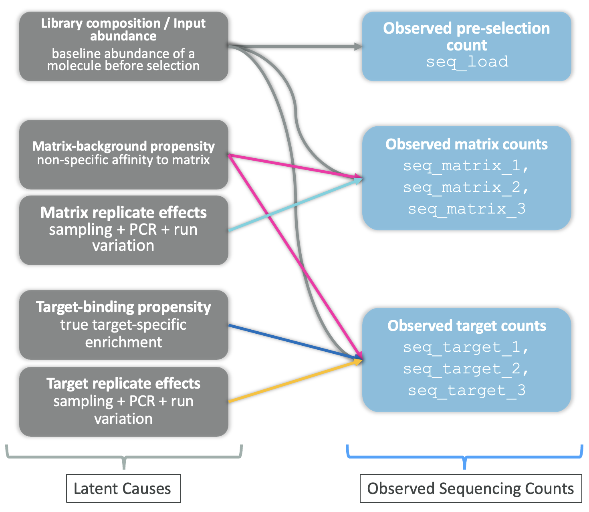
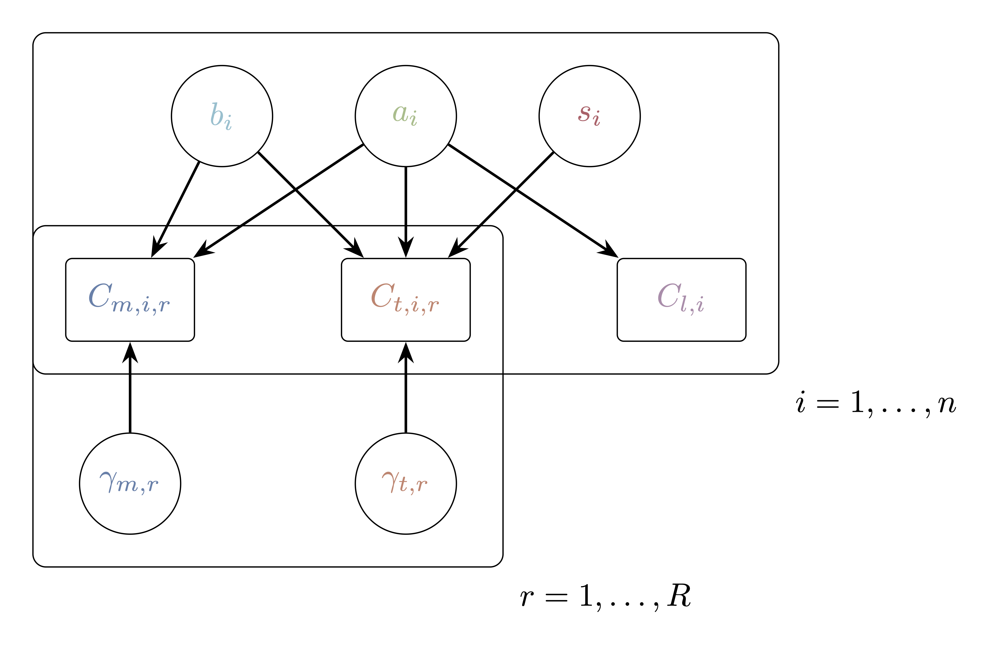

## What Is the Aim of This Blog?

A high target count can have several explanations. A compound may have been abundant in the starting library, retained by the matrix, enriched specifically in the target experiment, or affected by technical variation. The count alone cannot tell us which explanation matters most.

Building on the causal sketch from Part 1, we specify a Bayesian model that uses library, matrix, and target measurements together.

{#fig-causal-sketch width="50%"}

We will define the expected counts, account for residual variation, choose priors, and simulate complete experiments to see what those choices imply. Fitting the model and checking its posterior are subsequent steps. Molecular structure is reserved for the compound-aware extension in Part 3.

For each compound $i$, the measurements are a library count $C_{l,i}$, matrix counts $C_{m,i,r}$, and target counts $C_{t,i,r}$, where $r$ indexes replicates. We introduce three compound effects:

```{=html}
<style>
.del-effects {
  margin: 1.5rem 0 2rem;
  overflow-x: auto;
  border: 1px solid #e5e9f0;
  border-radius: 10px;
}
.del-effects table {
  width: 100%;
  margin-bottom: 0;
  color: #2e3440;
  font-size: 0.95rem;
}
.del-effects table > :not(caption) > * > * {
  padding: 0.9rem 1.1rem;
  vertical-align: middle;
  border-bottom: 1px solid #e5e9f0;
  background: #fff;
  box-shadow: none;
}
.del-effects table > thead > tr > th {
  background: #eceff4;
  font-size: 0.8rem;
  font-weight: 600;
  letter-spacing: 0.025em;
}
.del-effects tbody tr:last-child td { border-bottom: 0; }
.del-effects col:first-child { width: 14% !important; }
.del-effects col:not(:first-child) { width: 43% !important; }
.del-effects .effect-symbol {
  display: inline-block;
  min-width: 2.5rem;
  padding: 0.2rem 0.5rem;
  border-radius: 6px;
  border-bottom: 3px solid var(--effect-color);
  background: var(--effect-tint);
  color: #2e3440;
  font-size: 1.1rem;
}
</style>
```

::: del-effects
| Effect | What it represents | Where it contributes |
|:-----------------------|:-----------------------|:-----------------------|
| [$a_i$]{.effect-symbol style="--effect-color:#a3be8c; --effect-tint:#f0f5eb"} | Input abundance | Library, matrix, and target |
| [$b_i$]{.effect-symbol style="--effect-color:#88c0d0; --effect-tint:#edf6f8"} | Matrix background | Matrix and target |
| [$s_i$]{.effect-symbol style="--effect-color:#bf616a; --effect-tint:#f9eef0"} | Target-specific enrichment | Target only |
:::

### Our quantity of interest is $s_i$
$s_i$ is the compound’s target-specific log effect relative to the average compound in this experiment. Its exponential, $e^{s_i}$, is a relative multiplier of the expected target count after accounting for the model’s other terms.

## How the three measurements separate the effects?

The model’s central structure is simple: 

- library counts inform [$a_i$]{style="color:#a3be8c"}.
- matrix counts inform [$a_i$]{style="color:#a3be8c"} $+$ [$b_i$]{style="color:#88c0d0"}.
- target counts inform [$a_i$]{style="color:#a3be8c"} $+$ [$b_i$]{style="color:#88c0d0"} $+$ [$s_i$]{style="color:#bf616a"}.

Comparing these measurements allows us to distinguish the contributions, subject to the assumptions below.

{#fig-revised-del-dag width="85%"}

The arrows encode a modelling assumption: **the same abundance and background effects enter the matrix and target predictors with the same coefficients**. This shared contribution is what allows the target-versus-matrix comparison to isolate target-specific enrichment. If background behaves differently in the target experiment, some of that difference could instead be attributed to $s_i$.

Library measurements distinguish abundance from background. They are valuable for understanding those separate contributions, although the shared $a_i+b_i$ term cancels from the model's target-versus-matrix contrast:

$$
\underbrace{(a_i+b_i+s_i)}_{\text{target}}-\underbrace{(a_i+b_i)}_{\text{matrix}}
=s_i.
$$

Replicates help distinguish persistent compound effects from sample-level shifts and residual count variation.

Consider three illustrative compounds. A has high input abundance, B has additional matrix retention, and C has additional target-specific enrichment. Suppose sequencing exposures are equal and replicate effects are zero. All three can have the same expected target count:


```{python}
#| label: revised-plot-setup
#| include: false

import numpy as np
import matplotlib.pyplot as plt
from matplotlib.font_manager import FontProperties, findfont
from matplotlib.text import Text
from matplotlib.ticker import MaxNLocator, ScalarFormatter, NullFormatter
from plotnine import theme_minimal
from scipy.stats import halfnorm, nbinom, poisson

# Match the typography and minimal theme used in the original article.
PLOT_RC = theme_minimal().rcParams
BASE_SIZE = PLOT_RC["font.size"]
with plt.rc_context(PLOT_RC):
    PLOT_FONT = FontProperties(
        fname=findfont(FontProperties(family=["sans-serif"]))
    ).get_name()

COLORS = {"library": "#b48ead", "matrix": "#5e81ac", "target": "#d08770",
          "prior": "#277F8E", "poisson": "#65758B",
          "median": "#8B6BA8", "upper": "#C58B47"}

def new_figure(*args, **kwargs):
    with plt.rc_context(PLOT_RC):
        return plt.subplots(*args, layout="constrained", **kwargs)

def style_axis(ax):
    ax.set_facecolor("white")
    ax.set_axisbelow(True)
    ax.spines[:].set_visible(False)
    ax.grid(which="major", color="#E5E5E5", linewidth=1)
    ax.grid(which="minor", color="#FAFAFA", linewidth=0.5)
    ax.tick_params(which="both", length=0, colors="#4D4D4D",
                   labelsize=0.8 * BASE_SIZE)
    for label in (ax.xaxis.label, ax.yaxis.label):
        label.set_color("black")
        label.set_fontsize(BASE_SIZE)

def panel_title(ax, title):
    ax.set_title(title, loc="left", fontsize=BASE_SIZE,
                 color="black", weight="bold", pad=12)

def show_figure(fig):
    # Apply the same resolved font to annotations and tick labels as well.
    fig.canvas.draw()
    for item in fig.findobj(Text):
        item.set_fontfamily(PLOT_FONT)
    plt.show()
```

```{python}
#| label: fig-revised-three-compounds
#| fig-cap: "Three illustrative compounds with the same expected target count. Equal sequencing exposures make the comparison direct. These are chosen expected counts, not observations or fitted estimates; their different patterns reveal why all three measurement types are useful."
#| fig-width: 9
#| fig-height: 3.8
#| fig-dpi: 180

example_means = np.array([[10, 10, 10], [1, 10, 10], [1, 1, 10]])
conditions = ["Library", "Matrix", "Target"]
condition_colors = [COLORS[name.lower()] for name in conditions]
fig, axes = new_figure(1, 3, figsize=(9, 3.8), sharey=True)
fig.set_facecolor("white")
fig.suptitle("Same target count, three explanations", x=0.02, ha="left",
             fontsize=1.3 * BASE_SIZE, weight="bold", color="#2e3440")

for ax, values, letter, title in zip(
    axes, example_means, "ABC",
    ["Abundant input", "Matrix retention", "Target enrichment"],
):
    style_axis(ax)
    ax.set_facecolor("#f7f9fc")
    ax.grid(False, which="both")
    ax.axhline(0, color="#dce2ea", linewidth=0.8)
    # A common reference makes the identical target counts easy to compare.
    ax.axhline(10, color=COLORS["target"], linewidth=1,
               linestyle=(0, (3, 4)), alpha=0.45)
    ax.plot(range(3), values, color="#9aa6b5", linewidth=1.8, zorder=2)
    ax.scatter(range(3), values, c=condition_colors, s=115,
               edgecolors="white", linewidths=1.8, zorder=3)
    for x, y in enumerate(values):
        ax.annotate(str(y), (x, y), xytext=(0, 11), textcoords="offset points",
                    ha="center", fontsize=0.95 * BASE_SIZE, weight="bold",
                    color="#2e3440")
    ax.set(xticks=range(3), xticklabels=conditions,
           ylim=(-0.5, 13), xlim=(-0.4, 2.4), yticks=[0, 5, 10])
    ax.tick_params(axis="x", pad=10, labelsize=0.85 * BASE_SIZE)
    ax.tick_params(axis="y", labelcolor="#687588")
    ax.set_title(f"{letter}  ·  {title}", loc="left", pad=14,
                 fontsize=BASE_SIZE, weight="bold", color="#3b4252")

axes[0].set_ylabel("Expected count (reads)", labelpad=10, color="#3b4252")
show_figure(fig)
```

A target count near 10 would not distinguish these explanations. The measurements share several causes: input abundance [$a_i$]{style="color:#a3be8c"} contributes to all three conditions, and background retention [$b_i$]{style="color:#88c0d0"} contributes to both matrix and target counts. A replicate effect can also raise or lower the expected counts of all compounds in that sample. These shared causes can make the counts related.

Using the measurements together helps us separate these contributions. Library measurements inform input abundance; matrix measurements provide additional information about background retention. Together, they help us assess how much of the target count requires target-specific enrichment [$s_i$]{style="color:#bf616a"} after accounting for sample-level effects.

In real data, however, every count fluctuates, so none of these measurements gives an exact answer. If the background contribution is uncertain, the enrichment needed to explain a target count is uncertain too: more background can leave less enrichment needed, and vice versa. We therefore estimate all effects jointly, allowing uncertainty about abundance, background, and sample-level effects to carry through to our estimate of enrichment.

## From latent effects to expected counts

### Account for sequencing depth

A sample with twice as many usable reads offers roughly twice as much opportunity to observe each compound. 

Let $K_l$, $K_{m,r}$, and $K_{t,r}$ be the usable read totals and $N$ the number of compounds. 

Define known exposure offsets:

$$E_l=K_l/N,\qquad E_{m,r}=K_{m,r}/N,\qquad E_{t,r}=K_{t,r}/N.$$

For example, if a sample has $K=10{,}000$ usable reads and the library contains $N=100$ compounds, then $E=K/N=100$. Each compound would receive 100 reads if the reads were shared equally. This is a reference value, not the actual count for every compound. The model adjusts it using the condition baseline and the abundance [$a_i$]{style="color:#a3be8c"}, background [$b_i$]{style="color:#88c0d0"}, enrichment [$s_i$]{style="color:#bf616a"}, and replicate effects ($\gamma_{m,r}$ for matrix or $\gamma_{t,r}$ for target) that apply to each measurement.

### Combine the contributions on the log scale

We add the contributions on the log scale, then exponentiate the result to obtain the expected count, $\mu$. We call the sum $\eta$, so $\eta=\log\mu$ and $\mu=e^\eta$. This keeps the expected count positive, even when some effects are negative. For the three conditions, the sums are:

$$\begin{aligned}
\eta_{l,i}=\log\mu_{l,i}
 &=\log E_l+\alpha_l+\textcolor{#a3be8c}{a_i},\\
\eta_{m,i,r}=\log\mu_{m,i,r}
 &=\log E_{m,r}+\alpha_m+\textcolor{#a3be8c}{a_i}
   +\textcolor{#88c0d0}{b_i}+\gamma_{m,r},\\
\eta_{t,i,r}=\log\mu_{t,i,r}
 &=\log E_{t,r}+\alpha_t+\textcolor{#a3be8c}{a_i}
   +\textcolor{#88c0d0}{b_i}+\textcolor{#bf616a}{s_i}+\gamma_{t,r}.
\end{aligned}$$


The condition intercept $\alpha_c \\ (c \in \{l, m, t\})$ describes the overall baseline after accounting for exposure $E_c \\ (c \in \{l, m, t\})$. The replicate effect $\gamma_{c,r} \\ (c \in \{m, t\})$ shifts all compounds in one matrix or target sample. We have one library measurement here, so there is no separate library-replicate term.

### Give zero an unambiguous meaning

Without a constraint, increasing every [$s_i$]{style="color:#bf616a"} by one and decreasing $\alpha_t$ by one leaves every expected count unchanged. Similar shifts exist for abundance ([$a_i$]{style="color:#a3be8c"}), background ([$b_i$]{style="color:#88c0d0"}), and replicate effects ($\gamma_{m,r}$ for matrix or $\gamma_{t,r}$ for target). We remove this arbitrary choice of origin by requiring:

$$\sum_i a_i=\sum_i b_i=\sum_i s_i=0,
\qquad \sum_r\gamma_{m,r}=\sum_r\gamma_{t,r}=0.$$

The intercepts $\alpha_l$, $\alpha_m$, and $\alpha_t$ then capture average log baselines, and the effects describe deviations from those averages.

## Allow observed counts to vary around those means, $\mu_{c,i,r}$

The mean model specifies the expected count; the likelihood specifies the spread of possible observations. We use the Negative Binomial in its NB2 parameterisation:

$$\begin{aligned}
C_{l,i}&\sim\operatorname{NB}_2(\mu_{l,i},\phi_l),\\
C_{m,i,r}&\sim\operatorname{NB}_2(\mu_{m,i,r},\phi_m),\\
C_{t,i,r}&\sim\operatorname{NB}_2(\mu_{t,i,r},\phi_t),
\end{aligned}
\qquad
\mathbb E(C\mid\mu,\phi)=\mu,\quad
\operatorname{Var}(C\mid\mu,\phi)=\mu+\frac{\mu^2}{\phi}.$$

## Clean up these sections.
##### Identifying the four path structures in the DEL DAG

Before writing the statistical model, we can use the four elemental path structures to describe the causal assumptions in @fig-dag-with-latent-factors-and-replicates.

1.  **Forks (common causes).** Input abundance [$a_i$]{style="color:#a3be8c"} is a common cause of the library, matrix, and target counts, producing the forks

    - [$C_{l,i}$]{style="color:#b48ead"} ← [$a_i$]{style="color:#a3be8c"} → [$C_{m,i,r}$]{style="color:#5e81ac"},
    - [$C_{l,i}$]{style="color:#b48ead"} ← [$a_i$]{style="color:#a3be8c"} → [$C_{t,i,r}$]{style="color:#d08770"}, and
    - [$C_{m,i,r}$]{style="color:#5e81ac"} ← [$a_i$]{style="color:#a3be8c"} → [$C_{t,i,r}$]{style="color:#d08770"}.

    Matrix background [$b_i$]{style="color:#88c0d0"} creates another fork:

    - [$C_{m,i,r}$]{style="color:#5e81ac"} ← [$b_i$]{style="color:#88c0d0"} → [$C_{t,i,r}$]{style="color:#d08770"}.

    These shared causes can induce associations among the observed counts. They are not, however, confounders of the path [$s_i$]{style="color:#bf616a"} → [$C_{t,i,r}$]{style="color:#d08770"}, because neither [$a_i$]{style="color:#a3be8c"} nor [$b_i$]{style="color:#88c0d0"} causes [$s_i$]{style="color:#bf616a"}.

2.  **Pipes (mediation).** No mediation structure appears in this DAG. Every latent process acts directly on an observed count, and no node lies on a directed causal path between another cause and its count. The DAG therefore contains no mediator to condition on.

3.  **Colliders (common effects).** The target count [$C_{t,i,r}$]{style="color:#d08770"} is a shared effect of [$a_i$]{style="color:#a3be8c"}, [$b_i$]{style="color:#88c0d0"}, [$s_i$]{style="color:#bf616a"}, and [$\gamma_{t,r}$]{style="color:#d08770"}. It is therefore a collider for every pair of these causes. For example,

    - [$s_i$]{style="color:#bf616a"} → [$C_{t,i,r}$]{style="color:#d08770"} ← [$a_i$]{style="color:#a3be8c"}.

    Similarly, the matrix count [$C_{m,i,r}$]{style="color:#5e81ac"} is a collider for [$a_i$]{style="color:#a3be8c"}, [$b_i$]{style="color:#88c0d0"}, and [$\gamma_{m,r}$]{style="color:#5e81ac"}. Conditioning on, or selecting observations by, either count can induce associations among its otherwise independent causes.

4.  **Descendants of colliders.** The observed counts are descendants of their latent causes, but neither collider, [$C_{m,i,r}$]{style="color:#5e81ac"} nor [$C_{t,i,r}$]{style="color:#d08770"}, has a downstream node in this DAG. Consequently, the specific descendant-of-a-collider structure described earlier is absent.

[The practical conclusion is to model each observed count as an outcome of its assumed causes. The library count is generated by input abundance; the matrix count by input abundance, matrix background, and matrix-replicate variation; and the target count by input abundance, matrix background, target-specific enrichment, and target-replicate variation. The matrix and target counts are common effects of several causes, so they should not be treated as ordinary adjustment variables for one another.]{.highlight-key-point}

::: {.callout-note icon="false" collapse="true"}
# Why not use the matrix count as an ordinary predictor of the target count?

The observed counts do not directly cause one another. A high matrix count does not itself produce a high target count. Instead, the matrix and target counts may both be high because they share latent causes, particularly input abundance [$a_i$]{style="color:#a3be8c"} and matrix background [$b_i$]{style="color:#88c0d0"}.

We therefore avoid a simple regression that places the noisy matrix count directly on the right-hand side of the target-count model. Instead, we model the three counts jointly as outcomes of their assumed causes:

$$\begin{aligned}
\textcolor{#a3be8c}{a_i}
    &\longrightarrow C_{l,i},\\
(\textcolor{#a3be8c}{a_i},\textcolor{#88c0d0}{b_i},\gamma_{m,r})
    &\longrightarrow C_{m,i,r},\\
(\textcolor{#a3be8c}{a_i},\textcolor{#88c0d0}{b_i},\textcolor{#bf616a}{s_i},\gamma_{t,r})
    &\longrightarrow C_{t,i,r}.
\end{aligned}$$

The matrix count still provides information about [$b_i$]{style="color:#88c0d0"}, but it does so as a noisy outcome that shares latent causes with the target count.
:::

### Write the generative model and priors

The DAG tells us which quantities should contribute to each count, but we must still specify how those contributions generate the observed data. We develop the model in five steps:

1.  **Known offsets for sequencing depth:** account for differences in total usable reads among samples.
2.  **Negative Binomial likelihood:** describe variation in observed counts around their expected values, including variation beyond Poisson sampling noise.
3.  **Log-linear model for the expected counts:** combine the offsets, condition baselines, and compound and replicate effects, and establish the constraints needed to identify these effects.
4.  **Priors for the model parameters and latent effects:** specify prior beliefs about condition baselines, population scales, standardised latent effects, and condition-specific dispersion, and examine their implications for expected counts.
5.  **The complete generative model:** combine the likelihood, priors, and deterministic transformations into a joint specification that can generate simulated datasets for prior predictive checks.

The hierarchical priors in step 4 allow partial pooling within each group of compound or replicate effects. Shared population scales regularise uncertain effects while allowing individual compounds and replicates to differ.

##### 1. Known offsets for sequencing depth

Before modelling differences among compounds, we account for differences in total sequencing depth among samples. Let $K_l$, $K_{m,r}$, and $K_{t,r}$ denote the total usable reads in the library, matrix ($r$th replicate), and target ($r$th replicate), and let $N$ be the number of compounds. We define:

$$E_l = \frac{K_l}{N}, \qquad
E_{m,r} = \frac{K_{m,r}}{N}, \qquad
E_{t,r} = \frac{K_{t,r}}{N}$$

as known sequencing-exposure offsets. **Each offset is the count expected for one compound if reads were distributed uniformly within that sample.** The offsets establish a common depth-adjusted baseline; they do not assume that compounds are actually equally abundant. Compound-specific departures from this baseline are introduced later through the latent effects.

##### 2. Negative Binomial likelihood for residual count variation

The likelihood describes how the latent biological and technical processes become noisy observed counts. For compound $i$ and replicate $r$, we specify the Negative Binomial likelihood:

$$\begin{aligned}
C_{l,i} &\sim \operatorname{NegBinomial}_2(\mu_{l,i}, \phi_l), \\
C_{m,i,r} &\sim \operatorname{NegBinomial}_2(\mu_{m,i,r}, \phi_m), \\
C_{t,i,r} &\sim \operatorname{NegBinomial}_2(\mu_{t,i,r}, \phi_t),
\end{aligned}$$

Each line says that **the observed count is a noisy realisation around an expected count** $\mu$. Repeating the same experiment does not have to produce exactly $\mu$ reads, but the results should be distributed around it.

The subscript in $\operatorname{NegBinomial}_2$ identifies the **NB2 parameterisation** of the Negative Binomial family; it does not denote a different distribution. The notation follows [Cameron and Trivedi (1986)](https://doi.org/10.1002/jae.3950010104). In NB2, the extra-Poisson variance grows quadratically with the mean:

$$\mathbb{E}[C \mid \mu,\phi] = \mu,
\qquad
\operatorname{Var}(C \mid \mu,\phi) = \mu + \frac{\mu^2}{\phi}.$$

:::: {.callout-note icon="false" collapse="true"}
# How does NB2 differ from NB1?

This differs from NB1, where the additional variance grows linearly with the mean. Using the same inverse-dispersion convention for $\phi$, the NB1 mean and variance are:

$$\mathbb{E}[C \mid \mu,\phi] = \mu,
\qquad
\operatorname{Var}(C \mid \mu,\phi)
    = \mu + \frac{\mu}{\phi}
    = \mu\left(1+\frac{1}{\phi}\right).$$

The distinction matters for sequencing data because **high-abundance compounds can be much more variable in absolute terms than low-abundance compounds**. For example, if $\mu=10$ and $\phi=5$, NB2 gives

$$\operatorname{Var}(C)=10+\frac{10^2}{5}=30,$$

rather than the variance of $12$ implied by NB1:

$$\operatorname{Var}(C)=10+\frac{10}{5}=12.$$

::: {.callout-tip icon="false" collapse="true"}
# Absolute variation and relative noise are not the same

The standard deviation (SD) and coefficient of variation (CV) describe the same count variation on different scales:

$$\operatorname{SD}(C)=\sqrt{\operatorname{Var}(C)},
\qquad
\operatorname{CV}(C)=\frac{\operatorname{SD}(C)}{\mathbb{E}[C]}
                    =\frac{\operatorname{SD}(C)}{\mu}.$$

The **SD measures variation in absolute read counts**. The **CV measures that variation relative to the expected count**. For example, a deviation of 10 reads is small when 100 reads are expected, but very large when only 10 reads are expected.

Under the NB2 model,

$$\begin{aligned}
\operatorname{SD}(C)
    &= \sqrt{\operatorname{Var}(C)} \\
    &= \sqrt{\mu+\frac{\mu^2}{\phi}},
\end{aligned}$$

and, because $\mathbb{E}[C]=\mu$,

$$\begin{aligned}
\operatorname{CV}(C)
    &= \frac{\operatorname{SD}(C)}{\mathbb{E}[C]} \\
    &= \frac{\sqrt{\mu+\mu^2/\phi}}{\mu} \\
    &= \sqrt{\frac{\mu+\mu^2/\phi}{\mu^2}} \\
    &= \sqrt{\frac{\mu}{\mu^2}
             +\frac{\mu^2/\phi}{\mu^2}} \\
    &= \sqrt{\frac{1}{\mu}+\frac{1}{\phi}}.
\end{aligned}$$

Suppose $\phi=5$:

- If $\mu=1$, then $\operatorname{SD}(C)\approx1.10$ reads (absolute variation) and $\operatorname{CV}(C)\approx110\%$ (variation relative to the expected count). A difference of about one read is small in absolute terms, but it is as large as the entire expected count. Repeated observations might therefore commonly include 0, 1, or 2 reads.
- If $\mu=10$, then $\operatorname{SD}(C)\approx5.48$ reads and $\operatorname{CV}(C)\approx55\%$. A rough one-SD range is about 5–15 reads: the absolute spread is wider, but it is smaller relative to the expected count.
- If $\mu=100$, then $\operatorname{SD}(C)\approx45.83$ reads and $\operatorname{CV}(C)\approx46\%$. A rough one-SD range is about 54–146 reads. This is much greater absolute variation than at $\mu=1$, but proportionally it is less noisy.

The one-SD ranges above are only descriptive summaries; Negative Binomial counts are discrete and can be asymmetric, especially when $\mu$ is small.

This connects directly to [Why does sampling noise dominate at low proportions?](DEL_modelling_Part_1.qmd#why-does-sampling-noise-dominate-at-low-proportions){.box-ref-highlight} in Part 1. There, under a Poisson sampling model with $\mu=Np$, the relative sampling noise is:

$$\operatorname{CV}(C)=\frac{1}{\sqrt{\mu}}.$$

The NB2 model retains this sampling-noise contribution but adds extra-Poisson variation:

$$\operatorname{CV}(C)
    =\sqrt{\underbrace{\frac{1}{\mu}}_{\text{sampling noise}}
          +\underbrace{\frac{1}{\phi}}_{\text{extra-Poisson variation}}}.$$

At low expected counts, $1/\mu$ is large and sampling noise dominates, reproducing the behaviour described in Part 1. As abundance increases, $1/\mu$ becomes smaller, but the $1/\phi$ term remains. NB2 therefore extends the Part 1 argument: low-abundance compounds are especially noisy relative to their expected counts, **while residual extra-Poisson variation can preserve substantial relative variation even at high abundance.**
:::
::::

The parameter $\phi>0$ is the NB2 **inverse-dispersion parameter** introduced in [When is Negative Binomial appropriate?](DEL_modelling_Part_1.qmd#when-is-negative-binomial-appropriate){.box-ref-highlight} in Part 1. **It controls how much variability remains beyond the Poisson sampling variance after the mean model has accounted for the specified biological and technical effects.**

Because the additional variance is $\mu^2/\phi$:

- Smaller values of $\phi$ produce greater overdispersion and wider count distributions,
- Larger values produce less overdispersion and tighter distributions around $\mu$.
- As $\phi\rightarrow\infty$, the extra term approaches zero and the variance approaches the Poisson variance, $\operatorname{Var}(C)=\mu$.

::::::::::::: {.callout-note icon="false" collapse="true"}
# Different statistical models for the same causal DAG

Several statistical models can correspond to the same causal DAG. The DAG tells us which processes enter each expected count, but it does not fix every modelling detail. In particular, it leaves open how residual variation is shared across conditions and which likelihood is used for the observed counts. The two examples below illustrate these choices.

::: {.callout-note icon="false" collapse="true"}
# Different dispersion structures for the same DAG

The DAG does not determine how residual variation should be shared across conditions. We could use:

1.  **One shared parameter:** $\phi_l=\phi_m=\phi_t=\phi$. This assumes the same residual mean–variance relationship in all three conditions and provides the strongest pooling.
2.  **Separate condition-specific parameters:** $\phi_l$, $\phi_m$, and $\phi_t$. This allows each condition to have different residual variation but estimates more parameters and may produce less precise estimates.
3.  **Hierarchically related parameters:** condition-specific $\phi_l$, $\phi_m$, and $\phi_t$ drawn from a shared population distribution. This partially pools the estimates and lies between complete sharing and complete separation.

All three choices preserve the causal structure of the DAG; they differ only in their assumptions about residual count variation and information sharing. Here we begin with separate condition-specific parameters. Prior predictive checks, posterior predictive checks, and the stability of the fitted estimates will show whether that additional flexibility is supported. Because there are only three conditions, a hierarchical dispersion model may itself be weakly estimated and should also be evaluated through simulation.

[The dispersion parameters describe variation left unexplained by the mean model; they are not intrinsically biological or technical. Their interpretation depends on which biological and technical processes have already been represented explicitly in the model.]{.highlight-key-point}
:::

::::::::::: {.callout-note icon="false" collapse="true"}
# A Poisson-lognormal likelihood instead of Negative Binomial

A Poisson-lognormal likelihood may be useful when, after accounting for the modelled biological and technical effects, NB2 still underestimates the far-right tail of the count distribution. It represents the remaining variation as observation-specific multiplicative changes, $\epsilon_{c,i,r}$, of the Poisson rates $\lambda_{c,i,r}$ as:

$$\begin{aligned}
C_{c,i,r} &\sim \operatorname{Poisson}(\lambda_{c,i,r}), \\
\lambda_{c,i,r}
    &= \exp(\eta_{c,i,r}+\epsilon_{c,i,r}) \\
    &= \underbrace{\exp(\eta_{c,i,r})}_{\mu_{c,i,r}}
       \times
       \underbrace{\exp(\epsilon_{c,i,r})}_{\text{residual multiplier}} \\
    &= \mu_{c,i,r}\exp(\epsilon_{c,i,r}), \\
\epsilon_{c,i,r} &\sim \operatorname{Normal}(-\frac{\sigma_c^2}{2},\sigma_c^2).
\end{aligned}$$

::: {.callout-note icon="false" collapse="true"}
# Why is the Poisson rate Lognormally distributed?

This is why the model is called Poisson-lognormal, even though the equation above writes $\epsilon_{c,i,r}$, not $\lambda_{c,i,r}$, as Normal. **By definition, if a random variable is Normal on the log scale, it is Lognormal on the original scale.**

Taking logs of $\lambda_{c,i,r}=\mu_{c,i,r}\exp(\epsilon_{c,i,r})$ gives:

$$\log\lambda_{c,i,r}=\log\mu_{c,i,r}+\epsilon_{c,i,r},$$

Conditional on the current values of the mean-model parameters, $\log\mu_{c,i,r}=\eta_{c,i,r}$ is a fixed quantity: it is the linear predictor built from [$a_i$]{style="color:#a3be8c"}, [$b_i$]{style="color:#88c0d0"}, [$s_i$]{style="color:#bf616a"}, and the condition and replicate effects. The right-hand side is therefore a fixed quantity, $\log\mu_{c,i,r}$, plus the Normal residual $\epsilon_{c,i,r}\sim\operatorname{Normal}(-\sigma_c^2/2,\sigma_c^2)$. Adding a constant to a Normal random variable shifts its mean by that constant and leaves its variance unchanged. Thus,

$$\log\lambda_{c,i,r}\mid\mu_{c,i,r},\sigma_c
\sim\operatorname{Normal}\!\left(
\log\mu_{c,i,r}-\frac{\sigma_c^2}{2},\;
\sigma_c^2
\right).$$

Therefore, $\lambda_{c,i,r}$ is Lognormal:

$$\lambda_{c,i,r}\mid\mu_{c,i,r},\sigma_c
\sim\operatorname{Lognormal}\!\left(
\log\mu_{c,i,r}-\frac{\sigma_c^2}{2},\;
\sigma_c^2
\right),$$

Here, $\log\mu_{c,i,r}-\sigma_c^2/2$ is the mean of $\log\lambda_{c,i,r}$, and $\sigma_c^2$ is its variance. These are log-scale parameters, not the mean and variance of $\lambda_{c,i,r}$ on the original scale. Software commonly parameterises a Lognormal distribution using the mean and standard deviation on the log scale; under that convention, the second argument is $\sigma_c$, not $\sigma_c^2$.
:::

The term $\exp(\epsilon_{c,i,r})$ multiplies the modelled mean $\mu_{c,i,r}$. We want this multiplier to vary between observations without changing their average rate, so its mean must equal $1$. Simply centring $\epsilon_{c,i,r}$ at zero would not achieve this: exponentiation creates a right-skewed distribution, and the occasional large multipliers raise its mean above $1$. Shifting the Normal distribution slightly downward by setting its mean to $-\sigma_c^2/2$ corrects this effect:

$$\mathbb E[\exp(\epsilon_{c,i,r})]=1
\quad\Longrightarrow\quad
\mathbb E[\lambda_{c,i,r}]
=\mu_{c,i,r}\times1
=\mu_{c,i,r}.$$

For example, suppose the modelled mean is $\mu_{c,i,r}=100$ and $\sigma_c=1$. If we used $\epsilon_{c,i,r}\sim\operatorname{Normal}(0,1)$, then

$$\mathbb E[\exp(\epsilon_{c,i,r})]
=\exp\!\left(0+\frac{1^2}{2}\right)
\approx1.65.$$

<sup>Because for a Normal random variable $\epsilon \sim\operatorname{Normal}(m,\sigma^2)$, we have $\mathbb E[\exp(\epsilon)]=\exp(m+\frac{1}{2}\sigma^2)$.</sup>

The average Poisson rate would therefore be $100\times1.65=165$, rather than the intended value of $100$. Instead, using $\epsilon_{c,i,r}\sim\operatorname{Normal}(-1/2,1)$ gives

$$\mathbb E[\exp(\epsilon_{c,i,r})]
=\exp\!\left(-\frac12+\frac{1^2}{2}\right)
=1.$$

The rates can still vary between observations, but their average remains $100\times1=100$.

In other words, the extra residual allows observations with the same modelled mean structure, $\exp(\eta_{c,i,r})$, to have different underlying Poisson rates, $\lambda_{c,i,r} = \exp(\eta_{c,i,r}+\epsilon_{c,i,r})$. Hence, it represents residual observation-level heterogeneity, which can cause occasional extreme counts. However, a few high-count compounds alone do not justify it, because those counts may already be explained by the mean model or NB2 likelihood.

**In the Poisson-lognormal model, that residual variation is represented explicitly by the observation-level terms** $\epsilon$.

This explicit representation has an important computational consequence. The model estimates only one residual-scale parameter for each condition, $\sigma_l$, $\sigma_m$, and $\sigma_t$, but it also introduces a **separate latent residual for every observed count**:

- $\epsilon_{l,i}$ for each library count,
- $\epsilon_{m,i,r}$ for each matrix count,
- $\epsilon_{t,i,r}$ for each target count.

With $N$ compounds, $R_m$ matrix replicates, and $R_t$ target replicates, this gives approximately $N(1+R_m+R_t)$ latent residuals in addition to the three scale parameters. **For a large DEL experiment, explicitly estimating this many observation-level latent values can substantially increase memory use and optimisation time.** This is the main computational disadvantage relative to NB2, whose latent Gamma rates can be integrated out analytically.

#### What does it meaan that NB2's latent rates can be integrated out analytically?

NB2 also has a latent-rate interpretation, built from the same $\lambda_{c,i,r}$ and $\mu_{c,i,r}$ notation used above for the Poisson-lognormal model. Instead of writing the Poisson rate as $\lambda_{c,i,r}=\mu_{c,i,r}\exp(\epsilon_{c,i,r})$ with a lognormal residual, NB2 draws $\lambda_{c,i,r}$ directly from a Gamma distribution centred at $\mu_{c,i,r}$:

$$\begin{aligned}
\lambda_{c,i,r}\mid\mu_{c,i,r},\phi_c
    &\sim\operatorname{Gamma}
       \left(\text{shape}=\phi_c,\,
             \text{rate}=\frac{\phi_c}{\mu_{c,i,r}}\right),\\
C_{c,i,r}\mid\lambda_{c,i,r}
    &\sim\operatorname{Poisson}(\lambda_{c,i,r}).
\end{aligned}$$

::: {.callout-note icon="false" collapse="true"}
# What do the shape and rate parameters control?

A Gamma random variable $X$ with shape $k>0$ and rate $\beta>0$ has density

$$f(x\mid k,\beta)=\frac{\beta^k}{\Gamma(k)}\,x^{k-1}e^{-\beta x},
\qquad x>0,$$

with

$$\mathbb E[X]=\frac{k}{\beta},
\qquad
\operatorname{Var}(X)=\frac{k}{\beta^2}.$$

The two parameters control the shape of this density over positive values in different ways:

- **Shape** $k$ governs the overall form of the curve:

  - For $k<1$, the density is unbounded as $x\to0$ and decreases monotonically;
  - At $k=1$ it reduces to the Exponential distribution;
  - For $k>1$, it is unimodal, with the peak moving away from zero and the curve becoming increasingly symmetric and bell-shaped as $k$ grows.

- **Rate** $\beta$ governs the scale without changing that overall shape:

  - Increasing $\beta$ compresses the distribution toward zero,
  - Decreasing $\beta$ stretches it toward larger values.
  - For any fixed $k$, rescaling $\beta$ simply rescales $X$; the shape parameter alone determines whether the density is spike-like, exponential-like, or bell-like.

The plots below fix the rate at $\beta=1$ and vary only the shape $k$, so the change from panel to panel comes entirely from $k$. Each panel has its own $y$-axis, since the density values differ by orders of magnitude across $k$; what matters here is the shape of each curve, not comparing heights across panels.

```{python}
#| label: fig-gamma-shape-densities
#| fig-cap: "Gamma distributions with different shape parameters and a fixed rate of 1."

import numpy as np
import pandas as pd
from scipy.stats import gamma as gamma_dist
from plotnine import (
    ggplot, aes, geom_line, geom_area, facet_wrap, labs, theme_minimal, theme,
    element_text, scale_color_manual, scale_fill_manual
)

x_gamma = np.linspace(0.001, 20, 500)
shape_values = [0.5, 1, 2, 5, 10]
rate_gamma = 1.0

gamma_rows = []
for k in shape_values:
    density = gamma_dist.pdf(x_gamma, a=k, scale=1 / rate_gamma)
    gamma_rows.append(pd.DataFrame({
        "x": x_gamma,
        "density": density,
        "shape": f"k = {k}",
    }))

gamma_df = pd.concat(gamma_rows, ignore_index=True)
gamma_df["shape"] = pd.Categorical(
    gamma_df["shape"],
    categories=[f"k = {k}" for k in shape_values],
    ordered=True,
)

GAMMA_COLORS = ["#bf616a", "#d08770", "#a3be8c", "#5e81ac", "#b48ead"]

(
    ggplot(gamma_df, aes(x="x", y="density", color="shape", fill="shape"))
    + geom_area(alpha=0.35)
    + geom_line(size=1)
    + facet_wrap("~shape", scales="free_y", nrow=1)
    + scale_color_manual(values=GAMMA_COLORS)
    + scale_fill_manual(values=GAMMA_COLORS)
    + labs(
        title="Effect of the shape parameter k on the Gamma density",
        subtitle="Rate fixed at β = 1; only the shape parameter changes",
        x="x",
        y="Density",
    )
    + theme_minimal()
    + theme(plot_title=element_text(weight="bold"), legend_position="none")
)
```

As $k$ increases from $0.5$ to $10$, the curve moves from an unbounded spike at zero ($k=0.5$), through the Exponential decay of $k=1$, to increasingly symmetric, bell-shaped curves whose peak shifts away from zero ($k=2,5,10$). The rate $\beta=1$ is held fixed throughout, so all of this change is attributable to $k$ alone.

For comparison, the next plot fixes $k=2$ and varies only the rate $\beta$, illustrating that $\beta$ rescales the same shape rather than changing its form:

```{python}
#| label: fig-gamma-rate-densities
#| fig-cap: "Gamma distributions with different rate parameters and a fixed shape of 2."

x_gamma_rate = np.linspace(0.001, 12, 500)
rate_values = [0.5, 1, 2, 4]
shape_fixed = 2.0

rate_rows = []
for beta in rate_values:
    density = gamma_dist.pdf(x_gamma_rate, a=shape_fixed, scale=1 / beta)
    rate_rows.append(pd.DataFrame({
        "x": x_gamma_rate,
        "density": density,
        "rate": f"β = {beta}",
    }))

rate_df = pd.concat(rate_rows, ignore_index=True)
rate_df["rate"] = pd.Categorical(
    rate_df["rate"],
    categories=[f"β = {beta}" for beta in rate_values],
    ordered=True,
)

(
    ggplot(rate_df, aes(x="x", y="density", color="rate"))
    + geom_line(size=1)
    + scale_color_manual(values=GAMMA_COLORS)
    + labs(
        title="Effect of the rate parameter β on the Gamma density",
        subtitle="Shape fixed at k = 2; only the rate parameter changes",
        x="x",
        y="Density",
        color="Rate",
    )
    + theme_minimal()
    + theme(plot_title=element_text(weight="bold"))
)
```

With $k=2$ fixed, increasing $\beta$ compresses the same bell-shaped curve toward zero, while decreasing $\beta$ stretches it toward larger values; the overall shape (unimodal, moderately skewed) does not change.
:::

::: {.callout-note icon="false" collapse="true"}
# Why this parametrisation of the Gamma distribution is used?

In the NB2 mixture, $\lambda_{c,i,r}$ is Gamma with shape $\phi_c$ and rate $\phi_c/\mu_{c,i,r}$. Tying the rate to $\phi_c/\mu_{c,i,r}$ is what keeps the mean fixed at $\mu_{c,i,r}$ regardless of $\phi_c$, so changing $\phi_c$ only changes the shape of the distribution around that fixed mean:

- Small $\phi_c$ gives a right-skewed, high-variance Gamma, so $\lambda_{c,i,r}$ varies substantially from one observation to the next, and the resulting counts are strongly overdispersed relative to Poisson.
- Large $\phi_c$ gives an increasingly narrow, bell-shaped Gamma concentrated around $\mu_{c,i,r}$. In the limit $\phi_c\to\infty$, the Gamma collapses to a point mass at $\mu_{c,i,r}$, so $\lambda_{c,i,r}=\mu_{c,i,r}$ with no remaining variability, and NB2 reduces to $\operatorname{Poisson}(\mu_{c,i,r})$.

The plot below fixes the mean at $\mu=10$ and varies only $\phi_c$. Every curve therefore has the same mean, marked by the dashed vertical line; what changes is how tightly $\lambda$ concentrates around that mean:

```{python}
#| label: fig-gamma-inverse-dispersion
#| fig-cap: "Gamma distributions for the latent Poisson rate at different inverse-dispersion values. The mean remains fixed at 10, marked by the dashed line."

from plotnine import geom_vline

mu_fixed = 10.0
phi_values = [0.5, 1, 2, 10, 50]
x_phi = np.linspace(0.001, 40, 800)

phi_rows = []
for phi in phi_values:
    rate = phi / mu_fixed
    density = gamma_dist.pdf(x_phi, a=phi, scale=1 / rate)
    phi_rows.append(pd.DataFrame({
        "x": x_phi,
        "density": density,
        "phi": f"φ = {phi}",
    }))

phi_df = pd.concat(phi_rows, ignore_index=True)
phi_df["phi"] = pd.Categorical(
    phi_df["phi"],
    categories=[f"φ = {phi}" for phi in phi_values],
    ordered=True,
)

PHI_COLORS = ["#bf616a", "#d08770", "#a3be8c", "#5e81ac", "#b48ead"]

(
    ggplot(phi_df, aes(x="x", y="density", color="phi", fill="phi"))
    + geom_area(alpha=0.35)
    + geom_line(size=1)
    + geom_vline(xintercept=mu_fixed, linetype="dashed", color="#4c566a", size=0.7)
    + facet_wrap("~phi", scales="free_y", nrow=1)
    + scale_color_manual(values=PHI_COLORS)
    + scale_fill_manual(values=PHI_COLORS)
    + labs(
        title="Effect of φ on the Gamma mixture for λ",
        subtitle="Mean fixed at μ = 10 (dashed line); only the dispersion parameter φ changes",
        x="λ",
        y="Density",
    )
    + theme_minimal()
    + theme(plot_title=element_text(weight="bold"), legend_position="none")
)
```

Small $\phi$ values ($\phi=0.5,1,2$) produce broad, right-skewed densities, so $\lambda$ often takes values far above or below $\mu=10$. Large $\phi$ values ($\phi=10,50$) produce increasingly narrow peaks centred at $\mu=10$. As $\phi$ continues to grow, the curve collapses onto the dashed line, recovering a Poisson model with no extra rate variability.
:::

This Gamma distribution has:

$$\mathbb E[\lambda_{c,i,r}]=\mu_{c,i,r},
\qquad
\operatorname{Var}(\lambda_{c,i,r})=\frac{\mu_{c,i,r}^2}{\phi_c}.$$

So $\lambda_{c,i,r}$ plays exactly the same role here as it did in the Poisson-lognormal model: a latent, observation-specific Poisson rate scattered around $\mu_{c,i,r}$. **The difference is only in how that scatter is distributed, Gamma instead of lognormal, and this difference is what lets us integrate** $\lambda_{c,i,r}$ away in closed form. Side by side:

:::::: columns
::: {.column width="48%"}
**Poisson-lognormal**

$$\begin{aligned}
C_{c,i,r}\mid\lambda_{c,i,r} &\sim \operatorname{Poisson}(\lambda_{c,i,r}), \\
\lambda_{c,i,r} &= \mu_{c,i,r}\exp(\epsilon_{c,i,r}), \\
\epsilon_{c,i,r} &\sim \operatorname{Normal}\!\left(-\frac{\sigma_c^2}{2},\sigma_c^2\right).
\end{aligned}$$
:::

::: {.column width="4%"}
:::

::: {.column width="48%"}
**Poisson-Gamma (NB2)**

$$\begin{aligned}
C_{c,i,r}\mid\lambda_{c,i,r} &\sim \operatorname{Poisson}(\lambda_{c,i,r}), \\
\lambda_{c,i,r} &\sim \operatorname{Gamma}\!\left(\phi_c,\,\frac{\phi_c}{\mu_{c,i,r}}\right).
\end{aligned}$$
:::
::::::

In both cases $\lambda_{c,i,r}$ is centred at $\mu_{c,i,r}$ and $C_{c,i,r}$ is Poisson given $\lambda_{c,i,r}$; only the distribution used to scatter $\lambda_{c,i,r}$ around $\mu_{c,i,r}$ changes, lognormal versus Gamma. That distributional choice is what makes the Gamma case analytically integrable while the lognormal case is not.

To simplify notation, drop the $c,i,r$ subscripts and write $\mu$, $\phi$, $\lambda$, and $C$ for a single observation; the derivation is identical for every condition, compound, and replicate.

Our goal is to calculate the probability of observing $c$ counts given only the modelled mean $\mu$ and dispersion $\phi$, namely $p(C=c\mid\mu,\phi)$. Because the latent Poisson rate $\lambda$ is unknown, we cannot evaluate a single Poisson probability directly. Instead, for each possible value of $\lambda$, we multiply the Poisson probability of $c$ counts by the Gamma density assigned to that value of $\lambda$. We then integrate these products over all possible positive values of $\lambda$.

Two distributions enter this calculation:

- $p(C=c\mid\lambda)$, the Poisson probability of observing $c$ counts given the rate $\lambda$,
- $p(\lambda\mid\mu,\phi)$, the Gamma density of $\lambda$ given the mean $\mu$ and dispersion $\phi$

$$p(C=c\mid\lambda)=\frac{e^{-\lambda}\lambda^{c}}{c!},
\qquad
p(\lambda\mid\mu,\phi)=\frac{(\phi/\mu)^{\phi}}{\Gamma(\phi)}\,\lambda^{\phi-1}e^{-(\phi/\mu)\lambda},$$

where $c!$ is the factorial normalising the Poisson pmf, and $\Gamma(\phi)$ and $(\phi/\mu)^{\phi}$ together normalise the Gamma density so it integrates to $1$.

**Step 1 — Set up the mixing integral.** Marginalising over $\lambda$ means integrating the product of these two densities over every possible value of $\lambda$:

$$p(C=c\mid\mu,\phi)
=\int_0^\infty
   p(C=c\mid\lambda)\,
   p(\lambda\mid\mu,\phi)\,d\lambda.$$

**Step 2 — Substitute the two densities.** Replacing $p(C=c\mid\lambda)$ and $p(\lambda\mid\mu,\phi)$ with their explicit forms gives:

$$p(C=c\mid\mu,\phi)
=\int_0^\infty
   \underbrace{\frac{e^{-\lambda}\lambda^{c}}{c!}}_{p(C=c\mid\lambda)}\;
   \underbrace{\frac{(\phi/\mu)^{\phi}}{\Gamma(\phi)}\,\lambda^{\phi-1}e^{-(\phi/\mu)\lambda}}_{p(\lambda\mid\mu,\phi)}
   \,d\lambda.$$

**Step 3 — Move every term that does not depend on** $\lambda$ outside the integral. $c!$, $\Gamma(\phi)$, and $(\phi/\mu)^{\phi}$ are constants with respect to $\lambda$, so they factor out in front:

$$p(C=c\mid\mu,\phi)
=\frac{(\phi/\mu)^{\phi}}{\Gamma(\phi)\,c!}
\int_0^\infty
   \lambda^{c}\,\lambda^{\phi-1}\,e^{-\lambda}\,e^{-(\phi/\mu)\lambda}
   \,d\lambda.$$

**Step 4 — Combine the powers of** $\lambda$ and the exponential terms. Using $\lambda^{c}\lambda^{\phi-1}=\lambda^{c+\phi-1}$ and $e^{-\lambda}e^{-(\phi/\mu)\lambda}=e^{-(1+\phi/\mu)\lambda}$, the integral simplifies to a single power of $\lambda$ times a single exponential:

$$p(C=c\mid\mu,\phi)
=\frac{(\phi/\mu)^{\phi}}
        {\Gamma(\phi)\,c!}
  \int_0^\infty
  \lambda^{c+\phi-1}\,
  e^{-(1+\phi/\mu)\lambda}\,d\lambda.$$

Using the integral representation of the Gamma function, we have:

$$\int_0^\infty x^{k-1}e^{-rx}\,dx
    =\frac{\Gamma(k)}{r^k},$$

Here, $k=c+\phi$ and $r=1+\phi/\mu$. Substituting these values into the integral representation of the Gamma function evaluates only the integral:

$$\int_0^\infty
\lambda^{c+\phi-1}e^{-(1+\phi/\mu)\lambda}\,d\lambda
=
\frac{\Gamma(c+\phi)}
{\left(1+\phi/\mu\right)^{c+\phi}}.$$

**Step 5 — Substitute this result back into the full expression.** The factor outside the integral remains unchanged:

$$p(C=c\mid\mu,\phi)
=
\frac{(\phi/\mu)^\phi}{\Gamma(\phi)c!}
\frac{\Gamma(c+\phi)}
{\left(1+\phi/\mu\right)^{c+\phi}}.$$

**Step 6 — Simplify the fractions.** First use

$$1+\frac{\phi}{\mu}
=\frac{\mu+\phi}{\mu},
\qquad\text{so}\qquad
\frac{1}{(1+\phi/\mu)^{c+\phi}}
=\left(\frac{\mu}{\mu+\phi}\right)^{c+\phi}.$$

Then

$$\begin{aligned}
p(C=c\mid\mu,\phi)
&=\frac{\Gamma(c+\phi)}{\Gamma(\phi)c!}
  \left(\frac{\phi}{\mu}\right)^\phi
  \left(\frac{\mu}{\mu+\phi}\right)^{c+\phi}\\
&=\frac{\Gamma(c+\phi)}{\Gamma(\phi)c!}
  \frac{\phi^\phi}{\mu^\phi}
  \frac{\mu^{c+\phi}}{(\mu+\phi)^{c+\phi}}\\
&=\frac{\Gamma(c+\phi)}{\Gamma(\phi)c!}
  \frac{\phi^\phi}{\mu^\phi}
  \frac{\mu^c\mu^\phi}{(\mu+\phi)^{c+\phi}}\\
&=\frac{\Gamma(c+\phi)}{\Gamma(\phi)c!}
  \frac{\phi^\phi\mu^c\mu^\phi}
       {\mu^\phi(\mu+\phi)^{c+\phi}}\\
&=\frac{\Gamma(c+\phi)}{\Gamma(\phi)c!}
  \frac{\phi^\phi\mu^c}
       {(\mu+\phi)^{c+\phi}}\\
&=\frac{\Gamma(c+\phi)}{\Gamma(\phi)c!}
  \frac{\phi^\phi\mu^c}
       {(\mu+\phi)^\phi(\mu+\phi)^c}\\
&=\frac{\Gamma(c+\phi)}{\Gamma(\phi)c!}
  \frac{\phi^\phi}{(\mu+\phi)^\phi}
  \frac{\mu^c}{(\mu+\phi)^c}\\
&=\frac{\Gamma(c+\phi)}{\Gamma(\phi)c!}
  \left(\frac{\phi}{\phi+\mu}\right)^\phi
  \left(\frac{\mu}{\phi+\mu}\right)^c.
\end{aligned}$$

The final line above is the **closed-form NB2 probability mass function**:

$$\boxed{
p(C=c\mid\mu,\phi)
=
\frac{\Gamma(c+\phi)}{\Gamma(\phi)c!}
\left(\frac{\phi}{\phi+\mu}\right)^\phi
\left(\frac{\mu}{\phi+\mu}\right)^c
},
\qquad c=0,1,2,\ldots$$

This closed form lets us compute the probability of observing $c$ counts using only $\mu$ and $\phi$, while still accounting for extra-Poisson variation. The latent rate $\lambda$ originally represented observation-level variation around $\mu$, with $\operatorname{Var}(\lambda)=\mu^2/\phi$. Integrating out $\lambda$ removes the need to estimate a separate rate for every observation, but its contribution to the count variance remains:

$$\operatorname{Var}(C)=\mu+\frac{\mu^2}{\phi}.$$

::: {.callout-note icon="false" collapse="true"}
# The connection to the usual Negative Binomial pmf

The connection to the usual Negative Binomial pmf is easiest to see by writing

$$r=\phi,
\qquad
p=\frac{\phi}{\phi+\mu},
\qquad
1-p=\frac{\mu}{\phi+\mu}.$$

Substituting these into

$$p(C=c\mid r,p)
=\frac{\Gamma(c+r)}{\Gamma(r)c!}\,p^r(1-p)^c$$

gives exactly the boxed expression:

$$\begin{aligned}
p(C=c\mid\mu,\phi)
&=
\frac{\Gamma(c+\phi)}{\Gamma(\phi)c!}
\left(\frac{\phi}{\phi+\mu}\right)^\phi
\left(1-\frac{\phi}{\phi+\mu}\right)^c\\
&=
\frac{\Gamma(c+\phi)}{\Gamma(\phi)c!}
\left(\frac{\phi}{\phi+\mu}\right)^\phi
\left(\frac{\phi+\mu-\phi}{\phi+\mu}\right)^c\\
&=
\frac{\Gamma(c+\phi)}{\Gamma(\phi)c!}
\left(\frac{\phi}{\phi+\mu}\right)^\phi
\left(\frac{\mu}{\phi+\mu}\right)^c.
\end{aligned}$$
:::

In the Poisson-lognormal model, by contrast, $\lambda_{c,i,r}=\mu_{c,i,r}\exp(\epsilon_{c,i,r})$ mixes a Poisson distribution with a Lognormal distribution. The analogous integral has no elementary closed form:

$$p(C=c\mid\mu,\sigma)
=\int_{-\infty}^{\infty}
  \operatorname{Poisson}
    \left(c\mid\mu e^\epsilon\right)
  \operatorname{Normal}
    \left(\epsilon\mid-\frac{\sigma^2}{2},\sigma^2\right)
  d\epsilon.$$

It must usually be handled with explicit latent residuals, numerical integration, or an approximation such as variational inference.
:::::::::::
:::::::::::::

##### 3. Log-linear model for the expected counts

The next step is to specify the expected counts. We first define a linear predictor, $\eta$, for each condition. Each predictor contains a known log-exposure offset and an additive combination of the relevant model parameters:

$$\begin{aligned}
\eta_{l,i}
    &= \log E_l + \alpha_l + \textcolor{#a3be8c}{a_i}, \\
\eta_{m,i,r}
    &= \log E_{m,r} + \alpha_m + \textcolor{#a3be8c}{a_i} + \textcolor{#88c0d0}{b_i} + \gamma_{m,r}, \\
\eta_{t,i,r}
    &= \log E_{t,r} + \alpha_t + \textcolor{#a3be8c}{a_i} + \textcolor{#88c0d0}{b_i} + \textcolor{#bf616a}{s_i} + \gamma_{t,r}.
\end{aligned}$$

These sums are unconstrained: depending on the parameter values, each $\eta$ can be negative, zero, or positive. We therefore cannot use $\eta$ directly as the expected count, because a Negative Binomial mean must be positive. Instead, the **log link** defines the linear predictor on the log-mean scale:

$$\begin{aligned}
\log \mu_{l,i} &= \eta_{l,i}, \\
\log \mu_{m,i,r} &= \eta_{m,i,r}, \\
\log \mu_{t,i,r} &= \eta_{t,i,r}.
\end{aligned}$$

Thus, each $\eta$ represents the logarithm of an expected count. To recover the expected count on its original scale, we apply the exponential inverse-link function:

$$\begin{aligned}
\mu_{l,i} &= \exp(\eta_{l,i}), \\
\mu_{m,i,r} &= \exp(\eta_{m,i,r}), \\
\mu_{t,i,r} &= \exp(\eta_{t,i,r}).
\end{aligned}$$

Because $\exp(\eta)>0$ for every real value of $\eta$, this transformation guarantees that each $\mu$ is positive, as required for the expected value of a non-negative count.

:::::: {#are-the-model-parameters-identifiable .callout-note icon="false" collapse="true"}
# Are the model parameters identifiable?

Identifiability asks whether the observed-data distribution uniquely determines the model parameters. We assess it in two stages:

1.  **Structural identifiability:** can two different parameter values produce exactly the same expected counts, even with arbitrarily informative data?
2.  **Practical identifiability:** after any structural ambiguities have been removed, do the available sequencing depth and replicates contain enough information to estimate the parameters precisely?

### Stage 1: Structural identifiability

Structural identifiability can first be checked algebraically by looking for transformations of the parameters that leave every linear predictor unchanged. In this model, the condition intercepts $\alpha_l$, $\alpha_m$, and $\alpha_t$ and the effects [$a_i$]{style="color:#a3be8c"}, [$b_i$]{style="color:#88c0d0"}, [$s_i$]{style="color:#bf616a"}, $\gamma_{m,r}$, and $\gamma_{t,r}$ all enter additively. This creates arbitrary shifts between an intercept and the corresponding effects.

The additive ambiguity below is an example of **structurally non-identifiable**.

###### Additive or location ambiguity

For example, for any constant $c$, define:

$$\textcolor{#a3be8c}{a_i^\prime}=\textcolor{#a3be8c}{a_i}+c,\qquad
\alpha_l^\prime=\alpha_l-c,\qquad
\alpha_m^\prime=\alpha_m-c,\qquad
\alpha_t^\prime=\alpha_t-c.$$

The constants cancel in every linear predictor. For the library condition:

$$\eta_{l,i}^\prime
    =\log E_l+(\alpha_l-c)+(\textcolor{#a3be8c}{a_i}+c)
    =\eta_{l,i},$$

and the same cancellation occurs in the matrix and target conditions. Thus, setting $c=1$, for example, increases every [$a_i$]{style="color:#a3be8c"} by one and decreases every condition intercept by one while leaving all values of $\mu$ and the likelihood unchanged. The data cannot distinguish these parameterisations.

**Similar shifts can be made between** [$b_i$]{style="color:#88c0d0"} and the matrix and target intercepts, between [$s_i$]{style="color:#bf616a"} and the target intercept, and between each set of replicate effects and its condition intercept. The unconstrained model is therefore structurally non-identifiable.

We remove these arbitrary shifts by defining the compound and replicate effects as deviations around zero:

$$\sum_{i=1}^{N} \textcolor{#a3be8c}{a_i} =
\sum_{i=1}^{N} \textcolor{#88c0d0}{b_i} =
\sum_{i=1}^{N} \textcolor{#bf616a}{s_i} = 0,
\qquad
\sum_{r=1}^{R_m} \gamma_{m,r} =
\sum_{r=1}^{R_t} \gamma_{t,r} = 0.$$

These constraints do not add information to the data or change the model's expected counts. Without them, we could add the same constant to every effect and subtract it from the corresponding intercept, producing identical predictions but different parameter values. The zero-sum constraints remove this ambiguity by defining zero as the average effect. Under this convention, each condition intercept represents the average log expected count after accounting for the exposure offset, and each compound or replicate effect represents a deviation from its corresponding average.

In particular, because the [$s_i$]{style="color:#bf616a"} values sum to zero, zero is the **average target-specific effect across the compounds on the log scale**. Therefore:

- [$s_i$]{style="color:#bf616a"}$>0$ means that compound $i$ has more target-specific enrichment than the average compound;
- [$s_i$]{style="color:#bf616a"}$<0$ means that it has less; and
- [$s_i$]{style="color:#bf616a"}$=0$, or equivalently $e^{\textcolor{#bf616a}{s_i}}=1$, means that it is at the average, **not necessarily that it does not bind**.

[The model therefore estimates enrichment relative to the other compounds in this experiment. To interpret a particular value as absolute “no binding,” we would need an external reference, such as known non-binders, calibrated negative controls, or an explicit null component in the model.]{.highlight-key-point}

::: {.callout-note icon="false" collapse="true"}
# Implementing the zero-sum constraints

A simple non-centred construction is

$$\textcolor{#a3be8c}{a_i}=\sigma_a(z_{a,i}-\bar z_a),
\qquad
z_{a,i}\sim\operatorname{Normal}(0,1),$$

with analogous transformations for [$b_i$]{style="color:#88c0d0"}, [$s_i$]{style="color:#bf616a"}, $\gamma_{m,r}$, and $\gamma_{t,r}$. Subtracting the mean enforces the zero-sum constraint, while $\sigma_a$ controls the magnitude of variation among compounds.
:::

::: {.callout-note icon="false" collapse="true"}
# Other structural ambiguities which do not apply to the current model

Once the additive shifts have been removed, the three measurement types distinguish the compound effects through successive comparisons:

- The library counts inform input abundance [$a_i$]{style="color:#a3be8c"}.
- The matrix counts inform [$a_i$]{style="color:#a3be8c"}+[$b_i$]{style="color:#88c0d0"}; comparison with the library counts separates matrix background [$b_i$]{style="color:#88c0d0"} from input abundance, [$a_i$]{style="color:#a3be8c"}.
- The target counts inform [$a_i$]{style="color:#a3be8c"}+[$b_i$]{style="color:#88c0d0"}+[$s_i$]{style="color:#bf616a"}; comparison with the matrix counts separates target-specific enrichment [$s_i$]{style="color:#bf616a"} from their shared baseline, [$a_i$]{style="color:#a3be8c"}+[$b_i$]{style="color:#88c0d0"}.

Under the assumption that [$a_i$]{style="color:#a3be8c"}+[$b_i$]{style="color:#88c0d0"} contributes identically to the matrix and target predictors, the target-versus-matrix contrast identifies [$s_i$]{style="color:#bf616a"}. Library counts are needed to distinguish [$a_i$]{style="color:#a3be8c"} from [$b_i$]{style="color:#88c0d0"}, although they are not structurally required if [$s_i$]{style="color:#bf616a"} is the only estimand. Comparisons across compounds within each replicate identify the replicate effects, subject to their zero-sum constraints. Thus, with all three measurement types, fixed unit loadings, and the zero-sum constraints, the current mean parameterisation is intended to be globally identifiable.

This structure also explains why several other common ambiguities do not apply to the current model, although they could arise under a weakened measurement design or in future extensions:

- **Aliased components:** if two effects always appear through the same combination, the data identify only that combination. This would occur if library counts were removed: [$a_i$]{style="color:#a3be8c"} and [$b_i$]{style="color:#88c0d0"} would then appear only as [$a_i$]{style="color:#a3be8c"}+[$b_i$]{style="color:#88c0d0"}, so an arbitrary zero-sum vector could be added to [$a_i$]{style="color:#a3be8c"} and subtracted from [$b_i$]{style="color:#88c0d0"} without changing any expected count. The current model avoids this ambiguity by including the library measurements.
- **Scale ambiguity:** this occurs when an unknown effect and an unknown loading appear only through their product. The current model avoids it because [$a_i$]{style="color:#a3be8c"}, [$b_i$]{style="color:#88c0d0"}, and [$s_i$]{style="color:#bf616a"} all have fixed coefficients of $1$. In a hypothetical model containing only the product $\lambda_b\textcolor{#88c0d0}{b_i}$, however, $\lambda_b=2,\ \textcolor{#88c0d0}{b_i}=3$ and $\lambda_b=1,\ \textcolor{#88c0d0}{b_i}=6$ would be indistinguishable because both products equal $6$. Such a model would require a fixed loading, a constraint on the effect scale, or external calibration.
- **Label symmetry:** this can occur in a mixture model with unobserved classes. The current model has no latent classes and therefore no labels to exchange. In a hypothetical binder/non-binder mixture, swapping the component names and all associated parameters would leave the likelihood unchanged. An ordering constraint or known binders and non-binders would be needed to anchor the labels scientifically.
:::

### Stage 2: Practical identifiability

Even a structurally identifiable model can be weakly identified by finite, noisy data. We can assess practical identifiability through simulation-based parameter recovery:

1.  Choose known values for the compound effects, replicate effects, intercepts, and dispersion parameters.
2.  Simulate library, matrix, and target counts from the complete generative model.
3.  Fit the model to those simulated counts without supplying the true parameter values.
4.  Compare the posterior estimates with the known generating values.

For [$s_i$]{style="color:#bf616a"}, useful diagnostics include bias in the posterior means, correlation between true and estimated effects, credible-interval coverage, posterior uncertainty, and recovery of compound rankings.

This exercise should be repeated across realistic sequencing depths, dispersion levels, numbers of replicates, and effect sizes.

::: {.callout-note icon="false" collapse="true"}
# How do we evaluate parameter recovery?

Because the data are simulated, the true generating value of each [$s_i$]{style="color:#bf616a"} is known. We can therefore compare it directly with the posterior obtained after fitting the model.

- **Posterior-mean bias:** let [$\hat s_{i,m}$]{style="color:#bf616a"} be the posterior mean for compound $i$ in simulated dataset $m$, and let [$s_i^{\mathrm{true}}$]{style="color:#bf616a"} be its generating value. Across $M$ simulations,

  $$\operatorname{Bias}_i
  =\frac{1}{M}\sum_{m=1}^{M}
  \left(
  \textcolor{#bf616a}{\hat s_{i,m}}
  -\textcolor{#bf616a}{s_i^{\mathrm{true}}}
  \right).$$

  A positive value indicates systematic overestimation and a negative value indicates systematic underestimation. Values close to zero indicate little average signed error. However, hierarchical shrinkage can pull extreme effects toward zero, so conditional bias for the largest or smallest effects should also be examined rather than relying only on the overall average.

- **Credible-interval coverage:** for each simulation, record whether the credible interval contains the known generating value. For example, the coverage of a 90% interval is

  $$\operatorname{Coverage}_i
  =\frac{1}{M}\sum_{m=1}^{M}
  \mathbb I\!\left(
  \textcolor{#bf616a}{s_i^{\mathrm{true}}}
  \in \mathrm{CI}_{i,m}^{90\%}
  \right).$$

  A well-calibrated 90% interval should contain the true value in approximately 90% of repeated simulations.

  Substantially **lower** coverage suggests intervals that are too narrow or estimates that are biased. Substantially **higher** coverage may indicate unnecessarily wide intervals.

  The observed percentage will fluctuate because only finitely many simulations are run. For 1,000 simulations, coverage near 90% will typically vary by roughly two percentage points.

- **Correlation and ranking recovery:** compare the known true effects with their posterior means across compounds. A high correlation means that compounds with larger true effects generally receive larger estimates. Rank correlation focuses specifically on whether the ordering is recovered. If the goal is to select the strongest binders, we should also check how many of the truly top-ranked compounds appear in the estimated top-ranked set. These measures assess prioritisation, not numerical calibration: estimates can have the correct ordering while still being systematically too large, too small, or too uncertain.

- **Posterior uncertainty:** posterior standard deviations or credible-interval widths show how precisely each effect is estimated. They should be considered together with bias and coverage: **narrow intervals are useful only when they remain well calibrated.**

For formal treatments of simulation-based validation and posterior calibration, see [Cook, Gelman, and Rubin (2006)](https://doi.org/10.1198/106186006X136976) and [Talts et al. (2018)](https://doi.org/10.48550/arXiv.1804.06788).

[Gelman et al. (2020)](https://arxiv.org/abs/2011.01808) place these checks within the broader Bayesian workflow of model building, computation, validation, and revision.
:::

The experimental design can also be deliberately weakened:

- Removing library counts tests whether [$a_i$]{style="color:#a3be8c"} can still be separated from downstream effects;
- Removing matrix counts tests whether [$b_i$]{style="color:#88c0d0"} and [$s_i$]{style="color:#bf616a"} become entangled; and
- Reducing the number of replicates tests whether replicate variation remains distinguishable from the condition baselines.

If recovery improves with greater sequencing depth or additional replicates, the limitation is **practical identifiability**.

If two substantially different parameter combinations still produce the same distribution of library, matrix, and target counts, the data cannot distinguish between them. If this remains true even in simulations with very deep sequencing and many replicates, the problem is **structural non-identifiability**, not insufficient data. Collecting more of the same data will not resolve it; the model must instead be reparameterised, given an additional constraint, or supplied with a new measurement or external reference.
::::::

##### 4. Priors for the model parameters and latent effects

All additive effects ([$\textcolor{#a3be8c}{a_i}$]{style="color:#a3be8c"}, [$b_i$]{style="color:#88c0d0"}, [$s_i$]{style="color:#bf616a"}, $\gamma_{m,r}$, and $\gamma_{t,r}$) live on the log-mean scale. They are “additive” because they are summed on the log scale, for example:

$$\log \mu_{l,i} = \log E_l + \alpha_l + \textcolor{#a3be8c}{a_i}$$

After exponentiation, they become multiplicative effects on the expected count, for example for the library condition:

$$\mu_{l,i} = E_l e^{\alpha_l} e^{\textcolor{#a3be8c}{a_i}}$$

A value of zero therefore means no multiplicative change ($e^0=1$), while a log effect $x \in \{a_i,b_i,s_i,\gamma_{m,r},\gamma_{t,r}\}$ multiplies the expected count by $e^x$. The priors below are initial, weakly informative assumptions; their suitability must be assessed through prior predictive simulation.

###### Condition baselines

$$\alpha_l,\alpha_m,\alpha_t
\sim \operatorname{Normal}(0,1).$$

The intercepts $\alpha_l$, $\alpha_m$, and $\alpha_t$ represent the condition-wide baseline for the library, matrix, and target experiments after accounting for the known exposure offsets, $E_l$, $E_m$, and $E_t$. Because the compound and replicate effects sum to zero (see [Are the model parameters identifiable?](#are-the-model-parameters-identifiable){.box-ref-highlight} for details), each intercept describes the average condition on the log scale.

Let's use $c$ generically for the library ($l$), matrix ($m$), and target ($t$) conditions. The prior $\alpha_c\sim\operatorname{Normal}(0,1)$ is symmetric around zero on the log scale, with median $\alpha_c=0$. Its central 95% prior interval is:

$$-1.96\leq\alpha_c\leq1.96.$$

```{python}
#| label: fig-condition-intercept-prior
#| fig-cap: "Standard Normal prior for a condition intercept on the log-mean scale. Shading and dashed lines mark the central 95% prior interval."

import numpy as np
import pandas as pd
from scipy.stats import norm, lognorm
from plotnine import (
    ggplot, aes, geom_area, geom_line, geom_vline,
    labs, theme_minimal, theme, element_text
)

alpha_grid = np.linspace(-4, 4, 600)
alpha_lower, alpha_upper = norm.ppf([0.025, 0.975])

alpha_prior_df = pd.DataFrame({
    "alpha": alpha_grid,
    "density": norm.pdf(alpha_grid, loc=0, scale=1),
})
alpha_central_df = alpha_prior_df.query(
    "@alpha_lower <= alpha <= @alpha_upper"
)

(
    ggplot(alpha_prior_df, aes(x="alpha", y="density"))
    + geom_area(
        data=alpha_central_df,
        fill="#5e81ac",
        alpha=0.35,
    )
    + geom_line(color="#5e81ac", size=1)
    + geom_vline(
        xintercept=[alpha_lower, alpha_upper],
        linetype="dashed",
        color="#4c566a",
        size=0.7,
    )
    + geom_vline(
        xintercept=0,
        color="#4c566a",
        size=0.7,
    )
    + labs(
        title="Prior for the log-scale condition intercept",
        subtitle=(
            "α ~ Normal(0, 1); shaded region and dashed lines show "
            "the central 95% interval"
        ),
        x="Log-scale condition intercept α",
        y="Density",
    )
    + theme_minimal()
    + theme(plot_title=element_text(weight="bold"))
)
```

:::: {#condition-baseline-original-count-scale .callout-note collapse="true" icon="false"}
## What does this prior imply on the original count scale?

The prior median $\alpha_c=0$ corresponds to a baseline multiplier of $e^{\alpha_c}=e^0=1$. Thus, before seeing the data, the central prior value leaves the exposure baseline unchanged.

After exponentiation, the Normal prior on $\alpha_c$ becomes a Lognormal distribution for the multiplier $e^{\alpha_c}$:

$$e^{-1.96}\approx0.14
\leq e^{\alpha_c}\leq
e^{1.96}\approx7.1.$$

```{python}
#| label: fig-baseline-multiplier-prior
#| fig-cap: "Prior for the baseline count multiplier obtained by exponentiating the condition intercept. Shading and dashed lines mark the central 95% prior interval."

multiplier_grid = np.linspace(0.01, 10, 800)
multiplier_lower = np.exp(alpha_lower)
multiplier_upper = np.exp(alpha_upper)

multiplier_prior_df = pd.DataFrame({
    "multiplier": multiplier_grid,
    "density": lognorm.pdf(multiplier_grid, s=1, scale=np.exp(0)),
})
multiplier_central_df = multiplier_prior_df.query(
    "@multiplier_lower <= multiplier <= @multiplier_upper"
)

(
    ggplot(multiplier_prior_df, aes(x="multiplier", y="density"))
    + geom_area(
        data=multiplier_central_df,
        fill="#5e81ac",
        alpha=0.35,
    )
    + geom_line(color="#5e81ac", size=1)
    + geom_vline(
        xintercept=[multiplier_lower, multiplier_upper],
        linetype="dashed",
        color="#4c566a",
        size=0.7,
    )
    + geom_vline(
        xintercept=1,
        color="#4c566a",
        size=0.7,
    )
    + labs(
        title="Prior for the baseline multiplier",
        subtitle=(
            "exp(α) with α ~ Normal(0, 1); shaded region and dashed "
            "lines show the central 95% interval"
        ),
        x="Baseline multiplier exp(α)",
        y="Density",
    )
    + theme_minimal()
    + theme(plot_title=element_text(weight="bold"))
)
```

Writing $E_c$ generically for the relevant known exposure offset ($E_l$, $E_{m,r}$, or $E_{t,r}$), the baseline expected count when the compound and replicate effects are zero is: $$\mu_{\mathrm{baseline},c}=E_c e^{\alpha_c}.$$

::: {.small style="margin-left: 2rem; padding-left: 1rem; border-left: 3px solid #d8dee9;"}
For example, in the library condition,

$$\mu_{l,i}
=E_l e^{\alpha_l}e^{\textcolor{#a3be8c}{a_i}}
=E_l e^{\alpha_l}
\quad\text{when }\textcolor{#a3be8c}{a_i}=0.$$

This is the library-specific case of the generic baseline expression above.
:::

Therefore, the central 95% prior interval for the baseline expected count is:

$$0.14E_c
\;\leq\;
\mu_{\mathrm{baseline},c}
\;\leq\;
7.1E_c.$$

The absolute count range depends on the exposure offset. For example, if $E_c=100$ reads per compound, the prior permits baseline expected counts from approximately $14$ to $710$ reads. If $E_c=10$, the corresponding range is approximately $1.4$ to $71$ reads.

[$\operatorname{Normal}(0,1)$ is a broad prior for the condition intercept. If previous experiments provide stronger information about plausible baseline counts, the prior can be narrowed or recentered.]{.highlight-key-point}
::::

###### Population scales for compound and replicate variation {#population-scales}

$$\begin{aligned}
\sigma_a,\sigma_b
    &\sim \operatorname{HalfNormal}(0,0.75), \\
\sigma_s
    &\sim \operatorname{HalfNormal}(0,0.50), \\
\sigma_{\gamma_m},\sigma_{\gamma_t}
    &\sim \operatorname{HalfNormal}(0,0.25).
\end{aligned}$$

Each $\sigma$ is a non-negative population standard deviation on the log scale:

- $\sigma_a$ controls how much input abundance [$a_i$]{style="color:#a3be8c"} varies among compounds.
- $\sigma_b$ controls how much matrix background [$b_i$]{style="color:#88c0d0"} varies among compounds.
- $\sigma_s$ controls how much target-specific enrichment [$s_i$]{style="color:#bf616a"} varies among compounds.
- $\sigma_{\gamma_m}$ and $\sigma_{\gamma_t}$ control variation among matrix and target replicates, respectively.

A $\operatorname{HalfNormal}(0,\tau)$ prior has most of its mass near zero while retaining a right tail that permits larger variation when supported by the data. Its median is approximately $0.67\tau$ and its 95th percentile is approximately $1.96\tau$.

The plot below shows the generic Half-Normal shape after expressing the horizontal axis in units of $\tau$. The shaded region contains 95% of the prior probability:

```{python}
#| label: fig-standard-half-normal-prior
#| fig-cap: "Half-Normal prior expressed in units of its scale parameter. Shading contains 95% of the prior probability; vertical lines mark the median and 95th percentile."

from scipy.stats import halfnorm

half_normal_grid = np.linspace(0, 3.5, 600)
half_normal_median = halfnorm.ppf(0.50)
half_normal_p95 = halfnorm.ppf(0.95)

half_normal_df = pd.DataFrame({
    "scaled_value": half_normal_grid,
    "density": halfnorm.pdf(half_normal_grid),
})
half_normal_95_df = half_normal_df.query(
    "scaled_value <= @half_normal_p95"
)

(
    ggplot(half_normal_df, aes(x="scaled_value", y="density"))
    + geom_area(
        data=half_normal_95_df,
        fill="#a3be8c",
        alpha=0.35,
    )
    + geom_line(color="#a3be8c", size=1)
    + geom_vline(
        xintercept=half_normal_median,
        color="#4c566a",
        size=0.7,
    )
    + geom_vline(
        xintercept=half_normal_p95,
        linetype="dashed",
        color="#4c566a",
        size=0.7,
    )
    + labs(
        title="Shape of a Half-Normal prior",
        subtitle=(
            "Solid line: median = 0.67τ; dashed line: "
            "95th percentile = 1.96τ"
        ),
        x="Non-negative scale value (in units of τ)",
        y="Density",
    )
    + theme_minimal()
    + theme(plot_title=element_text(weight="bold"))
)
```

The plot below compares the three priors on the same scale. Smaller values of $\tau$ place more probability close to zero, whereas larger values permit larger population standard deviations:

```{python}
#| label: fig-population-scale-priors
#| fig-cap: "Half-Normal priors for compound and replicate population scales. Points and dashed lines mark the prior medians, with identical axes across panels."
#| fig-width: 12
#| fig-height: 4

from plotnine import facet_wrap, geom_point, geom_text, scale_color_manual

scale_grid = np.linspace(0, 2.5, 600)
scale_prior_specs = [
    ("Abundance/background\nτ = 0.75", 0.75),
    ("Target enrichment\nτ = 0.50", 0.50),
    ("Replicate effects\nτ = 0.25", 0.25),
]

scale_prior_rows = []
scale_prior_medians = []

for label, tau in scale_prior_specs:
    median = halfnorm.ppf(0.50, scale=tau)
    scale_prior_rows.append(pd.DataFrame({
        "sigma": scale_grid,
        "density": halfnorm.pdf(scale_grid, scale=tau),
        "prior": label,
    }))
    scale_prior_medians.append({
        "median": median,
        "median_density": halfnorm.pdf(median, scale=tau),
        "median_label": f"median = {median:.2f}",
        "prior": label,
    })

scale_prior_df = pd.concat(scale_prior_rows, ignore_index=True)
scale_prior_median_df = pd.DataFrame(scale_prior_medians)
scale_prior_order = [label for label, _ in scale_prior_specs]

scale_prior_df["prior"] = pd.Categorical(
    scale_prior_df["prior"],
    categories=scale_prior_order,
    ordered=True,
)
scale_prior_median_df["prior"] = pd.Categorical(
    scale_prior_median_df["prior"],
    categories=scale_prior_order,
    ordered=True,
)

SCALE_PRIOR_COLORS = {
    scale_prior_order[0]: "#88c0d0",
    scale_prior_order[1]: "#bf616a",
    scale_prior_order[2]: "#d08770",
}

(
    ggplot(scale_prior_df, aes(x="sigma", y="density", color="prior"))
    + geom_line(size=1)
    + geom_vline(
        scale_prior_median_df,
        aes(xintercept="median", color="prior"),
        linetype="dashed",
        size=0.9,
        inherit_aes=False,
        show_legend=False,
    )
    + geom_point(
        scale_prior_median_df,
        aes(x="median", y="median_density", color="prior"),
        size=2.5,
        inherit_aes=False,
        show_legend=False,
    )
    + geom_text(
        scale_prior_median_df,
        aes(
            x="median",
            y="median_density",
            label="median_label",
            color="prior",
        ),
        nudge_x=0.08,
        nudge_y=0.10,
        ha="left",
        size=8,
        inherit_aes=False,
        show_legend=False,
    )
    + facet_wrap("~prior", nrow=1)
    + scale_color_manual(values=SCALE_PRIOR_COLORS)
    + labs(
        title="Comparison of priors for the population scales",
        subtitle=(
            "All panels use the same x- and y-axis scales; points, labels, "
            "and dashed lines mark prior medians"
        ),
        x="Population standard deviation σ (log scale)",
        y="Density",
    )
    + theme_minimal()
    + theme(
        plot_title=element_text(weight="bold"),
        legend_position="none",
    )
)
```

The values of $\tau$ describe prior beliefs about the magnitude of different **types of variation**. The current choices imply

$$\underbrace{\tau=0.75}_{\sigma_a,\sigma_b}
>
\underbrace{\tau=0.50}_{\sigma_s}
>
\underbrace{\tau=0.25}_{\sigma_{\gamma_m},\sigma_{\gamma_t}}.$$

Thus, the model **initially permits more between-compound variation in input abundance and matrix background, somewhat less variation in target-specific enrichment, and the least variation between replicates**.

A smaller prior for the replicate scales is reasonable when experimental replicates are expected to be similar. The distinction between the abundance/background and enrichment scales is less certain: DEL enrichment may also vary substantially.

::: {#population-scales-original-count-scale .callout-note collapse="true" icon="false"}
## What do these priors imply on the original count scale?

The priors are defined on the log scale, but their implications are easier to understand as changes in expected counts. Recall that when all compound and replicate effects are zero, the baseline expected count in condition $c$ is:

$$\mu_{\mathrm{baseline},c}=E_c e^{\alpha_c}.$$

Now suppose one effect, denoted by $x \in \{a_i,b_i,s_i,\gamma_{m,r},\gamma_{t,r}\}$, is included in the linear predictor while the other effects remain zero. The expected count becomes:

$$\mu_c(x)
=E_c e^{\alpha_c+x}
=\mu_{\mathrm{baseline},c}e^x.$$

Depending on the condition, $x$ may be input abundance [$a_i$]{style="color:#a3be8c"}, matrix background [$b_i$]{style="color:#88c0d0"}, target-specific enrichment [$s_i$]{style="color:#bf616a"}, or a replicate effect $\gamma_{m,r}$ or $\gamma_{t,r}$. For example, $x=0.5$ multiplies the expected count by $e^{0.5}\approx1.65$, whereas $x=-0.5$ multiplies it by $e^{-0.5}\approx0.61$. Thus, positive effects increase expected counts and negative effects decrease them.

Suppose the baseline, $\mu_{\mathrm{baseline},c}$, is 100 expected reads and use the median of each scale prior, $0.67\tau$, as a representative spread:

- $\sigma_a$ and $\sigma_b$: median scale $0.51$ (that is, 0.67 \* 0.75), giving approximately **60–166 expected reads**, (that is, $100e^{-0.51}\approx60$ and $100e^{0.51}\approx166$). The [$a_i$]{style="color:#a3be8c"} effect applies to all three conditions; [$b_i$]{style="color:#88c0d0"} applies only to matrix and target.
- $\sigma_s$: median scale $0.34$ (that is, 0.67 \* 0.50), giving approximately **71–140 expected target reads**. Stronger effects remain possible; [$s_i$]{style="color:#bf616a"}$=1$ would give approximately 272 expected target reads (that is, $100e^1\approx272$).
- $\sigma_{\gamma_m}$ and $\sigma_{\gamma_t}$: median scale $0.17$ (that is, 0.67 \* 0.25), giving approximately **84–118 expected reads** in the affected replicate.

```{python}
#| label: fig-population-scale-count-effects
#| fig-cap: "Representative changes to a baseline of 100 expected reads using plus or minus one prior-median population scale. These ranges are illustrative effects, not predictive intervals."
#| fig-width: 10
#| fig-height: 4

from plotnine import geom_segment, scale_x_continuous

baseline_count = 100
count_effect_specs = [
    ("Abundance/background", 0.75, "#88c0d0"),
    ("Target enrichment", 0.50, "#bf616a"),
    ("Replicate effects", 0.25, "#d08770"),
]

count_effect_rows = []
for label, tau, color in count_effect_specs:
    median_scale = halfnorm.ppf(0.50, scale=tau)
    lower = baseline_count * np.exp(-median_scale)
    upper = baseline_count * np.exp(median_scale)
    count_effect_rows.append({
        "effect": label,
        "lower": lower,
        "upper": upper,
        "label_x": upper + 5,
        "range_label": f"{lower:.0f}–{upper:.0f}",
        "color": color,
    })

count_effect_df = pd.DataFrame(count_effect_rows)
count_effect_order = [label for label, _, _ in count_effect_specs]
count_effect_df["effect"] = pd.Categorical(
    count_effect_df["effect"],
    categories=count_effect_order[::-1],
    ordered=True,
)

COUNT_EFFECT_COLORS = {
    label: color for label, _, color in count_effect_specs
}

(
    ggplot(count_effect_df, aes(y="effect", color="effect"))
    + geom_segment(
        aes(x="lower", xend="upper", yend="effect"),
        size=4,
        alpha=0.55,
    )
    + geom_point(aes(x="lower"), size=2)
    + geom_point(aes(x="upper"), size=2)
    + geom_vline(
        xintercept=baseline_count,
        linetype="dashed",
        color="#4c566a",
        size=0.7,
    )
    + geom_text(
        aes(x="label_x", label="range_label"),
        ha="left",
        size=8,
        show_legend=False,
    )
    + scale_color_manual(values=COUNT_EFFECT_COLORS)
    + scale_x_continuous(
        limits=(50, 190),
        breaks=[50, 75, 100, 125, 150, 175],
    )
    + labs(
        title="Representative prior effects on expected counts",
        subtitle=(
            "Ranges apply ± one prior-median scale to a baseline of "
            "100 expected reads;\ndashed line marks the baseline"
        ),
        x="Expected count",
        y="",
    )
    + theme_minimal()
    + theme(
        plot_title=element_text(weight="bold"),
        legend_position="none",
    )
)
```

These are representative changes in the **expected count**, not predictive intervals or hard bounds. Each $\sigma$ is uncertain, effects can be larger, and NB2 adds observation-level variation around the resulting expectation.
:::

[These values are provisional modelling assumptions, not consequences of the likelihood or DAG. If previous experiments do not support this ordering, a reasonable simpler choice is to give $\sigma_a$, $\sigma_b$, and $\sigma_s$ the same prior while retaining a tighter prior for replicate effects. Prior predictive simulation should be used to check whether either choice generates plausible count ranges and fold changes.]{.highlight-key-point}

###### Standardised latent effects and hierarchical shrinkage

$$\begin{aligned}
z_{a,i},z_{b,i},z_{s,i}
    &\sim \operatorname{Normal}(0,1), \\
z_{\gamma_m,r},z_{\gamma_t,r}
    &\sim \operatorname{Normal}(0,1),
\end{aligned}$$

followed by the zero-sum transformations

$$\begin{aligned}
\textcolor{#a3be8c}{a_i}
    &=\sigma_a(z_{a,i}-\bar z_a),\\
\textcolor{#88c0d0}{b_i}
    &=\sigma_b(z_{b,i}-\bar z_b),\\
\textcolor{#bf616a}{s_i}
    &=\sigma_s(z_{s,i}-\bar z_s),\\
\gamma_{m,r}
    &=\sigma_{\gamma_m}(z_{\gamma_m,r}-\bar z_{\gamma_m}),\\
\gamma_{t,r}
    &=\sigma_{\gamma_t}(z_{\gamma_t,r}-\bar z_{\gamma_t}).
\end{aligned}$$

The $z$ variables are standardised deviations without direct scientific units. Subtracting their means enforces the zero-sum constraints, and multiplying by the corresponding $\sigma$ gives each effect its population scale.

The box below explains why this construction is useful.

::: {.callout-note collapse="true" icon="false"}
## Why use this parameterisation?

This [non-centred hierarchical parameterisation](https://betanalpha.github.io/assets/case_studies/hierarchical_modeling.html) constructs the latent-effect parameters, [$a_i$]{style="color:#a3be8c"}, [$b_i$]{style="color:#88c0d0"}, [$s_i$]{style="color:#bf616a"}, $\gamma_{m,r}$, and $\gamma_{t,r}$, from unit-scale auxiliary variables $z \sim \operatorname{Normal}(0,1)$ and the group-specific population scales discussed in [Population scales](#population-scales). Each scale is shared only within its corresponding group: for example, $\sigma_a$ is shared across the abundance effects, whereas $\sigma_{\gamma_m}$ is shared across the matrix-replicate effects.

### 1. Hierarchical prior and partial pooling

Consider the input-abundance effects [$a$]{style="color:#a3be8c"} as an example. The model contains one effect for every compound, [$a_i$]{style="color:#a3be8c"}. Estimating them independently would produce unstable values for compounds with few reads. We therefore use a common population scale, $\sigma_a$, whose spread is learned from all compounds. Given $\sigma_a$, the preliminary effect $a_i^*$ is drawn from a Normal distribution with mean $0$ and variance $\sigma_a^2$:

$$\begin{aligned}
\sigma_a
    &\sim\operatorname{HalfNormal}(0,0.75),
    &&\text{population level},\\
{a_i^*}\mid\sigma_a
    &\sim\operatorname{Normal}(0,\sigma_a^2),
    &&\text{compound level}.
\end{aligned}$$

This conditional dependence is what makes the prior **hierarchical**: the compound-level effects $a_i^*$ share the higher-level parameter $\sigma_a$. Data from all compounds inform $\sigma_a$, and the inferred $\sigma_a$ in turn controls how far the abundance effects can plausibly lie from zero. This sharing produces **partial pooling**: uncertain effects are regularised toward zero, while compounds with strong evidence can retain larger effects.

[Hierarchical modelling specifies the shared structure; partial pooling is the resulting behaviour.]{.highlight-key-point}

We write $a_i^*$ to emphasise that it is a preliminary effect, not the final [$a_i$]{style="color:#a3be8c"}. The final effect satisfies the zero-sum constraint discussed in [Are the model parameters identifiable?](#are-the-model-parameters-identifiable){.box-ref-highlight}.

### 2. Zero-sum transformation

After drawing one preliminary effect for each compound, $a_i^*$, first we calculate their arithmetic mean, $\bar a^*$:

$$\bar a^*=\frac{1}{N}\sum_{i=1}^{N}a_i^*.$$

Then we subtract this common mean from every preliminary effect to obtain the final effect [$a_i$]{style="color:#a3be8c"}:

$$\textcolor{#a3be8c}{a_i}=a_i^*-\bar a^*.$$

This guarantees the required zero-sum constraint:

$$\begin{aligned}
\sum_{i=1}^{N}\textcolor{#a3be8c}{a_i}
&=\sum_{i=1}^{N}(a_i^*-\bar a^*)\\
&=\sum_{i=1}^{N}a_i^*-N\bar a^*\\
&=\sum_{i=1}^{N}a_i^*
  -N\left(\frac{1}{N}\sum_{i=1}^{N}a_i^*\right)\\
&=0.
\end{aligned}$$

For example, suppose three preliminary effects are $(-0.2,\,0.4,\,0.7)$. Their mean is $0.3$, so the final effects are

$$(-0.2,\,0.4,\,0.7)-0.3=(-0.5,\,0.1,\,0.4),$$

which sum to zero.

### 3. Non-centred implementation

Rather than sample each preliminary effect $a_i^*$ directly from $\operatorname{Normal}(0,\sigma_a^2)$, we use a **non-centred parameterisation**. Separating the unit-scale variation from the unknown population scale often makes Bayesian computation more stable, especially when $\sigma_a$ is small or weakly identified.

First, we draw a standard Normal variable $z_{a,i}$ for each compound:

$$z_{a,i}\sim\operatorname{Normal}(0,1),
\qquad i=1,\ldots,N.$$

Multiplying a Normal variable $z_{a,i}$ by $\sigma_a$ multiplies its standard deviation by $\sigma_a$. We can therefore define:

$$a_i^*=\sigma_a z_{a,i},$$

which implies:

$$a_i^*\mid\sigma_a
\sim\operatorname{Normal}(0,\sigma_a^2).$$

The $a_i^*$ values have the required population scale, but they are still **unconstrained**: their realised mean is not necessarily zero. To enforce the zero-sum constraint, first wecalculate their mean:

$$\begin{aligned}
\bar a^*
&=\frac{1}{N}\sum_{i=1}^{N}a_i^*\\
&=\frac{1}{N}\sum_{i=1}^{N}\sigma_a z_{a,i}\\
&=\sigma_a\bar z_a,
\end{aligned}$$

where $\bar z_a=\frac{1}{N}\sum_i z_{a,i}$. We then subtract this mean from every preliminary effect. Substituting $a_i^*=\sigma_a z_{a,i}$ and $\bar a^*=\sigma_a\bar z_a$ gives:

$$\begin{aligned}
\textcolor{#a3be8c}{a_i}
&=a_i^*-\bar a^*\\
&=\sigma_a z_{a,i}-\sigma_a\bar z_a\\
&=\sigma_a\left(z_{a,i}-\bar z_a\right).
\end{aligned}$$

The final [$a_i$]{style="color:#a3be8c"} values therefore have the population scale controlled by $\sigma_a$ and satisfy $\sum_i a_i=0$. The same calculation is applied separately to [$b_i$]{style="color:#88c0d0"}, [$s_i$]{style="color:#bf616a"}, $\gamma_{m,r}$, and $\gamma_{t,r}$.
:::

Because each $\sigma$ is itself unknown, the prior for a typical [$a_i$]{style="color:#a3be8c"}, [$b_i$]{style="color:#88c0d0"}, [$s_i$]{style="color:#bf616a"}, or $\gamma$ effect is not a single Normal curve. The plot below therefore simulates the full hierarchy: first draw the relevant population scale from its Half-Normal prior, then construct one centred effect from a group of size $N=100$ compounds or $R=4$ replicates. [$a_i$]{style="color:#a3be8c"} and [$b_i$]{style="color:#88c0d0"} share the same scale prior, so they are shown together. The shaded region in each panel is the central 95% of the resulting marginal prior on the log-effect scale.

```{python}
#| label: fig-centred-latent-effect-priors
#| fig-cap: "Marginal priors for centred latent effects, integrating over uncertainty in their population scales. Shading marks the central 95% of simulated effects for groups of 100 compounds or four replicates."
#| fig-width: 12
#| fig-height: 4.2

from scipy.stats import gaussian_kde
from plotnine import as_labeller, geom_area, facet_wrap, scale_fill_manual

rng_latent = np.random.default_rng(1)
n_latent_draws = 20000
n_compounds_prior = 100
n_replicates_prior = 4

def simulate_centred_effect(tau, group_size, rng):
    sigma = halfnorm.rvs(scale=tau, size=n_latent_draws, random_state=rng)
    z = rng.normal(size=(n_latent_draws, group_size))
    z_centred = z - z.mean(axis=1, keepdims=True)
    return sigma * z_centred[:, 0]

latent_prior_specs = [
    ("Abundance / background", 0.75, n_compounds_prior, "#88c0d0"),
    ("Target enrichment", 0.50, n_compounds_prior, "#bf616a"),
    ("Replicate effects", 0.25, n_replicates_prior, "#d08770"),
]

log_effect_grid = np.linspace(-3.0, 3.0, 700)
log_effect_rows = []
log_effect_bounds = []
LATENT_FACET_LABELS = {
    str(i + 1): label for i, (label, _, _, _) in enumerate(latent_prior_specs)
}
LATENT_PRIOR_COLORS = {
    str(i + 1): color for i, (_, _, _, color) in enumerate(latent_prior_specs)
}

for i, (label, tau, group_size, color) in enumerate(latent_prior_specs):
    facet_id = str(i + 1)
    samples = simulate_centred_effect(tau, group_size, rng_latent)
    density = gaussian_kde(samples)(log_effect_grid)
    lower, upper = np.quantile(samples, [0.025, 0.975])
    log_effect_rows.append(pd.DataFrame({
        "effect": log_effect_grid,
        "density": density,
        "facet_id": facet_id,
        "prior": label,
    }))
    log_effect_bounds.append({
        "facet_id": facet_id,
        "lower": lower,
        "upper": upper,
    })

log_effect_df = pd.concat(log_effect_rows, ignore_index=True)
log_effect_df["facet_id"] = pd.Categorical(
    log_effect_df["facet_id"],
    categories=list(LATENT_FACET_LABELS.keys()),
    ordered=True,
)
log_effect_central_df = (
    log_effect_df
    .merge(pd.DataFrame(log_effect_bounds), on="facet_id")
    .query("lower <= effect <= upper")
)

(
    ggplot(log_effect_df, aes(x="effect", y="density", color="facet_id"))
    + geom_area(
        log_effect_central_df,
        aes(x="effect", y="density", fill="facet_id"),
        alpha=0.30,
        color=None,
        show_legend=False,
    )
    + geom_line(size=1)
    + geom_vline(xintercept=0, color="#4c566a", size=0.7)
    + facet_wrap(
        "~facet_id",
        nrow=1,
        scales="free_y",
        labeller=as_labeller(LATENT_FACET_LABELS),
    )
    + scale_color_manual(values=LATENT_PRIOR_COLORS)
    + scale_fill_manual(values=LATENT_PRIOR_COLORS)
    + labs(
        title="Marginal priors for centred latent effects",
        subtitle=(
            "Each panel mixes over uncertainty in the corresponding σ; "
            "shaded regions mark the central 95%"
        ),
        x="Log-scale effect",
        y="Density",
    )
    + theme_minimal()
    + theme(
        plot_title=element_text(weight="bold"),
        legend_position="none",
    )
)
```

Compared on the same log-effect axis, the [$a_i$]{style="color:#a3be8c"} and [$b_i$]{style="color:#88c0d0"} prior is the most diffuse, the [$s_i$]{style="color:#bf616a"} prior is intermediate, and the replicate-effect prior is concentrated closest to zero.

::: {#latent-effects-original-count-scale .callout-note collapse="true" icon="false"}
## What does this prior imply on the original count scale?

A log-scale effect $x$ multiplies a baseline expected count by $e^x$. With a baseline of $100$ expected reads, the simulated hierarchical priors imply the following central 95% intervals for a typical effect:

- [$a_i$]{style="color:#a3be8c"} or [$b_i$]{style="color:#88c0d0"}: approximately $20$ to $480$ expected reads ($100e^{\pm 1.6}$).
- [$s_i$]{style="color:#bf616a"}: approximately $34$ to $290$ expected target reads ($100e^{\pm 1.1}$).
- $\gamma_{m,r}$ or $\gamma_{t,r}$: approximately $62$ to $161$ expected reads in the affected replicate ($100e^{\pm 0.47}$).

These intervals are wider than the representative $\pm 0.67\tau$ ranges shown for the population scales, because they also include uncertainty in $\sigma$ itself. The plot below uses the same simulated effects after transforming them to $100e^{x}$:

```{python}
#| label: fig-latent-effect-expected-counts
#| fig-cap: "Priors for expected counts obtained by applying the centred latent effects to a baseline of 100 reads. Shading marks central 95% intervals, with the abundance/background interval extending beyond the displayed range."
#| fig-width: 12
#| fig-height: 4.2

from plotnine import scale_x_continuous

rng_count = np.random.default_rng(1)
baseline_count = 100
count_grid = np.linspace(5, 450, 800)
count_prior_rows = []
count_prior_bounds = []

for i, (label, tau, group_size, color) in enumerate(latent_prior_specs):
    facet_id = str(i + 1)
    samples = simulate_centred_effect(tau, group_size, rng_count)
    expected_counts = baseline_count * np.exp(samples)
    density = gaussian_kde(expected_counts)(count_grid)
    lower, upper = np.quantile(expected_counts, [0.025, 0.975])
    count_prior_rows.append(pd.DataFrame({
        "expected_count": count_grid,
        "density": density,
        "facet_id": facet_id,
        "prior": label,
    }))
    count_prior_bounds.append({
        "facet_id": facet_id,
        "lower": lower,
        "upper": upper,
    })

count_prior_df = pd.concat(count_prior_rows, ignore_index=True)
count_prior_df["facet_id"] = pd.Categorical(
    count_prior_df["facet_id"],
    categories=list(LATENT_FACET_LABELS.keys()),
    ordered=True,
)
count_prior_central_df = (
    count_prior_df
    .merge(pd.DataFrame(count_prior_bounds), on="facet_id")
    .query("lower <= expected_count <= upper")
)

(
    ggplot(
        count_prior_df,
        aes(x="expected_count", y="density", color="facet_id"),
    )
    + geom_area(
        count_prior_central_df,
        aes(x="expected_count", y="density", fill="facet_id"),
        alpha=0.30,
        color=None,
        show_legend=False,
    )
    + geom_line(size=1)
    + geom_vline(
        xintercept=baseline_count,
        linetype="dashed",
        color="#4c566a",
        size=0.7,
    )
    + facet_wrap(
        "~facet_id",
        nrow=1,
        scales="free_y",
        labeller=as_labeller(LATENT_FACET_LABELS),
    )
    + scale_color_manual(values=LATENT_PRIOR_COLORS)
    + scale_fill_manual(values=LATENT_PRIOR_COLORS)
    + scale_x_continuous(
        limits=(0, 450),
        breaks=[0, 100, 200, 300, 400],
    )
    + labs(
        title="Implied prior on expected counts",
        subtitle=(
            "Baseline of 100 expected reads; dashed line marks the baseline. "
            "The abundance/background 95% interval extends beyond the plotted range."
        ),
        x="Expected count",
        y="Density",
    )
    + theme_minimal()
    + theme(
        plot_title=element_text(weight="bold"),
        legend_position="none",
    )
)
```

These distributions describe prior uncertainty in the **expected count** $\mu$, not the range of observed counts. The NB2 likelihood still adds sampling and extra-Poisson variation around each expectation.
:::

###### Condition-specific dispersion

We give each condition its own dispersion parameter, $\kappa_c$, to describe count variability beyond Poisson sampling noise:

$$\kappa_c=\frac{1}{\sqrt{\phi_c}},
\qquad c\in\{l,m,t\},$$

::: {.callout-note collapse="true" icon="false"}
## Why use $\kappa_c$ instead of $\phi_c$?

The NB2 likelihood is conventionally written in terms of the inverse-dispersion parameter $\phi_c$:

$$\operatorname{Var}(C\mid\mu,\phi_c)
=\mu+\frac{\mu^2}{\phi_c}.$$

We could place a prior directly on $\phi_c$; doing so would define a valid model. The difficulty is that $\phi_c$ is awkward to interpret when choosing that prior. It runs in the opposite direction from the amount of variation:

- Small $\phi_c$ means strong overdispersion
- Large $\phi_c$ means little overdispersion

The Poisson model is approached as $\phi_c\rightarrow\infty$, so the value corresponding to no extra variation lies at infinity. Consequently, it is difficult to look at a prior such as a Gamma distribution on $\phi_c$ and judge what ranges of count variability it implies.

We therefore rewrite the same model using $\kappa_c$:

$$\kappa_c=\frac{1}{\sqrt{\phi_c}},
\qquad c\in\{l,m,t\},$$

Substituting $\phi_c=\kappa_c^{-2}$ into the NB2 variance gives

$$\mathbb E(C\mid\mu,\kappa_c)=\mu,
\qquad
\operatorname{Var}(C\mid\mu,\kappa_c)
=\mu+\mu^2\kappa_c^2.$$

Here, $\mu$ is the expected count for the particular observation in condition $c$. The variance has two parts:

- $\mu$ is the variance that a Poisson distribution with the same mean would have.
- $\mu^2\kappa_c^2$ is the additional variance allowed by the Negative Binomial distribution.

These are **variance** terms, so their sum is the total variance. The standard deviation is the square root of that total:

$$\operatorname{SD}(C\mid\mu,\kappa_c)
=\sqrt{\mu+\mu^2\kappa_c^2}.$$

To make variability comparable across observations with different expected counts, we can calculate the **coefficient of variation (CV)**. That is because, a standard deviation of $50$ reads is large when the expected count is $100$, but small when the expected count is $10{,}000$. Dividing the standard deviation by the mean (CV), removes the read units and reports the spread as a proportion of the expected count. The CV can be used to interpret $\kappa_c$ and choose its prior.

For the Negative Binomial distribution, the CV is:

$$\begin{aligned}
\operatorname{CV}(C\mid\mu,\kappa_c)
&=\frac{\operatorname{SD}(C\mid\mu,\kappa_c)}
        {\mathbb E(C\mid\mu,\kappa_c)}\\[0.4em]
&=\frac{\sqrt{\mu+\mu^2\kappa_c^2}}{\mu}\\[0.4em]
&=\frac{\sqrt{\mu^2\left(\frac{1}{\mu}+\kappa_c^2\right)}}{\mu}\\[0.4em]
&=\frac{\mu\sqrt{\frac{1}{\mu}+\kappa_c^2}}{\mu}\\[0.4em]
&=\sqrt{\frac{1}{\mu}+\kappa_c^2}.
\end{aligned}$$

Equivalently, the squared coefficient of variation is:

$$\operatorname{CV}^2(C\mid\mu,\kappa_c)
=\frac{1}{\mu}+\kappa_c^2.$$

The term $1/\mu$ is the contribution of Poisson counting noise to the squared CV, while $\kappa_c^2$ is the contribution of overdispersion.

For a fixed positive $\kappa_c$, as $\mu$ increases, $1/\mu$ becomes smaller, so **the total CV approaches** $\kappa_c$ and $\mu\kappa_c$ becomes a good approximation to the standard deviation. This approximation requires $1/\mu$ to be small compared with $\kappa_c^2$. For example, if the expected count is $1{,}000$ reads, and $\kappa_c=0.5$, then $\operatorname{CV}^2=1/1000+(0.5)^2=0.251$ and $\operatorname{CV} = \sqrt{0.251} \approx 0.501$. $\operatorname{SD} = \sqrt{1000+1000^2(0.5)^2}=\sqrt{251{,}000}\approx501$ reads, or about $1{,}000\times0.5=500$ reads.

When $1/\mu$ is large compared with $\kappa_c^2$, **Poisson noise dominates**, making the total CV and standard deviation substantially larger than $\kappa_c$ and $\mu\kappa_c$, respectively. For example, if the expected count is $0.1$ reads, and $\kappa_c=0.5$, then $\operatorname{CV}^2=1/0.1+(0.5)^2=10.25$ and $\operatorname{CV} = \sqrt{10.25} \approx 3.2$. $\operatorname{SD} = \sqrt{0.1+0.1^2(0.5)^2}=\sqrt{0.1025} \approx 0.32$ reads, compared with $0.1\times0.5=0.05$ reads from the approximation.
:::

Before observing the data, we do not know $\kappa_c$. We use the same prior for the library, matrix, and target conditions, drawing a separate value for each:

$$\kappa_l,\kappa_m,\kappa_t
\overset{\mathrm{ind}}{\sim}\operatorname{HalfNormal}(0,0.5),
\qquad
\phi_c=\kappa_c^{-2}.$$

This prior permits only non-negative values and gives higher density to smaller amounts of overdispersion. The value $0.5$ controls the spread of the prior; it is neither a fixed value of $\kappa_c$ nor an upper bound. Its median is approximately $0.34$, its 95th percentile is approximately $0.98$, and approximately 4.6% of its probability lies above $1$.

```{python}
#| label: fig-dispersion-prior
#| fig-width: 9
#| fig-height: 3.8
#| fig-cap: "Half-Normal prior for dispersion. Shading contains 95% of the prior probability."

import numpy as np
import matplotlib.pyplot as plt
from matplotlib.ticker import AutoMinorLocator, MaxNLocator, StrMethodFormatter
from matplotlib.text import Text
from matplotlib.font_manager import FontProperties, findfont
from plotnine import theme_minimal
from scipy.stats import halfnorm, nbinom, poisson

DISPERSION_COLORS = {
    "prior": "#277F8E",
    "poisson": "#65758B",
    "median": "#8B6BA8",
    "upper": "#C58B47",
    "ink": "black",
}

# Match the theme_minimal() typography used by the surrounding plotnine plots.
DISPERSION_RCPARAMS = theme_minimal().rcParams
DISPERSION_BASE_SIZE = DISPERSION_RCPARAMS["font.size"]
with plt.rc_context(DISPERSION_RCPARAMS):
    DISPERSION_FONT = FontProperties(
        fname=findfont(FontProperties(family=["sans-serif"]))
    ).get_name()

def new_dispersion_figure(*args, **kwargs):
    with plt.rc_context(DISPERSION_RCPARAMS):
        return plt.subplots(*args, **kwargs)

def match_dispersion_typography(fig):
    # Use the font resolved by theme_minimal() for every text element.
    for text in fig.findobj(Text):
        text.set_fontfamily(DISPERSION_FONT)

def style_dispersion_axis(ax):
    ax.set_facecolor("white")
    ax.set_axisbelow(True)
    ax.xaxis.set_minor_locator(AutoMinorLocator(2))
    ax.yaxis.set_minor_locator(AutoMinorLocator(2))
    ax.grid(which="major", color="#E5E5E5", linewidth=1)
    ax.grid(which="minor", color="#FAFAFA", linewidth=0.5)
    ax.spines[:].set_visible(False)
    ax.tick_params(which="both", length=0, colors="#4D4D4D",
                   labelsize=0.8 * DISPERSION_BASE_SIZE)
    for label in (ax.xaxis.label, ax.yaxis.label):
        label.set_color("black")
        label.set_fontsize(DISPERSION_BASE_SIZE)

kappa_tau = 0.50
kappa_median = halfnorm.ppf(0.50, scale=kappa_tau)
kappa_p95 = halfnorm.ppf(0.95, scale=kappa_tau)
kappa_grid = np.linspace(0, 2.0, 700)
kappa_density = halfnorm.pdf(kappa_grid, scale=kappa_tau)

fig, ax = new_dispersion_figure(figsize=(9, 3.8), layout="constrained")
style_dispersion_axis(ax)
ax.fill_between(
    kappa_grid, kappa_density, where=kappa_grid <= kappa_p95,
    color=DISPERSION_COLORS["prior"], alpha=0.16,
)
ax.plot(kappa_grid, kappa_density, color=DISPERSION_COLORS["prior"], lw=2.3)
for value, color, label, label_position in [
    (kappa_median, DISPERSION_COLORS["median"],
     f"Median: {kappa_median:.2f}", (0.65, 1.25)),
    (kappa_p95, DISPERSION_COLORS["upper"],
     f"95th percentile: {kappa_p95:.2f}", (1.12, 0.72)),
]:
    height = halfnorm.pdf(value, scale=kappa_tau)
    ax.vlines(value, 0, height, color=color, ls="--", lw=1.2)
    ax.scatter(value, height, color=color, s=35, zorder=3)
    ax.annotate(
        label, xy=(value, height), xytext=label_position,
        color=DISPERSION_COLORS["ink"], fontsize=8,
        arrowprops={"arrowstyle": "-", "color": color, "lw": 1},
    )
ax.set(
    xlim=(0, 2), ylim=(0, 1.75), xticks=[0, 0.5, 1, 1.5, 2],
    xlabel="Dispersion κ", ylabel="Prior density",
)
ax.set_title("Prior for condition-specific dispersion",
             loc="left", fontsize=1.2 * DISPERSION_BASE_SIZE,
             color="black", weight="bold", pad=15)
match_dispersion_typography(fig)
plt.show()
```

:::: {.callout-note collapse="true" icon="false"}
## What does this prior mean for observed counts?

Increasing $\kappa_c$ spreads the possible observed counts more widely around the same expected count. This is easier to see by fixing $\mu$ and comparing entire count distributions:

- $\kappa_c=0$ gives the Poisson limit, with variance $\mu$.
- $\kappa_c\approx0.34$ is the median of our dispersion prior.
- $\kappa_c\approx0.98$ is its 95th percentile and allows much stronger overdispersion.

Each row below holds the expected count fixed. Moving from left to right increases dispersion. The horizontal axes are identical within each row, so the widening of the distributions can be compared directly. Each panel uses its own probability axis to keep the broader distributions visible. The dashed line marks the expected count, which stays in the same place.

```{python}
#| label: fig-counts-fixed-dispersion
#| fig-width: 11
#| fig-height: 6.6
#| fig-cap: "Count distributions at three fixed dispersion values. Panels show probabilities at integer counts; the high-count panels connect these probabilities for readability. Each row extends to the 99.5th percentile of its broadest distribution, so a small right tail is omitted."

fixed_kappa_specs = [
    ("Poisson limit", 0.0, DISPERSION_COLORS["poisson"]),
    ("Prior median", kappa_median, DISPERSION_COLORS["median"]),
    ("Prior 95th percentile", kappa_p95, DISPERSION_COLORS["upper"]),
]

def count_distribution(mu, kappa):
    if kappa == 0:
        return poisson(mu)
    phi = kappa ** -2
    return nbinom(n=phi, p=phi / (phi + mu))

fig, axes = new_dispersion_figure(
    2, 3, figsize=(11, 6.6), sharex="row", layout="constrained",
)
for row, mu in enumerate((10, 1000)):
    xmax = int(count_distribution(mu, kappa_p95).ppf(0.995))
    counts = np.arange(xmax + 1)
    for col, (label, kappa, color) in enumerate(fixed_kappa_specs):
        ax = axes[row, col]
        style_dispersion_axis(ax)
        mass = count_distribution(mu, kappa).pmf(counts)
        if mu == 10:
            ax.bar(counts, mass, width=0.85, color=color, alpha=0.8)
        else:
            ax.fill_between(counts, mass, color=color, alpha=0.18)
            ax.plot(counts, mass, color=color, lw=1.7)
        ax.axvline(mu, color=DISPERSION_COLORS["ink"], ls="--", lw=1)
        sd = np.sqrt(mu + mu**2 * kappa**2)
        ax.set_title(f"{label} · κ = {kappa:.2f}",
                     fontsize=0.8 * DISPERSION_BASE_SIZE, color="black", pad=10)
        ax.text(0.97, 0.92, f"SD = {sd:,.1f} reads", transform=ax.transAxes,
                ha="right", va="top", fontsize=8, color=DISPERSION_COLORS["ink"])
        ax.set_xlim(-0.5, xmax)
        ax.set_ylim(bottom=0)
        ax.set_xlabel("Observed count (reads)")
        ax.xaxis.set_major_locator(MaxNLocator(nbins=4, integer=True))
        ax.xaxis.set_major_formatter(StrMethodFormatter("{x:,.0f}"))
        if col == 0:
            ax.set_ylabel(f"Expected count = {mu:,}\nProbability per count")
fig.suptitle("More dispersion allows a wider range of observed counts",
             fontsize=1.2 * DISPERSION_BASE_SIZE, weight="bold",
             color=DISPERSION_COLORS["ink"], ha="left", x=0.02)
match_dispersion_typography(fig)
plt.show()
```

At an expected count of $1{,}000$, moving from Poisson variation to the prior median increases the standard deviation from about $32$ to $339$ reads. At the prior 95th percentile it reaches about $980$ reads. The broad distributions are skewed: more probability lies at low counts, while a long right tail keeps the mean at $1{,}000$. The mean therefore need not be the most likely count.

::: {.callout-note collapse="true" icon="false"}
## Generating counts from the full prior

The previous figure uses selected values of $\kappa_c$. To see what the prior as a whole implies, we now draw $\kappa_c\sim\operatorname{HalfNormal}(0,0.5)$ and then draw an observed count from the corresponding Negative Binomial distribution. Repeating both steps includes uncertainty about dispersion as well as variation in the observed counts.

The teal distributions below show these simulated counts. The dashed curves show the Poisson distributions at the same expected counts. Wider teal distributions indicate the additional variability allowed by our prior. Both distributions have the same theoretical mean.

```{python}
#| label: fig-counts-dispersion-prior-predictive
#| fig-width: 10
#| fig-height: 4.5
#| fig-cap: "Prior predictive counts with the expected count held fixed. Each panel uses 200,000 simulations. High counts are grouped into bins of 50 reads; the Poisson reference uses exactly the same bins. The plotted range contains at least 99.5% of the simulated counts."

rng_dispersion = np.random.default_rng(2026)
n_dispersion_simulations = 200000
# One κ per hypothetical experiment. For this marginal plot we retain one
# count per experiment; observations within a condition would share its κ.
dispersion_kappa_draws = np.abs(rng_dispersion.normal(0, kappa_tau, n_dispersion_simulations))
dispersion_phi_draws = dispersion_kappa_draws ** -2
prior_predictive_counts = {}

fig, axes = new_dispersion_figure(1, 2, figsize=(10, 4.5), layout="constrained")
for ax, mu, bin_width in zip(axes, (10, 1000), (1, 50)):
    # Gamma–Poisson sampling is equivalent to NB2 and keeps the mean at μ.
    rates = rng_dispersion.gamma(shape=dispersion_phi_draws, scale=mu / dispersion_phi_draws)
    samples = rng_dispersion.poisson(rates)
    prior_predictive_counts[mu] = samples
    xmax = int(np.ceil(np.quantile(samples, 0.995) / bin_width) * bin_width)
    edges = np.arange(-0.5, xmax + bin_width, bin_width)
    centres = (edges[:-1] + edges[1:]) / 2
    # Divide by all draws, including those outside the displayed range.
    mass = np.histogram(samples, bins=edges)[0] / n_dispersion_simulations
    poisson_mass = np.diff(poisson.cdf(edges, mu=mu))
    style_dispersion_axis(ax)
    ax.bar(centres, mass, width=bin_width * 0.9,
           color=DISPERSION_COLORS["prior"], alpha=0.7,
           label="Counts drawn using the full prior")
    ax.plot(centres, poisson_mass, color=DISPERSION_COLORS["poisson"],
            ls="--", lw=2, label="Poisson reference")
    ax.axvline(mu, color=DISPERSION_COLORS["ink"], ls=":", lw=1.1,
               label="Expected count")
    ax.set_title(f"Expected count = {mu:,} reads",
                 fontsize=0.8 * DISPERSION_BASE_SIZE, color="black")
    ax.set(xlim=(-0.5, edges[-1]), ylim=(0, None), xlabel="Observed count (reads)",
           ylabel="Probability per count" if bin_width == 1 else "Probability per 50-read bin")
    ax.xaxis.set_major_locator(MaxNLocator(nbins=4, integer=True))
    ax.xaxis.set_major_formatter(StrMethodFormatter("{x:,.0f}"))
handles, labels = axes[0].get_legend_handles_labels()
fig.legend(handles, labels, loc="outside lower center", ncol=1, frameon=False,
           fontsize=0.8 * DISPERSION_BASE_SIZE, labelcolor="black")
fig.suptitle("Observed counts implied by the dispersion prior",
             fontsize=1.2 * DISPERSION_BASE_SIZE, weight="bold",
             color="black", ha="left", x=0.02)
match_dispersion_typography(fig)
plt.show()
```
:::
::::

Each condition has its own unknown $\kappa_c$, shared across its compounds and replicates. Using the same prior gives library, matrix, and target conditions the same starting assumptions, while allowing their fitted dispersion values to differ. The choice of $0.5$ is provisional: a smaller prior spread would favour less overdispersion, while a larger spread would allow more.

[A prior predictive check of the complete model draws the intercepts and latent effects to obtain each observation's $\mu$, then checks whether the resulting counts have plausible zero frequencies and upper tails.]{.highlight-key-point}

###### Checking and revising these assumptions

The prior distributions and their numerical settings express our starting beliefs about the experiment. Before fitting the model, we should check what those beliefs imply by drawing parameters from the priors and generating simulated counts. This is a **prior predictive check**. We ask whether the simulated datasets are plausible for a DEL experiment:

- **Zero counts:** Are the proportions of compounds with no reads plausible in each condition?
- **Very large counts:** Are unusually high counts as frequent and as large as we would reasonably expect?
- **Agreement between replicates:** Do replicates show a plausible degree of similarity across compounds?
- **Target-versus-matrix differences:** Are the differences in expected counts, after accounting for sequencing depth, consistent with plausible enrichment and background variation?

If these simulations regularly produce unrealistic datasets, we should revisit the prior settings or model structure before fitting. Once the model is fitted, **posterior predictive checks** ask whether simulations using the inferred parameters reproduce the patterns in the observed data.

We should also check how strongly our conclusions depend on the model's structural assumptions. The current model assumes that [$b_i$]{style="color:#88c0d0"} contributes equally to the matrix and target log-means, that the counts are independent once all latent effects and other parameters are given, and that every compound in a condition shares the same dispersion parameter. Shared latent effects can still make the counts correlated before conditioning on those effects.

If a check reveals a specific mismatch, we can consider a corresponding change:

- If matrix background appears to contribute differently in the target condition, estimate a coefficient multiplying [$b_i$]{style="color:#88c0d0"} in the target predictor.
- If most target-specific effects appear close to the average but a few are much larger, consider a prior on [$s_i$]{style="color:#bf616a"} that concentrates effects near zero while allowing occasional large deviations.
- If the model fails to reproduce residual count variability or extreme counts, consider allowing dispersion to vary among compounds or using a Poisson-lognormal likelihood.

Each change introduces additional assumptions and may make parameters harder to estimate. We should assess whether it improves predictive checks and whether the inferred target effects change materially. This comparison is a **sensitivity analysis**: it shows which conclusions remain stable under plausible alternative assumptions.

[The result of interest is the posterior distribution of the target-specific log effect, $s_i$. Under the zero-sum constraint, it measures enrichment relative to the average compound. Its uncertainty reflects the model's joint estimation of input abundance, matrix background, replicate effects, and residual count variation.]{.highlight-key-point}

##### 5. Putting the complete model together

The preceding sections introduced the likelihood, mean structure, and priors separately. We can now combine them into one generative model. Let $N$ be the number of compounds, and let $R_m$ and $R_t$ be the numbers of matrix and target replicates.

###### The overall likelihood

Conditional on the latent effects and model parameters, the observed counts are independent. Their joint likelihood is

$$\begin{aligned}
p(\mathbf C\mid\boldsymbol\theta,\mathbf E)
&=
\prod_{i=1}^{N}
\operatorname{NB}_2\!\left(
    C_{l,i}\mid\mu_{l,i},\phi_l
\right)\\
&\quad{}\times
\prod_{i=1}^{N}\prod_{r=1}^{R_m}
\operatorname{NB}_2\!\left(
    C_{m,i,r}\mid\mu_{m,i,r},\phi_m
\right)\\
&\quad{}\times
\prod_{i=1}^{N}\prod_{r=1}^{R_t}
\operatorname{NB}_2\!\left(
    C_{t,i,r}\mid\mu_{t,i,r},\phi_t
\right).
\end{aligned}$$

Here, $\mathbf C$ denotes all observed counts, $\mathbf E$ denotes the known sequencing-exposure offsets, and $\boldsymbol\theta$ collects the unknown stochastic quantities $\boldsymbol\alpha$, $\boldsymbol\sigma$, $\mathbf z$, and $\boldsymbol\kappa$. The centred effects, expected counts, and inverse-dispersion parameters are deterministic functions of these quantities. This product is the **overall likelihood**: it assigns a joint probability to the complete set of library, matrix, and target counts for any proposed parameter values.

The counts are independent only **conditional on** $\boldsymbol\theta$. Marginally, they are related because they share latent causes. For example, counts for the same compound share [$a_i$]{style="color:#a3be8c"}, while matrix and target counts additionally share [$b_i$]{style="color:#88c0d0"}.

###### The complete generative specification

The model can be generated from top to bottom as follows.

First, draw the condition baselines, population scales, and condition-specific dispersion parameters:

$$\begin{aligned}
\alpha_l,\alpha_m,\alpha_t
    &\overset{\mathrm{ind}}{\sim}\operatorname{Normal}(0,1),\\
\sigma_a,\sigma_b
    &\overset{\mathrm{ind}}{\sim}\operatorname{HalfNormal}(0,0.75),\\
\sigma_s
    &\sim\operatorname{HalfNormal}(0,0.50),\\
\sigma_{\gamma_m},\sigma_{\gamma_t}
    &\overset{\mathrm{ind}}{\sim}\operatorname{HalfNormal}(0,0.25),\\
\kappa_l,\kappa_m,\kappa_t
    &\overset{\mathrm{ind}}{\sim}\operatorname{HalfNormal}(0,0.50),\\
\phi_c&=\kappa_c^{-2},
\qquad c\in\{l,m,t\}.
\end{aligned}$$

Next, draw the standardised latent deviations:

$$\begin{aligned}
z_{a,i},z_{b,i},z_{s,i}
    &\overset{\mathrm{ind}}{\sim}\operatorname{Normal}(0,1),
    &&i=1,\ldots,N,\\
z_{\gamma_m,r}
    &\overset{\mathrm{ind}}{\sim}\operatorname{Normal}(0,1),
    &&r=1,\ldots,R_m,\\
z_{\gamma_t,r}
    &\overset{\mathrm{ind}}{\sim}\operatorname{Normal}(0,1),
    &&r=1,\ldots,R_t.
\end{aligned}$$

Centre and scale these deviations to obtain the identifiable compound and replicate effects:

$$\begin{aligned}
\textcolor{#a3be8c}{a_i}
    &=\sigma_a(z_{a,i}-\bar z_a),&
\textcolor{#88c0d0}{b_i}
    &=\sigma_b(z_{b,i}-\bar z_b),&
\textcolor{#bf616a}{s_i}
    &=\sigma_s(z_{s,i}-\bar z_s),\\
\gamma_{m,r}
    &=\sigma_{\gamma_m}(z_{\gamma_m,r}-\bar z_{\gamma_m}),&
\gamma_{t,r}
    &=\sigma_{\gamma_t}(z_{\gamma_t,r}-\bar z_{\gamma_t}).
\end{aligned}$$

Then combine the known offsets and latent effects to calculate the expected counts:

$$\begin{aligned}
\mu_{l,i}
    &=E_l\exp\!\left(
        \alpha_l+\textcolor{#a3be8c}{a_i}
    \right),\\
\mu_{m,i,r}
    &=E_{m,r}\exp\!\left(
        \alpha_m+\textcolor{#a3be8c}{a_i}
        +\textcolor{#88c0d0}{b_i}+\gamma_{m,r}
    \right),\\
\mu_{t,i,r}
    &=E_{t,r}\exp\!\left(
        \alpha_t+\textcolor{#a3be8c}{a_i}
        +\textcolor{#88c0d0}{b_i}
        +\textcolor{#bf616a}{s_i}+\gamma_{t,r}
    \right).
\end{aligned}$$

Finally, generate the observed counts:

$$\begin{aligned}
C_{l,i}
    &\sim\operatorname{NegBinomial}_2(\mu_{l,i},\phi_l),\\
C_{m,i,r}
    &\sim\operatorname{NegBinomial}_2(\mu_{m,i,r},\phi_m),\\
C_{t,i,r}
    &\sim\operatorname{NegBinomial}_2(\mu_{t,i,r},\phi_t),
\end{aligned}
\qquad
\operatorname{Var}(C\mid\mu,\phi)
=\mu+\frac{\mu^2}{\phi}.$$

Equivalently, the joint generative distribution factorises as

$$p(\mathbf C,\boldsymbol\theta\mid\mathbf E)
=
\underbrace{p(\mathbf C\mid\boldsymbol\theta,\mathbf E)}_{\text{overall likelihood}}
\times
\underbrace{p(\boldsymbol\alpha)\,
p(\boldsymbol\sigma)\,
p(\mathbf z)\,
p(\boldsymbol\kappa)}_{\text{priors}},$$

with the centred effects, expected counts, and $\phi_c=\kappa_c^{-2}$ defined deterministically from these quantities.

This top-to-bottom description also gives the algorithm for the next stage of the Bayesian workflow: **prior predictive checking**. Draw parameters and latent effects from their priors, calculate the expected counts, simulate counts from NB2, and then ask whether the resulting DEL datasets are scientifically plausible.

## References:

- [Cook, Gelman, & Rubin (2006), “Validation of Software for Bayesian Models Using Posterior Quantiles”](https://doi.org/10.1198/106186006X136976) — introduces simulation-based checks of posterior calibration using known generating parameter values.

- [Talts et al. (2018), “Validating Bayesian Inference Algorithms with Simulation-Based Calibration”](https://doi.org/10.48550/arXiv.1804.06788) — develops simulation-based calibration for detecting biased or miscalibrated Bayesian computation.

- [Gelman et al. (2020), “Bayesian Workflow”](https://arxiv.org/abs/2011.01808) — discusses simulation, model checking, computational validation, and iterative model improvement as parts of Bayesian analysis.

- [Rosenbaum & Rubin (1983)](https://academic.oup.com/jrsssb/article/45/2/212/7027731) — classic paper on sensitivity to an unobserved binary covariate with a binary outcome.

- [VanderWeele & Ding (2017), E-value](https://pubmed.ncbi.nlm.nih.gov/28693043/) — a very accessible modern approach: it quantifies how strongly an unmeasured confounder would need to be associated with both treatment and outcome to explain away an association.

- [Cinelli & Hazlett (2020), “Making Sense of Sensitivity”](https://academic.oup.com/jrsssb/article/82/1/39/7056023?guestAccessKey=) — especially useful for regression-style intuition. Their “robustness value” asks how strong omitted confounding would need to be to overturn a conclusion.

- [sensemakr](https://carloscinelli.com/sensemakr/) — practical R/Stata implementation of Cinelli & Hazlett’s approach; useful if you want a computational reference rather than only theory
