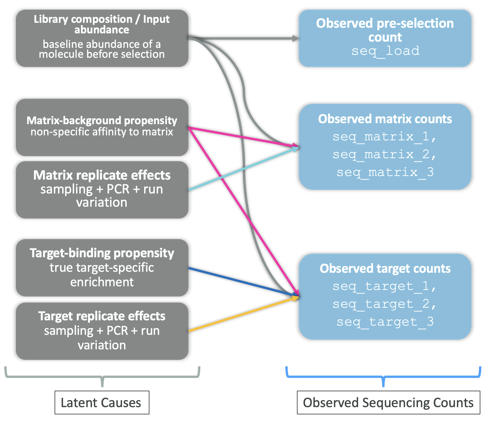
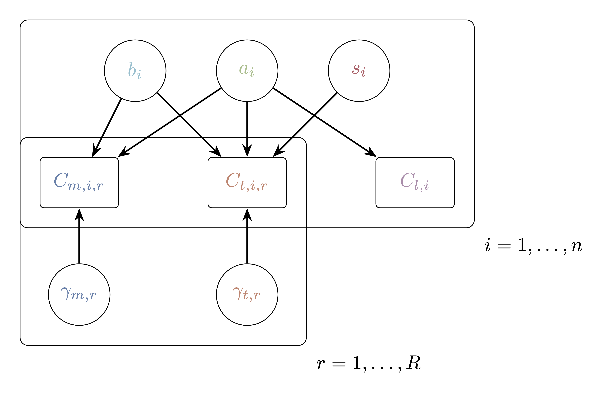

## What Is the Aim of This Blog?

A high target count can have several explanations. A compound may have been abundant in the starting library, retained by the matrix, enriched specifically in the target experiment, or affected by technical variation. The count alone cannot tell us which explanation matters most.

Building on the causal sketch from Part 1, we specify a Bayesian model that uses library, matrix, and target measurements together.

{#fig-causal-sketch width="50%"}

We will define the expected counts, account for residual variation, choose priors, and simulate complete experiments to see what those choices imply. Fitting the model and checking its posterior are subsequent steps. Molecular structure is reserved for the compound-aware extension in Part 3.

For each compound $i$, the measurements are a library count $C_{l,i}$, matrix counts $C_{m,i,r}$, and target counts $C_{t,i,r}$, where $r$ indexes replicates. We introduce three compound effects:

```{=html}
<style>
.del-effects {
  margin: 1.5rem 0 2rem;
  overflow-x: auto;
  border: 1px solid #e5e9f0;
  border-radius: 10px;
}
.del-effects table {
  width: 100%;
  margin-bottom: 0;
  color: #2e3440;
  font-size: 0.95rem;
}
.del-effects table > :not(caption) > * > * {
  padding: 0.9rem 1.1rem;
  vertical-align: middle;
  border-bottom: 1px solid #e5e9f0;
  background: #fff;
  box-shadow: none;
}
.del-effects table > thead > tr > th {
  background: #eceff4;
  font-size: 0.8rem;
  font-weight: 600;
  letter-spacing: 0.025em;
}
.del-effects tbody tr:last-child td { border-bottom: 0; }
.del-effects col:first-child { width: 14% !important; }
.del-effects col:not(:first-child) { width: 43% !important; }
.del-effects .effect-symbol {
  display: inline-block;
  min-width: 2.5rem;
  padding: 0.2rem 0.5rem;
  border-radius: 6px;
  border-bottom: 3px solid var(--effect-color);
  background: var(--effect-tint);
  color: #2e3440;
  font-size: 1.1rem;
}
</style>
```

::: del-effects
| Effect | What it represents | Where it contributes |
|:-----------------------|:-----------------------|:-----------------------|
| [$a_i$]{.effect-symbol style="--effect-color:#a3be8c; --effect-tint:#f0f5eb"} | Input abundance | Library, matrix, and target |
| [$b_i$]{.effect-symbol style="--effect-color:#88c0d0; --effect-tint:#edf6f8"} | Matrix background | Matrix and target |
| [$s_i$]{.effect-symbol style="--effect-color:#bf616a; --effect-tint:#f9eef0"} | Target-specific enrichment | Target only |
:::

### Our quantity of interest is $s_i$

$s_i$ is the compound’s target-specific log effect relative to the average compound in this experiment. Its exponential, $e^{s_i}$, is a relative multiplier of the expected target count after accounting for the model’s other terms.

## How the three measurements separate the effects?

The model’s central structure is simple:

- library counts inform [$a_i$]{style="color:#a3be8c"}.
- matrix counts inform [$a_i$]{style="color:#a3be8c"} $+$ [$b_i$]{style="color:#88c0d0"}.
- target counts inform [$a_i$]{style="color:#a3be8c"} $+$ [$b_i$]{style="color:#88c0d0"} $+$ [$s_i$]{style="color:#bf616a"}.

Comparing these measurements allows us to distinguish the contributions, subject to the assumptions below.

{#fig-revised-del-dag width="85%"}

The arrows encode a modelling assumption: **the same abundance and background effects enter the matrix and target predictors with the same coefficients**. This shared contribution is what allows the target-versus-matrix comparison to isolate target-specific enrichment. If background behaves differently in the target experiment, some of that difference could instead be attributed to $s_i$.

Library measurements distinguish abundance from background. They are valuable for understanding those separate contributions, although the shared $a_i+b_i$ term cancels from the model's target-versus-matrix contrast:

$$\underbrace{(a_i+b_i+s_i)}_{\text{target}}-\underbrace{(a_i+b_i)}_{\text{matrix}}
=s_i.$$

Replicates help distinguish persistent compound effects from sample-level shifts and residual count variation.

Consider three illustrative compounds. A has high input abundance, B has additional matrix retention, and C has additional target-specific enrichment. Suppose sequencing exposures are equal and replicate effects are zero. All three can have the same expected target count:

```{python}
#| label: revised-plot-setup
#| include: false

import numpy as np
import matplotlib.pyplot as plt
from matplotlib.font_manager import FontProperties, findfont
from matplotlib.text import Text
from matplotlib.ticker import MaxNLocator, ScalarFormatter, NullFormatter
from plotnine import theme_minimal
from scipy.stats import halfnorm, nbinom, poisson

# Match the typography and minimal theme used in the original article.
PLOT_RC = theme_minimal().rcParams
BASE_SIZE = PLOT_RC["font.size"]
with plt.rc_context(PLOT_RC):
    PLOT_FONT = FontProperties(
        fname=findfont(FontProperties(family=["sans-serif"]))
    ).get_name()

COLORS = {"library": "#b48ead", "matrix": "#5e81ac", "target": "#d08770",
          "prior": "#277F8E", "poisson": "#65758B",
          "median": "#8B6BA8", "upper": "#C58B47"}

def new_figure(*args, **kwargs):
    with plt.rc_context(PLOT_RC):
        return plt.subplots(*args, layout="constrained", **kwargs)

def style_axis(ax):
    ax.set_facecolor("white")
    ax.set_axisbelow(True)
    ax.spines[:].set_visible(False)
    ax.grid(which="major", color="#E5E5E5", linewidth=1)
    ax.grid(which="minor", color="#FAFAFA", linewidth=0.5)
    ax.tick_params(which="both", length=0, colors="#4D4D4D",
                   labelsize=0.8 * BASE_SIZE)
    for label in (ax.xaxis.label, ax.yaxis.label):
        label.set_color("black")
        label.set_fontsize(BASE_SIZE)

def panel_title(ax, title):
    ax.set_title(title, loc="left", fontsize=BASE_SIZE,
                 color="black", weight="bold", pad=12)

def show_figure(fig):
    # Apply the same resolved font to annotations and tick labels as well.
    fig.canvas.draw()
    for item in fig.findobj(Text):
        item.set_fontfamily(PLOT_FONT)
    plt.show()
```

```{python}
#| label: fig-revised-three-compounds
#| fig-cap: "Three illustrative compounds with the same expected target count. Equal sequencing exposures make the comparison direct. These are chosen expected counts, not observations or fitted estimates; their different patterns reveal why all three measurement types are useful."
#| fig-width: 9
#| fig-height: 3.8
#| fig-dpi: 180

example_means = np.array([[10, 10, 10], [1, 10, 10], [1, 1, 10]])
conditions = ["Library", "Matrix", "Target"]
condition_colors = [COLORS[name.lower()] for name in conditions]
fig, axes = new_figure(1, 3, figsize=(9, 3.8), sharey=True)
fig.set_facecolor("white")
fig.suptitle("Same target count, three explanations", x=0.02, ha="left",
             fontsize=1.3 * BASE_SIZE, weight="bold", color="#2e3440")

for ax, values, letter, title in zip(
    axes, example_means, "ABC",
    ["Abundant input", "Matrix retention", "Target enrichment"],
):
    style_axis(ax)
    ax.set_facecolor("#f7f9fc")
    ax.grid(False, which="both")
    ax.axhline(0, color="#dce2ea", linewidth=0.8)
    # A common reference makes the identical target counts easy to compare.
    ax.axhline(10, color=COLORS["target"], linewidth=1,
               linestyle=(0, (3, 4)), alpha=0.45)
    ax.plot(range(3), values, color="#9aa6b5", linewidth=1.8, zorder=2)
    ax.scatter(range(3), values, c=condition_colors, s=115,
               edgecolors="white", linewidths=1.8, zorder=3)
    for x, y in enumerate(values):
        ax.annotate(str(y), (x, y), xytext=(0, 11), textcoords="offset points",
                    ha="center", fontsize=0.95 * BASE_SIZE, weight="bold",
                    color="#2e3440")
    ax.set(xticks=range(3), xticklabels=conditions,
           ylim=(-0.5, 13), xlim=(-0.4, 2.4), yticks=[0, 5, 10])
    ax.tick_params(axis="x", pad=10, labelsize=0.85 * BASE_SIZE)
    ax.tick_params(axis="y", labelcolor="#687588")
    ax.set_title(f"{letter}  ·  {title}", loc="left", pad=14,
                 fontsize=BASE_SIZE, weight="bold", color="#3b4252")

axes[0].set_ylabel("Expected count (reads)", labelpad=10, color="#3b4252")
show_figure(fig)
```

A target count near 10 would not distinguish these explanations. The measurements share several causes: input abundance [$a_i$]{style="color:#a3be8c"} contributes to all three conditions, and background retention [$b_i$]{style="color:#88c0d0"} contributes to both matrix and target counts. A replicate effect can also raise or lower the expected counts of all compounds in that sample. These shared causes can make the counts related.

Using the measurements together helps us separate these contributions. Library measurements inform input abundance; matrix measurements provide additional information about background retention. Together, they help us assess how much of the target count requires target-specific enrichment [$s_i$]{style="color:#bf616a"} after accounting for sample-level effects.

In real data, however, every count fluctuates, so none of these measurements gives an exact answer. If the background contribution is uncertain, the enrichment needed to explain a target count is uncertain too: more background can leave less enrichment needed, and vice versa. We therefore estimate all effects jointly, allowing uncertainty about abundance, background, and sample-level effects to carry through to our estimate of enrichment.

## From latent effects to expected counts

### Account for sequencing depth

A sample with twice as many usable reads offers roughly twice as much opportunity to observe each compound.

Let $K_l$, $K_{m,r}$, and $K_{t,r}$ be the usable read totals and $N$ the number of compounds.

Define known exposure offsets:

$$E_l=K_l/N,\qquad E_{m,r}=K_{m,r}/N,\qquad E_{t,r}=K_{t,r}/N.$$

For example, if a sample has $K=10{,}000$ usable reads and the library contains $N=100$ compounds, then $E=K/N=100$. Each compound would receive 100 reads if the reads were shared equally. This is a reference value, not the actual count for every compound. The model adjusts it using the condition baseline and the abundance [$a_i$]{style="color:#a3be8c"}, background [$b_i$]{style="color:#88c0d0"}, enrichment [$s_i$]{style="color:#bf616a"}, and replicate effects ($\gamma_{m,r}$ for matrix or $\gamma_{t,r}$ for target) that apply to each measurement.

### Combine the contributions on the log scale

We add the contributions on the log scale, then exponentiate the result to obtain the expected count, $\mu$. We call the sum $\eta$, so $\eta=\log\mu$ and $\mu=e^\eta$. This keeps the expected count positive, even when some effects are negative. For the three conditions, the sums are:

$$\begin{aligned}
\eta_{l,i}=\log\mu_{l,i}
 &=\log E_l+\alpha_l+\textcolor{#a3be8c}{a_i},\\
\eta_{m,i,r}=\log\mu_{m,i,r}
 &=\log E_{m,r}+\alpha_m+\textcolor{#a3be8c}{a_i}
   +\textcolor{#88c0d0}{b_i}+\gamma_{m,r},\\
\eta_{t,i,r}=\log\mu_{t,i,r}
 &=\log E_{t,r}+\alpha_t+\textcolor{#a3be8c}{a_i}
   +\textcolor{#88c0d0}{b_i}+\textcolor{#bf616a}{s_i}+\gamma_{t,r}.
\end{aligned}$$

The condition intercept $\alpha_c \\ (c \in \{l, m, t\})$ describes the overall baseline after accounting for exposure $E_c \\ (c \in \{l, m, t\})$. The replicate effect $\gamma_{c,r} \\ (c \in \{m, t\})$ shifts all compounds in one matrix or target sample. We have one library measurement here, so there is no separate library-replicate term.

### Give zero an unambiguous meaning

Without a constraint, increasing every [$s_i$]{style="color:#bf616a"} by one and decreasing $\alpha_t$ by one leaves every expected count unchanged. Similar shifts exist for abundance ([$a_i$]{style="color:#a3be8c"}), background ([$b_i$]{style="color:#88c0d0"}), and replicate effects ($\gamma_{m,r}$ for matrix or $\gamma_{t,r}$ for target). We remove this arbitrary choice of origin by requiring:

$$\sum_i a_i=\sum_i b_i=\sum_i s_i=0,
\qquad \sum_r\gamma_{m,r}=\sum_r\gamma_{t,r}=0.$$

The intercepts $\alpha_l$, $\alpha_m$, and $\alpha_t$ then capture average log baselines, and the effects describe deviations from those averages.

## Allow observed counts to vary around those means, $\mu_{c,i,r}$

The mean model specifies the expected count; the likelihood specifies the spread of possible observations. We use the Negative Binomial in its NB2 parameterisation:

$$\begin{aligned}
Count_{l,i}&\sim\operatorname{NB}_2(\mu_{l,i},\phi_l),\\
Count_{m,i,r}&\sim\operatorname{NB}_2(\mu_{m,i,r},\phi_m),\\
Count_{t,i,r}&\sim\operatorname{NB}_2(\mu_{t,i,r},\phi_t).
\end{aligned}$$

$$\mathbb E(Count\mid\mu,\phi)=\mu,
\qquad
\operatorname{Var}(Count\mid\mu,\phi)
=\underbrace{\mu}_{\text{Poisson noise}}
+\underbrace{\frac{\mu^2}{\phi}}_{\text{additional variation}}.$$

The first variance term is ordinary Poisson counting noise. The second allows additional variation, beyond Poisson noise. The inverse of parameter $\phi_c$ controls the **overdispersion** for condition $c$.

This is the mean–variance convention used in the [Stan NB2 documentation](https://mc-stan.org/docs/functions-reference/unbounded_discrete_distributions.html#nbalt).

We assign one dispersion parameter, $\phi_c$, to each condition $c \in \{l, m, t\}$, shared across its compounds and replicates. It describes residual variation after the mean effects have been accounted for.

[Increasing dispersion does not systematically raise a compound's expected count; it makes observations around that expectation more variable.]{.highlight-key-point}

To make the amount of overdispersion easier to interpret, define

$$\kappa_c=\phi_c^{-1/2},\qquad
\operatorname{SD}(C\mid\mu,\kappa_c)=\sqrt{\mu+\mu^2\kappa_c^2}.$$

Larger $\kappa_c$ means greater spread. The limit $\kappa_c=0$ is Poisson sampling.

::: {.callout-note collapse="true" icon="false"}
## Why introduce $\kappa_c$ instead of putting a prior on $\phi_c$?

A prior directly on $\phi_c$ is valid. Its interpretation is less convenient: smaller values mean more variation, and the Poisson limit occurs at infinity. The transformation puts that limit at zero and makes increasing values correspond to increasing overdispersion. It changes neither the likelihood family nor identifiability; choosing a prior on the transformed parameter is still a substantive modelling choice.

We use the **coefficient of variation (CV)** to express count variation relative to the expected count. This helps us interpret the range of variation allowed by a prior on $\kappa_c$. For example, a standard deviation of 20 reads is 20% of an expected count of 100, but only 2% of an expected count of 1,000. The CV makes this comparison by dividing the standard deviation by the mean:

$$\operatorname{CV}(C\mid\mu,\kappa_c)
=\frac{\operatorname{SD}(C\mid\mu,\kappa_c)}{\mathbb E(C\mid\mu,\kappa_c)}
=\frac{\sqrt{\mu+\mu^2\kappa_c^2}}{\mu}
=\sqrt{\frac1\mu+\kappa_c^2}.$$

When the expected count, $\mu$, is large enough then $1/\mu$ is small compared with $\kappa_c^2$, the CV is close to $\kappa_c$. When $\mu$ is small, the $1/\mu$ term contributes more, so the CV can be much larger than $\kappa_c$. This means that low counts can show large fluctuations relative to their mean, even when overdispersion is small.

With no overdispersion, $\kappa_c=0$, so:

$$SD = \sqrt{\mu} \quad \text{and} \quad CV = \frac{\sqrt{\mu}}{\mu} = \frac{1}{\sqrt{\mu}}$$

This is the Poisson sampling noise. For example:

- if $\mu = 1$, then $SD = 1$ read. That is 100% of the expected count.
- if $\mu = 100$, then $SD = 10$ reads. That is 10% of the expected count.

[Low expected counts can be proportionally noisy without needing any extra variation beyond ordinary counting noise, that is ordinary Poisson counting noise.]{.highlight-key-point}
:::

## Priors: how much variation do we expect?

### Condition baselines

Each condition baseline receives $\alpha_{c \in \{l, m, t\}}\sim\operatorname{Normal}(0,1)$.

```{python}
#| label: fig-baseline-count-interpretation
#| fig-cap: 'Condition baseline prior and its count-scale interpretation. Left: α_c ~ Normal(0, 1). Middle: $\mu_{\mathrm{baseline}}=100e^{\alpha_c}$ at exposure E = 100. Right: $\mu_{\mathrm{baseline}}=3e^{\alpha_c}$ at exposure E = 3. Compound and replicate effects are set to zero. Shading marks central 95% prior intervals; dashed lines mark the medians. The count intervals are approximately 14–710 and 0.4–21.3 reads, respectively. These are priors for baseline expected counts, not prediction intervals for observed counts or arithmetic averages across compounds. Tails continue beyond the shaded intervals.'
#| fig-width: 13
#| fig-height: 3.8
#| fig-dpi: 180

from scipy.stats import norm, lognorm

alpha_grid = np.linspace(-3.5, 3.5, 800)
alpha_bounds = norm.ppf([0.025, 0.975])
fig, axes = new_figure(1, 3, figsize=(13, 3.8))
for ax in axes:
    style_axis(ax)
    ax.grid(False, axis="x")
    ax.set_ylim(bottom=0)

axes[0].plot(alpha_grid, norm.pdf(alpha_grid), color=COLORS["matrix"], lw=2)
axes[0].fill_between(alpha_grid, norm.pdf(alpha_grid),
                     where=(alpha_grid >= alpha_bounds[0]) & (alpha_grid <= alpha_bounds[1]),
                     color=COLORS["matrix"], alpha=0.2)
axes[0].axvline(0, color=COLORS["median"], ls="--", lw=1.3)
axes[0].set(xlabel=r"Condition baseline $\alpha_c$", ylabel="Prior density",
            xlim=(-3.5, 3.5), ylim=(0, 0.49))
panel_title(axes[0], r"Log scale: $\alpha_c \sim \mathrm{Normal}(0,1)$")
axes[0].text(0.5, 0.95, "Median 0 · Central 95%: −1.96 to 1.96",
              transform=axes[0].transAxes, ha="center", va="top",
              fontsize=0.8 * BASE_SIZE, color="#3b4252",
              bbox={"facecolor": "white", "edgecolor": "none", "pad": 3})

for ax, baseline_exposure in zip(axes[1:], (100, 3)):
    baseline_prior = lognorm(s=1, scale=baseline_exposure)
    baseline_lower, baseline_median, baseline_upper = baseline_prior.ppf([0.025, 0.5, 0.975])
    baseline_grid = np.linspace(0.001 * baseline_exposure, 10 * baseline_exposure, 2000)
    baseline_density = baseline_prior.pdf(baseline_grid)
    ax.plot(baseline_grid, baseline_density, color=COLORS["prior"], lw=2)
    ax.fill_between(baseline_grid, baseline_density,
                     where=(baseline_grid >= baseline_lower) & (baseline_grid <= baseline_upper),
                     color=COLORS["prior"], alpha=0.2)
    ax.axvline(baseline_median, color=COLORS["median"], ls="--", lw=1.3)
    for bound in (baseline_lower, baseline_upper):
        ax.vlines(bound, 0, baseline_prior.pdf(bound), color=COLORS["prior"], lw=1, alpha=0.6)
    ax.set(xlabel="Baseline expected count (reads)", ylabel="Prior density",
            xlim=(0, 10 * baseline_exposure), ylim=(0, baseline_density.max() * 1.15))
    panel_title(ax, rf"Count scale: $\mu_{{\mathrm{{baseline}}}}={baseline_exposure}e^{{\alpha_c}}$")
    precision = 0 if baseline_exposure == 100 else 1
    ax.text(0.96, 0.93,
             f"Exposure: {baseline_exposure} reads\n"
             f"Median: {baseline_median:.0f} reads\n"
             f"Central 95%: {baseline_lower:.{precision}f}–{baseline_upper:.{precision}f} reads",
             transform=ax.transAxes, ha="right", va="top",
             fontsize=0.85 * BASE_SIZE, linespacing=1.6, color="#3b4252",
             bbox={"facecolor": "white", "edgecolor": "none", "pad": 3})
show_figure(fig)
```


### Compound and replicate effects

We use the same three steps for every group of effects. Let $g \in \{a, b, s, \gamma_m, \gamma_t\}$ identify the group, $j$ identify a member of that group, and $n_g$ be the number of members. We write $x_{g,j}$ for a generic effect.

#### 1. Start with a shared population scale

We describe each group at two levels:

$$\begin{aligned}
\sigma_g
    &\sim\operatorname{HalfNormal}(0,\tau_g),
    &&\text{population level},\\
x_{g,j}^*\mid\sigma_g
    &\sim\operatorname{Normal}(0,\sigma_g^2),
    &&\text{individual-effect level}.
\end{aligned}$$

Here, $\tau_g$ expresses our prior belief about how much variation is plausible within group $g$. We choose $\tau_g$; the model then learns the unknown scale $\sigma_g$ from the data.

First, we draw one $\sigma_g$ for the whole group. Given that scale, we draw a preliminary effect $x_{g,j}^*$ independently for each member.

Because the members, $x_{g,j}^*$, share a scale, $\sigma_g$, they contribute information about how much variation the group contains. Effects with little information are pulled towards zero, while effects with stronger evidence can depart further from it. This is called **partial pooling**.

The star marks a preliminary effect, not the final $x_{g,j}$. Although the preliminary effects come from a distribution centred at zero, their realised average will generally not be exactly zero. We therefore apply the zero-sum constraint next.

#### 2. Apply the zero-sum constraint {#group-zero-sum-construction}

Calculate the mean of the preliminary effects within the group:

$$\bar x_g^*=\frac{1}{n_g}\sum_{j=1}^{n_g}x_{g,j}^*.$$

Subtract this common mean from every preliminary effect to obtain the final effects:

$$x_{g,j}=x_{g,j}^*-\bar x_g^*.$$

Their sum is then exactly zero:

$$\begin{aligned}
\sum_{j=1}^{n_g}x_{g,j}
&=\sum_{j=1}^{n_g}(x_{g,j}^*-\bar x_g^*)\\
&=\sum_{j=1}^{n_g}x_{g,j}^*-n_g\bar x_g^*\\
&=\sum_{j=1}^{n_g}x_{g,j}^*
  -n_g\left(\frac{1}{n_g}\sum_{j=1}^{n_g}x_{g,j}^*\right)\\
&=0.
\end{aligned}$$

For example, suppose three preliminary effects are $(-0.2,\,0.4,\,0.7)$. Their mean is $0.3$, so the final effects are:

$$(-0.2,\,0.4,\,0.7)-0.3=(-0.5,\,0.1,\,0.4),$$

which sum to zero. Subtracting the same mean preserves the differences between members and gives their effects a common reference point.

#### 3. Use a non-centred implementation {#group-non-centred-construction}

We implement the same prior by separating standard Normal variation from the unknown scale. This is called a [**non-centred parameterisation**](https://betanalpha.github.io/assets/case_studies/hierarchical_modeling.html). First, draw an independent standard Normal variable for each member:

$$z_{g,j}\sim\operatorname{Normal}(0,1),
\qquad j=1,\ldots,n_g.$$

Multiplying by $\sigma_g$ gives the preliminary effect:

$$x_{g,j}^*=\sigma_g z_{g,j},
\qquad
x_{g,j}^*\mid\sigma_g\sim\operatorname{Normal}(0,\sigma_g^2).$$

The mean of these preliminary effects is $\bar x_g^*=\sigma_g\bar z_g$, where $\bar z_g=\frac{1}{n_g}\sum_j z_{g,j}$. Substituting into the zero-sum transformation gives:

$$\begin{aligned}
x_{g,j}
&=x_{g,j}^*-\bar x_g^*\\
&=\sigma_g z_{g,j}-\sigma_g\bar z_g\\
&=\sigma_g\left(z_{g,j}-\bar z_g\right).
\end{aligned}$$

This gives final effects whose spread is controlled by $\sigma_g$ and whose sum is zero. Centring links the final effects: if one changes, the others must still balance it so that the sum stays zero.

#### Choose the prior scale for each effect group

We now apply these three steps to each group in the DEL model. The table gives our chosen $\tau_g$ values and the assumptions they express:

| Effect group | Shared scale | Prior spread $\tau_g$ | Assumption before seeing the data |
|:-------------|:-------------|:---------------------|:---------------------------------|
| Input abundance [$a_i$]{style="color:#a3be8c"} | $\sigma_a$ | $0.75$ | Allow relatively broad differences in starting abundance between compounds. |
| Matrix background [$b_i$]{style="color:#88c0d0"} | $\sigma_b$ | $0.75$ | Allow relatively broad differences in background retention between compounds. |
| Target-specific enrichment [$s_i$]{style="color:#bf616a"} | $\sigma_s$ | $0.50$ | Favour smaller departures from zero than for abundance or background, while allowing larger enrichment effects. |
| Matrix replicate effects $\gamma_{m,r}$ | $\sigma_{\gamma_m}$ | $0.25$ | Expect smaller shifts between matrix samples than between compounds. |
| Target replicate effects $\gamma_{t,r}$ | $\sigma_{\gamma_t}$ | $0.25$ | Expect smaller shifts between target samples than between compounds. |

In each row, $\sigma_g\sim\operatorname{HalfNormal}(0,\tau_g)$. For example, the abundance row gives $\sigma_a\sim\operatorname{HalfNormal}(0,0.75)$ and the final effects [$a_i$]{style="color:#a3be8c"} are constructed as:

$$\textcolor{#a3be8c}{a_i}=\sigma_a(z_{a,i}-\bar z_a).$$

We apply the zero-sum transformation separately within each effect group. Each group also has its own scale. For example, abundance and background share the same prior specification, but their scales $\sigma_a$ and $\sigma_b$ are estimated separately.


#### What do these priors imply for counts?

We consider two baseline expected counts: 100 reads and 3 reads. The lower baseline illustrates a very large library relative to the available sequencing depth. For example, 3 million usable reads across 1 million compounds gives an equal-share exposure of $E=3$; with the condition intercept and all effects set to zero, this gives a baseline expected count of 3.

We apply one final, centred effect $x$ to each baseline, holding all other effects at zero:

$$\mu=100e^x
\qquad\text{or}\qquad
\mu=3e^x.$$

An effect of zero leaves either baseline unchanged; positive effects increase the expected count and negative effects decrease it. The left panel shows the priors for the shared scales. The middle and right panels show their implications for baseline expected counts of 100 and 3, respectively. Each distribution is shown on its own row, so its shape can be seen without other distributions covering it. Darker shading marks its central 95% prior interval, with the bounds labelled beside the curve. The curves are scaled to equal peak heights for readability. Dashed lines mark the corresponding baselines. Both count panels use the same scale and effect draws, so they express the same beliefs about relative changes at different count levels.

```{python}
#| label: fig-revised-population-priors
#| fig-cap: 'Ridgeline plots of the group priors. Left: population-scale priors. Middle and right: histograms of expected counts $\mu=100e^x$ and $\mu=3e^x$, using the same 100,000 draws of one centred effect and its scale (500 compounds or three replicates). Each distribution has its own row and is scaled to the same peak height for readability; heights are not comparable probability densities across rows. Darker count shading marks the central 95% prior interval, labelled in reads; lighter shading shows the remaining visible tails. Dashed lines mark the baselines. Probabilities and quantiles are calculated before height scaling, including draws outside the displayed range. All other effects are zero; observed-count sampling variation is excluded.'
#| fig-width: 13
#| fig-height: 4.6
#| fig-dpi: 180

def draw_count_ridge(ax, edges, density, central_density, row, color, interval_text):
    # Separate rows and equal peak heights make every distribution readable.
    # The probability calculations use the original, unscaled densities.
    height_scale = 0.75 / density.max()
    ax.axhline(row, color="#d8dee6", linewidth=0.7, zorder=0)
    ax.stairs(row + density * height_scale, edges, baseline=row,
               fill=True, color=color, alpha=0.10)
    ax.stairs(row + central_density * height_scale, edges, baseline=row,
               fill=True, color=color, alpha=0.40)
    ax.stairs(row + density * height_scale, edges, baseline=row,
               color=color, linewidth=1.4)
    ax.text(0.98, row + 0.52, interval_text, transform=ax.get_yaxis_transform(),
             ha="right", va="center", fontsize=8, color=color,
             bbox={"facecolor": "white", "edgecolor": "none", "pad": 1.5})

def style_ridge_axis(ax, labels, title):
    style_axis(ax)
    ax.grid(False, which="both")
    ax.grid(axis="x", color="#e5e5e5", linewidth=0.7)
    ax.set(yticks=[2, 1, 0], yticklabels=labels, ylim=(-0.12, 2.95), ylabel="")
    ax.tick_params(axis="y", pad=8)
    panel_title(ax, title)

fig, axes = new_figure(1, 3, figsize=(13, 4.6))
scale_specs = [("Abundance / background", 0.75, 500, COLORS["matrix"]),
               ("Target-specific", 0.50, 500, COLORS["target"]),
               ("Replicate", 0.25, 3, COLORS["prior"])]
group_ridge_labels = ["Abundance /\nbackground", "Target-specific", "Replicate"]
prior_rng = np.random.default_rng(20260909)
x = np.linspace(0, 2.5, 600)
group_count_intervals = {100: [], 3: []}
group_shaded_masses = []
for index, (label, tau, group_size, color) in enumerate(scale_specs):
    row = 2 - index
    scale_density = halfnorm.pdf(x, scale=tau)
    scale_height = row + 0.75 * scale_density / scale_density.max()
    axes[0].axhline(row, color="#d8dee6", linewidth=0.7, zorder=0)
    axes[0].fill_between(x, row, scale_height, color=color, alpha=0.3)
    axes[0].plot(x, scale_height, color=color, lw=1.5)
    axes[0].text(0.98, row + 0.52, f"τ = {tau:.2f}",
                  transform=axes[0].get_yaxis_transform(), ha="right", va="center",
                  fontsize=8, color=color)
    sigma = np.abs(prior_rng.normal(0, tau, 100_000))
    # Exact marginal distribution of z_i - mean(z) for a group of this size.
    effect = sigma * prior_rng.normal(0, np.sqrt(1 - 1 / group_size), sigma.size)
    for ax, count_baseline in zip(axes[1:], (100, 3)):
        expected_counts = count_baseline * np.exp(effect)
        lower, median, upper = np.quantile(expected_counts, [0.025, 0.5, 0.975])
        group_count_intervals[count_baseline].append([lower, median, upper])
        edges = np.linspace(0, 6 * count_baseline, 151)
        widths = np.diff(edges)
        frequencies = np.histogram(expected_counts, bins=edges)[0]
        central_counts = expected_counts[(expected_counts >= lower) & (expected_counts <= upper)]
        central_frequencies = np.histogram(central_counts, bins=edges)[0]
        density = frequencies / (expected_counts.size * widths)
        central_density = central_frequencies / (expected_counts.size * widths)
        group_shaded_masses.append(np.sum(central_density * widths))
        precision = 0 if count_baseline == 100 else 1
        draw_count_ridge(ax, edges, density, central_density, row, color,
                          f"95%: {lower:.{precision}f}–{upper:.{precision}f} reads")
axes[0].set(xlabel="Population scale σ", xlim=(0, 2.5))
for ax, count_baseline in zip(axes[1:], (100, 3)):
    ax.axvline(count_baseline, color=COLORS["poisson"], linestyle="--", linewidth=1, alpha=0.7)
    ax.set(xlabel="Expected count (reads)", xlim=(0, 6 * count_baseline),
            xticks=np.array([0, 1, 2, 4, 6]) * count_baseline)
for ax, title in zip(axes, ["Priors for shared scales", r"Count scale: $\mu=100e^x$", r"Count scale: $\mu=3e^x$"]):
    style_ridge_axis(ax, group_ridge_labels, title)
show_figure(fig)
```

The narrower replicate prior keeps expected counts closer to their baseline, while the broader abundance and background priors allow larger departures. Moving from a baseline of 100 to 3 scales every interval by $3/100$ without changing the underlying prior. These intervals describe one effect at a time; they do not include the additional count variation described by the Negative Binomial likelihood.


### A prior for residual dispersion, interpreted through counts

We give the three conditions separate, independent dispersion draws:

$$\kappa_l,\kappa_m,\kappa_t
\overset{\mathrm{ind}}{\sim}\operatorname{HalfNormal}(0,0.50),
\qquad \phi_c=\kappa_c^{-2}.$$

The prior has a median of about $0.34$ and a 95th percentile of about $0.98$. Thus, 95% of its probability lies between $0$ and $0.98$, but larger values remain possible. The value $0.50$ controls the prior's spread; it is not an upper limit.

Unlike the compound and replicate effects, $\kappa_c$ changes the spread of observed counts without changing their expected count. We compare means of $\mu=100$ and $\mu=3$, using the latter as a low-count example relevant to a large library with limited sequencing depth. The left panel shows the prior for $\kappa_c$. The middle and right panels compare the Poisson limit ($\kappa_c=0$), the prior median, and the prior 95th percentile at each mean. Each row shows the shape of a distribution of possible **observed counts**, scaled to the same peak height so the distributions remain visible. Darker shading marks its central 95% count interval, with the bounds labelled beside the curve. Dashed lines mark the fixed mean of 100 or 3.

```{python}
#| label: fig-kappa-prior-counts
#| fig-cap: 'Left: Half-Normal(0, 0.50) prior for κ, with 95% of its probability shaded and its median and 95th percentile marked. Middle and right: ridgelines of exact Poisson or NB2 probabilities at means of 100 and 3, drawn as one-read-wide steps. Each row has its own baseline and is scaled to the same peak height; heights are not comparable probabilities across rows. Darker shading marks central 95% count intervals; integer quantiles can give coverage above 95%. Dashed lines mark the fixed means. Each count axis extends to the 99.5th percentile of its broadest distribution. Quantiles and probabilities are computed before height scaling, without renormalizing omitted tails. These are conditional distributions at selected κ values, not posterior credible intervals or predictions averaged over the full prior.'
#| fig-width: 13
#| fig-height: 4.6
#| fig-dpi: 180

kappa_plot_prior = halfnorm(scale=0.50)
kappa_plot_median, kappa_plot_p95 = kappa_plot_prior.ppf([0.5, 0.95])
kappa_plot_grid = np.linspace(0, 1.8, 600)
kappa_plot_specs = [
    ("Poisson", 0.0, COLORS["poisson"]),
    (f"κ = {kappa_plot_median:.2f}", kappa_plot_median, COLORS["median"]),
    (f"κ = {kappa_plot_p95:.2f}", kappa_plot_p95, COLORS["upper"]),
]
fig, axes = new_figure(1, 3, figsize=(13, 4.6))
axes[0].plot(kappa_plot_grid, kappa_plot_prior.pdf(kappa_plot_grid),
             color=COLORS["prior"], lw=2)
axes[0].fill_between(kappa_plot_grid, kappa_plot_prior.pdf(kappa_plot_grid),
                     where=kappa_plot_grid <= kappa_plot_p95,
                     color=COLORS["prior"], alpha=0.15, label="95% of prior probability")
for value, label, color in [
    (kappa_plot_median, "Median", COLORS["median"]),
    (kappa_plot_p95, "95th percentile", COLORS["upper"]),
]:
    axes[0].axvline(value, color=color, linestyle="--", linewidth=1.3,
                    label=f"{label}: {value:.2f}")
    axes[0].scatter(value, kappa_plot_prior.pdf(value), color=color, s=35, zorder=3)
axes[0].set(xlabel="Dispersion κ", ylabel="Prior density",
            xlim=(0, 1.8), ylim=(0, 1.8))
axes[0].legend(frameon=False, fontsize=8, loc="upper right", labelcolor="black")

kappa_count_intervals = {100: [], 3: []}
kappa_shaded_masses = []
for ax, kappa_plot_mean in zip(axes[1:], (100, 3)):
    broad_phi = kappa_plot_p95 ** -2
    broad_distribution = nbinom(n=broad_phi, p=broad_phi / (broad_phi + kappa_plot_mean))
    max_count = int(broad_distribution.ppf(0.995))
    counts = np.arange(max_count + 1)
    edges = np.arange(max_count + 2) - 0.5
    for index, (label, kappa, color) in enumerate(kappa_plot_specs):
        row = 2 - index
        if kappa == 0:
            distribution = poisson(mu=kappa_plot_mean)
        else:
            phi = kappa ** -2
            distribution = nbinom(n=phi, p=phi / (phi + kappa_plot_mean))
        lower, upper = distribution.ppf([0.025, 0.975])
        kappa_count_intervals[kappa_plot_mean].append([lower, upper])
        mass = distribution.pmf(counts)
        central_mass = np.where((counts >= lower) & (counts <= upper), mass, 0)
        kappa_shaded_masses.append(central_mass.sum())
        draw_count_ridge(ax, edges, mass, central_mass, row, color,
                          f"95%: {lower:.0f}–{upper:.0f} reads")
    ax.axvline(kappa_plot_mean, color=COLORS["poisson"], linestyle="--", linewidth=1)
    ax.set(xlabel="Observed count (reads)", xlim=(-0.5, max_count + 0.5))
    ax.xaxis.set_major_locator(MaxNLocator(nbins=5, integer=True))
style_axis(axes[0])
axes[0].grid(False, axis="x")
panel_title(axes[0], "Prior for dispersion")
kappa_ridge_labels = ["Poisson limit\nκ = 0",
                       f"Prior median\nκ = {kappa_plot_median:.2f}",
                       f"Prior 95th percentile\nκ = {kappa_plot_p95:.2f}"]
for ax, title in zip(axes[1:], [r"Count variation: $\mu=100$", r"Count variation: $\mu=3$"]):
    style_ridge_axis(ax, kappa_ridge_labels, title)
show_figure(fig)
```

Larger $\kappa_c$ allows a wider range of observed counts around the same mean. At $\mu=100$, the standard deviation is about 10, 35, and 99 reads for the three dispersion values; at $\mu=3$, it is about 1.7, 2.0, and 3.4 reads. The low-count intervals are recalculated from the count distributions, not obtained by rescaling the 100-read intervals. Even without overdispersion, ordinary Poisson noise has a standard deviation of about 58% of the mean at $\mu=3$, compared with 10% at $\mu=100$.


## Prior predictive check: What does the complete model predict before seeing any data?

We now simulate complete experiments using all the priors above. For this demonstration, each experiment has 500 compounds, one library sample, three matrix replicates, and three target replicates. Every sample has exposure $E=10$, corresponding to a supplied sequencing depth of 5,000 reads. These dimensions and depths are illustrative; they are not representative of a real experiment.

For each simulated experiment, we:

1. Draw three condition intercepts $\alpha_l$, $\alpha_m$, $\alpha_t$, five population scales $\sigma_a$, $\sigma_b$, $\sigma_s$, $\sigma_{\gamma_m}$ and $\sigma_{\gamma_t}$, and three dispersion parameters, $\kappa_l$, $\kappa_m$, $\kappa_t$, from their independent priors.

2. Draw and centre the compound and replicate effects, $a_i$, $b_i$, $s_i$, $\gamma_{m,r}$ and $\gamma_{t,r}$, sharing each scale within its group.

3. Calculate the expected library, matrix, and target counts from the log-linear equations.

4. Draw all observed counts from NB2, sharing the appropriate dispersion within each condition.

Repeating these steps gives samples from the **joint prior predictive distribution**: the distribution of possible complete datasets implied by our priors and count model, before using the observed counts to estimate the effects.

Let $\widetilde{\mathbf C}$ represent the complete collection of simulated counts, $\mathbf E$ the fixed exposures, and $\theta$ all the random quantities drawn from the priors: the condition baselines, population scales, standard Normal variables used to construct the centred effects, and dispersion parameters. Then:

$$
\underbrace{p(\widetilde{\mathbf C}\mid\mathbf E)}_{\text{joint prior predictive distribution}}
=\int
\underbrace{p(\widetilde{\mathbf C}\mid\theta,\mathbf E)}_{\text{count model}}
\underbrace{p(\theta)}_{\text{joint prior}}
\,d\theta.
$$

The purpose is to ask whether these combined assumptions produce plausible experiments. In this DEL model, we prioritise four checks:

1. **Read counts:** Are sample totals compatible with the supplied sequencing depths, and do a few compounds dominate the reads? Independent NB2 draws do not enforce those totals.
2. **Apparent enrichment:** After accounting for exposure, are the magnitude and frequency of target-versus-matrix differences believable?
3. **Detection and dropout:** Is the fraction of zero counts plausible, and how often are compounds absent from all replicates or detected only in target samples?
4. **Replicate agreement:** Are differences between replicates reasonable, and do the same compounds repeatedly appear enriched?

We assess these patterns across simulated experiments at realistic library sizes and sequencing depths. If they routinely look implausible, we revisit the priors or model assumptions before fitting the data.

### Read counts: totals and concentration

First, we check the read budget and how it is distributed. For each simulated sample, we calculate:

- **Total-count ratio:** the sum of simulated counts divided by the supplied sequencing depth. A ratio of one means the totals agree.
- **Top-1% read share:** the fraction of simulated reads assigned to the highest-count 1% of compounds. This shows whether a few compounds dominate the sample.

@fig-prior-read-counts summarises these checks for our illustrative experiment. The intervals describe what the model predicts, not acceptable ranges.

```{python}
#| label: fig-prior-read-counts
#| code-summary: "Simulate complete experiments and summarise read counts"
#| fig-cap: 'Read-count checks across 2,000 prior predictive experiments, each with 500 compounds and a supplied depth of 5,000 reads per sample. Points mark medians; bars show central 95% intervals for each sample. The dashed line marks agreement with the supplied depth. The top 1% consists of five compounds per sample. These simulations use all the priors and NB2 sampling; no observed KiNDEL counts are used.'
#| fig-width: 11
#| fig-height: 4.2
#| fig-dpi: 180

read_rng = np.random.default_rng(20261004)
n_experiments, n_compounds, supplied_depth = 2_000, 500, 5_000
sample_names = ["Library", "Matrix 1", "Matrix 2", "Matrix 3",
                "Target 1", "Target 2", "Target 3"]
sample_conditions = ["library"] + ["matrix"] * 3 + ["target"] * 3
total_ratios = np.empty((n_experiments, 7))
top_read_shares = np.empty_like(total_ratios)
n_top = int(np.ceil(0.01 * n_compounds))

def draw_centred_effect(tau, size):
    scale = abs(read_rng.normal(0, tau))
    effect = scale * read_rng.normal(size=size)
    return effect - effect.mean()

for draw in range(n_experiments):
    alpha = read_rng.normal(0, 1, 3)
    a = draw_centred_effect(0.75, n_compounds)
    b = draw_centred_effect(0.75, n_compounds)
    s = draw_centred_effect(0.50, n_compounds)
    gamma_m = draw_centred_effect(0.25, 3)
    gamma_t = draw_centred_effect(0.25, 3)
    kappa = abs(read_rng.normal(0, 0.50, 3))
    log_mu = np.column_stack([
        alpha[0] + a,
        alpha[1] + (a + b)[:, None] + gamma_m,
        alpha[2] + (a + b + s)[:, None] + gamma_t,
    ]) + np.log(supplied_depth / n_compounds)
    mu = np.exp(log_mu)
    counts = np.empty_like(mu, dtype=np.int64)
    for condition, columns in enumerate(([0], [1, 2, 3], [4, 5, 6])):
        # Gamma-Poisson sampling is NB2 with variance mu + kappa**2 * mu**2.
        if kappa[condition] < 1e-6:
            counts[:, columns] = read_rng.poisson(mu[:, columns])
        else:
            phi = 1 / kappa[condition]**2
            rate = read_rng.gamma(phi, mu[:, columns] / phi)
            counts[:, columns] = read_rng.poisson(rate)
    totals = counts.sum(axis=0)
    top_totals = np.partition(counts, n_compounds - n_top, axis=0)[-n_top:].sum(axis=0)
    total_ratios[draw] = totals / supplied_depth
    # Concentration is undefined for a sample with no reads.
    top_read_shares[draw] = np.divide(
        top_totals, totals, out=np.full(7, np.nan), where=totals > 0
    )

fig, axes = new_figure(1, 2, figsize=(11, 4.2), sharey=True)
for ax, values in zip(axes, (total_ratios, 100 * top_read_shares)):
    style_axis(ax)
    lower, median, upper = np.nanquantile(values, [0.025, 0.5, 0.975], axis=0)
    for row, condition in enumerate(sample_conditions):
        ax.errorbar(median[row], row,
                    xerr=[[median[row] - lower[row]], [upper[row] - median[row]]],
                    fmt="o", color=COLORS[condition], capsize=3, lw=2)
    ax.set_yticks(range(7), sample_names)
axes[0].invert_yaxis()
axes[0].set_xscale("log")
axes[0].axvline(1, color=COLORS["poisson"], ls="--", lw=1.2)
axes[0].set_xlabel("Simulated total / supplied depth (log scale)")
axes[1].set_xlabel("Reads assigned to the top 1% of compounds (%)")
axes[1].set_xlim(0, 100)
panel_title(axes[0], "Does the read budget agree?")
panel_title(axes[1], "Do a few compounds dominate?")
show_figure(fig)
```

The wide total-count ranges highlight a modelling issue: independent NB2 counts do not preserve a fixed read budget, and centring effects on the log scale does not fix their arithmetic mean after exponentiation. If the modelled compounds account for all $K$ reads, persistent discrepancies call for reconsidering the baseline priors or a likelihood that conditions on the total.

For an observed comparison, use matching compound sets and depths. [KiNDEL's `ddr1_1M.parquet`](https://github.com/insitro/kindel#datasets) is already a selected top-million subset; the training split reduces it further. Their count sums are subset totals, not full-screen sequencing depths. Observed counts provide a reference for plausibility; they are not needed to generate prior predictions.
